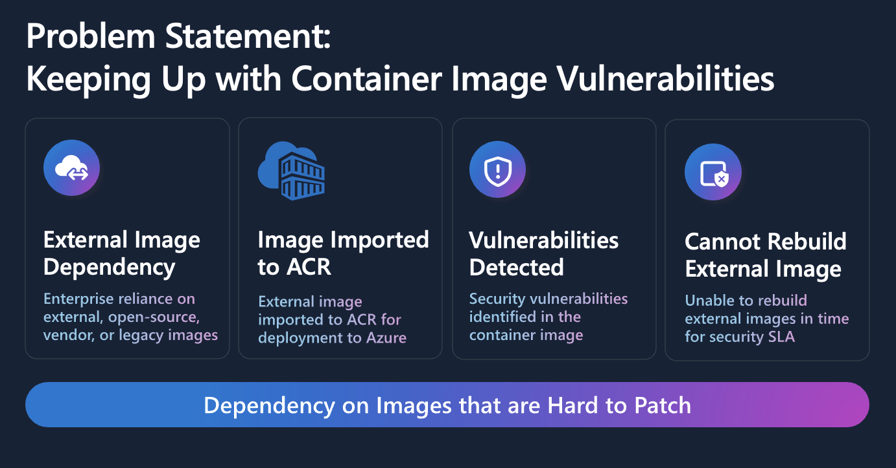
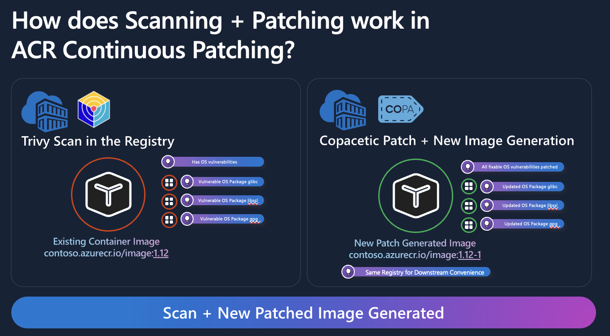

## Addressing Today's Container Vulnerability Challenge

In today's containerized ecosystem, maintaining secure images has become increasingly challenging. New vulnerabilities emerge rapidly, and managing these manually often feels like an endless game of catch-up. Teams rely heavily on external, open-source, or vendor container images, many which aren't regularly rebuilt by upstream maintainers. This delay exposes your deployments to risks, leaving you vulnerable and potentially out of compliance with security standards.

Artifacts stored in Azure Container Registry (ACR) can become vulnerable as new threats are discovered over time, leaving your production environment exposed.

## Automating Security with ACR Continuous Patching

To tackle this persistent issue, Azure Container Registry introduces Continuous Patching, a powerful automated solution to detect and remediate vulnerabilities directly within your registry, without manual intervention.

Continuous Patching leverages a scheduled workflow to:

1. Scan your container images regularly using [Trivy](https://trivy.dev/latest/), identifying operating system (OS) level vulnerabilities.

2. Automatically patch identified OS vulnerabilities with [Copacetic](https://project-copacetic.github.io/copacetic/website/), creating updated and secure images without the need to rebuild from source.

This process ensures that vulnerabilities are addressed swiftly, reducing risk and freeing your team from the burden of continuous manual updates.

## Key Benefits

Continuous Patching significantly enhances your security posture by:

- Reducing remediation times: Automatically detect and patch vulnerabilities faster than traditional rebuild methods.

- Minimizing disruption: New patched images maintain original functionality, ensuring seamless integration into existing deployment workflows.

- Improving compliance: Regularly patched images help you consistently meet security SLAs and compliance requirements.

- Enhancing DevSecOps efficiency: Streamline security within your CI/CD pipelines by reducing manual processes and vulnerability response times.

## Getting Started

Ready to secure your containerized applications effortlessly? To get started with continuous patching in Azure Container Registry, refer to our [detailed documentation](https://learn.microsoft.com/en-us/azure/container-registry/key-concept-continuous-patching).

