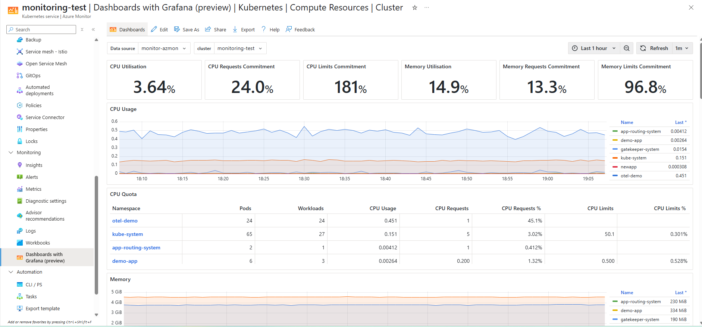
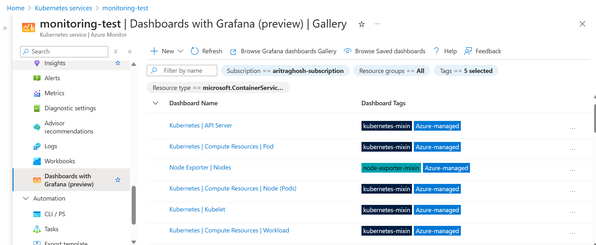

### Introduction

As Kubernetes adoption accelerates, engineers need streamlined, cost-effective tools for cluster observability. Until now, this often meant deploying and managing separate monitoring stacks. Azure Monitor's latest integration with Grafana changes this: cluster insights are now just a click away in the Azure portal.

We are thrilled to announce that Azure Kubernetes Service (AKS) now offers native Grafana dashboards within the Azure portal at no additional cost. This integration eliminates the complexity of maintaining separate visualization tools while delivering Grafana's powerful capabilities directly where you need them. Metrics from [Container Insights]([https://docs.azure.cn/azure-monitor/containers/container-insights-overview](https://learn.microsoft.com/azure/azure-monitor/containers/kubernetes-monitoring-enable?tabs=cli#container-logs)), the Kubernetes metrics server, and any configured [Azure Managed Prometheus](https://learn.microsoft.com/azure/azure-monitor/metrics/prometheus-metrics-overview) endpoints are available out-of-the-box, providing comprehensive cluster observability.

To get started, navigate to your AKS cluster in the Azure portal and select **Monitoring** > **Dashboards with Grafana (preview)**. You will be presented with prebuilt dashboards for cluster health, node utilization, and pod performance. From there, you may edit and add  panels, configure template variables scoped to namespaces or node pools, and save custom dashboards - all within the familiar AKS management experience. Because no Grafana server needs to be provisioned or maintained, teams can quickly adopt and customize dashboards within the AKS portal- reducing setup time, operational complexity, and accelerating access to actionable insights for SRE and DevOps workflows.

*Figure 1: Comprehensive AKS cluster dashboard showing resource utilization, performance metrics, and health status directly within the Azure portal.*

### Why Grafana in Azure Portal?

Grafana is celebrated for its rich panel types, templating engine, and client-side data transformations. Embedding it natively in Azure Portal offers:

- Unified experience: No extra authentication or network configuration—just use your Azure login.
- Single-pane observability: Combine Azure Metrics, Logs, and Application Insights data alongside and other Azure data sources supported by Grafana.
- Rapid onboarding: Spin up dashboards in minutes using familiar Azure workflows and templates. Many prebuilt dashboards are available out of the box and any community dashboard using Prometheus and/or Azure Monitor can be imported.

These capabilities mean faster troubleshooting, deeper insights, and a more consistent observability platform for Azure-centric workloads.

### When to upgrade to Azure Managed Grafana?

While Dashboards with Grafana in the Azure portal cover most common visualization scenarios, Azure Managed Grafana remains the right choice for advanced use cases, including:

- Extended plugin support (including open-source and community plugins).
- Advanced authentication, provisioning APIs, and fine-grained access control.
- Multi-cloud and hybrid data source connectivity.

**When to choose native dashboards:** Quick visibility into your Azure telemetry, minimal setup, with no additional costs.  
**When to choose Azure Managed Grafana:** Large teams with complex governance, open-source or Enterprise, or multi-cloud data sources.

#### Feature Comparison

| Feature | Azure Monitor dashboards with Grafana (preview) | Azure Managed Grafana |
|---------|--------------------------------|----------------------|
| **Access** | Azure portal | Grafana Web Interface |
| **Pricing** | No cost | Per user pricing plus compute costs for Standard SKU |
| **Data Sources** | Azure Monitor and Azure Prometheus | Azure Monitor, Azure Prometheus, Azure Data Explorer, OSS data sources, Enterprise data sources available with license |
| **Data source Authentication** | Current-user only | User-configurable: Current-user, Managed Identity, App registration |
| **Customization** | Basic - Azure-managed plugins only | Advanced - Custom plugins, dashboards, and settings |
| **Alerting** | Azure Monitor alerts only | Full Grafana alerting capabilities |
| **Enterprise Features** | Not supported | Reporting, team collaboration, enterprise plugins |
| **Deployment Model** | Managed SaaS | Dedicated VM scale sets with private networking options |

A detailed difference is available on the [solution comparison](https://learn.microsoft.com/azure/azure-monitor/visualize/visualize-grafana-overview#solution-comparison)

### Customization and Advanced Features

The native Grafana experience in Azure Monitor includes many of the customization features you expect:

- **Variables & Templating:** Define dashboard variables for dynamic filtering across subscriptions, resource groups, or services.
- **Themes & Layouts:**  Automatically switches theme based on the Azure portal's theme, resize panels, and arrange layouts with drag-and-drop.
- **Cross-workspace & cross-source queries:** Query data from multiple Log Analytics workspaces, metrics namespaces.
- **Alerts:**  View Azure alerts state and history in Grafana dashboards.

### Getting Started

> **Note:** To view telemetry in Grafana dashboards, ensure you have at least **Reader** access to the relevant resource (Azure Monitor or Log Analytics workspace).
> **Note:** Currently, the AKS cluster entry point is gated by the enablement of Managed Prometheus. This will likely change in the future as we incorporate dashboards which leverage platform metrics or Container Insights based logs

The default dashboards are  available in the AKS cluster page under **Dashboards with Grafana**

*Figure 2: Navigation view showing the collection of pre-built Grafana dashboards available in the AKS monitoring section, providing one-click access to various visualization templates.*

To create a new dashboard

1. In the Azure portal, go to **Azure Monitor** > **Dashboards with Grafana**.
2. Click **+ New** and select **New  Dashboard**.
3. Provide a title for the dashboard and the subscription, resource group for the dashboard. Click on Create.
Once the dashboard is created, select **+ Add** and chose **Add Visualization**
4. Choose data sources (Log Analytics, Metrics, Prometheus, Azure Resource Graph) and start adding panels.

This feature is available out of the box for all customers. For more information on customization, refer to the [Learn documentation](https://learn.microsoft.com/azure/azure-monitor/visualize/visualize-use-grafana-dashboards).

### Real-world Use Cases

- **Troubleshooting node issues:** A platform SRE spots CPU saturation on the `prod-nodepool`; by filtering the dashboard by node pool, they view CPU and memory trends and identify the problematic pod in under two minutes.
- **Analyzing API latency:** A DevOps team correlates Application Insights request durations with pod-level metrics for the `payments` service, isolating slow endpoints and impacted pods to optimize performance.
- **Unified multi-cluster monitoring:** A cloud architect overseeing three AKS clusters uses a single Grafana dashboard to compare node utilization and ingress traffic across regions, enabling data-driven scaling and cost decisions.
- **Investigating API server list bottlenecks:** When the API server experiences high latency, an SRE opens the API Server Grafana dashboard to view `list` request counts and durations, identifying a misbehaving DaemonSet issuing excessive list calls and restoring control plane performance swiftly.
- **Monitoring Azure Container Networking Services:** A network administrator overlays Container Networking Metrics in Grafana to track pod-to-pod latency, dropped packet rates, and network policy enforcement events—quickly isolating a misconfigured CNI plugin and ensuring secure cluster communications.

### Roadmap

Building on the public preview launch of Grafana dashboards in AKS, we have a lot of exciting features on the our roadmap. Some of these are listed here

- **In-portal Grafana Explore integration:**
Embed Grafana’s [Explore](https://grafana.com/docs/grafana/latest/explore/) mode directly in the Azure portal—providing query builders, logs/metrics toggle, and inline documentation to help users investigate time series and log data without leaving Azure Monitor

- **Expanded Azure resource support:**

 Add native integrations for additional resources —so metrics and logs from these resources appear in Grafana dashboards

- **Seamless migration tooling:**

Provide easy migration of dashboards and data source configurations between native Grafana dashboards and Azure Managed Grafana instances, simplifying hybrid and migration scenarios

### Frequently Asked Questions

**Q: Is there any additional cost for using Grafana dashboards in Azure Monitor?**  
A: No, the feature is included at no additional cost with your Azure Monitor usage.

**Q: Can I use custom Grafana plugins with the native dashboards?**  
A: Currently, only the built-in plugins are supported. For custom plugins, consider Azure Managed Grafana.

**Q: Can I export dashboards created in the portal to standalone Grafana?**  
A: Yes, Dashboards using Prometheus and Azure data sources can be imported.

**Q: Will my existing Grafana dashboards work with this feature?**  
A: Most dashboards using Prometheus or Azure data sources can be imported, though some adjustments may be needed.

### Conclusion and Next Steps

Azure Monitor dashboards with Grafana simplify observability by bringing Grafana's power into the Azure portal. Get started today to build rich, interactive dashboards without extra infrastructure. For deeper customization or hybrid scenarios, explore Azure Managed Grafana.

**Ready to dive in?** Try creating your first dashboard using the default AKS Node Overview template and customize one panel to match your team's monitoring needs. The [public preview is available now](https://learn.microsoft.com/azure/azure-monitor/visualize/visualize-use-grafana-dashboards)

- [Read the press release](https://grafana.com/about/press/2025/05/19/grafana-dashboards-coming-to-microsofts-azure-monitor/)
- [Explore the documentation](https://learn.microsoft.com/azure/azure-monitor/visualize/visualize-use-grafana-dashboards)
