## Introduction

If you're reading this, you likely have heard the phrase "It's always DNS." This is a common joke amongst developers that the root of many issues is related to DNS.
In this blog we aim to empower you to identify the root cause of DNS issues and get back to green. You can also watch the video walkthrough from [Microsoft Build Breakout Session #181](https://build.microsoft.com/en-US/sessions/BRK181) starting at the 5-minute mark.

In AKS, DNS resolution involves three main components:

- **Application Pod**: The pod running your application that needs to resolve DNS names, e.g. `order-service` in the following diagram.
- **kube-dns**: The in-cluster DNS service.

  > **Note**: Consider that the in-cluster DNS service is called `kube-dns` for historical reasons, but the actual implementation is [CoreDNS](https://coredns.io/). That's why the backend pods running the service are named `coredns-xxxx`.

- **Upstream DNS Server**: Azure's default or a custom DNS.

In practice, DNS resolution in Kubernetes falls into two main categories: resolving **local endpoints** and resolving **external domains**.

### Local Endpoint Resolution

When your application needs to resolve a cluster‑internal service (for example, `another-service`), it sends a DNS query directly to the in‑cluster DNS service `kube‑dns`. The DNS service looks up the internal service record and returns the pod IP. The following diagram illustrates this flow, showing the pod issuing the query, `kube‑dns` responding, and the application receiving the IP for the service:

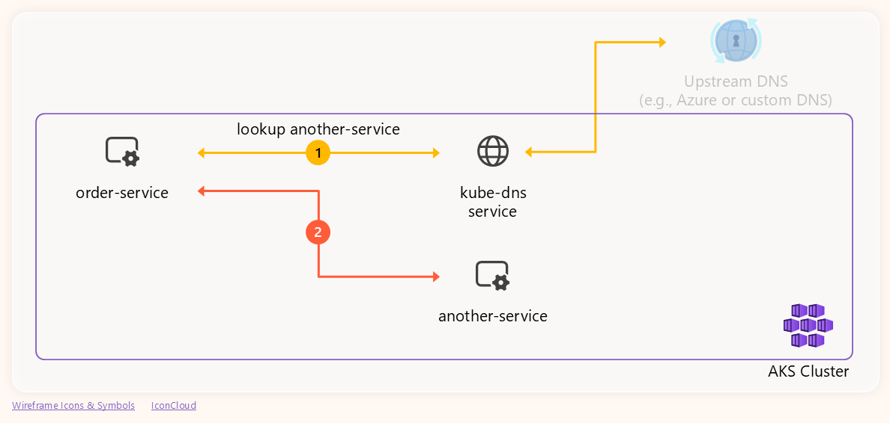

### External Endpoint Resolution

For external domains such as `myexternalendpoint.com`, `kube-dns` receives the pod's query and generates its own DNS request to the configured upstream DNS server (in our case, a custom DNS). Once the upstream server responds, `kube-dns` sends that response back to the pod. The following diagram illustrates this end-to-end flow:

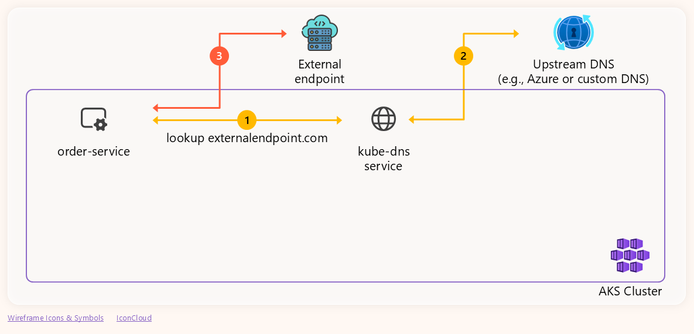

## Demo Environment & Failing Scenario

Our setup for this demo includes:

- An AKS cluster configured to use a custom DNS server at `10.224.0.92`.
- The custom DNS server is intentionally misconfigured to not respond to queries with name `myexternalendpoint.com`. Any other domain name is resolved correctly.
- A simple store application where one of the services needs to connect to `myexternalendpoint.com`.

> The application code alongside the detailed steps to reproduce the environment ([setup-env.md](https://github.com/blanquicet/aks-store-demo/blob/main/setup-env.md)) and the demo ([detailed-guide.md](https://github.com/blanquicet/aks-store-demo/blob/main/detailed-guide.md)) are available at [blanquicet/aks-store-demo](https://github.com/blanquicet/aks-store-demo).

Once the environment is ready, let's deploy the application:

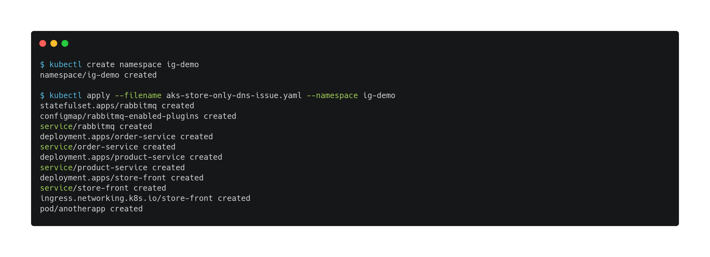

Then, access the application through the store-front Ingress IP, which exposes it to the Internet:

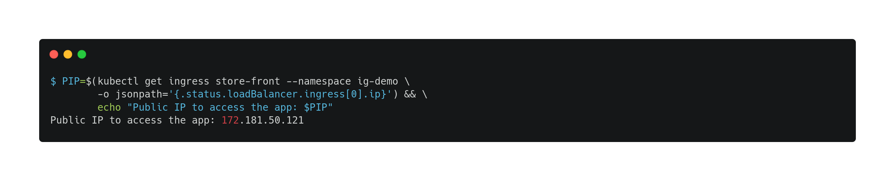

And finally, try the application. You'll notice that when the product Inspektor Gadget is in the cart and you try to check out, the UI hangs and eventually fails with the following message:

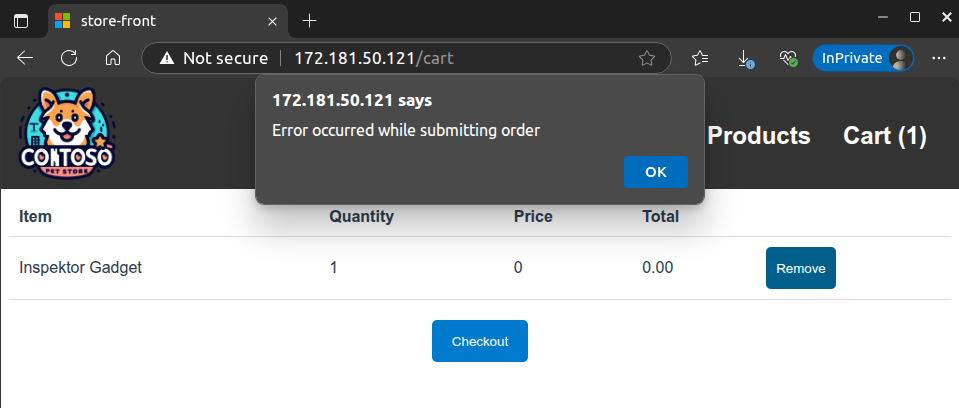

And this is the error we will debug.

## Troubleshooting the DNS Issue with Inspektor Gadget

This is the part of the application we are focusing on:

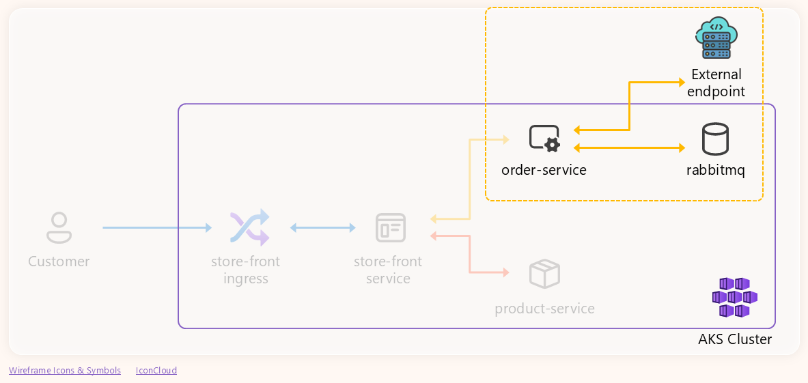

1. Let's start by checking `order‑service` pod logs:

    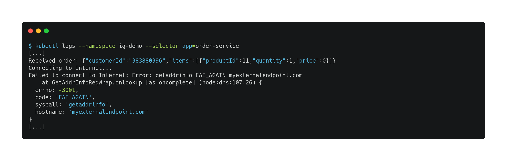

    **Finding**: The logs show "getaddrinfo EAI_AGAIN myexternalendpoint.com", indicating DNS lookup failures for the external endpoint.

2. Now that we know it's a DNS issue, let's trace the DNS traffic using [Inspektor Gadget](http://inspektor-gadget.io/). Inspektor Gadget is a versatile open source tool for observability. In this case, it will allow us to easily view DNS queries and responses to identify the root cause of the issue. If you are not running it yet, deploy it into your cluster by following the [installation instructions](https://inspektor-gadget.io/docs/latest/quick-start#kubernetes).

    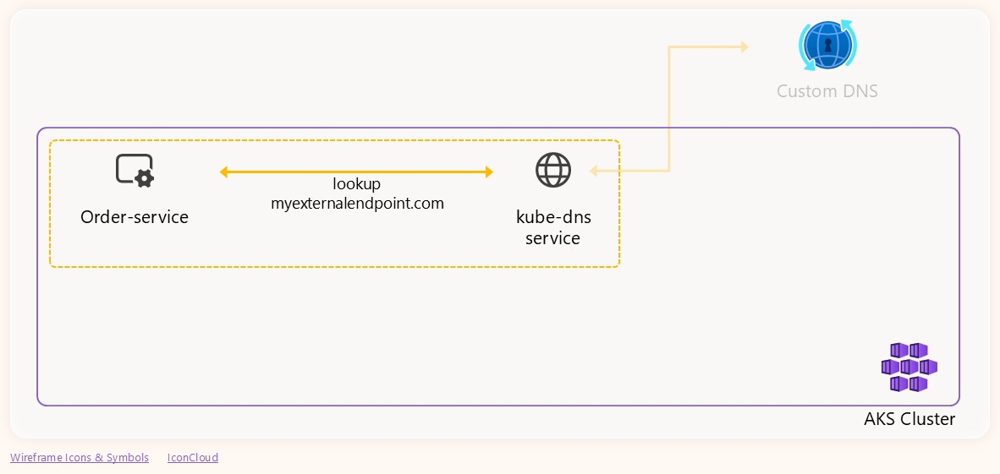

    With IG installed, let's run the [trace_dns gadget](https://inspektor-gadget.io/docs/latest/gadgets/trace_dns) to trace the DNS requests generated by the `order-service` pod for the `myexternalendpoint.com.` domain name:

    > **Note**: Ensure that the filter value is a fully qualified domain name (FQDN) by adding a dot (.) to the end of the name.

    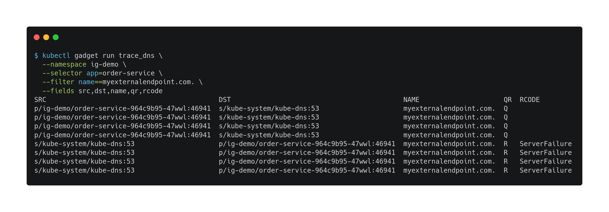

    **Observations**: The trace output shows multiple DNS queries (QR=Q) from the `order-service` pod to `kube-dns` for `myexternalendpoint.com.`, followed by response packets (QR=R) from `kube-dns` with response code `ServerFailure`. This indicates that `kube-dns` received the queries but failed to resolve the name, returning a server failure error.

3. Now, given that it's resolving an external domain, let's check if that failure is coming from the custom DNS or it's being generated by the `kube-dns` service itself. To do this, we will trace the DNS traffic between `kube-dns` and the custom DNS server.

    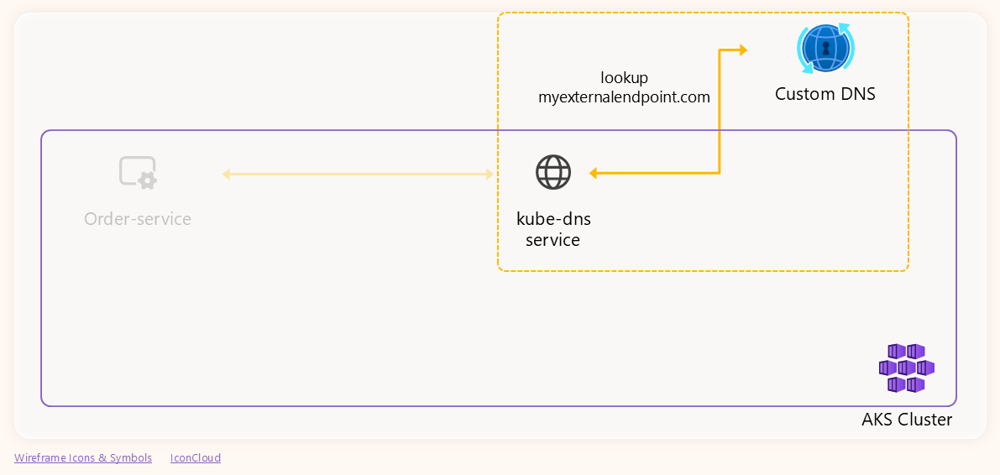

    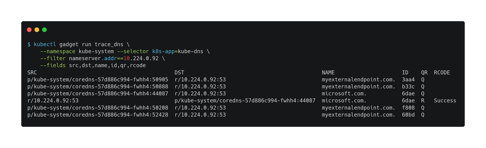

    The output confirmed that the custom DNS server is reachable but it's not replying to the queries related with the `myexternalendpoint.com.` name:

    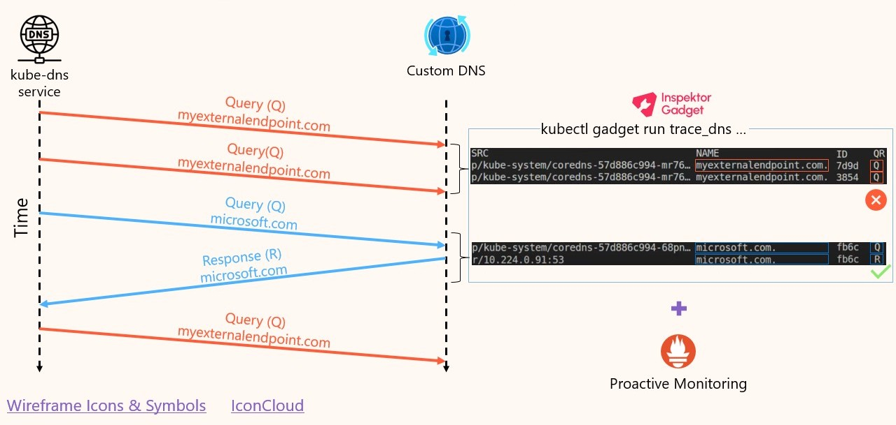

## Wrap-up

With Inspektor Gadget, we were able to follow the entire DNS resolution process and see exactly where things went wrong. Starting from the `order-service` pod, we saw DNS queries being sent to `kube-dns` and confirmed that `kube-dns` was responding with `ServerFailure`. This alone gave us confidence that the issue wasn't within the application logic or networking rules.

We then followed the trail from `kube-dns` to the upstream DNS server and confirmed that `kube-dns` was generating the proper external queries—but the upstream server wasn't replying at all. This clearly explained the server failure responses `kube-dns` was returning to the application.
To validate that the issue was isolated to a specific domain, we traced other DNS queries to the upstream server and saw successful responses, proving the DNS server itself was reachable and generally working.

Having this visibility into DNS traffic at each step of the chain made troubleshooting faster and more reliable. Inspektor Gadget didn't just help us observe behaviors in real time—it let us isolate the issue with confidence and understand the impact across components.

Complementarily, you can get networking metrics and logs using the Container Network Observability feature of [Advanced Container Networking Services​ (ACNS)](https://learn.microsoft.com/en-us/azure/aks/advanced-container-networking-services-overview). This feature provides networking observability for AKS clusters and also supports Windows nodepools.

For a broader guide on diagnosing DNS issues in production clusters, check out [this DNS troubleshooting walkthrough on Microsoft Learn](https://learn.microsoft.com/en-us/troubleshoot/azure/azure-kubernetes/connectivity/dns/troubleshoot-dns-failures-across-an-aks-cluster-in-real-time).

## Resources

Summary of resources used in this article:

- [Demo application code](https://github.com/blanquicet/aks-store-demo)
- [Inspektor Gadget Documentation](https://inspektor-gadget.io/docs/latest/)
- [trace_dns Gadget Documentation](https://inspektor-gadget.io/docs/latest/gadgets/trace_dns)
- [Microsoft Build Breakout Session #181](https://build.microsoft.com/en-US/sessions/BRK181)
- [DNS Troubleshooting Walkthrough on Microsoft Learn](https://learn.microsoft.com/en-us/troubleshoot/azure/azure-kubernetes/connectivity/dns/troubleshoot-dns-failures-across-an-aks-cluster-in-real-time)
