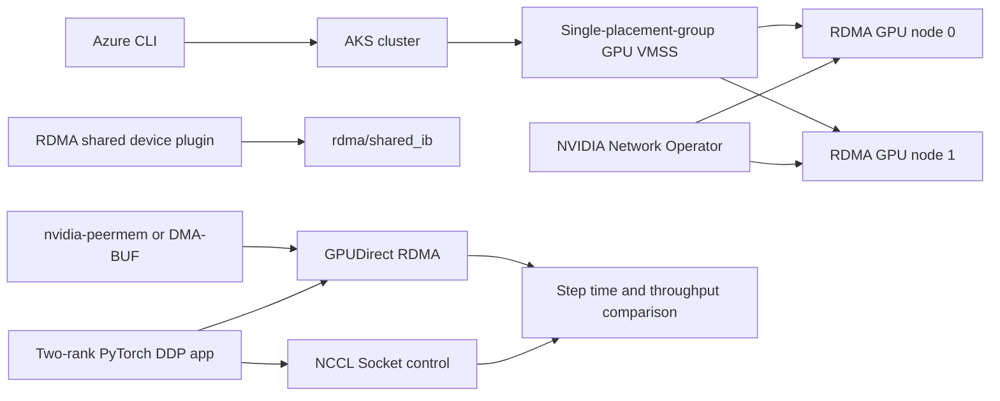

# Accelerate distributed AI training with GPUDirect RDMA on AKS

Provision two RDMA-capable GPU nodes, enable InfiniBand and GPUDirect RDMA,
validate the fabric, and run the same PyTorch DistributedDataParallel (DDP)
application twice: once over ordinary Ethernet sockets and once over
InfiniBand. The final report accepts an RDMA speedup only when NCCL logs prove
that the accelerated run used `NET/IB/.../GDRDMA`.

## What you'll build



The lab validates each layer separately:

1. **Placement:** both nodes belong to one VM scale set with
   `singlePlacementGroup=true`.
2. **Kernel and scheduling:** Mellanox OFED, GPUs, `rdma/shared_ib`, and a
   peer-memory path (`nvidia-peermem` or DMA-BUF) are ready.
3. **Fabric:** verbs report an active InfiniBand link and cross-node
   `ib_write_bw` bandwidth.
4. **Application transport:** NCCL reports Socket for the control and
   `NET/IB/.../GDRDMA` for the accelerated run.
5. **Application impact:** the same 256-MiB DDP gradient, image, GPU count, and
   nodes produce comparable step-time and throughput metrics.

## Why placement matters

Azure's InfiniBand fabric is isolated at the VMSS boundary. RDMA peers must be
in the same VM scale set (or availability set), and an HPC VMSS must use a
single placement group. This lab therefore creates both GPU nodes in one AKS
node pool and verifies the generated VMSS setting instead of creating separate
pools.

The Azure RDMA network reserves `172.16.0.0/16`. The cluster uses
`10.244.0.0/16` for pods and `10.0.0.0/16` for services so neither overlaps
that range.

## Learning objectives

After completing the lab, you'll be able to:

- Provision a two-node AKS pool that is eligible for the same InfiniBand fabric.
- Explain the difference between Ethernet control traffic, InfiniBand verbs,
  RDMA, and GPUDirect RDMA.
- Expose InfiniBand HCAs as schedulable Kubernetes resources.
- Prove that links are Active and measure latency and bandwidth with perftest.
- Distinguish NCCL's Socket and IB/GDR transports from logs.
- Quantify the effect of RDMA on a real PyTorch DDP gradient synchronization.

## Time and cost

- **Time:** 60–90 minutes; specialized node allocation and driver setup account
  for most of it.
- **Cost:** The default creates one CPU system node and **two 8-GPU
  `Standard_ND96amsr_A100_v4` nodes**. These are expensive resources billed
  from allocation until deletion.
- **Quota/capacity:** Two default GPU nodes require 192 ND A100-family vCPUs.
  Quota is not a capacity guarantee; allocation can still fail.
- **Cleanup:** Run `./scripts/90-cleanup.sh --all` immediately after the lab.

## Modules

| # | Module | Goal | Time |
| --- | --- | --- | ---: |
| 1 | [Check prerequisites](modules/01-check-prerequisites.md) | Validate tools, feature state, SKU entitlement, RDMA capability, and quota | 5 minutes |
| 2 | [Provision the cluster](modules/02-provision-cluster.md) | Create AKS and a two-node, single-placement-group RDMA GPU pool | 20–35 minutes |
| 3 | [Enable RDMA and GPUDirect](modules/03-enable-rdma.md) | Install Network Operator, OFED, device plugins, and a GPUDirect memory path | 15–25 minutes |
| 4 | [Validate InfiniBand](modules/04-validate-infiniband.md) | Prove active links and measure cross-node verbs latency/bandwidth | 5 minutes |
| 5 | [Run the training comparison](modules/05-run-training-comparison.md) | Compare identical DDP steps over TCP and GPUDirect RDMA | 5–10 minutes |
| 6 | [Observe and interpret results](modules/06-observe-results.md) | Verify transport evidence and interpret application metrics | 5 minutes |
| 7 | [Clean up](modules/07-cleanup.md) | Delete all billable resources safely | 5 minutes |

## Fast path

Read the modules before the first run. To repeat the checked workflow:

```bash
./scripts/00-preflight.sh
./scripts/10-create-cluster.sh
./scripts/20-install-rdma.sh
./scripts/30-validate-fabric.sh
./scripts/40-run-training-comparison.sh
./scripts/50-report.sh
./scripts/90-cleanup.sh --all
```

Override defaults with environment variables, for example:

```bash
export LAB_SUBSCRIPTION=<subscription-id>
export LAB_LOCATION=southcentralus
export LAB_GPU_SKU=Standard_ND96amsr_A100_v4
```

## What the application measures

The application is a real two-rank PyTorch DDP loop. Each rank owns one GPU on
a different node. An 8,192 × 8,192 dense neural layer creates one 256-MiB
gradient bucket; `loss.backward()` makes DDP synchronize that gradient before
the optimizer step. Keeping the synthetic batch small isolates the network path
that dominates communication-heavy distributed training.

The control and accelerated runs differ only in `NCCL_IB_DISABLE`:

| Run | Setting | Required log evidence |
| --- | --- | --- |
| TCP control | `NCCL_IB_DISABLE=1` | `Using network Socket` |
| RDMA | `NCCL_IB_DISABLE=0` | `Using network IB` and `GDRDMA` |

A faster run without `GDRDMA` evidence is not counted as a GPUDirect result.

## Validation status

The complete checked-in workflow was exercised from a new resource group to
final deletion on a real AKS cluster in `eastus2euap`, with two managed
`Standard_ND96isr_H200_v5` nodes in one single-placement-group VMSS. This run
created the control plane and pool, installed every pinned component, validated
the fabric, compared both transports, and deleted the resource group. Each DDP
rank requested one H200 GPU and one RDMA resource on a different node.

The AKS-managed open NVIDIA module could not load `nvidia-peermem` after OFED
installation, so the run took the documented DMA-BUF fallback. NCCL then proved
that both accelerated ranks used `NET/IB/.../GDRDMA`.

Measured results on 2026-09-20:

<!-- markdownlint-disable MD013 -->

| Check | Result |
| --- | ---: |
| InfiniBand link | Active, 400 Gb/s; 3.29 µs average read latency |
| `ib_write_bw`, 8-MiB messages | 379.96 Gb/s average |
| DDP over TCP | 206.933 ms/step, 4.832 steps/s, 1.297 GB/s effective gradient rate |
| DDP over GPUDirect RDMA | 11.716 ms/step, 85.351 steps/s, 22.911 GB/s effective gradient rate |
| Application improvement | **17.66x lower step time / 17.66x higher throughput** |

<!-- markdownlint-enable MD013 -->

The accelerated logs contained `via NET/IB/.../GDRDMA`; the control logs
contained `NET/Socket`.

The workload path was also validated on two idle nodes in an existing
`Standard_ND96isr_H100_v5` AKS pool. That pool exposes its RDMA resource as the
valid Kubernetes quantity `1k`, so the scripts accept nonzero quantity suffixes
instead of assuming all extended resources are plain integers.

<!-- markdownlint-disable MD013 -->

| H100 check | Result |
| --- | ---: |
| InfiniBand link | Active, 400 Gb/s; 5.24 µs average read latency |
| `ib_write_bw`, 8-MiB messages | 378.46 Gb/s average |
| DDP over TCP | 280.383 ms/step, 3.567 steps/s |
| DDP over GPUDirect RDMA | 12.582 ms/step, 79.481 steps/s |
| Application improvement | **22.28x** |

The InfiniBand-only phase was also validated between two
`Standard_ND96amsr_A100_v4` AKS nodes: the 200-Gb/s link was Active,
`ib_read_lat` averaged 5.99 µs, and `ib_write_bw` sustained 187.78 Gb/s. One
node's GPUs were fully allocated by an existing workload, so no A100 DDP A/B
result is claimed.

<!-- markdownlint-enable MD013 -->

Exact numbers vary by SKU, image, topology, and cluster load. The scripts
enforce evidence and configurable floors rather than assuming these values
everywhere.

## Sources

- [Set up InfiniBand on Azure HPC VMs](https://learn.microsoft.com/azure/virtual-machines/setup-infiniband#cluster-configuration-options)
- [Azure/aks-rdma-infiniband](https://github.com/Azure/aks-rdma-infiniband)
- [NVIDIA Network Operator 26.4.0](https://docs.nvidia.com/networking/display/kubernetes2640/getting-started-kubernetes.html)
- [PyTorch DistributedDataParallel](https://pytorch.org/docs/stable/generated/torch.nn.parallel.DistributedDataParallel.html)
