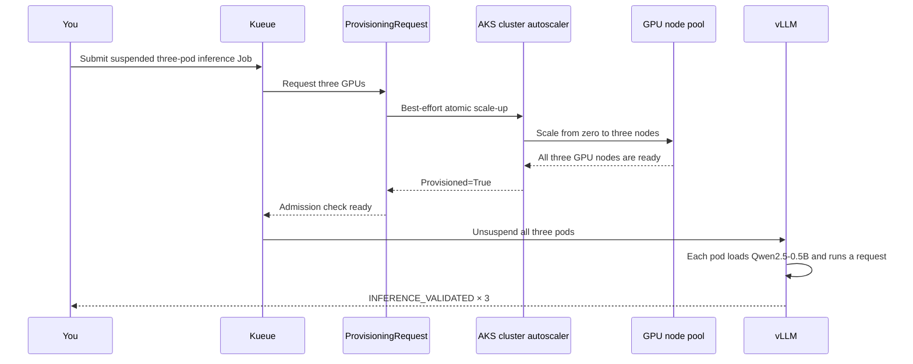

# Provision GPU inference with Kueue on AKS

Start with an empty GPU node pool, submit a three-pod inference workload, and
watch Azure Kubernetes Service (AKS) add all three GPU nodes before Kueue allows
the workload to run.

## What you'll build



This codelab demonstrates three separate responsibilities:

- **Kueue** decides when the workload can start.
- **ProvisioningRequest and the AKS cluster autoscaler** add node capacity.
- **vLLM** loads a real model and serves an OpenAI-compatible request.

## Learning objectives

After you finish, you'll be able to:

- Configure a Kueue queue that gates GPU workloads on capacity provisioning.
- Identify each state between workload submission and Kueue admission.
- Scale an AKS GPU node pool from zero before pods are created.
- Validate GPU inference with a real model request.
- Distinguish workload admission, node autoscaling, and inference replica scaling.

## Time and cost

- **Time:** 45–60 minutes, including cluster and GPU node provisioning.
- **Cost:** The cluster uses two CPU system nodes. Up to three GPU nodes are
  billed while the pool is above zero. Model download and cold start can take
  several minutes.
- **Cleanup:** Run `./scripts/90-cleanup.sh --all` as soon as you finish.

Azure GPU availability and quota vary by subscription and region. The preflight
script checks both before creating resources.

## Important managed GPU limitation

This codelab uses a conventional GPU node pool with the AKS-installed driver and
an explicitly installed NVIDIA device plugin. It does **not** use
`--enable-managed-gpu=true` because managed GPU node pools don't support the
cluster autoscaler during preview.

The fully managed GPU experience and automatic GPU node scaling can't currently
be demonstrated on the same pool. This codelab prioritizes the end-to-end
Kueue-to-autoscaler path.

## Modules

| # | Module | Goal | Time |
|---|---|---|---:|
| 1 | [Check prerequisites](modules/01-check-prerequisites.md) | Confirm tools, Azure access, GPU SKU availability, and quota | 5 minutes |
| 2 | [Create the cluster](modules/02-create-cluster.md) | Create a Kubernetes 1.35 AKS cluster with CPU system nodes | 15 minutes |
| 3 | [Create the GPU pool](modules/03-create-gpu-pool.md) | Add an autoscaling GPU pool that starts at zero | 5 minutes |
| 4 | [Install the controllers](modules/04-install-controllers.md) | Install Kueue and the NVIDIA device plugin | 5 minutes |
| 5 | [Configure provisioning](modules/05-configure-provisioning.md) | Connect Kueue to the AKS cluster autoscaler | 3 minutes |
| 6 | [Run inference](modules/06-run-inference.md) | Trigger scale-up and make a real model request | 10–20 minutes |
| 7 | [Observe and troubleshoot](modules/07-observe-and-troubleshoot.md) | Read each control-plane handoff and diagnose stalls | 10 minutes |
| 8 | [Clean up](modules/08-cleanup.md) | Remove GPU capacity and all lab resources | 5 minutes |

## Fast path

Follow the modules for explanations and checkpoints. After reading them once,
use this sequence to repeat the lab:

```bash
./scripts/00-preflight.sh
./scripts/10-create-cluster.sh
./scripts/20-create-gpu-pool.sh
./scripts/30-install-controllers.sh
./scripts/40-configure-queue.sh
./scripts/50-submit-inference.sh
./scripts/60-watch-flow.sh
./scripts/90-cleanup.sh --all
```

## Validation status

The complete checked-in scenario was validated in `eastasia` using the
`AKS E2E - GPU SKU Test` subscription and three
`Standard_NV6ads_A10_v5` nodes:

- The pool started with zero nodes.
- Kueue created one Workload and a ProvisioningRequest with `count: 3`.
- CAS changed the pool from zero to three.
- All three nodes became Ready and advertised `nvidia.com/gpu`.
- The ProvisioningRequest reached `Provisioned=True` with reason
  `CapacityIsProvisioned`.
- Kueue admitted the Job only after all capacity was ready.
- The Job completed `3/3`, and every pod returned `INFERENCE_VALIDATED`.
- Submission through Job completion took 418 seconds.

The run established the settings required by a 4-GB A10-4Q profile: 70% GPU
memory utilization, a 2,048-token context, four sequences, and eager execution.
The watcher reports Azure pool count and Ready Kubernetes node count separately
so node-bootstrap failures remain visible.
