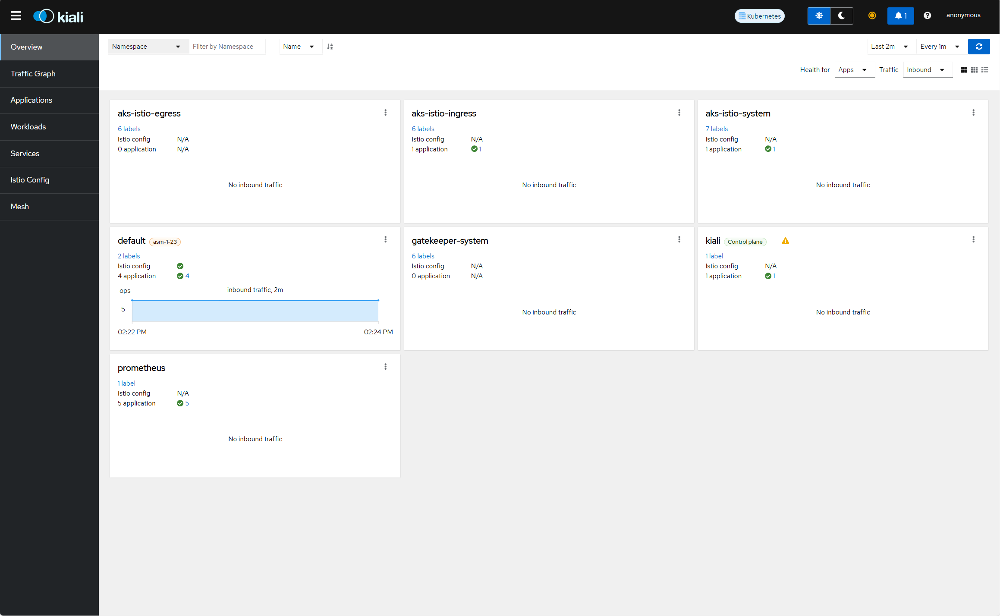
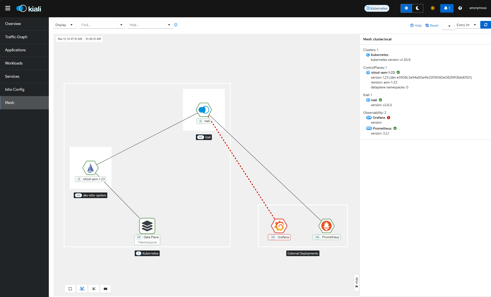
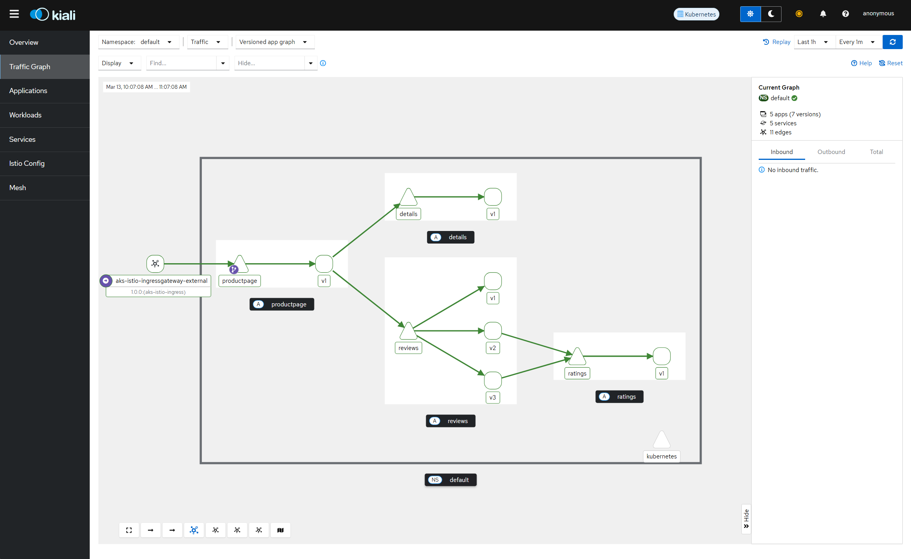

# Kiali Dashboard Integration with Istio-based service mesh add-on for AKS

This document contains instructions on how to integrate Kiali dashboard with Istio-based service mesh add-on for Azure Kubernetes Service (AKS) to visualize and monitor your service mesh traffic.

## Objectives
* Deploy Kiali dashboard to visualize Istio service mesh traffic
* Configure Prometheus to collect metrics from Istio
* Set up external access to the Kiali dashboard
* Demonstrate traffic visualization for a sample application

> [!Note]  
> [Kiali](https://kiali.io/) is not officially supported by Microsoft, but can be used with AKS Istio add-on as a third-party integration.

## Before you begin
* [Install](https://learn.microsoft.com/en-us/azure/aks/istio-deploy-addon#install-istio-add-on) Istio-based service mesh add-on on your cluster.
    ```shell
    az aks mesh enable -g <rg-name> -n <cluster-name>
    ```
* [Enable external ingressgateway](https://learn.microsoft.com/en-us/azure/aks/istio-deploy-ingress#enable-external-ingress-gateway)
    ```shell
    az aks mesh enable-ingress-gateway -g <rg-name> -n <cluster-name> --ingress-gateway-type external
    ```
* [Enable sidecar injection](https://learn.microsoft.com/en-us/azure/aks/istio-deploy-addon#enable-sidecar-injection) on the default namespace. 
    ```shell
    revision=$(az aks show --resource-group <rg-name> --name <cluster-name> --query 'serviceMeshProfile.istio.revisions[0]' -o tsv)
    kubectl label namespace default istio.io/rev=$revision
    ```
* Install demo app
    ```shell
    kubectl apply -f https://raw.githubusercontent.com/istio/istio/release-1.23/samples/bookinfo/platform/kube/bookinfo.yaml
    ```

    Confirm several deployments and services are created on your cluster. For example:
    ```console
    service/details created
    serviceaccount/bookinfo-details created
    deployment.apps/details-v1 created
    service/ratings created
    serviceaccount/bookinfo-ratings created
    deployment.apps/ratings-v1 created
    service/reviews created
    serviceaccount/bookinfo-reviews created
    deployment.apps/reviews-v1 created
    deployment.apps/reviews-v2 created
    deployment.apps/reviews-v3 created
    service/productpage created
    serviceaccount/bookinfo-productpage created
    deployment.apps/productpage-v1 created
    ```
    ```shell
    kubectl get pods
    ```
    Ensure each pod has 2/2 containers in the `Ready` state
    ```console
    NAME                              READY   STATUS    RESTARTS   AGE
    details-v1-558b8b4b76-2llld       2/2     Running   0          2m41s
    productpage-v1-6987489c74-lpkgl   2/2     Running   0          2m40s
    ratings-v1-7dc98c7588-vzftc       2/2     Running   0          2m41s
    reviews-v1-7f99cc4496-gdxfn       2/2     Running   0          2m41s
    reviews-v2-7d79d5bd5d-8zzqd       2/2     Running   0          2m41s
    reviews-v3-7dbcdcbc56-m8dph       2/2     Running   0          2m41s
    ```

* Configure ingress gateway and virtual service
    ```shell
    kubectl apply -f gateway.yaml
    kubectl apply -f virtualservice.yaml
    ```
* Validate that the sample application is accessible.  
    ```shell
    # Set environment variables for external ingress host and ports:
    export INGRESS_HOST_EXTERNAL=$(kubectl -n aks-istio-ingress get service aks-istio-ingressgateway-external -o jsonpath='{.status.loadBalancer.ingress[0].ip}')
    export INGRESS_PORT_EXTERNAL=$(kubectl -n aks-istio-ingress get service aks-istio-ingressgateway-external -o jsonpath='{.spec.ports[?(@.name=="http2")].port}')
    export GATEWAY_URL_EXTERNAL=$INGRESS_HOST_EXTERNAL:$INGRESS_PORT_EXTERNAL
    ```
    Retrieve the external address of the sample application:
    ```shell
    echo "http://$GATEWAY_URL_EXTERNAL/productpage"
    ```
    Use `curl` to confirm the sample application is accessible:
    ```shell
    curl -s "http://${GATEWAY_URL_EXTERNAL}/productpage" | grep -o "<title>.*</title>"
    ```
    The expected output is:
    ```console
    <title>Simple Bookstore App</title>
    ```

## Steps
### 1. Deploy Prometheus for Kiali
Kiali requires Prometheus to collect and query metrics from your service mesh.

```shell
# Create a namespace for Prometheus
kubectl create namespace prometheus

# Add Prometheus Helm repository
helm repo add prometheus-community https://prometheus-community.github.io/helm-charts
helm repo update

# Install Prometheus
helm install prometheus prometheus-community/prometheus \
  --namespace prometheus \
  -f prometheus-values.yaml

# Verify the Prometheus pods are running
kubectl get pods -n prometheus
```

### 2. Install Kiali
> [!Important]
> This guide uses anonymous authentication for simplicity. For production deployments, implement appropriate authentication methods to secure your kiali dashboard from unauthorized access.
```shell
# Create namespace for Kiali
kubectl create namespace kiali-operator

# Add Kiali Helm repository (requires Helm 3)
helm repo add kiali https://kiali.org/helm-charts
helm repo update

# Install Kiali operator
helm install \
  --namespace kiali-operator \
  kiali-operator kiali/kiali-operator \
  -f kiali-values.yaml

# Wait for the Kiali operator to deploy Kiali
kubectl wait --for=condition=available deployment/kiali-operator -n kiali-operator --timeout=120s
sleep 30
kubectl wait --for=condition=available deployment/kiali -n kiali-operator --timeout=300s
```
```shell
# Check the Kiali CR exists:
kubectl get kialis -n kiali-operator  
```
```console
NAME    AGE
kiali   3m5s
```
```shell
#Verify all Kiali pods are running
kubectl get pods -n kiali-operator  
```
```console
NAME                              READY   STATUS    RESTARTS   AGE
kiali-6cf5bfd56d-2gmp4            1/1     Running   0          2m58s
kiali-operator-6cb48ccc78-lm8vp   1/1     Running   0          3m12s
```
### 3. Create an External Service for Kiali
Create a LoadBalancer service to access Kiali from outside the cluster:
```shell
kubectl apply -f kiali-external-service.yaml
```
Retrieve the external IP for Kiali:
```shell
kubectl get svc kiali-external -n kiali-operator

export KIALI_EXTERNAL_IP=$(kubectl get svc kiali-external -n kiali-operator -o jsonpath='{.status.loadBalancer.ingress[0].ip}')
```
```console
NAME            TYPE           CLUSTER-IP    EXTERNAL-IP     PORT(S)      AGE
kiali-external  LoadBalancer   10.0.25.123   20.240.112.45   20001:32456/TCP   45s
```
You can now access the Kiali dashboard at ```http://${KIALI_EXTERNAL_IP}:20001```

### 4. Kiali Dashboard Visualization
#### Generate Traffic for Visualization
To visualize service mesh traffic in Kiali, you need to generate traffic to your application:
```shell
for i in {1..100}; do 
  curl -s "http://${GATEWAY_URL_EXTERNAL}/productpage" > /dev/null
  sleep 0.2
done
```

#### Kiali Dashboard
>[!Note]
To learn about the full set of features supported by Kiali, see the [website](https://kiali.io/docs/features/)  

Navigate to ```http://${KIALI_EXTERNAL_IP}:20001``` in your browser to access the Kiali dashboard to visualize different aspects of your service mesh.   







## Troubleshooting
### No traffic showing in Kiali graph
1. Verify that Prometheus is collecting Istio metrics:
    ```shell
    # Port forward to Prometheus UI
    kubectl port-forward svc/prometheus-server -n prometheus 9090:80
    ```
    Open ```http://localhost:9090``` in your browser and query ```istio_requests_total```. If data is present, Prometheus is collecting metrics correctly.

2. Check if your application pods have Istio sidecar injected:
    ```shell
    kubectl get pods -n default
    ```
    Each pod should show 2/2 containers (your application + istio-proxy).

3. Verify sidecar injection by checking for istio-proxy containers:
    ```shell
    kubectl get pods -n default -o jsonpath='{.items[*].spec.containers[*].name}' | grep istio-proxy
    ```

4. Check Kiali logs for any errors:
    ```shell
    kubectl logs -l app=kiali -n kiali-operator
    ```

### Kiali dashboard not accessible
If you can't access the Kiali dashboard through the external service:
1. Verify the external service is properly created:
    ```shell
    kubectl get svc kiali-external -n kiali-operator
    ```
2. Check if the service is properly selecting the Kiali pods:

    ```shell
    kubectl describe svc kiali-external -n kiali-operator
    ```

3. Try accessing Kiali through port-forwarding as an alternative:

    ```shell
    kubectl port-forward svc/kiali -n kiali-operator 20001:20001
    ```
    Then access Kiali at http://localhost:20001

## Clean up
To remove Kiali and its components:
```shell
# Delete the Kiali external service
kubectl delete service kiali-external -n kiali-operator

# Uninstall Kiali
helm uninstall kiali-operator -n kiali-operator
kubectl delete namespace kiali-operator

# Uninstall Prometheus
helm uninstall prometheus -n prometheus
kubectl delete namespace prometheus
```