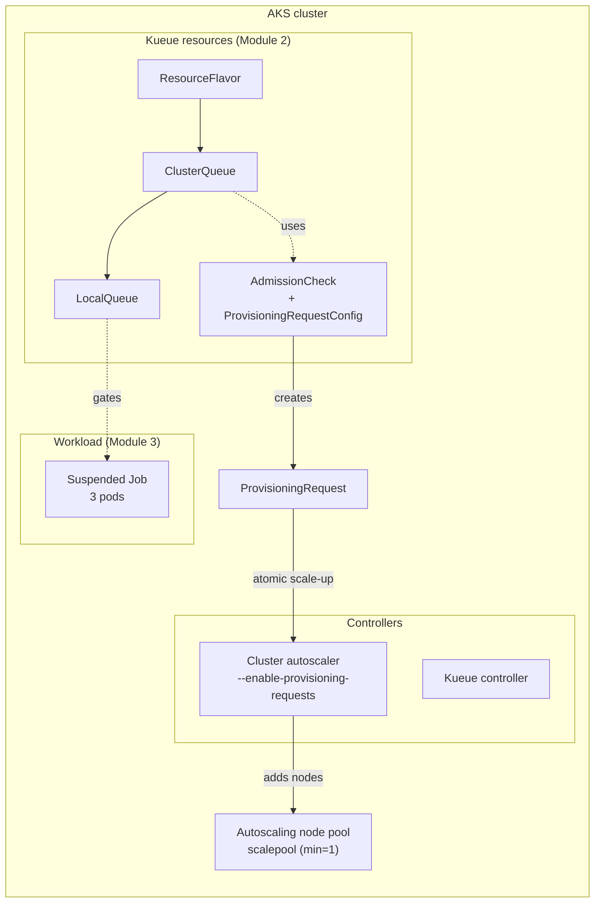

# Kueue and Cluster Autoscaler on AKS

A hands-on walkthrough for gating batch workloads with [Kueue](https://kueue.sigs.k8s.io/)
and letting the AKS [cluster autoscaler](https://learn.microsoft.com/azure/aks/cluster-autoscaler-overview)
provision the capacity they need — on demand, before the workload starts.

## Overview

Running batch and gang-scheduled workloads on a shared cluster needs two things:
something to decide *which* workloads run *when*, and something to make sure the
*nodes* those workloads need actually exist. This walkthrough uses Kueue for the
first and the cluster autoscaler (CAS) for the second, connected through the
Kubernetes [ProvisioningRequest](https://github.com/kubernetes/autoscaler/tree/master/cluster-autoscaler/provisioningrequest)
API.

[Kueue](https://kueue.sigs.k8s.io/) is a Kubernetes-native job queueing
controller. Instead of letting every submitted job grab nodes immediately, you
define quotas (ResourceFlavors and ClusterQueues) and Kueue gates admission
against them. A Job submitted with `suspend: true` and a queue-name label stays
suspended until Kueue admits it.

The cluster autoscaler grows and shrinks node pools to match pending demand. On
its own, CAS reacts *after* pods are unschedulable. Paired with Kueue through a
**ProvisioningRequest AdmissionCheck**, the model flips to *provision first*:
Kueue asks CAS — via a ProvisioningRequest of the
`best-effort-atomic-scale-up` class — to atomically add the capacity a workload
needs, and only admits the workload once the nodes are ready. This avoids the
half-scheduled gang problem where some pods land and others sit Pending.

AKS supplies the rest: a node pool with autoscaling enabled, and the
cluster-autoscaler `--enable-provisioning-requests` capability. The three
modules below provision that infrastructure, configure the queues and
provisioning gate, and submit a workload that triggers a real scale-up.

## Architecture



Kueue picks up the suspended Job, creates a Workload, and — because the
ClusterQueue carries the `cas-provisioning` AdmissionCheck — generates a
ProvisioningRequest. The cluster autoscaler honors it with an atomic scale-up of
`scalepool`, and once the nodes exist Kueue admits the Job and its pods
schedule.

## Modules

| Module | Directory | What you'll do |
|--------|-----------|----------------|
| 1 — Infrastructure | [`1-infrastructure/`](1-infrastructure/) | Provision an AKS cluster with an autoscaling node pool and install the Kueue controller |
| 2 — Kueue Queues | [`2-kueue-queues/`](2-kueue-queues/) | Apply the ResourceFlavor, the ProvisioningRequest AdmissionCheck, and the ClusterQueue / LocalQueue |
| 3 — Workload | [`3-workload/`](3-workload/) | Submit a suspended Job and watch Kueue + CAS provision nodes to run it |

Work through them in order — each module assumes the previous one is in place.

## Prerequisites

| Tool | Version | Notes |
|------|---------|-------|
| [Azure CLI](https://learn.microsoft.com/cli/azure/install-azure-cli) | ≥ 2.70 | Authenticated (`az login`) |
| [kubectl](https://kubernetes.io/docs/tasks/tools/) | ≥ 1.28 | `az aks install-cli` |
| [Helm](https://helm.sh/docs/intro/install/) | ≥ 3.12 | Installs the Kueue controller |

## Quick start

```bash
# 1. Provision infrastructure (Module 1) — see 1-infrastructure/README.md
#    Creates an AKS cluster with an autoscaling pool "scalepool" (min=1 max=5)
#    and installs Kueue.

# 2. Configure Kueue + the provisioning gate (Module 2)
cd 2-kueue-queues
kubectl apply -f manifests/00-namespace.yaml
kubectl apply -f manifests/10-resource-flavor.yaml
kubectl apply -f manifests/20-provisioning.yaml

# 3. Submit the workload (Module 3)
cd ../3-workload
kubectl apply -f manifests/job.yaml

# 4. Watch Kueue create a ProvisioningRequest and CAS scale up
kubectl -n cas-demo get provisioningrequest -w   # Provisioned=True
kubectl get nodes -l agentpool=scalepool -w       # node count grows
kubectl -n cas-demo get job kueue-cas-job         # COMPLETIONS 3/3
```

The Job stays `Suspended` until Kueue admits it. Kueue creates a
ProvisioningRequest, CAS atomically grows `scalepool`, and once the nodes are
Ready the Job runs to completion.

## Cleanup

```bash
kubectl delete -f 3-workload/manifests/job.yaml
kubectl delete -f 2-kueue-queues/manifests/20-provisioning.yaml
kubectl delete -f 2-kueue-queues/manifests/10-resource-flavor.yaml
kubectl delete -f 2-kueue-queues/manifests/00-namespace.yaml
# Then delete the cluster / resource group from Module 1.
```
