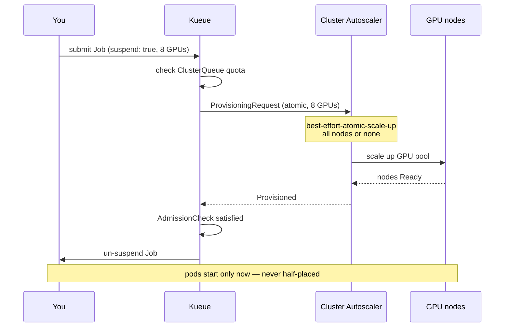

# GPU Labs — Kueue + Cluster Autoscaler end to end

A hands-on sequence for running GPU workloads on AKS with Kueue admission
control and the cluster autoscaler. It covers the full path a customer walks:
provisioning a GPU pool, verifying the hardware, running distributed training,
sharing the cluster between competing jobs, and reading the metrics that tell
you whether any of it performed.

The [`cas-batch-job`](../cas-batch-job/) example demonstrates the same
Kueue + CAS provisioning gate on CPU. These labs are the GPU version, where the
mechanism stops being a nicety and starts being the thing that keeps an
expensive cluster from deadlocking.

## Why admission control matters more for GPUs

On CPU, over-provisioning is cheap and a partially scheduled job is merely
wasteful. On GPUs neither holds:

- **Cost.** An `ND96amsr_A100_v4` node is roughly two orders of magnitude more
  expensive per hour than a general-purpose D8. Idle GPUs are the single
  largest source of waste in a shared AI cluster.
- **Scarcity.** A100/H100 capacity is frequently constrained. "Scale up and see"
  is not a reliable strategy when the capacity may not be there.
- **All-or-nothing semantics.** A distributed training job that receives 6 of
  the 8 GPUs it needs does not run at 75%. It runs at 0%, while holding 6 GPUs
  nobody else can use. Two such jobs can deadlock a cluster indefinitely, each
  waiting on capacity the other is squatting on.

Kueue plus the cluster autoscaler addresses all three. Jobs are admitted only
when their **entire** GPU request can be satisfied, and the capacity is
provisioned atomically before the workload starts:



The job consumes nothing while it waits. No pods, no partial placement, no
GPUs held hostage.

## The labs

| Lab | What it teaches | GPUs |
|-----|-----------------|------|
| [1 — GPU verification](manifests/10-gpu-verify.yaml) | Prove the stack works: driver, CUDA compute, NCCL interconnect | 8 (1 node) |
| [2 — Multi-node training](manifests/20-multinode-training.yaml) | Gang scheduling for distributed PyTorch DDP | 16 (2 nodes) |
| [3 — Queue contention](manifests/30-queue-contention.yaml) | What happens when demand exceeds quota | 24 requested / 16 available |

Work through them in order. Lab 1 catches hardware problems before you spend
time on Labs 2–3.

## Prerequisites

| Requirement | Notes |
|-------------|-------|
| AKS cluster, Kubernetes ≥ 1.33 | ProvisioningRequest support |
| GPU node pool with autoscaling | See below |
| Kueue ≥ v0.9 | Installed by [Module 1](../../1-infrastructure/) |
| GPU quota in your region | `az vm list-usage --location <region>` |

### Provisioning the GPU pool

The labs assume an autoscaling GPU pool named `gpupool`. The pool must scale
from zero so idle GPUs cost nothing:

```bash
az aks nodepool add \
  --resource-group <rg> --cluster-name <cluster> \
  --name gpupool \
  --node-vm-size Standard_ND96amsr_A100_v4 \
  --node-count 0 \
  --enable-cluster-autoscaler --min-count 0 --max-count 2 \
  --node-taints nvidia.com/gpu=present:NoSchedule \
  --labels gpu=a100-80gb
```

Three details that matter:

- **`--min-count 0`** lets the pool scale to zero between labs. This is the
  main cost control; without it you pay for idle A100s.
- **`--node-taints nvidia.com/gpu=present:NoSchedule`** stops CPU workloads
  from landing on GPU nodes. The ResourceFlavor tolerates this taint so Kueue
  workloads still schedule.
- **`--max-count 2`** caps the blast radius. Kueue's `nominalQuota` is a second
  ceiling; the lower of the two wins.

AKS installs the NVIDIA device plugin automatically, which is what advertises
`nvidia.com/gpu` as a schedulable resource. Confirm before starting:

```bash
kubectl get nodes -l gpu=a100-80gb \
  -o custom-columns=NODE:.metadata.name,GPUS:.status.capacity.nvidia\\.com/gpu
```

> **Other GPU SKUs.** These labs were validated on `ND96amsr_A100_v4`
> (8×A100 80 GB). For `NC80adis_H100_v5` (2×H100 94 GB), set `nvidia.com/gpu`
> to `2` in the manifests and adjust `nominalQuota` accordingly. Any SKU works
> as long as the per-pod GPU request matches what a single node provides.

### Applying the queue

```bash
kubectl apply -f ../../../2-kueue-queues/manifests/50-gpu-autoscale-queue.yaml
```

This creates the `gpu-lab` namespace, a ResourceFlavor pinned to `gpupool`, the
ProvisioningRequestConfig and AdmissionCheck that drive CAS, and a
ClusterQueue/LocalQueue pair. Verify it is ready:

```bash
kubectl get clusterqueue gpu-cluster-queue -o wide
kubectl get admissioncheck gpu-provisioning
```

---

## Lab 1 — GPU verification

Prove the GPU stack works before trusting it with a long run.

```bash
kubectl apply -f manifests/10-gpu-verify.yaml
kubectl -n gpu-lab get workload -w      # suspended until CAS provisions
kubectl -n gpu-lab logs -f job/gpu-verify
```

If the pool was at zero, expect several minutes before the pod starts: node
provisioning, GPU driver installation, then a ~9 GB image pull. This is normal
and worth knowing so you do not mistake it for a hang.

The job runs three checks of increasing strength. Actual output from an
8×A100 node:

```
1. Devices visible to this container
0, NVIDIA A100-SXM4-80GB, 81920 MiB, 580.159.04
... (8 devices)

2. CUDA compute check
torch sees 8 GPU(s)
  cuda:0 NVIDIA A100-SXM4-80GB matmul ok -> -4.531e+04
  ...

3. NCCL all-reduce across all GPUs
       size         time   algbw   busbw
  536870912       4542.8  118.18  206.81
 1073741824       8210.4  130.78  228.86
 2147483648        16253  132.13  231.22
# Avg bus bandwidth    : 224.991
```

**The third check is the one that earns its keep.** A node can pass
`nvidia-smi` and still have NVLink degraded to PCIe, which silently turns
multi-GPU training into a crawl. Bus bandwidth is how you detect it:

| Observed busbw | Interpretation |
|----------------|----------------|
| 200+ GB/s | Healthy NVLink on 8×A100 SXM |
| 20–50 GB/s | Falling back to PCIe — investigate before training |
| < 10 GB/s | Interconnect problem; do not run distributed jobs |

Checking this takes a minute. Discovering it three days into a training run
does not.

---

## Lab 2 — Multi-node distributed training

This is the lab that justifies the design: it deliberately does not fit on one
node.

```bash
kubectl apply -f manifests/20-multinode-training.yaml
kubectl -n gpu-lab get pods -w
```

Watch what happens on admission: **both pods appear at once, or neither does.**
That is the atomic guarantee. Kueue does not un-suspend the Job until CAS has
confirmed it can provision all 16 GPUs.

Follow rank 0:

```bash
kubectl -n gpu-lab logs -f job/multinode-training \
  --selector=batch.kubernetes.io/job-completion-index=0
```

Expected tail (this run is the single-node 8-GPU baseline, measured on
`ND96amsr_A100_v4`; the 16-rank two-node run reports the same shape):

```
process group up: 8 ranks
  step   0  loss 0.7122
  step  10  loss 0.1163
  step  20  loss 0.0311
  step  30  loss 0.0108
  step  40  loss 0.0037
50 steps in 0.7s
throughput: 17568.3 samples/s across 8 ranks
per-GPU:    2196.0 samples/s
peak GPU memory: 3.4 GB
```

Record `per-GPU samples/s` and treat the single-node figure as your baseline.
It is the number to watch as you change GPU count: scaling from 8 to 16 GPUs
should roughly double aggregate throughput while per-GPU throughput stays
flat. Expect *some* per-GPU drop when you cross a node boundary, because
gradients then travel over the network rather than NVLink. A large drop means
the job is communication-bound, and Lab 1's busbw is the first thing to check.

> **On this synthetic benchmark specifically:** the model is small and the data
> is generated on-device, so 50 steps complete in under a second and there is
> no input pipeline. That makes it a clean test of the distributed machinery,
> but it also makes it unusually communication-heavy relative to real training.
> Do not read these absolute numbers as a throughput expectation for your own
> model — use them to confirm the ranks rendezvous, the collective completes,
> and scaling behaves sensibly.

### Seeing the gang guarantee directly

The clearest demonstration is to ask for more than the cluster can provide:

```bash
kubectl -n gpu-lab patch job multinode-training --type=json \
  -p='[{"op":"replace","path":"/spec/parallelism","value":8}]'
```

With `--max-count 2`, an 8-node request cannot be satisfied. The Workload stays
pending with **zero pods created** — it does not grab the 2 nodes that are
available and wait for the rest:

```bash
kubectl -n gpu-lab describe workload | grep -A5 "Conditions"
```

Without gang scheduling this is exactly where a cluster deadlocks.

---

## Lab 3 — Queue contention

Three jobs, 24 GPUs requested, 16 available.

With the default `nominalQuota: "16"` and 8 GPUs per job, A and B are admitted
together and C waits for one of them to finish. If your pool is smaller (for
example a single 2-GPU H100 node), lower the quota and the per-job request to
match; the jobs then serialise one at a time and the effect is easier to see.

```bash
kubectl apply -f manifests/30-queue-contention.yaml
kubectl -n gpu-lab get workloads -w
```

A is admitted; B and C wait. When A finishes, B is admitted. At no point do
three jobs each hold a fraction of what they need.

```bash
kubectl -n gpu-lab get workloads -o custom-columns=\
NAME:.metadata.name,ADMITTED:.status.conditions[?\(@.type==\"Admitted\"\)].status
```

Observed on a 2-GPU quota (one job's worth at a time):

```
NAME                     ADMITTED
job-contention-a-78845   True
job-contention-b-c4362   <none>
job-contention-c-d1cd8   <none>
```

**Check the pod count while B and C are waiting** — this is the property that
matters:

```bash
kubectl -n gpu-lab get pods
# only contention-a's pod exists
```

B and C have created *zero* pods. They are not holding a partial allocation
and waiting for the rest; they consume nothing at all. Kueue reports exactly
why:

```bash
kubectl -n gpu-lab get workload <b-workload> \
  -o jsonpath='{.status.conditions[?(@.type=="QuotaReserved")].message}'
# couldn't assign flavors to pod set main: insufficient unused quota
# for nvidia.com/gpu in flavor gpu-a100, 2 more needed
```

As A completes, B is admitted in its place. The admission timestamps show the
serialisation directly:

```bash
kubectl -n gpu-lab get workloads -o custom-columns=\
NAME:.metadata.name,ADMITTED:.status.conditions[?\(@.type==\"Admitted\"\)].lastTransitionTime
```

```
a admitted: 2026-09-01T19:55:32Z
b admitted: 2026-09-01T19:59:37Z    # ~4 min later, once A released its GPUs
c admitted: <pending>               # still queued
```

Without admission control, all three would have been scheduled at once, each
grabbing whatever GPUs it could and none making progress.

---

## Checking runtime performance and metrics

Verifying a job ran is not the same as verifying it ran *well*. Three layers
are worth watching.

### 1. GPU utilization (DCGM)

The NVIDIA GPU Operator ships `dcgm-exporter`, which is the authoritative
source for per-GPU telemetry. If you installed the operator:

```bash
kubectl -n gpu-operator get pods -l app=nvidia-dcgm-exporter

# Raw metrics from one exporter pod
POD=$(kubectl -n gpu-operator get pod -l app=nvidia-dcgm-exporter \
        -o jsonpath='{.items[0].metadata.name}')
kubectl -n gpu-operator exec "$POD" -- curl -s localhost:9400/metrics \
  | grep -E 'DCGM_FI_DEV_(GPU_UTIL|FB_USED|POWER_USAGE)'
```

The metrics that matter during a training run:

| Metric | Meaning | Healthy during training |
|--------|---------|-------------------------|
| `DCGM_FI_DEV_GPU_UTIL` | SM occupancy (%) | 85–100% |
| `DCGM_FI_DEV_FB_USED` | Framebuffer memory used | Well below capacity |
| `DCGM_FI_DEV_POWER_USAGE` | Draw (W) | Near TDP under load |
| `DCGM_FI_DEV_NVLINK_BANDWIDTH_TOTAL` | NVLink traffic | Non-zero for multi-GPU |

**Low `GPU_UTIL` during training is the most common and most expensive problem
in a GPU cluster.** It usually means the data pipeline, not the GPU, is the
bottleneck — you are paying A100 prices to wait on a dataloader. If Lab 2 shows
utilization below ~50%, the fix is in the input pipeline, not more GPUs.

For managed collection, enable Azure Monitor and scrape the exporter:

```bash
az aks update -g <rg> -n <cluster> --enable-azure-monitor-metrics
```

### 2. Kueue queue health

Whether the *queue* is behaving is a separate question from whether the GPUs are:

```bash
# Live quota accounting: reserved vs admitted vs pending
kubectl get clusterqueue gpu-cluster-queue -o jsonpath='{.status}' | jq

# Why a specific workload is not admitted
kubectl -n gpu-lab describe workload <name> | grep -A10 Conditions
```

Useful signals: a persistently high `pendingWorkloads` with GPUs sitting idle
points at a quota that is too tight, or a ResourceFlavor whose `nodeLabels` do
not match any node — a common and confusing misconfiguration.

### 3. Autoscaler behaviour

```bash
# Did CAS act on the ProvisioningRequest?
kubectl get provisioningrequests -A

# Full decision log
kubectl -n kube-system describe configmap cluster-autoscaler-status
```

A `ProvisioningRequest` stuck in `Pending` usually means the region genuinely
has no capacity for the requested SKU — the request is working correctly and
telling you something real about supply.

### End-to-end timing

For capacity planning, the interesting number is wall-clock from submission to
first step. Time the phases separately:

```bash
kubectl -n gpu-lab get events --sort-by=.lastTimestamp \
  | grep -E 'TriggeredScaleUp|Scheduled|Pulling|Pulled|Started'
```

Indicative cold-start breakdown for an A100 node from zero. These are rough
planning figures, not measurements — they vary with region, SKU availability,
and registry throughput, which is exactly why the command above is worth
running on your own cluster:

| Phase | Order of magnitude |
|-------|--------------------|
| ProvisioningRequest → node Ready | a few minutes |
| GPU driver install | ~1–2 min |
| Image pull (~9 GB, uncached) | a few minutes |
| **Total to first step** | **usually under ~15 min** |

If cold start dominates your job time, that is the argument for `--min-count 1`
(keep one node warm) or for pre-pulling images — a real trade-off between
idle cost and queue latency, and worth measuring before deciding.

---

## Cleanup

GPU nodes are expensive; scale down as soon as you are done.

```bash
kubectl delete namespace gpu-lab
kubectl delete clusterqueue gpu-cluster-queue
kubectl delete admissioncheck gpu-provisioning
kubectl delete provisioningrequestconfig gpu-provreq-config
kubectl delete resourceflavor gpu-a100
```

With `--min-count 0` the pool drains automatically once the pods are gone
(default scale-down delay is 10 minutes). Confirm you are back to zero:

```bash
kubectl get nodes -l gpu=a100-80gb
az aks nodepool show -g <rg> --cluster-name <cluster> -n gpupool \
  --query 'count' -o tsv
```

To remove the pool entirely:

```bash
az aks nodepool delete -g <rg> --cluster-name <cluster> -n gpupool
```

## Troubleshooting

| Symptom | Likely cause |
|---------|--------------|
| Workload never admitted, no ProvisioningRequest | ResourceFlavor `nodeLabels` match no node; check `agentpool` value |
| Pods pending with `untolerated taint` | Flavor missing the `nvidia.com/gpu` toleration |
| `nvidia.com/gpu` not in node capacity | Device plugin not ready; `kubectl -n kube-system get pods \| grep nvidia` |
| ProvisioningRequest stuck `Pending` | No regional capacity for the SKU, or pool `--max-count` too low |
| NCCL hangs at startup | `/dev/shm` too small — the manifests mount 16 Gi for this reason |
| Low busbw in Lab 1 | GPUs on PCIe rather than NVLink; check the VM SKU |

## What has been validated

Sample outputs in this README are real, not illustrative. Specifically:

- **Lab 1** was run end to end on `Standard_ND96amsr_A100_v4` (8×A100 80 GB,
  driver 580.159.04). All three checks pass; the NCCL figures are that run.
- **Lab 2's** training script was validated on a single 8-GPU node
  (`torchrun` rendezvous, DDP all-reduce, throughput reporting). The output
  shown is that 8-rank run.
- **Lab 3's** admission behaviour was validated against a live Kueue v0.18.2
  install: quota gating, zero pods for queued workloads, and the sequential
  handoff. The timestamps shown are from that run.

Two caveats worth stating plainly:

- The **2-node** path in Lab 2 exercises the same code as the validated
  single-node run, but the cross-node rendezvous itself was not run on a
  multi-node GPU pool. If you hit an issue, the Service DNS
  (`publishNotReadyAddresses`) is the first thing to check.
- Lab 3 was validated on **quota gating**. The full
  ProvisioningRequest→CAS scale-up path additionally requires the
  `ProvisioningRequest` CRD, which is installed on clusters where the feature
  is enabled; without it Kueue's AdmissionCheck stays pending. Confirm with
  `kubectl get crd provisioningrequests.autoscaling.x-k8s.io`.
