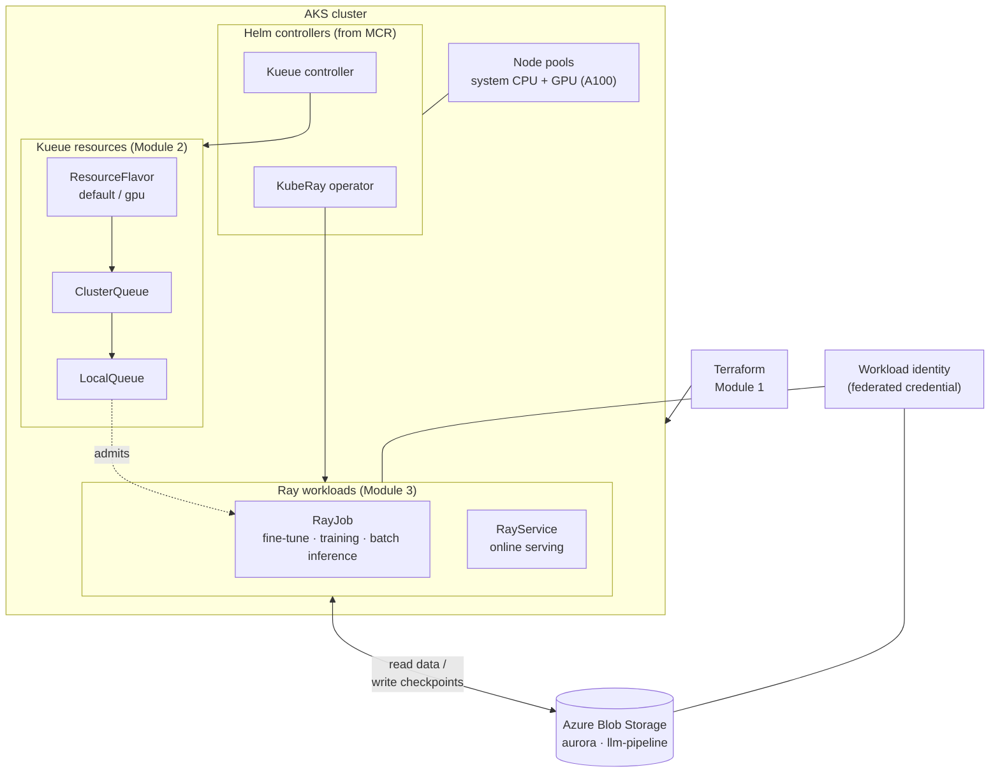

# Kueue and Ray on AKS

A hands-on walkthrough for running Ray training, inference, and serving on
Azure Kubernetes Service with Kueue admission control. It provisions the full
stack from scratch (cluster, node pools, operators, storage, queues) and submits
four real Ray workloads.

## Overview

Sharing a GPU cluster across teams and jobs needs two things: something to
decide *which* workloads run *when*, and something to manage the distributed
runtime each workload depends on. This walkthrough uses Kueue for the first and
KubeRay for the second.

[Kueue](https://kueue.sigs.k8s.io/) is a Kubernetes-native job queueing
controller. Instead of letting every submitted job grab nodes immediately, you
define quotas (ResourceFlavors and ClusterQueues) and Kueue gates admission
against them — jobs that fit run, jobs that don't wait in line. This gives you
backpressure on a single constrained queue and fair borrowing between teams
that share a cohort, without anyone over-committing the cluster.

[KubeRay](https://github.com/ray-project/kuberay) manages the Ray lifecycle. A
`RayJob` spins up a Ray cluster, runs a batch workload (fine-tune, inference),
and tears it down; a `RayService` keeps a Ray Serve deployment running behind a
stable HTTP endpoint. Kueue and KubeRay integrate directly: a RayJob submitted
with `suspend: true` stays suspended until Kueue admits it.

AKS supplies the rest. GPU node pools (the default config provisions an A100
node), an OIDC issuer and workload identity so Ray pods reach Azure Blob Storage
without stored credentials, and the AI Runtime images and Helm charts served
from MCR. The three modules below provision that infrastructure, configure the
queues, and submit the workloads.

## Architecture



Terraform provisions the cluster and node pools, installs the KubeRay operator
and Kueue controller via Helm, and stages datasets in Azure Blob Storage.
Module 2 applies the Kueue quota objects. Module 3 submits Ray workloads
that read from and write to Blob Storage using workload identity — no access
keys in the manifests.

## Modules

| Module | Directory | What you'll do |
|--------|-----------|----------------|
| 1 — Infrastructure | [`1-infrastructure/`](1-infrastructure/) | Provision the AKS cluster, KubeRay + Kueue operators, Blob storage, workload identity, and pre-staged datasets with one `terraform apply` |
| 2 — Kueue Queues | [`2-kueue-queues/`](2-kueue-queues/) | Apply ResourceFlavors and ClusterQueues — a single backpressure queue or two teams sharing a cohort with borrowing |
| 3 — Workloads | [`3-workloads/`](3-workloads/) | Submit four Ray examples: Aurora fine-tune, LLM training, batch inference (all RayJob), and online serving (RayService) |

Work through them in order — each module assumes the previous one is in place.

The four workloads in Module 3:

- **[Aurora fine-tune](3-workloads/aurora-finetune/)** — LoRA fine-tune of the Aurora weather model on regional ERA5 data (RayJob, multi-GPU)
- **[LLM training](3-workloads/llm-training/)** — Distributed Qwen2.5-7B LoRA fine-tune with Ray Train and LLaMA-Factory (RayJob)
- **[Batch inference](3-workloads/batch-inference/)** — Parallel inference over a dataset using Ray Data and ActorPool (RayJob)
- **[Online serving](3-workloads/online-serving/)** — Aurora model served behind a stable HTTP endpoint with Ray Serve (RayService)

## Prerequisites

| Tool | Version | Notes |
|------|---------|-------|
| [Azure CLI](https://learn.microsoft.com/cli/azure/install-azure-cli) | ≥ 2.70 | Authenticated (`az login`) to a subscription with GPU quota |
| [Terraform](https://developer.hashicorp.com/terraform/install) | ≥ 1.6 | Module 1 provisioning |
| [kubectl](https://kubernetes.io/docs/tasks/tools/) | ≥ 1.28 | `az aks install-cli` |
| `envsubst` | — | Renders the Module 3 manifest templates (`gettext` package) |
| Python | ≥ 3.10 | Only for Aurora data generation in Module 1 |

You also need GPU quota in your target region. The default config provisions a
`Standard_ND96amsr_A100_v4` node (8×A100 80 GB) — check availability with
`az vm list-usage` before deploying, or set `gpu_enabled=false` for a CPU-only
run. See [Module 1](1-infrastructure/) for details.

## Quick start

The fast path: provision, point kubectl at the cluster, apply one queue, submit
one RayJob, and watch it complete.

```bash
# 1. Provision infrastructure (Module 1)
cd 1-infrastructure/terraform
terraform init
terraform apply -var="subscription_id=<your-subscription-id>"

# 2. Point kubectl at the new cluster
eval "$(terraform output -raw get_credentials_command)"

# 3. Configure Kueue (Module 2) — namespace, identity, flavors, single queue
cd ../../2-kueue-queues
kubectl apply -f manifests/00-namespace.yaml
kubectl apply -f <(terraform -chdir=../1-infrastructure/terraform output -raw ray_workload_sa_yaml)
kubectl apply -f manifests/10-resource-flavors.yaml
kubectl apply -f manifests/20-single-queue.yaml

# 4. Submit one RayJob (Module 3 — Aurora fine-tune)
cd ../3-workloads/aurora-finetune
source env.example
export AZURE_STORAGE_ACCOUNT_NAME=$(terraform -chdir=../../1-infrastructure/terraform output -raw storage_account_name)
./submit.sh

# 5. Verify it gets admitted and runs
kubectl -n ray get rayjob,pods -w
```

The RayJob stays suspended until Kueue admits it from the `default` queue, then
KubeRay brings up the Ray cluster and runs the workload. For the other three
examples and the team-queue borrowing demo, follow each module's README.

## Cleanup

Delete the workloads and queue objects, then tear down all Azure resources:

```bash
# Remove queues and namespace (optional — terraform destroy removes the cluster anyway)
kubectl delete namespace ray

# Tear down the cluster, operators, storage, and identity
cd 1-infrastructure/terraform
terraform destroy -var="subscription_id=<your-subscription-id>"
```
