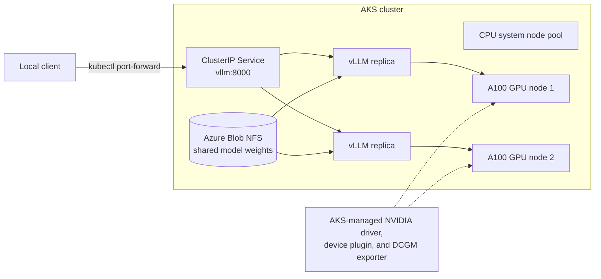

# Serve an LLM with managed GPUs on AKS

> [!IMPORTANT]
> Fully managed GPU nodes are a preview feature. Preview features are provided
> as is and as available, are excluded from service-level agreements and
> limited warranty, and aren't intended for production use. For details, see
> [AKS support policies](https://learn.microsoft.com/azure/aks/support-policies).

Build a two-replica vLLM service on Azure Kubernetes Service (AKS) with fully
managed NVIDIA GPU nodes. The example verifies GPU access before deployment,
stages model weights once on shared storage, and keeps the service private
behind a `ClusterIP` Service.



## What you build

- Two managed GPU nodes that expose `nvidia.com/gpu` without a separately
  installed device plugin or GPU Operator.
- A shared `ReadWriteMany` volume that stores
  `Qwen/Qwen2.5-7B-Instruct`.
- Two vLLM replicas spread across separate GPU nodes.
- Startup, readiness, and liveness probes that account for model load time.
- A PodDisruptionBudget and a zero-surge rollout strategy for scarce GPU
  capacity.
- Direct access to NVIDIA Data Center GPU Manager (DCGM) metrics on each node.

The example does not create a public endpoint. Use `kubectl port-forward` to
test the service from your computer.

## Time and cost

Allow 45–75 minutes for the full example. Most of that time is cluster
provisioning, model transfer, and the first vLLM startup.

The default configuration creates:

- Two `Standard_D4s_v5` system nodes.
- Two `Standard_NC24ads_A100_v4` GPU nodes.
- A 200-GiB Premium Azure Blob volume.

GPU nodes account for most of the cost. Run the cleanup module as soon as you
finish. Pricing varies by region and agreement; estimate the current cost with
the [Azure pricing calculator](https://azure.microsoft.com/pricing/calculator/).
If a long-running step fails and you don't plan to retry immediately, run
`./scripts/90-cleanup.sh` to remove the GPU pool.

## Prerequisites

You need:

- An Azure subscription where you can create resource groups, AKS clusters,
  node pools, and storage.
- Regional quota for two `Standard_NC24ads_A100_v4` nodes and two
  `Standard_D4s_v5` nodes.
- Azure CLI 2.85.0 or later.
- `aks-preview` extension 19.0.0b29 or later.
- `kubectl` 1.34 or later, Python 3, and Bash.
- Outbound HTTPS access to Docker Hub, PyPI, and Hugging Face.

The default region is `westus2`. Set `LAB_LOCATION` before running the scripts
if your quota is in another region.

## Modules

| # | Module | Outcome |
| --- | --- | --- |
| 0 | [Check prerequisites](modules/00-prerequisites.md) | Confirm tools, Azure access, feature registration, SKU availability, and quota |
| 1 | [Create the cluster](modules/01-cluster.md) | Create a CPU-only AKS cluster with the Blob CSI driver |
| 2 | [Create the managed GPU pool](modules/02-managed-gpu-nodepool.md) | Add two A100 nodes with the AKS-managed NVIDIA stack |
| 3 | [Verify GPU access](modules/03-verify.md) | Check the managed profile, schedulable GPU resources, CUDA access, and DCGM metrics |
| 4 | [Stage the model](modules/04-model-storage.md) | Download and verify model weights once on shared storage |
| 5 | [Deploy the inference service](modules/05-inference-service.md) | Start two vLLM replicas and send an OpenAI-compatible request |
| 6 | [Observe the service](modules/06-observability.md) | Compare device-level and service-level metrics |
| 7 | [Clean up](modules/07-cleanup.md) | Remove billable GPU capacity or delete the complete example |

Run the modules in order. Each module includes an expected result and focused
troubleshooting steps.

## Fast path

Run these commands from this directory:

```bash
./scripts/00-preflight.sh
./scripts/10-create-cluster.sh
./scripts/20-create-managed-gpu-pool.sh
./scripts/30-verify-gpu.sh
./scripts/40-stage-model.sh
./scripts/50-deploy-vllm.sh

kubectl port-forward -n managed-gpu-inference service/vllm 8000:8000
```

In another terminal, send a request:

```bash
curl --fail-with-body http://127.0.0.1:8000/v1/chat/completions \
  -H 'Content-Type: application/json' \
  -d '{
    "model": "qwen",
    "messages": [
      {"role": "user", "content": "Reply with exactly: AKS GPU service online."}
    ],
    "max_tokens": 16,
    "temperature": 0
  }'
```

When you finish, stop the port-forward and delete the example:

```bash
./scripts/90-cleanup.sh --all
```

## Why the example uses these patterns

**Separate system and GPU pools.** System components remain on CPU nodes, so
you can remove GPU capacity without disrupting the control-plane add-ons that
run in the cluster.

**Shared model storage.** Each serving pod mounts the same model checkpoint.
Replacing a pod remounts the volume instead of downloading the model again.

**Two replicas with no rollout surge.** Each replica requests one GPU. A
default rolling update can request a third GPU that does not exist and stall.
The manifest updates one replica at a time instead.

**Private access by default.** An unauthenticated public model endpoint can
consume expensive GPU capacity. Add authentication, transport security, and
rate limiting before exposing the service outside the cluster.

**Guarded destructive operations.** The scripts label or tag the resources
they own, use a subscription-specific kubeconfig context, and refuse to clean
up resources that don't have the expected ownership marker.

## Validated configuration

This configuration was validated end to end in September 2026 with:

- AKS 1.35.
- Two `Standard_NC24ads_A100_v4` nodes.
- `vllm/vllm-openai:v0.28.0`.
- `Qwen/Qwen2.5-7B-Instruct`.
- Two ready replicas on separate nodes.
- Shared model weights mounted read-only from Azure Blob NFS.
- Successful OpenAI-compatible completion requests.

## Production considerations

This example demonstrates a serving baseline, not a complete production
platform.

| Gap | Next step |
| --- | --- |
| Public access | Add an authenticated gateway with TLS and rate limiting |
| Secret management | Use workload identity and Azure Key Vault for protected model access |
| Node autoscaling | Managed GPU node pools do not support cluster autoscaler during preview; scale the pool manually |
| Model rollout | Add versioned model paths and controlled traffic shifting |
| Multi-region availability | Deploy independent regional stacks and route between them |
| Restricted egress | Import the vLLM image into Azure Container Registry and use a prebuilt staging image instead of installing from PyPI at runtime |
| Cluster isolation | Add a NetworkPolicy so only approved clients can reach the private Service |

## Layout

```text
manifests/  Kubernetes resources for storage, validation, and serving
modules/    Guided steps with expected results and troubleshooting
scripts/    Repeatable setup, validation, deployment, and cleanup commands
```

## Learn more

- [Fully managed GPU nodes on AKS](https://learn.microsoft.com/azure/aks/aks-managed-gpu-nodes)
- [Use Azure Blob storage with AKS](https://learn.microsoft.com/azure/aks/azure-blob-csi)
- [Monitor GPU metrics on AKS](https://learn.microsoft.com/azure/aks/monitor-gpu-metrics)
- [vLLM documentation](https://docs.vllm.ai)
