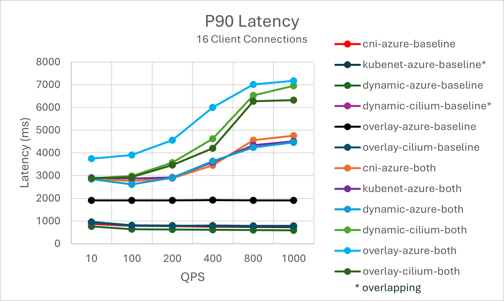
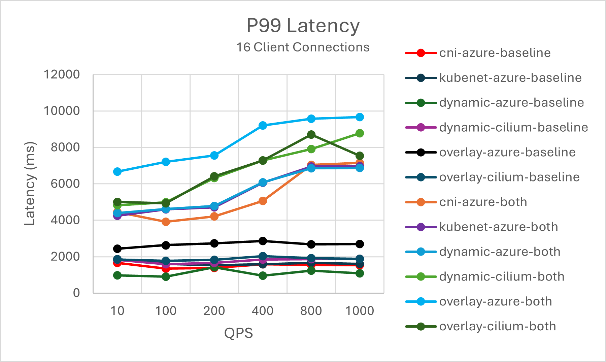

# **AKS Istio Add-On Performance**

The Istio-based service mesh add-on is logically split into the control plane (Istiod), which manages and configures the Envoy proxies, and the data plane, which is the set of Envoy proxies deployed as sidecars. This document provides an analysis of the add-on’s control and data plane across the most used network plugins in Azure Kubernetes Service (AKS): Azure CNI, Kubenet, Azure CNI Dynamic IP Allocation, and Azure CNI Overlay as well as testing the Cilium network dataplane in the later two network plugins.

## Control Plane Performance
Istiod’s CPU and memory requirements correlate with the rate of deployment and configuration changes as well as the number of proxies connected[\[1\]](#1.-control-plane-performance). Therefore, to determine Istiod’s performance in `v1.17`, a single Istiod instance with the default settings: `2 vCPU` and `2 GB` memory is used with horizontal pod autoscaling disabled. The two scenarios tested were:

- Scenario One
  - Examines the impact of churning on Istiod. To reduce variables, only one service is used for all sidecars. 
- Scenario Two
  - Focuses on determining the maximum sidecars Istiod can manage (sidecar capacity) with 1,000 services and each service has `N` sidecars, totaling the overall maximum.

### **Scenario One**
The ClusterLoader2 framework[\[3\]](#3.-clusterloader2) was used to determine the maximum number of sidecars Istiod can manage when there is sidecar churning. The churn percent is defined as the percent of sidecars churned down/up during the test. For example, 50% churn for 10,000 sidecars would mean that 5,000 sidecars were churned down then 5,000 sidecars were churned up. The churn percents tested were determined from the typical churn percentage during deployment rollouts (`maxUnavailable`). The churn rate was calculated by determining the total number of sidecars churned (up and down) over the actual time taken to complete the churning process.

#### **Sidecar Capacity and Istiod CPU and Memory**

<table width="654">
<tbody><tr><td colspan="5" width="326"><strong>Azure CNI</strong></td><td colspan="5" width="328"><strong>Azure CNI Dynamic IP</strong></td></tr>
<tbody><tr>
<td>Churn (%)</td><td>Churn Rate (sidecars/sec)</td><td>Sidecar Capacity</td><td>Istiod Memory (GB)</td><td>Istiod vCPU</td><td>Churn (%)</td><td>Churn Rate (sidecars/sec)</td><td>Sidecar Capacity</td><td>Istiod Memory (GB)</td><td>Istiod vCPU</td></tr>
<tr><td>0</td><td>--</td><td>15,000</td><td>13.4</td><td>9</td><td>0</td><td>--</td><td>35,000</td><td>41</td><td>14</td>
</tr>
<tr><td>25</td><td>41.7</td><td>15,000</td><td>17.5</td><td>12</td><td>25</td><td>31.3</td><td>30,000</td><td>42.6</td>
<td>14</td></tr>
<tr><td>50</td><td>62.5</td><td>15,000</td><td>18.2</td><td>8</td><td>50</td><td>59.5</td><td>25,000</td><td>43.1</td><td>12</td></tr>
<tr><td colspan="5" width="326"><strong>Kubenet</strong></td><td colspan="5" width="328"><strong>Azure CNI Overlay</strong></td></tr>
<td>Churn (%)</td><td>Churn Rate (sidecars/sec)</td><td>Sidecar Capacity</td><td>Istiod Memory (GB)</td><td>Istiod vCPU</td><td>Churn (%)</td><td>Churn Rate (sidecars/sec)</td><td>Sidecar Capacity</td><td>Istiod Memory (GB)</td><td>Istiod vCPU</td></tr>
<tr><td>0</td><td>--</td><td>35,000</td><td>40.3</td><td>14</td><td>0</td><td>--</td><td>35,000</td><td>40.8</td><td>13</td></tr>
<tr><td>25</td><td>50</td><td>30,000</td><td>44.9</td><td>14</td><td>25</td><td>41.7</td><td>30,000</td><td>43.9</td>
<td>13</td></tr>
<tr><td>50</td><td>46.3</td><td>25000</td><td>42.2</td><td>10</td><td>50</td><td>55.6</td><td>30,000</td><td>49</td><td>12</td></tr>
<tr><td colspan="5" width="326"><strong>Azure CNI Overlay w/ Cilium</strong></td><td colspan="5" width="328"><strong>Azure CNI Dynamic IP w/ Cilium</strong></td></tr>
<td>Churn (%)</td><td>Churn Rate (sidecars/sec)</td><td>Sidecar Capacity</td><td>Istiod Memory (GB)</td><td>Istiod vCPU</td><td>Churn (%)</td><td>Churn Rate (sidecars/sec)</td><td>Sidecar Capacity</td><td>Istiod Memory (GB)</td><td>Istiod vCPU</td></tr>
<tr><td>0</td><td>--</td><td>15,000</td><td>17.2</td><td>10</td><td>0</td><td>--</td><td>20,000</td><td>23.4</td>
<td>13</td></tr>
<tr><td>25</td><td>31.3</td><td>15,000</td><td>19.4</td><td>12</td><td>25</td><td>31.3</td><td>15,000</td><td>20.1</td>
<td>12</td></tr>
<tr><td>50</td><td>50</td><td>15,000</td><td>23.3</td><td>12</td><td>50</td><td>35.7</td><td>15,000</td><td>23.4</td><td>10</td>
</tr>
</tbody></table>

### **Scenario Two**
The ClusterLoader2 framework[\[3\]](#3.-ClusterLoader2) was used to determine the maximum number of sidecars Istiod can manage with 1,000 services. Each service had `N` sidecars contributing to the overall maximum sidecar count. The API Server resource usage is measured to determine if there is any significant stress from the add-on.

#### **Sidecar Capacity**
|Azure CNI       |Azure CNI Dynamic IP|Kubenet         |Azure CNI Overlay|Azure CNI Overlay w/ Cilium|Azure CNI Dynamic IP w/ Cilium|
|----------------|--------------------|----------------|-----------------|---------------------------|------------------------------|
|15,000          |15,000              |15,000          |15,000           |10,000                     |15,000                        |

#### **CPU and Memory**
|      |    |Azure CNI   |Azure CNI Dynamic IP|Kubenet |Azure CNI Overlay|Azure CNI Overlay w/ Cilium|Azure CNI Dynamic IP w/ Cilium|
|----------------|------------|--------------------|--------|-----------------|---------------------------|------------------------------|------|
|vCPU            |API Server  |3                   |3.4     |2.4              |3                          |2.5                           |4.4   |
|                |Istiod      |16                  |16      |16               |16                         |15                            |16    |
|Memory (GB)     |API Server  |5.5                 |7.9     |4.8              |5.9                        |4.1                           |8.8   |
|                |Istiod      |49.2                |48.3    |48.8             |48.2                       |29.6                          |49.3  |

## Data Plane Performance
Sidecar performance is impacted by a variety of factors: request size, number of proxy worker threads, number of client connections etc.[\[2\]](#2.-data-plane-performance) Additionally, when the add-on is enabled, a request now must traverse the client-side proxy, then the server-side proxy. Therefore, latency and resource consumption are measured to determine the data plane performance.

Fortio was used to create the load[\[4\]](#4.-Fortio). The test was conducted with the Istio benchmark repository[\[5\]](#5.-Istio-Benchmark) that was modified for use with the add-on. The test involved a 1 kB payload, 16 client connections, 2 proxy workers, utilized `http/1.1` protocol and mutual TLS enabled at various queries per second (QPS). 

#### **CPU and Memory**
The sidecar proxy resource consumption across the various AKS network plugins, the table shows the memory and CPU usage for both the client and server proxy for 16 client connections and 1000 QPS. 

|Sidecar         |      |Azure CNI       |Azure CNI Dynamic IP|Kubenet     |Azure CNI Overlay|Azure CNI Overlay w/ Cilium|Azure CNI Dynamic IP w/ Cilium|
|----------------|------------|----------------|--------------------|------------|-----------------|---------------------------|------------------------------|
|Client          |vCPU        |.27             |.29                 |.28         |.48              |.36                        |.37                           |
|                |Memory (MB) |61.5            |56.2                |60.8        |164              |61.5                       |54.9                          |
|Server          |vCPU        |.35             |.28                 |.29         |.34              |.48                        |.40                           |
|                |Memory (MB) |58.9            |58.5                |53.4        |56.6             |61.5                       |45.2                          |

#### **Latency**
The sidecar Envoy proxy collects raw telemetry data after responding to a client, which does not directly affect the request's total processing time. However, this process delays the start of handling the next request, contributing to queue wait times and influencing average and tail latencies. Depending on the traffic pattern, the actual tail latency varies. 

The following analysis compares the impact of adding sidecar proxies to the data path for the most used AKS network plugins. It includes both P90 and P99 latency metrics, showing the latency most users would experience as well as providing insights into the worst-case latency that 99% of users would encounter.  

## Service Entry
Istio features a custom resource definition known as a ServiceEntry that enables adding additional services into the Istio’s internal service registry, this allows services already in the mesh to route or access the services specified[\[6\]](#6.-ServiceEntry). However, the configuration of multiple ServiceEntries with the `resolution` field set to DNS can cause a heavy load on DNS servers, the following can help reduce the load[\[7\]](#7.-Understanding-DNS):

- Switch to resolution: NONE to avoid proxy DNS lookups entirely. Suitable for most use cases.
- Increase TTL (Time To Live) if you control the domains being resolved.
- Limit the ServiceEntry scope with `exportTo` or a sidecar if it is only needed by a few workloads.

## Citations
#### [1. Control Plane Performance](https://istio.io/latest/docs/ops/deployment/performance-and-scalability/#control-plane-performance)
#### [2. Data Plane Performance](https://istio.io/latest/docs/ops/deployment/performance-and-scalability/#data-plane-performance)
#### [3. ClusterLoader2](https://github.com/kubernetes/perf-tests/tree/master/clusterloader2#clusterloader)
#### [4. Fortio](https://fortio.org/)
#### [5. Istio Benchmark](https://github.com/istio/tools/tree/master/perf/benchmark#istio-performance-benchmarking)
#### [6. ServiceEntry](https://istio.io/latest/docs/reference/config/networking/service-entry/)
#### [7. Understanding DNS](https://preliminary.istio.io/latest/docs/ops/configuration/traffic-management/dns/#proxy-dns-resolution)
