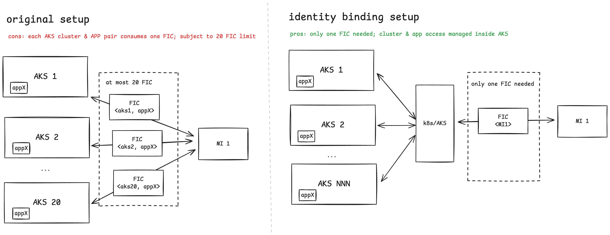

# Identity Bindings Concepts

## Context

[Workload identity feature exists for AKS today](https://learn.microsoft.com/azure/aks/workload-identity-overview) but has scale limitations in not being able to go beyond 20 Federated Identity Credentials (FICs) per identity. For customers having large scale K8s platform spanning across more than 20 clusters (thus more than 20 issuers => more than 20 FICs required) or having a lot of `<namespace, service-account>` combinations to create FIC mappings for the same identity, this a blocker today.

## Conceptual Introduction

An Identity binding is a mapping resource that allows customers to create mapping between one user assigned managed identity and one AKS cluster where there are workloads that require authentication to Entra using this user assigned managed identity. So let's say you have a UAMI MI-1 which needs to be used in AKS cluster AKS-1, AKS-2, AKS-3,.... you'll create the following identity binding mappings:

- IB-A mapping MI-1 to AKS-1
- IB-B mapping MI-1 to AKS-2
- IB-C mapping MI-1 to AKS-3

AKS service maintains a unique OIDC issuer for each user-assigned managed identity, whose details are generated by AKS on creation of the identity binding resource. In the above example, the issuer URL OIDC_URL-1 would be the same for M1 across the identity bindings IB-A, IB-B, and IB-C.

This way even if the same user-assigned managed identity is needed by workloads running across multiple clusters, only one Federated Identity Credential is required for this user-assigned managed identity thus addressing the 20 FIC limitation. When the cluster operator creates an identity binding, this single federated identity credential is automatically created with the OIDC issuer maintained by AKS for this user assigned managed identity.

While the above step allows for usage of a particular user-assigned managed identity within the cluster, the cluster operator is then expected to create ClusterRole/ClusterRoleBinding identifying the namespace and the service accounts (either granularly or collectively across namespace or cluster) that are allowed to use this user-assigned managed identity for Entra authentication.

This OIDC issuer itself functions similarly to the AKS cluster's OIDC issuer by exposing OIDC discovery documents. Workloads running within the cluster can request a client assertion signed by the internal token provider using this issuer's dedicated signing keys. That assertion can then be exchanged for an Azure Entra token via the federated identity flow.

## FAQ

### Is identity sameness (namespace and service account sameness) required across clusters when the same user-assigned managed identity is used across clusters?

No. Identity binding doesn't have any pre-requisite for identity sameness and it's completely up to the cluster operator to explicitly authorize the namespaces/service-accounts inside the cluster that are allowed to use a managed identity.

### Can multiple identity bindings be created for the same user-assigned managed identity?

Yes. The OIDC issuer URL maintained by AKS will be the same for this user-assigned managed identity across all of these identity bindings.

### What permissions are required for creation of the identity bindings?

**ARM permissions required:**
- `Microsoft.ContainerService/managedClusters/identityBindings/*`
- `Microsoft.ManagedIdentity/userAssignedIdentities/federatedIdentityCredentials/*` (when identityBindings resource is created, federatedIdentityCredentials is automatically created on-behalf-of the cluster operator. if cluster operator who is creating identityBindings doesn't have permissions to create federatedIdentityCredentials, the identityBindings creation will fail)

**K8s permissions required:**
- permissions to create ClusterRole and ClusterRoleBinding (which would be possible for cluster admin)

### With federated identity credentials auto generated at the time of identity binding creation, when all identity bindings mapping to a MI are deleted, what happens to the FIC that was created for that specific MI?

There's currently no garbage collection for the FIC when the last identity binding mapped to a MI is deleted. Cluster operator should clean up the FIC only after verifying that all identity-bindings mapped to a MI are deleted, failing which any identity-binding and cluster still dependent on the same would be impacted.

### What are networking pre-requisites for usage of identity bindings feature?

Before identity bindings, workload identity feature required egress to be allowed for `login.microsoftonline.com` so that workloads could send requests to eSTS to exchange service account tokens for Entra access tokens.

With the identity binding feature, there's no need for `login.microsoftonline.com` as token exchange requests are routed via a cluster-specific identity binding specific proxy deploy on AKS service.

## Next Steps

[Set up identity bindings](./identity-bindings-how-to-guide.md) based on the how-to guide.