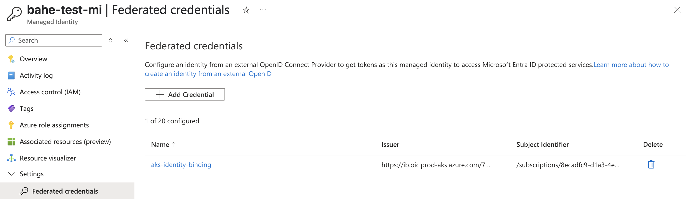
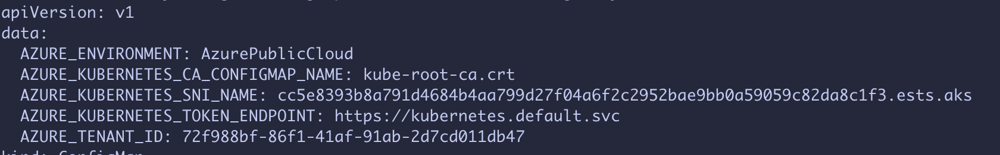
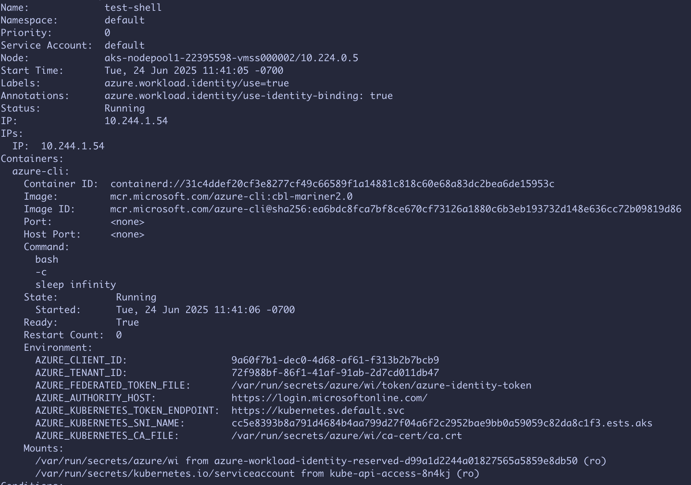

# Identity Bindings - Getting started

## Prerequisites

* Fill out this [form](https://aka.ms/aks/identity-bindings/private-preview-form) to provide subscription(s) where AKS needs to enable the feature flag (Microsoft.ContainerService/IdentityBinding) for this private preview.
* Install `aks-preview` Azure CLI extension of version >= `18.0.0b26`:    
    ```bash
    # Install the aks-preview extension
    az extension add --name aks-preview

    # Update to the latest version if already installed
    az extension update --name aks-preview
    ```
* To complete the set up and usage of identity bindings, the following permissions are required:
  * Microsoft.ManagedIdentity/userAssignedIdentities/federatedIdentityCredentials/write
  * Microsoft.ContainerService/managedClusters/write

## Setup - AKS Control Plane Resource

In this section you will map a managed identity to an AKS cluster using an identity binding:

1. Create necessary test resources (resource group, AKS cluster, managed identity):

  ```bash
  # Set up environment variables
  export RESOURCE_GROUP="ib-test"
  export LOCATION="westus2"
  export CLUSTER="ibtest"
  export MI_NAME="ib-test-mi"

  # Create resource group, AKS cluster, and identity bindings
  az group create --name $RESOURCE_GROUP -l $LOCATION
  az aks create -g $RESOURCE_GROUP -n $CLUSTER -l $LOCATION --no-ssh-key
  az identity create -g $RESOURCE_GROUP -n $MI_NAME
  ```

2. Create identity binding to map a managed identity to an AKS cluster. 

  ```bash
  export MI_RESOURCE_ID=$(az identity show -g $RESOURCE_GROUP -n $MI_NAME --query id -o tsv)
  az aks identity-binding create -g $RESOURCE_GROUP --cluster-name $CLUSTER -n "$MI_NAME-ib" --managed-identity-resource-id $MI_RESOURCE_ID
  ```

3. AKS creates a unique OIDC issuer per managed identity and populates that in the identity binding resource. Check the identity binding resource to obtain the OIDC issuer URL for this managed identity"

   ```bash
  az aks identity-binding show -g $RESOURCE_GROUP --cluster-name $CLUSTER -n "$MI_NAME-ib"
  ```
  Output should be similar to:
  {
    // omitted other fields
    "oidcIssuer": {
          "oidcIssuerUrl": "https://ib.oic.prod-aks.azure.com/<MI-tenant-id>/<MI-client-id>"
        },
    // omitted other fields      
  }
You should be able to find the FIC with name "aks-identity-binding" created under the managed identity, siimlar to this:



Once you see output similar to the above, it confirms that the control plane resources have been successfully created.

## Setup - In-cluster Resource

In this section you will create a cluster level role and role binding to grant your application (service account) to make use of the identity binding for acquiring access token from Entra. You will need to have cluster admin or similar permission to create cluster role / cluster role binding resources.

1. Create ClusterRole and ClusterRoleBinding to authorize the specific namespaces and service accounts that are allowed to use the managed identities (for which identity binding was created earlier):

  ```bash
  # Obtain credentials needed to access the cluster
  az aks get-credentials -g $RESOURCE_GROUP -n $CLUSTER -a -f "${CLUSTER}.kubeconfig"
  export KUBECONFIG="$(pwd)/${CLUSTER}.kubeconfig"

  export MI_CLIENT_ID=$(az identity show -g $RESOURCE_GROUP -n $MI_NAME --query clientId -o tsv)
  cat > cluster-role.yaml <<EOF
  ---
  apiVersion: rbac.authorization.k8s.io/v1
  kind: ClusterRole
  metadata:
    name: test
  rules:
    - verbs: ["use-managed-identity"]
      apiGroups: ["cid.wi.aks.azure.com"]
      resources: ["$MI_CLIENT_ID"]
  ---
  apiVersion: rbac.authorization.k8s.io/v1
  kind: ClusterRoleBinding
  metadata:
    name: test
  roleRef:
    apiGroup: rbac.authorization.k8s.io
    kind: ClusterRole
    name: test
  subjects:
    - kind: ServiceAccount
      name: default
      namespace: default
  EOF
  kubectl apply -f cluster-role.yaml
  ```

2. Identity binding private preview provides a webhook specifically for the private preview (for public preview, the managed workload identity webhook will add support for identity bindings). Install workload identity webhook using the following step:

  ```bash
  git clone --branch feature/custom-token-endpoint https://github.com/Azure/azure-workload-identity.git

  export SNI=$(az aks show -g $RESOURCE_GROUP -n $CLUSTER --query resourceUid -o tsv | read -r input; echo -n "identity-binding$input" | sha256sum | cut -d' ' -f1 | read -r input; echo "${input}.ests.aks")
  export MI_CLIENT_ID=$(az identity show -g $RESOURCE_GROUP -n $MI_NAME --query clientId -o tsv)
  export MI_TENANT_ID=$(az identity show -g $RESOURCE_GROUP -n $MI_NAME --query tenantId -o tsv)
  helm upgrade azure-wi-identity-binding azure-workload-identity/manifest_staging/charts/workload-identity-webhook --install --wait --timeout=5m -v=5 --namespace=kube-system --set azureTenantID="$MI_TENANT_ID" --set image.repository=mcr.microsoft.com/oss/v2/azure/workload-identity/webhook --set image.release=v1.6.0-alpha.1 --set customTokenEndpoint.azureKubernetesTokenEndpoint="https://kubernetes.default.svc" --set customTokenEndpoint.azureKubernetesCAConfigMapName="kube-root-ca.crt" --set customTokenEndpoint.azureKubernetesSniName="$SNI"
  ```

  You can verify the installation by checking the pods and configmap:

  ```bash
  kubectl -n kube-system get pods -l app=workload-identity-webhook
  NAME                                                  READY   STATUS    RESTARTS   AGE
  azure-wi-webhook-controller-manager-bfdd576c6-cdzq4   1/1     Running   0          7m28s
  azure-wi-webhook-controller-manager-bfdd576c6-rzn6c   1/1     Running   0          7m28s
  ```

  ```bash
  kubectl -n kube-system get configmap azure-wi-webhook-config -o yaml
  ```

  

3. Create service account with required annotations with managed identity information:

  ```bash
  kubectl annotate sa default -n default azure.workload.identity/tenant-id=$MI_TENANT_ID
  kubectl annotate sa default -n default azure.workload.identity/client-id=$MI_CLIENT_ID
  ```

4. Deploy workload with required labels and annotations:

  ```bash
  kubectl apply -f - <<EOF
  apiVersion: v1
  kind: Pod
  metadata:
    name: test-shell
    namespace: default
    labels:
      azure.workload.identity/use: "true"
    annotations:
      azure.workload.identity/use-identity-binding: "true"          
  spec:
    serviceAccount: default
    containers:
      - name: azure-cli
        image: mcr.microsoft.com/azure-cli:cbl-mariner2.0
        command: ["bash", "-c", "sleep infinity"]
    restartPolicy: Never
  EOF
  ```

  Make sure the pod namespace, service account name, labels, and annotations are using the correct values. Wait for the pod to be ready:

  ```bash
  kubectl get pod
  NAME         READY   STATUS    RESTARTS   AGE
  test-shell   1/1     Running   0          99s
  ```

  We can describe the pod to confirm it's being properly configured:

  ```bash
  kubectl describe pod test-shell
  ```

  If you see the environment variables and mounts similar to the below, then it means the pod is configured correctly.

  

5. Exec into the pod for shell access. Inside the pod shell, use `curl` to obtain Entra access token for the managed identity:

  ```bash
  kubectl exec -it test-shell -- bash

  curl  "https://${AZURE_KUBERNETES_SNI_NAME}" --cacert $AZURE_KUBERNETES_CA_FILE --resolve "${AZURE_KUBERNETES_SNI_NAME}:443:10.0.0.1" -d "grant_type=client_credentials" -d "client_assertion_type=urn:ietf:params:oauth:client-assertion-type:jwt-bearer" -d "scope=https://management.azure.com//.default" -d "client_assertion=$(cat $AZURE_FEDERATED_TOKEN_FILE)" -d "client_id=$AZURE_CLIENT_ID"
  ```

  You can also paste this token in https://jwt.ms/ to get decoded output similar to the following:

  