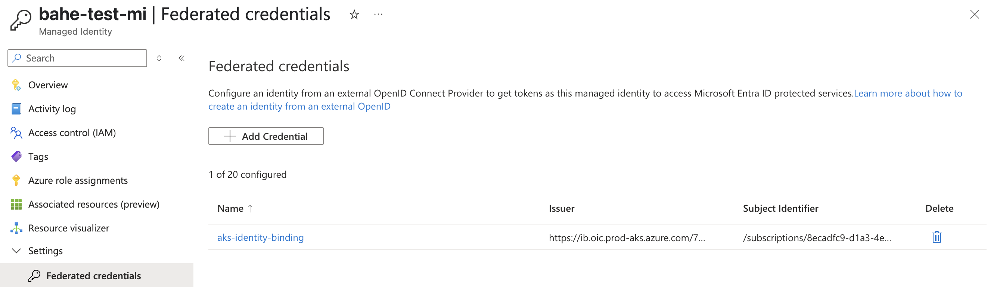
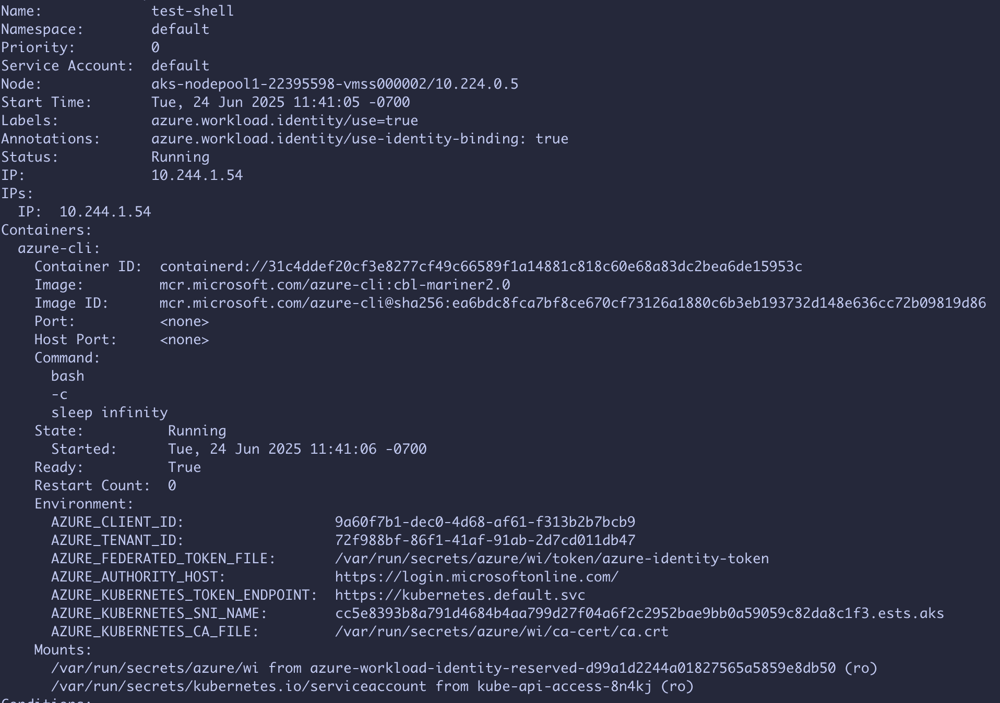

# Identity Bindings - Getting started

## Prerequisites

* Fill out this [form](https://aka.ms/aks/identity-bindings/private-preview-form) to provide subscription(s) where AKS needs to enable the feature flag (Microsoft.ContainerService/IdentityBinding) for this private preview.

* Install `aks-preview` Azure CLI extension of version >= `18.0.0b26`:    
    ```bash
    # Install the aks-preview extension
    az extension add --name aks-preview

    # Update to the latest version if already installed
    az extension update --name aks-preview
    ```

* To complete the set up and usage of identity bindings, the following permissions are required:
  * Microsoft.ManagedIdentity/userAssignedIdentities/federatedIdentityCredentials/write
  * Microsoft.ContainerService/managedClusters/write

## Setup - AKS Control Plane Resource

In this section you will map a managed identity to an AKS cluster using an identity binding:

1. Create necessary test resources (resource group, AKS cluster, managed identity):

  ```bash
  # Set up environment variables
  export RESOURCE_GROUP="ib-test"
  export LOCATION="westus2"
  export CLUSTER="ibtest"
  export MI_NAME="ib-test-mi"

  # Create resource group, AKS cluster, and identity bindings
  az group create --name $RESOURCE_GROUP -l $LOCATION
  az aks create -g $RESOURCE_GROUP -n $CLUSTER -l $LOCATION --no-ssh-key --enable-workload-identity
  az identity create -g $RESOURCE_GROUP -n $MI_NAME
  ```

2. Create identity binding to map a managed identity to an AKS cluster. 

  ```bash
  export MI_RESOURCE_ID=$(az identity show -g $RESOURCE_GROUP -n $MI_NAME --query id -o tsv)
  az aks identity-binding create -g $RESOURCE_GROUP --cluster-name $CLUSTER -n "$MI_NAME-ib" --managed-identity-resource-id $MI_RESOURCE_ID
  ```

3. AKS creates a unique OIDC issuer per managed identity and populates that in the identity binding resource. Check the identity binding resource to obtain the OIDC issuer URL for this managed identity:

  ```bash
  az aks identity-binding show -g $RESOURCE_GROUP --cluster-name $CLUSTER -n "$MI_NAME-ib"
  ```

  Output should be similar to:
  
  ```
  {
    // omitted other fields
    "oidcIssuer": {
          "oidcIssuerUrl": "https://ib.oic.prod-aks.azure.com/<MI-tenant-id>/<MI-client-id>"
        },
    // omitted other fields      
  }
  ```
  
  You should be able to find the FIC with name "aks-identity-binding" created under the managed identity, similar to this:

  

  Once you see output similar to the above, it confirms that the control plane resources have been successfully created.

  **Note:** This FIC is managed by AKS as part of the identity binding. User should not make changes to this FIC to ensure identity bindings and identity federation are unimpacted.

## Setup - In-cluster Resource

In this section you will create a cluster level role and role binding to grant your application (service account) to make use of the identity binding for acquiring access token from Entra. You will need to have cluster admin or similar permission to create cluster role / cluster role binding resources.

1. Create ClusterRole and ClusterRoleBinding to authorize the specific namespaces and service accounts that are allowed to use the managed identities (for which identity binding was created earlier):

  ```bash
  # Obtain credentials needed to access the cluster
  az aks get-credentials -g $RESOURCE_GROUP -n $CLUSTER -a -f "${CLUSTER}.kubeconfig"
  export KUBECONFIG="$(pwd)/${CLUSTER}.kubeconfig"
  export MI_CLIENT_ID=$(az identity show -g $RESOURCE_GROUP -n $MI_NAME --query clientId -o tsv)
  
  kubectl apply -f - <<EOF
  apiVersion: v1
  kind: Namespace
  metadata:
    name: demo
  ---
  apiVersion: v1
  kind: ServiceAccount
  metadata:
    name: demo
    namespace: demo
  ---
  apiVersion: rbac.authorization.k8s.io/v1
  kind: ClusterRole
  metadata:
    name: test
  rules:
    - verbs: ["use-managed-identity"]
      apiGroups: ["cid.wi.aks.azure.com"]
      resources: ["$MI_CLIENT_ID"]
  ---
  apiVersion: rbac.authorization.k8s.io/v1
  kind: ClusterRoleBinding
  metadata:
    name: test
  roleRef:
    apiGroup: rbac.authorization.k8s.io
    kind: ClusterRole
    name: test
  subjects:
    - kind: ServiceAccount
      name: demo
      namespace: demo
  EOF
  ```

2. Create service account with required annotations with managed identity information:

  ```bash
  kubectl annotate sa demo -n demo azure.workload.identity/tenant-id=$MI_TENANT_ID
  kubectl annotate sa demo -n demo azure.workload.identity/client-id=$MI_CLIENT_ID
  ```

3. Deploy workload with required labels and annotations:

  ```bash
  kubectl apply -f - <<EOF
  apiVersion: v1
  kind: Pod
  metadata:
    name: test-shell
    namespace: demo
    labels:
      azure.workload.identity/use: "true"
    annotations:
      azure.workload.identity/use-identity-binding: "true"          
  spec:
    serviceAccount: demo
    containers:
      - name: azure-cli
        image: mcr.microsoft.com/azure-cli:cbl-mariner2.0
        command: ["bash", "-c", "sleep infinity"]
    restartPolicy: Never
  EOF
  ```

  Make sure the pod namespace, service account name, labels, and annotations are using the correct values. Wait for the pod to be ready:

  ```bash
  kubectl get pod
  ```

  Expected output should be similar to:

  ```
  NAME         READY   STATUS    RESTARTS   AGE
  test-shell   1/1     Running   0          99s
  ```

  We can describe the pod to confirm it's being properly configured:

  ```bash
  kubectl describe pod test-shell
  ```

  If you see the environment variables and mounts similar to the below, then it means the pod is configured correctly.

  

4. Exec into the pod for shell access. Inside the pod shell, use `curl` to obtain Entra access token for the managed identity:

  ```bash
  kubectl exec -it test-shell -- bash

  curl  "https://${AZURE_KUBERNETES_SNI_NAME}" --cacert $AZURE_KUBERNETES_CA_FILE --resolve "${AZURE_KUBERNETES_SNI_NAME}:443:10.0.0.1" -d "grant_type=client_credentials" -d "client_assertion_type=urn:ietf:params:oauth:client-assertion-type:jwt-bearer" -d "scope=https://management.azure.com//.default" -d "client_assertion=$(cat $AZURE_FEDERATED_TOKEN_FILE)" -d "client_id=$AZURE_CLIENT_ID"
  ```

  You can also paste this token (value of access_token field in the response) in https://jwt.ms/ to get decoded output similar to the following:

  

## Next Steps

Identity binding allows you to map multiple AKS clusters to the same MI and to go beyond the [20 FIC limit that existed with workload identity federation with Entra](https://learn.microsoft.com/entra/workload-id/workload-identity-federation-considerations#general-federated-identity-credential-considerations). So try creating more identity bindings for more clusters to the same identity. And you can also try allowing more subjects to use the MI within those clusters.
