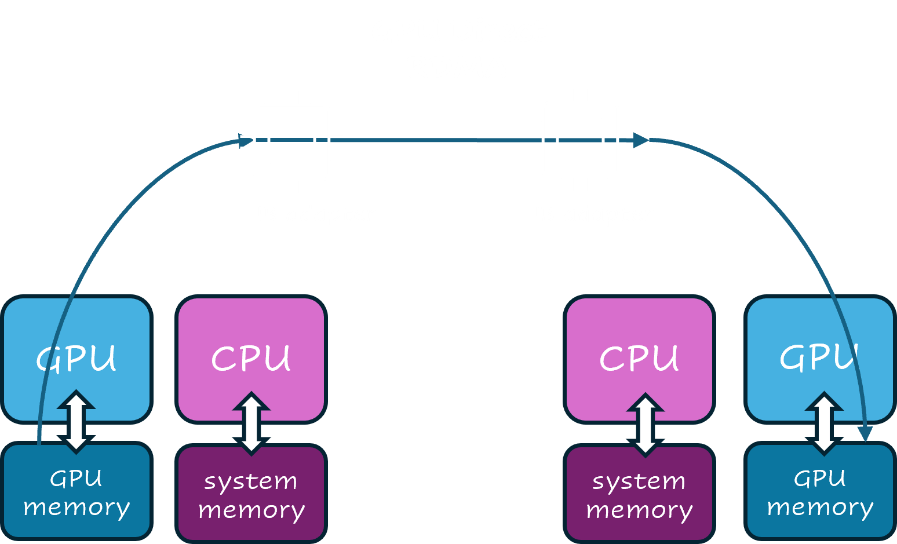

High performance computing (HPC) workloads, like large-scale distributed AI training and inferencing, often require fast, reliable data transfer and synchronization across the underlying compute. Model training, for example, requires shared memory across GPUs because the parameters and gradients need to be constantly shared. For models with billions of parameters, the available memory in a single GPU node may not be enough, so "pooling" the memory across multiple nodes also requires high memory bandwidth due to the sheer volume of data involved. A common way to achieve this at scale is with a high-speed, low-latency network interconnect technology called [InfiniBand (IB)](https://network.nvidia.com/pdf/whitepapers/IB_Intro_WP_190.pdf).

<!-- truncate -->

If you are not familiar with what InfiniBand is yet, imagine this interconnect network as an incredibly fast highway for data transfer, and the data as cars that need to travel from one city to another. On a typical highway (like traditional IP networks), cars must follow speed limits, obey traffic signals, and sometimes stop in traffic jams, which slows them down. InfiniBand networking, on the other hand, can be considered a highway built just for race cars - it has no speed limits, no traffic lights, and wide lanes, allowing the cars to zoom at top speed without any interruptions. This makes data travel incredibly fast and efficiently.

There are two ways to use this fast InfiniBand highway:

- **[Remote Direct Memory Access (RDMA) over InfiniBand](https://enterprise-support.nvidia.com/s/article/What-is-RDMA)**: Similar to driving a race car on the fast InfiniBand highway. It maximizes speed and performance but may require specific application design and networking configuration to operate these race cars on the race car highway.
- **[IP over InfiniBand (IPoIB)](https://docs.nvidia.com/doca/sdk/ip+over+infiniband/index.html)**: This is comparable to regular cars using the race car highway - may be easy to implement and compatible with off-the-shelf applications, but you don't get the full speed benefits.

Choosing between these two approaches depends on whether you need compatibility and ease (regular cars on a race car highway) or top-notch speed and performance (race cars on a race car highway).

## RDMA over InfiniBand versus IPoIB

RDMA over InfiniBand enables data transfer directly between the memory of different machines without involving the CPU (as shown in the diagram below for GPUs) which significantly reduces latency and improves throughput.

To use this approach, your application needs to be RDMA-aware, meaning that an RDMA API or RDMA-aware message passing framework is used to enable high performance communication. Check out this [RDMA programming on NVIDIA](https://docs.nvidia.com/networking/display/rdmaawareprogrammingv17/rdma-aware+programming+overview) guide to learn more.

If your application is not RDMA-aware, IPoIB alternatively can be used to provide an IP network emulation layer on top of InfiniBand networks. IPoIB enables your application to transmit data over IB but may lower performance and increase latency as it relies on the IP protocol stack.

The table below summarizes these key differences:

| Feature             | RDMA over IB                               | IPoIB                                              |
| ------------------- | ------------------------------------------ | -------------------------------------------------- |
| **Data Transfer**   | Direct Memory Access                       | IP Protocol Over IB                                |
| **Latency**         | Very Low                                   | Higher                                             |
| **Throughput**      | Very High                                  | Lower                                              |
| **CPU Involvement** | Minimal                                    | Significant                                        |
| **Complexity**      | More specialized (requires RDMA awareness) | Low (easier to implement in existing applications) |

## InfiniBand on AKS

In the Kubernetes world, there are a range of tools and plugins that support HPC workloads and InfiniBand - so where is a good place to start?

Choosing the right compute in your node pool is an important building block. Consider using Azure [HBv3](https://learn.microsoft.com/azure/virtual-machines/sizes/high-performance-compute/hbv3-series?tabs=sizebasic) and [HBv4](https://learn.microsoft.com/azure/virtual-machines/sizes/high-performance-compute/hbv4-series?tabs=sizebasic) HPC VM sizes or [ND series](https://learn.microsoft.com/azure/virtual-machines/sizes/gpu-accelerated/nd-family) GPU VM sizes with built-in NVIDIA networking which are all suitable for HPC applications.

When using NVIDIA VM sizes, the [Network Operator](https://docs.nvidia.com/networking/display/cokan10/network+operator) and [GPU Operator](https://docs.nvidia.com/datacenter/cloud-native/gpu-operator/latest/getting-started.html) are useful tools that package networking and device specific components for ease of installation on Kubernetes. However, setting up your cluster for multi-node distributed HPC workloads may involve tasks such as installing a device plugin, networking component, and node labelling configurations.

As a cluster admin or AI service provider, these steps shouldn't increase time-to-value for your developers or end users! That's why we recently created an open-source [InfiniBand on AKS guide](https://azure.github.io/aks-rdma-infiniband/) to simplify and streamline this setup, walking you through step-by-step instructions to:

- Determine the appropriate InfiniBand approach for your new or existing AKS application.
- Configure the NVIDIA Network Operator with specific namespace and node labelling to properly schedule your pods deployments.
- Apply out-of-box Kubernetes network policy and test the associated pod configuration to achieve maximum performance, resource efficiency, or support non-RDMA aware apps.
- Optionally set up the NVIDIA GPU Operator and view an example pod configuration to claim both GPUs and InfiniBand resources created from your selected device plugin managed via Network Operator.
- Validate the end-to-end setup with [example test scripts](https://github.com/Azure/aks-rdma-infiniband/tree/main/tests) on your chosen VM size.

The AKS team is actively building out this repository with examples and updates for new component versions. We encourage you to set up InfiniBand following these best practices for HPC workloads like AI training or inferencing at scale, starting in your AKS test environment(s). Please submit any feedback and/or enhancements by [creating a new issue](https://github.com/Azure/aks-rdma-infiniband/issues), or review/comment on existing issues in the project!
