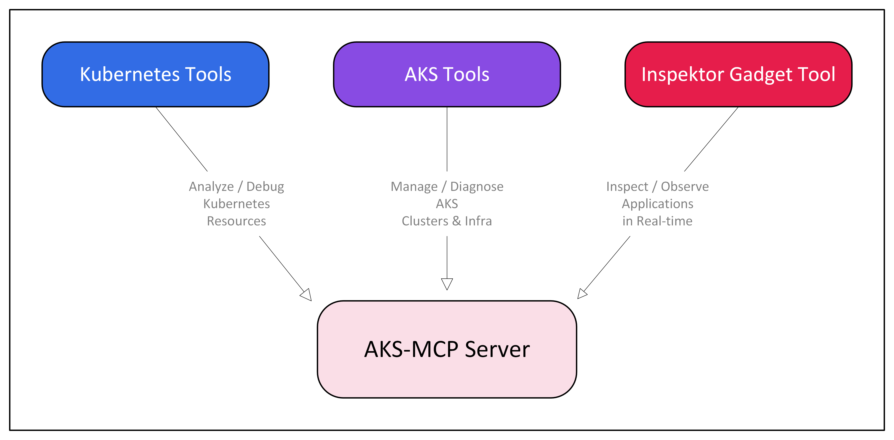
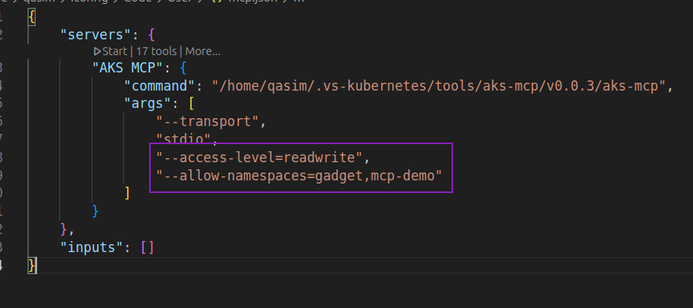
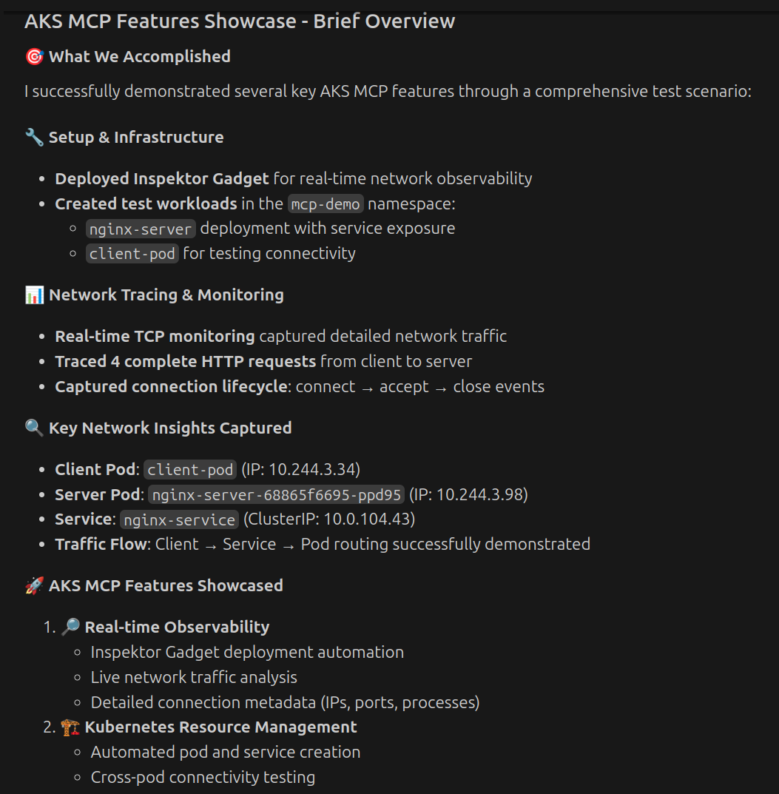
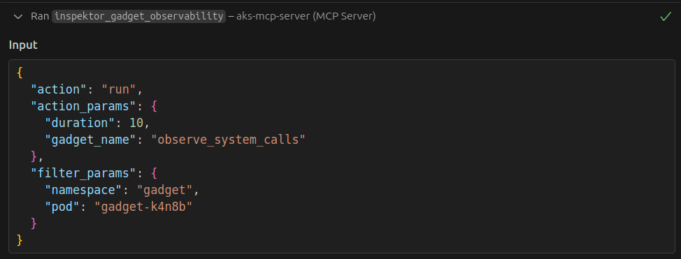
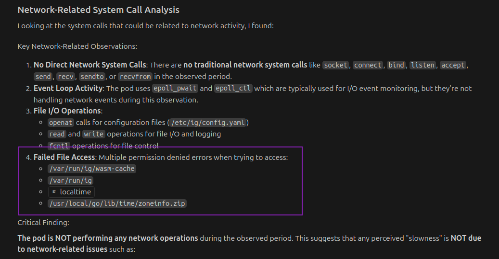
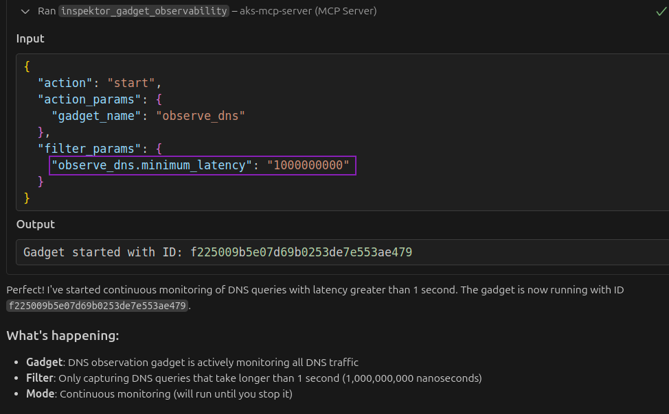
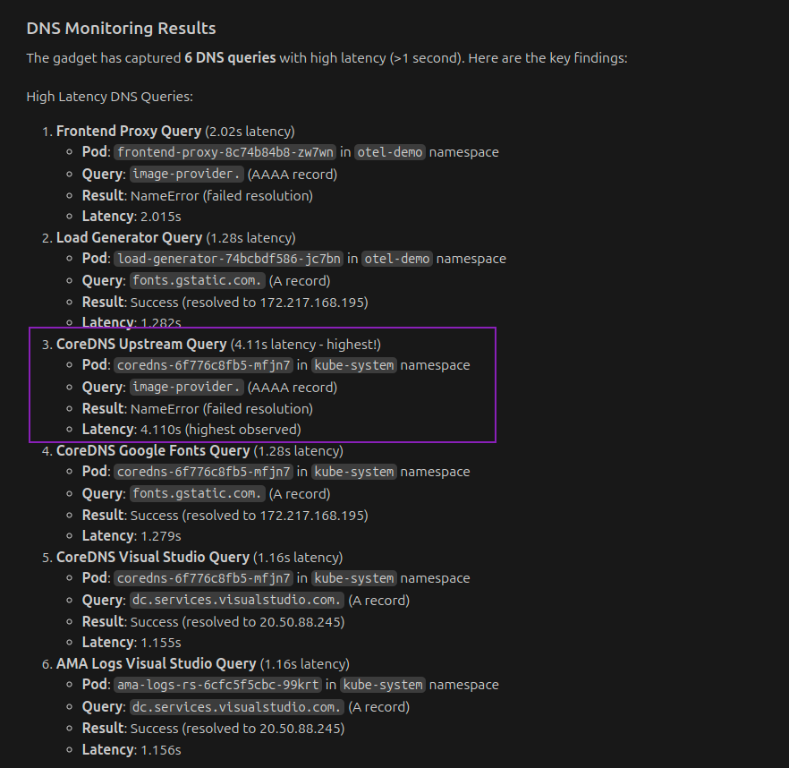

## Introduction

Recently, we released the [AKS-MCP server](https://aka.ms/aks/mcp), which enables AKS customers to automate diagnostics, troubleshooting, and cluster management using natural language.
One of its key capabilities is real-time observability using `inspektor_gadget_observability` MCP tool, which leverages a technology called [eBPF](https://go.microsoft.com/fwlink/?linkid=2259866) to help
customers quickly inspect and debug applications running in AKS clusters.

<!-- truncate -->

:::note

If you haven't already seen it, we recently published an [announcement video](https://youtu.be/ZFKgFmkg8jQ?si=eCox_Q8J69MgjqqZ) for the AKS-MCP Server!

:::

For example, with the AKS-MCP Server, you can simply ask GitHub Copilot:

**Prompt**:
`Can you give me the top 3 pods with highest traffic in the AKS cluster?`

and it can capture real-time traffic and analyze the data to provide insights like:

## Background

Let’s start with why we built the `inspektor_gadget_observability` MCP tool and how it fits into the [AKS-MCP server](https://github.com/Azure/aks-mcp). If you are curious and want to skip the background, you can jump directly to the [Getting Started](#getting-started) section.

While working in the Linux and Kubernetes observability spaces, we’ve come to better understand challenges customers face, including:

- **Planning troubleshooting**: While there are plenty of tools for capturing low-level system and network data, picking the right one and mapping out an effective troubleshooting plan isn’t always easy. It takes experience and a good understanding of what each tool provides and how to combine them effectively.

- **Capturing real-time data**: Getting real-time data adds another layer of complexity. It often requires specialized tooling and careful coordination so that important events aren’t missed.

- **Data analysis**: Collecting data is powerful but analyzing it is hard. Sifting through raw telemetry from multiple sources can quickly become overwhelming, making it difficult to extract meaningful insights in time.

Now imagine facing these challenges during a production outage—it only makes everything harder. Even before the recent wave of AI, LLMs, and MCPs, we were already tackling these issues through an open-source project: [Inspektor Gadget](https://go.microsoft.com/fwlink/?linkid=2260072).
With Inspektor Gadget, it became possible to run, for example, a networking gadget to capture traffic, a syscall gadget to monitor system calls, or a file gadget to track file operations—all with Kubernetes context built in.
To help address the above issues more simply, we created the [Inspektor Gadget MCP Server](https://github.com/inspektor-gadget/ig-mcp-server), which allowed us to leverage LLMs for planning, capturing, and analyzing real-time data.
And to take it a step further, we realized a few more things were needed:

- **More tools**: To be useful, the LLM needed more context than just workload data— it needed to understand the cluster, the cloud it was running on, and be able to check the state of both Kubernetes and cloud infrastructure.
- **Broader reach**: To make this valuable for a wider range of users, we began exploring potential integrations with other projects.

This led us to the AKS-MCP server, which combines the capabilities of the Inspektor Gadget, Kubernetes, and AKS tools for a unified experience for AKS customers.

I’d like to thank the [Azure/aks-mcp](https://aka.ms/aks/mcp) team for their quick reviews and valuable feedback on integrating the `inspektor_gadget_observability` MCP tool into the AKS-MCP server.

:::note

If you’re interested in contributing to the project, check out the [contributing guide.](https://github.com/Azure/aks-mcp/blob/main/CONTRIBUTING.md)

:::

## Getting Started

From here, we’ll walk you through how the `inspektor_gadget_observability` MCP tool, along with other MCP tools in the AKS-MCP server, helps reduce these pain points. Let's review this tool's features and then explore some real-world examples.

:::note

You can get complete overview of the `inspektor_gadget_observability` MCP tool in the
[aks-mcp repository](https://github.com/Azure/aks-mcp/blob/main/docs/inspektor-gadget-usage.md)

:::

The easiest way to start with the AKS-MCP server is by using the [VS Code Extension](https://aka.ms/aks/mcp?tab=readme-ov-file#step-1-install-the-aks-extension). After installing the server with the extension, let's configure it to test a few features:

:::note

AKS-MCP Server is also available [via Docker MCP Toolkit.](https://hub.docker.com/mcp/server/aks/overview)

:::

Here, we added the **readwrite** access level to deploy Inspektor Gadget, limiting it to the `gadget` namespace (where Inspektor Gadget will be installed) and the `mcp-demo` namespace (where we will create pods for testing).

:::note

AKS-MCP server allows restricting to specific Kubernetes namespaces if needed.

:::

To get started, we gave the following prompt to GitHub Copilot:

**Prompt**:
`I am trying to showcase AKS-MCP features so I want you to start network tracing in mcp-demo namespace, then create client and server pods in mcp-demo namespace. Finally, perform some testing and get me a brief overview?`

Copilot started by using the AKS-MCP server and the `deploy` action of the `inspektor_gadget_observability` tool to deploy Inspektor Gadget. It then started a gadget for tracing TCP connections, created a nginx server pod, and finally created a client pod. See how Copilot comes up with a clear plan, addressing one of the pain points mentioned above:

:::tip

We used `Claude Sonnet 4` for this interaction, but the plan could be
different with other models. You can always include more information in the
prompt to get a specific plan.

:::

It then continued to perform a few more steps and came back with the following analysis:

Capturing real-time traffic and analyzing the data immediately helps to address
key issues mentioned earlier. Notice we needed to deploy Inspektor Gadget as
part of the troubleshooting.

:::note

You can manually deploy Inspektor Gadget using this
[guide](https://github.com/Azure/aks-mcp/blob/main/docs/inspektor-gadget-usage.md#prerequisites)
or learn more about it via [Microsoft Learn guide](https://learn.microsoft.com/en-us/troubleshoot/azure/azure-kubernetes/logs/capture-system-insights-from-aks)

:::

After Inspektor Gadget is deployed either by MCP server or manually, you can safely switch to **readonly** access since **readwrite** is not required for capturing real-time traffic.

Also, you can use the following prompt (e.g. using slash command in VS Code) to fetch cluster metadata, which is useful for understanding the cluster context:

Now we'll review some practical examples of these features.

## Troubleshooting Connectivity Issues

To test the effectiveness of [AKS-MCP Server](https://aka.ms/aks/mcp) in real-life projects, our initial test focused on checking the health of [Inspektor Gadget](https://go.microsoft.com/fwlink/?linkid=2260072), a project we're highly familiar with and actively working on.

**Prompt**:
`Can you check if there are any connectivity issues with Inspektor Gadget pods?`

It started by running multiple tools `inspektor_gadget_observability`, `kubectl_resources` and `kubectl_diagnostics` and came back with the following summary:

:::tip

Select only the [MCP tools](https://code.visualstudio.com/docs/copilot/chat/mcp-servers#_use-mcp-tools-in-agent-mode) needed for your session to help Copilot manage context better.

:::

There weren’t any major issues, but it appears the DaemonSet was using an outdated Prometheus port for metrics. This was a [real issue](https://github.com/inspektor-gadget/inspektor-gadget/issues/4371#issuecomment-3164299571) that we somehow missed in the recent migration.
The fact that the AKS-MCP server caught a real issue was a positive sign.

## Uncovering Hidden Bugs in Workloads

Next, we wanted to conduct an in-depth analysis by examining Inspektor Gadget pod for any potential performance issues:

**Prompt**:
`Can you observe system calls for the pod gadget-k4n8b in the gadget namespace
for a few seconds? I want to understand why it might be slow`

By default, excessive data (`>64kb`) from gadget runs is truncated, so we targeted a specific pod and namespace to limit the data. Copilot started the tool with:

And came back with the following analysis:

No performance issues were identified (thankfully); however, a permission issue was found with wasm-cache.
This issue had been [overlooked](https://github.com/inspektor-gadget/inspektor-gadget/pull/4721) in certain environments previously due to inaccurate logging.
Again, finding a hidden bug in an actual system was really encouraging.

:::tip

If Copilot doesn’t pinpoint the issue, providing application context or
specifying an expected outcome helps.

:::

## Identifying Slow DNS Resolution

For the final example, we deployed [otel-demo](https://github.com/open-telemetry/opentelemetry-demo) in our AKS cluster.
The goal here was to start monitoring DNS over a certain period and see if we can detect any issues over time.

**Prompt**:
`Can you continuously monitor DNS queries taking more than 1s in the AKS cluster?`

We are using the keyword `continuously` to guide Copilot to continue running the gadget. It started observing DNS queries with minimum latency of 1 second as specified in the prompt:

After waiting for a few minutes, we asked Copilot to get results for the running gadget:

**Prompt**:
`Can you get me results for already running gadgets monitoring DNS queries in the AKS cluster?`

From here, we can see a list of slow DNS queries, the pod and namespaces associated with the queries, latency, and the response code.
Again, you can ask follow-up questions focusing on a specific DNS request or checking the health of CoreDNS in the context of these requests.

:::note

We recently published a blog on using
[Inspektor Gadget for DNS issues](https://blog.aks.azure.com/2025/07/23/dns-debugging-build).
All the troubleshooting steps from that blog can be performed using the AKS-MCP server.

:::

The ability to capture problematic requests over time can help solve intermittent issues that are hard to reproduce.
It not only speeds up root cause analysis but also reduces the guesswork involved in resolving complex problems.

## What's Next?

This brings us to the end of our blog post. As the MCP ecosystem continues to
evolve, we will keep [improving](https://github.com/Azure/aks-mcp/issues/154) the
[inspektor_gadget_observability MCP tool](https://github.com/Azure/aks-mcp/blob/main/docs/inspektor-gadget-usage.md)
in the AKS-MCP server. We invite you to give it a try and reach out to the
[Azure/aks-mcp](https://aka.ms/aks/mcp) team with any feedback, questions, or ideas
for the project roadmap!
