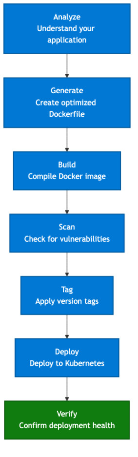

### Introducing Containerization Assist: AI-Driven Artifact Generation for Kubernetes 

AI has quickly become an integral part of the modern developer's workflow. Whether it’s GitHub Copilot, MCPs, or other emerging tools, AI is now central to how developers build, test, and ship software. Inspired by the productivity gains AI enables, the AKS DevX team began exploring how it could simplify and accelerate the creation of Kubernetes deployment artifacts. In AKS, we’ve consistently seen how challenging it can be for customers to containerize legacy applications and move them onto Kubernetes. The process is rarely straightforward, often requiring more time and effort than it ideally should. 

It doesn’t take long in a cloud-native journey to realize that containerizing an application requires much more than just executing a single command. It involves a deep understanding of your app’s dependencies, writing secure and optimized Dockerfiles, producing the right Kubernetes manifests, and deploying everything reliably. Each of these steps can introduce its own set of challenges, from dependency mismatches to subtle configuration issues that slow you down and distract you from building features that matter. 

That’s why today we’re introducing Containerization Assist, an AI-powered MCP server designed to simplify the process of containerizing your applications. Without requiring deep Docker expertise, Containerization Assist guides you step by step through creating Dockerfiles and Kubernetes deployment manifests, all from within your development environment using natural language. Best of all, no matter your stack, whether you're using GitHub Copilot, Cursor, Claude Code, or another tool, Containerization Assist works seamlessly wherever MCP servers are supported. 

### So how does it work? 

Containerization Assist orchestrates the containerization workflow (see Figure 1) as an intelligent assistant, working as a standard set of MCP tools and workflows to deliver more deterministic, debuggable outputs at every step. When operations fail, you don’t get cryptic error codes. Instead, you receive clear, actionable guidance with remediation hints and resolution steps. Using an AI-driven approach, Containerization Assist incorporates security and performance best practices from curated knowledge packs, helping ensure your containers align with industry standards—without requiring you to memorize them. 

_Figure 1: The workflow of the containerization assist MCP server._ 

All of this comes together to create a seamless, developer-friendly experience tailored to how developers are increasingly using AI tools in 2025. Each operation logs clear “Starting” and “Completed” messages that GitHub Copilot or your preferred tool can interpret, summarize, and build upon in conversation. With built-in Docker and Kubernetes integration, vulnerability scanning powered by Trivy, and intelligent tool routing that automatically handles dependencies, you're ready to start creating containers today! 

Visit https://aka.ms/aks/containerization-assist to get started today! 

_Figure 2: A gif showcasing Containerization Assist._ 