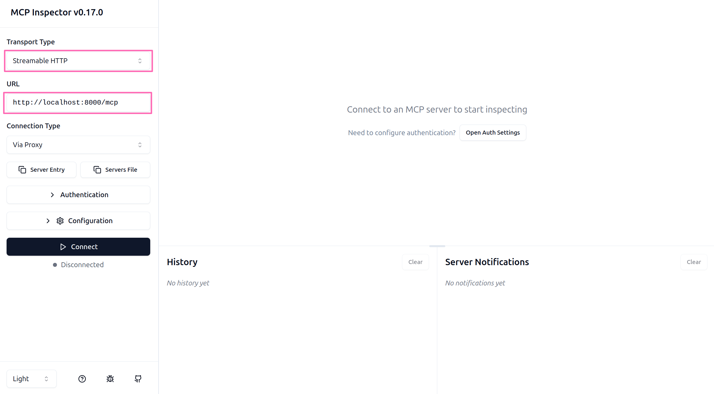
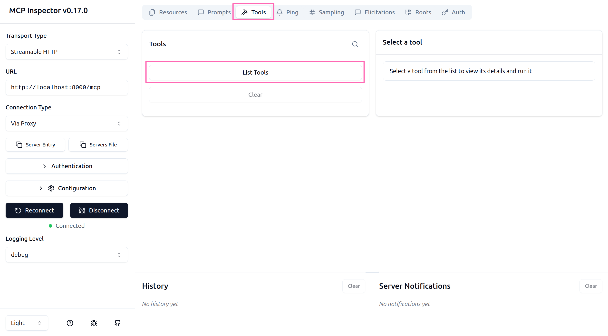
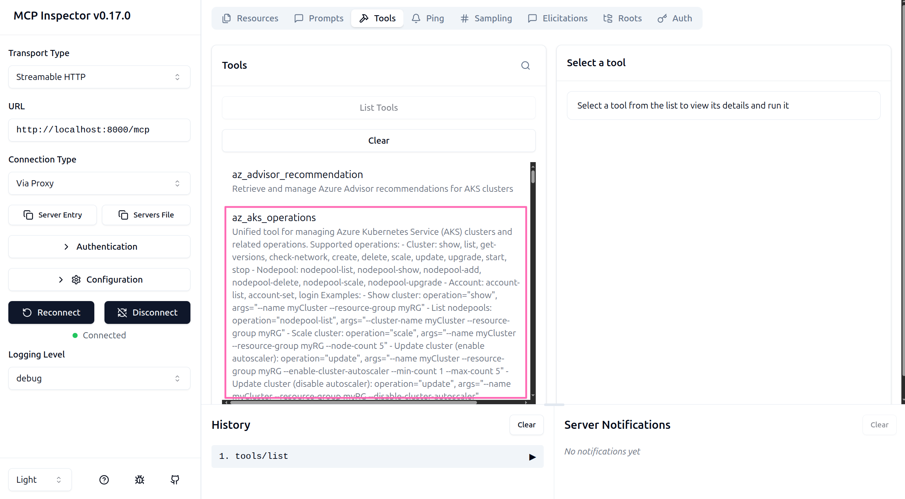
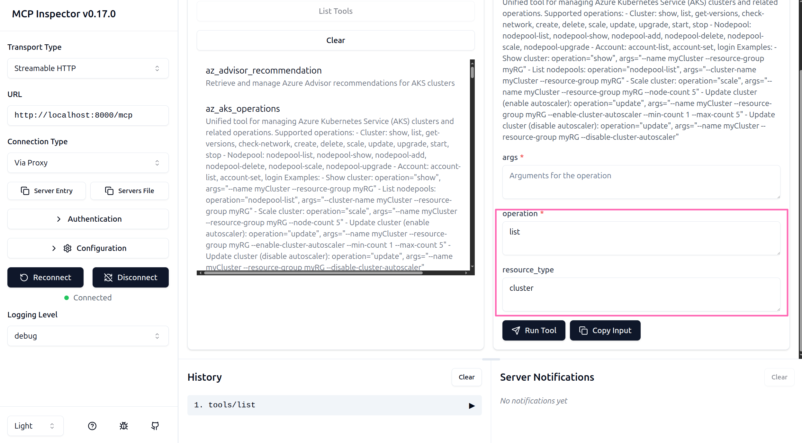
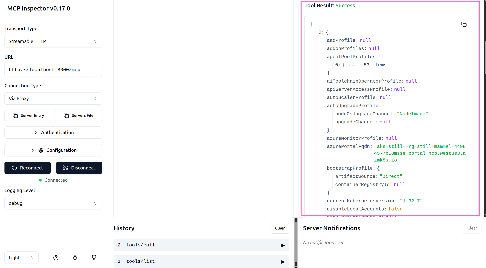

It's been a few months since the [AKS-MCP server was announced](/2025/08/06/aks-mcp-server). Since then, there have been several updates and improvements. The MCP server can be easily installed on a local machine using the [AKS Extension for VS Code](/2025/08/06/aks-mcp-server#getting-started-with-aks-mcp), or via the [GitHub MCP registry](https://github.com/mcp?q=AKS), or even using the [Docker MCP hub](https://hub.docker.com/mcp/explore?search=AKS).

In this blog post, I'll show you one approach to running the AKS MCP server: deploying it inside an AKS cluster as a Streamable HTTP service. This pattern demonstrates how MCP servers can be centrally managed and made accessible to multiple clients—including AI assistants, automation tools, and even autonomous agents.

<!-- truncate -->

Before we get started, let's explore why you might consider this deployment pattern.

## Why Deploy MCP Servers on AKS?

Running MCP servers on AKS offers several potential advantages, depending on your requirements:

- **Centralized deployment**: Host multiple MCP servers in a single cluster, making them accessible to various clients without requiring local installation on each machine
- **Scalability and reliability**: Leverage AKS's built-in features for scaling, monitoring, logging, and high availability
- **Secure authentication**: Use Workload Identity for passwordless authentication with fine-grained access control
- **Multi-client access**: Enable different teams, applications, or autonomous agents to connect to the same MCP server instance over HTTP
- **Standardized patterns**: Establish a repeatable deployment pattern that can be applied to other MCP servers beyond just the AKS MCP server
- **Governance and auditability**: Maintain centralized control over authentication and audit trails by collecting MCP server logs in one place, providing visibility into all tool invocations across your organization

That said, this approach isn't the only way—or necessarily the best way—to run MCP servers. Local installations may be simpler for individual users, while other deployment patterns might better suit different use cases. The key is choosing the right approach for your specific requirements.

In this setup, we'll use a User-Assigned Managed Identity with Workload Identity to authenticate the MCP server to Azure, giving it necessary permissions to manage both Kubernetes and Azure resources.

Let's dive in!

## Prerequisites

Before you begin, ensure you have the following:

- [Azure subscription](https://azure.microsoft.com/free/)
- [Azure CLI](https://learn.microsoft.com/cli/azure/install-azure-cli)
- [kubectl](https://kubernetes.io/docs/tasks/tools/install-kubectl/)
- [NodeJS and npm](https://nodejs.org) for running MCP Inspector
- POSIX-compliant shell (e.g., bash, zsh) or use [Azure Cloud Shell](https://shell.azure.com)

With an Azure subscription and the Azure CLI installed, log into your Azure account.

```sh
az login
```

We'll take advantage of one preview feature of AKS so run the following command to install the Azure CLI extensions for AKS.

```sh
az extension add --name aks-preview
```

Register the **DisableSSHPreview** feature in your subscription. We don't need SSH access for this cluster so disable it at cluster creation time.

```sh
az feature register --name DisableSSHPreview --namespace Microsoft.ContainerService
```

Wait for the feature to be registered. You can check the status with the following command:

```sh
az feature show --name DisableSSHPreview --namespace Microsoft.ContainerService
```

Once the feature is registered, refresh the registration of the Microsoft.ContainerService resource provider.

```sh
az provider register --namespace Microsoft.ContainerService
```

With the prerequisites in place, you're ready to start setting up the AKS MCP server on AKS.

Run the following command to export a random name variable to use for resource names to avoid naming conflicts.

```sh
export RANDOM_NAME=$(petname) # If you don't have petname, replace this entire command with e.g. export RANDOM_NAME=myrandomname
```

:::info

I am working on a Ubuntu 24.04 LTS machine with the [petname](https://manpages.ubuntu.com/manpages/jammy/en/man1/petname.1.html) utility installed to generate random names. If you don't have access to this package, you can simply replace the `petname` command with any random name of your choice.

:::

Set a few environment variables to use throughout.

```sh
export LOCATION=westus3 # or any Azure region of your choice
export RESOURCE_GROUP_NAME=rg-$RANDOM_NAME
export AKS_CLUSTER_NAME=aks-$RANDOM_NAME
export MANAGED_IDENTITY_NAME=mi-$RANDOM_NAME
```

## Provision Azure resources

You're now ready to create the necessary Azure resources. Run the following command to create a resource group and retrieve the resource group ID. This will be used later when assigning Azure RBAC roles to the managed identity.

```sh
read -r RESOURCE_GROUP_ID <<< \
  "$(az group create \
  --name $RESOURCE_GROUP_NAME \
  --location $LOCATION \
  --query '{id:id}' -o tsv)"
```

For demonstration purposes, we can create a single node AKS cluster. Run the following command to create one with Workload Identity enabled and retrieve the OIDC issuer URL. This value will be used later when configuring the federated identity credential.

```sh
read -r AKS_OIDC_ISSUER_URL <<< \
  "$(az aks create \
    --resource-group $RESOURCE_GROUP_NAME \
    --name $AKS_CLUSTER_NAME \
    --enable-workload-identity \
    --enable-oidc-issuer \
    --ssh-access disabled \
    --node-count 1 \
    --query '{oidcIssuerUrl:oidcIssuerProfile.issuerUrl}' -o tsv)"
```

:::info

The `--ssh-access disabled` flag is used to disable SSH access to the nodes in the AKS cluster. This is a security best practice as it reduces the attack surface of the cluster.

:::

In order to allow the MCP server to authenticate to Azure, you'll need to create a User-Assigned Managed Identity and configure it for Workload Identity.

Create a new User-Assigned Managed Identity in the same resource group as your AKS cluster and retrieve its principal ID and client ID which will be used to configure Azure role assignment and Service Account annotation.

```sh
read -r PRINCIPAL_ID CLIENT_ID <<< \
  "$(az identity create \
    --resource-group $RESOURCE_GROUP_NAME \
    --name $MANAGED_IDENTITY_NAME \
    --query '{principalId:principalId, clientId:clientId}' -o tsv)"
```

Create a federated identity credential for the managed identity. This allows the Service Account in the AKS cluster to authenticate as the managed identity.

```sh
az identity federated-credential create \
  --name $MANAGED_IDENTITY_NAME \
  --identity-name $MANAGED_IDENTITY_NAME \
  --resource-group $RESOURCE_GROUP_NAME \
  --issuer $AKS_OIDC_ISSUER_URL \
  --subject system:serviceaccount:default:aks-mcp \
  --audiences api://AzureADTokenExchange
```

:::info

The following parameters used in the command above:

- `--issuer`: The OIDC issuer URL of the AKS cluster. This is obtained from the AKS cluster properties.
- `--subject`: The subject claim that identifies the Service Account in the AKS cluster. In this case, it's `system:serviceaccount:default:aks-mcp`, which corresponds to the `aks-mcp` Service Account in the `default` namespace.
- `--audiences`: The audience for the token. For Workload Identity, this should be `api://AzureADTokenExchange`.

:::

Grant the managed identity the **Contributor** role for the resource group so it can manage resources associated with the cluster. This includes permissions to manage the AKS cluster itself as well as any other resources in the resource group such as monitoring, networking, and storage resources.

```sh
az role assignment create \
  --assignee $PRINCIPAL_ID \
  --role "Contributor" \
  --scope $RESOURCE_GROUP_ID
```

:::danger

You are granting the managed identity a broad set of permissions that may exceed the minimum required for your MCP server to function. This is only for demonstration purposes. In a production environment, you should follow the principle of least privilege and assign only the necessary permissions required for your use case.

:::

Connect to the AKS cluster.

```sh
az aks get-credentials \
  --resource-group $RESOURCE_GROUP_NAME \
  --name $AKS_CLUSTER_NAME
```

:::tip

If you don't have `kubectl` installed, you can use the Azure Cloud Shell in the Azure portal, which has `kubectl` pre-installed or use the `az aks install-cli` command to install `kubectl`.

:::

## Deploy Kubernetes resources

Create a Service Account in the AKS cluster and annotate it with the managed identity client ID.

```sh
kubectl apply -f - <<EOF
apiVersion: v1
kind: ServiceAccount
metadata:
  name: aks-mcp
  annotations:
    azure.workload.identity/client-id: $CLIENT_ID
EOF
```

:::info

The annotation `azure.workload.identity/client-id` is used to associate the Service Account with the managed identity. This allows the pods that use this Service Account to authenticate to Azure using the managed identity.

:::

Create a ClusterRoleBinding to bind the `cluster-admin` role to the Service Account. This allows the MCP server to manage resources in the AKS cluster.

```sh
kubectl apply -f - <<EOF
apiVersion: rbac.authorization.k8s.io/v1
kind: ClusterRoleBinding
metadata:
  name: aks-mcp-cluster-admin
roleRef:
  apiGroup: rbac.authorization.k8s.io
  kind: ClusterRole
  name: cluster-admin
subjects:
  - kind: ServiceAccount
    name: aks-mcp
    namespace: default
EOF
```

:::danger

You are granting the Service Account a broad set of permissions that may exceed the minimum required for your MCP server to function. This is only for demonstration purposes. In a production environment, you should follow the principle of least privilege and assign only the necessary permissions required for your use case.

:::

Deploy the AKS MCP server as a Deployment and Service in the AKS cluster.

```sh
kubectl apply -f - <<EOF
apiVersion: apps/v1
kind: Deployment
metadata:
  name: aks-mcp
spec:
  replicas: 1
  selector:
    matchLabels:
      app: aks-mcp
  template:
    metadata:
      labels:
        app: aks-mcp
        azure.workload.identity/use: "true"
    spec:
      serviceAccountName: aks-mcp
      containers:
      - name: aks-mcp
        image: ghcr.io/azure/aks-mcp:v0.0.9
        args:
          - --access-level=readwrite
          - --transport=streamable-http
          - --host=0.0.0.0
          - --port=8000
          - --timeout=600
        ports:
        - containerPort: 8000
          name: http
        resources: {}
EOF
```

:::info

Let's break down some of the key parameters used in the Deployment manifest above:

- `azure.workload.identity/use: "true"`: This label indicates that the pod should use Workload Identity for authentication.
- `serviceAccountName: aks-mcp`: This specifies the Service Account that the pod will use. This Service Account is annotated with the managed identity client ID, allowing the pod to authenticate to Azure using the managed identity.
- `image: ghcr.io/azure/aks-mcp:v0.0.9`: This is the container image for the AKS MCP server. You can check for the latest version on the [AKS MCP releases page](https://github.com/Azure/aks-mcp/releases).
- `args`: These are the command-line arguments passed to the MCP server:
  - `--access-level=readwrite`: This sets the access level of the MCP server to read-write, allowing it to manage resources.
  - `--transport=streamable-http`: This configures the MCP server to use Streamable HTTP as the transport protocol.
  - `--host=0.0.0.0`: This binds the MCP server to all network interfaces in the pod.
  - `--port=8000`: This sets the port on which the MCP server will listen for incoming requests.
  - `--timeout=600`: This sets the timeout for requests to 600 seconds.

You can refer to the [AKS MCP documentation](https://github.com/Azure/aks-mcp?tab=readme-ov-file#options) for additional configuration options.

:::

:::danger

The AKS MCP server is deployed with **readwrite** access, which enables the MCP server to manage resources in the cluster and on Azure. This is only for demonstration purposes. In a production environment, you should follow the principle of least privilege and configure the MCP server with only the necessary access level required for your use case.

:::

Wait for the MCP server pod to be in the `Running` state.

```sh
kubectl get pods -l app=aks-mcp -w
```

You can also check the logs of the MCP server pod to ensure it's running correctly. Here is an example of what the logs should look like:

```text
$ kubectl logs deploy/aks-mcp
time="02:57:02" level=info msg="Initializing AKS MCP service..."
time="02:57:02" level=info msg="Azure client initialized successfully"
time="02:57:06" level=info msg="Azure CLI initialized successfully (federated_token)"
time="02:57:06" level=info msg="MCP server initialized successfully"
time="02:57:06" level=info msg="Registering Azure Components..."
time="02:57:06" level=info msg="Azure Components registered successfully"
time="02:57:06" level=info msg="Registering Kubernetes Components..."
time="02:57:06" level=info msg="No optional Kubernetes components enabled"
time="02:57:06" level=info msg="Kubernetes Components registered successfully"
time="02:57:06" level=info msg="Registering Prompts..."
time="02:57:06" level=info msg="AKS MCP service initialization completed successfully"
time="02:57:06" level=info msg="AKS MCP version: 0.0.9+1758679679"
time="02:57:06" level=info msg="Streamable HTTP server listening on 0.0.0.0:8000"
time="02:57:06" level=info msg="MCP endpoint available at: http://0.0.0.0:8000/mcp"
time="02:57:06" level=info msg="Send POST requests to /mcp to initialize session and obtain Mcp-Session-Id"
```

Note the logs indicate that the MCP server is using the federated token for authentication, which means that Workload Identity is working correctly.

Finally, create a Service to expose the AKS MCP server.

```sh
kubectl apply -f - <<EOF
apiVersion: v1
kind: Service
metadata:
  name: aks-mcp
spec:
  type: ClusterIP
  ports:
  - port: 8000
    targetPort: 8000
    protocol: TCP
    name: http
  selector:
    app: aks-mcp
EOF
```

This will create an internal ClusterIP service that exposes the MCP server on port 8000.

## Verify the deployment

Now, we can verify the MCP server is working correctly by port-forwarding the service to your local machine and using the [MCP Inspector](https://github.com/modelcontextprotocol/inspector) tool to connect to it.

Run the following command to port-forward the AKS MCP service to your local machine and append the `&` at the end to move the process to the background.

```sh
kubectl port-forward svc/aks-mcp 8000:8000 &
```

:::tip

This service is only accessible within the AKS cluster. Port-forwarding allows you to access the service from your local machine for testing purposes. In a production environment, you would typically expose the service using an Ingress controller. See the AKS documentation on [managed NGINX ingress with the application routing add-on](https://learn.microsoft.com/azure/aks/app-routing) for more details.

:::

To test the MCP server, we'll use the MCP Inspector tool, which is a web-based tool that allows you to interact with the MCP server.

Run the following command to start the MCP Inspector tool.

```sh
npx @modelcontextprotocol/inspector
```

The command will install and run the MCP Inspector tool. Once it's running, your default web browser should automatically open to `http://localhost:6274`. If it doesn't, you can manually open your browser and navigate to the URL provided in the terminal output.

In the MCP Inspector tool, you will need to populate a few fields to connect:

- **Transport Type**: Select `Streamable HTTP`.
- **URL**: Enter `http://localhost:8000/mcp`.



Click the "Connect" button to connect to the AKS MCP server.

In the menu on the top of the page, click on "**Tools**" and then click on "**List Tools**" to see the list of available tools.



Click on the "**az_aks_operations**" tool to see the details of the tool.



In the panel to the right, you can enter the arguments for the tool. Enter the following arguments to list the AKS clusters in your subscription:

- **operation**: Enter `list`.
- **resource_type**: Enter `cluster`.



Click the **Run Tool** button to run the tool.



You should see the list of AKS clusters in your subscription.

## Conclusion

Congratulations! You've successfully deployed the AKS MCP server on AKS as a Streamable HTTP service with Workload Identity.

In this walkthrough, you've learned how to:

- Enable Workload Identity on an AKS cluster for secure, passwordless authentication
- Configure a User-Assigned Managed Identity with federated credentials
- Deploy the AKS MCP server as a containerized workload with fine-grained Azure and Kubernetes permissions
- Test the deployment using the MCP Inspector tool

More importantly, you've seen a deployment pattern that extends beyond just the AKS MCP server. This same approach can be applied to deploy any MCP server as a Streamable HTTP service on AKS, creating a centralized hub where multiple clients—from AI assistants to autonomous agents—can connect and interact with your infrastructure tools.

This pattern is particularly valuable when:

- Multiple teams need access to the same MCP server capabilities
- You want to reduce the overhead of managing individual client-side installations
- Your use case involves autonomous agents or automated workflows that need programmatic access to MCP tools
- You require enterprise-grade monitoring, logging, and security controls

However, keep in mind that this is one approach among many. Depending on your specific requirements, you might choose local installations for simplicity, serverless deployments for cost optimization, or hybrid approaches that combine multiple patterns.

Remember, the configuration used in this guide grants broad permissions for demonstration purposes. In production scenarios, always follow the principle of least privilege by granting only the specific permissions your MCP server needs to operate.

## What's next

Now that you have the AKS MCP server running on AKS, I'll leave it to you to explore the various tools and capabilities available through the MCP server. Consider these next steps:

- **Expand to other MCP servers**: Apply this same pattern to deploy other MCP servers (database tools, cloud providers, etc.) creating a centralized MCP hub
- **Configure monitoring and logging**: Set up Azure Monitor and Container Insights to track the health and performance of your MCP servers, and enable centralized audit logging for governance and compliance
- **Implement network policies**: Add Kubernetes Network Policies to control traffic flow to and from your MCP servers
- **Set up ingress**: Replace the port-forward approach with an Ingress controller to enable remote access for multiple clients or autonomous agents
- **Scale for production**: Adjust replica counts, resource requests/limits, and implement autoscaling based on your workload requirements

One area I'm particularly excited about is how autonomous agents can leverage this centralized deployment to orchestrate complex infrastructure operations. Stay tuned for a future post where I'll dive into using this AKS MCP server deployment with autonomous agents to automate real-world scenarios.

## Troubleshooting

If you encounter a tool call error with a message stating _Please run `az login` to setup account_, it means that the Workload Identity was not properly configured for the Service Account. Double-check the following:

- Ensure that the federated identity credential was created with the correct issuer URL, subject, and audiences.
- Verify that the Service Account is annotated with the correct client ID of the managed identity.

## Cleanup

To stop the MCP Inspector tool, press `Ctrl+C` in the terminal where it is running.

To stop the port forwarding, run the following command:

```sh
pkill -f 'kubectl port-forward'
```

To delete the resources created in this post, run the following command:

```sh
az group delete --name $RESOURCE_GROUP_NAME --yes --no-wait
```
