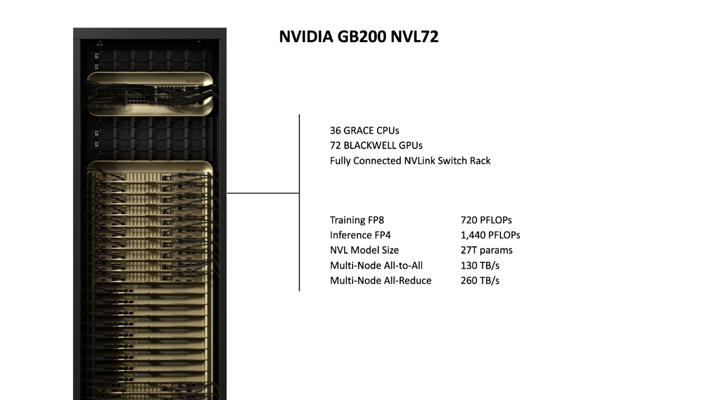
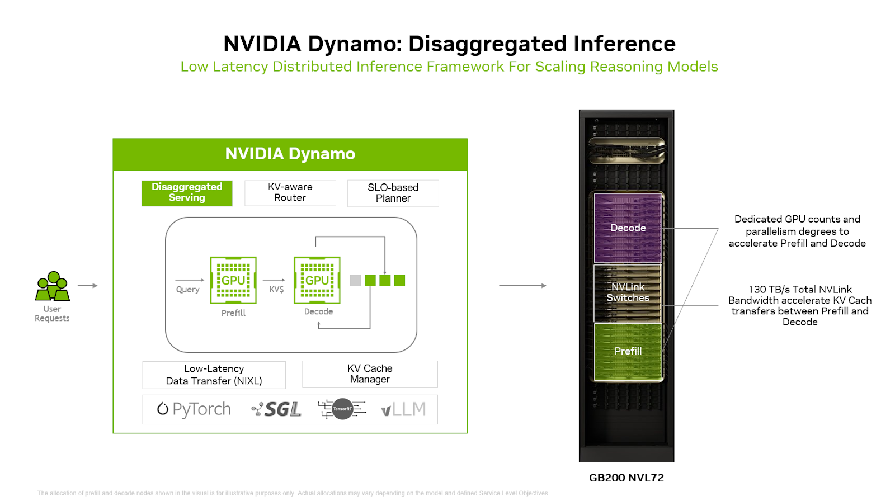

*This blog post is co-authored with
[Rohan Varma](https://www.linkedin.com/in/rohan-s-varma/),
[Saurabh Aggarwal](https://www.linkedin.com/in/sa126/),
[Anish Maddipoti](https://www.linkedin.com/in/anish-maddipoti/), and
[Amr Elmeleegy](https://www.linkedin.com/in/meleegy/) from NVIDIA
to showcase solutions
that help customers run AI inference at scale using Azure Kubernetes Service
(AKS) and NVIDIA’s advanced hardware and distributed inference frameworks.*

Modern language models now routinely exceed the compute and memory capacity of
a single GPU or even a whole node with multiple GPUs on Kubernetes.
Consequently, inference at the
scale of billions of model parameters demands multi-node, distributed
deployment. Frameworks like the [open-source NVIDIA Dynamo platform](https://github.com/ai-dynamo/dynamo)
play a crucial role by coordinating execution across nodes, managing
memory resources efficiently, and accelerating data transfers between GPUs
to keep latency low.

However, software alone cannot solve these challenges. The underlying hardware
must also support this level of scale and throughput. Rack-scale systems like
[Azure ND GB200-v6](https://learn.microsoft.com/azure/virtual-machines/sizes/gpu-accelerated/nd-gb200-v6-series)
VMs, accelerated by NVIDIA GB200 NVL72, meet this need by integrating
72 NVIDIA Blackwell
GPUs in a distributed GPU setup connected via high-bandwidth, low-latency
interconnect. This architecture uses the rack as a unified compute engine
and enables fast, efficient communication and scaling that traditional
multi-node setups struggle to achieve.

For some more demanding or unpredictable workloads, even combining advanced hardware and distributed inference frameworks
is not sufficient on its own. Inference traffic spikes unpredictably.
Fixed, static inference configurations and setups with predetermined resource
allocation can lead to GPU underutilization or overprovisioning. Instead,
inference infrastructure must dynamically adjust in real time, scaling
resources up or down to align with current demand without wasting GPU capacity
or risking performance degradation.

## A holistic solution: ND GB200-v6 VMs and Dynamo on AKS

To effectively address the variability in inference traffic in distributed
deployments, our approach combines three key components: ND GB200-v6
VMs, the NVIDIA Dynamo inference framework, with an Azure Kubernetes
Service (AKS) cluster. Together, these technologies provide the scale,
flexibility, and responsiveness necessary to meet the demands of modern,
large-scale inference workloads.

### ND GB200-v6: Rack-Scale Accelerated Hardware

At the core of Azure’s [ND GB200-v6 VM series](https://learn.microsoft.com/azure/virtual-machines/sizes/gpu-accelerated/nd-gb200-v6-series)
is the liquid-cooled NVIDIA GB200 NVL72 system, a rack-scale architecture
that integrates 72 NVIDIA Blackwell GPUs and 36 NVIDIA Grace™ CPUs into a
single, tightly coupled domain.

The rack-scale design of ND GB200-v6 unlocks model serving patterns that were
previously infeasible due to interconnect and memory bandwidth constraints.

### NVIDIA Dynamo: a distributed inference framework

[NVIDIA Dynamo](https://www.nvidia.com/en-us/ai/dynamo/) is an open source
distributed inference serving framework that supports multiple engine
backends, including [vLLM](https://github.com/vllm-project/vllm),
[TensorRT-LLM](https://github.com/NVIDIA/TensorRT-LLM), and
[SGLang](https://github.com/sgl-project/sglang). It disaggregates the
prefill (compute-bound) and decode (memory-bound) phases across separate GPUs,
enabling independent scaling and phase-specific parallelism strategies.
For example, the memory-bound decode phase can leverage wide
[expert parallelism](https://developer.nvidia.com/blog/how-nvidia-gb200-nvl72-and-nvidia-dynamo-boost-inference-performance-for-moe-models/#boosting_moe_model_performance_with_disaggregated_serving%C2%A0) (EP)
without constraining the compute-heavy prefill phase, improving overall
resource utilization and performance.

Dynamo includes an
[SLA-based Planner](https://github.com/ai-dynamo/dynamo/blob/main/docs/planner/sla_planner_quickstart.md)
that proactively manages GPU scaling for prefill/decode (PD) disaggregated
inference. Using pre-deployment profiling, it evaluates how model parallelism
and batching affect performance, recommending configurations that meet
latency targets like Time to First Token (TTFT) and Inter-Token Latency (ITL)
within a given GPU budget. At runtime, the Planner forecasts traffic with
time-series models, dynamically adjusting PD worker counts based on predicted
demand and real-time metrics.

The Dynamo
[LLM-aware Router](https://github.com/ai-dynamo/dynamo/tree/main/docs/router)
manages the key-value (KV) cache across large GPU clusters by hashing requests
and tracking cache locations. It calculates overlap scores between incoming
requests and cached KV blocks, routing requests to GPUs that maximize cache
reuse while balancing workload. This cache-aware routing reduces costly KV
recomputation and avoids bottlenecks, which in turn improves performance, especially for
large models with long context windows.

To reduce GPU memory overhead, the Dynamo
[KV Block Manager](https://github.com/ai-dynamo/dynamo/blob/f93b619ad9c6dfe820fbf08b79f1f9eedec4a62c/docs/kvbm/kvbm_architecture.md)
offloads infrequently accessed KV blocks to CPU RAM, SSDs, or object storage.
It supports hierarchical caching and intelligent eviction policies across
nodes, scaling cache storage to petabyte levels while preserving reuse
efficiency.

Dynamo’s disaggregated execution model is especially effective for large,
dynamic inference workloads where compute and memory demands shift across
phases. The Azure Research paper ["Splitwise: Efficient generative LLM
inference using phase splitting"](https://www.microsoft.com/en-us/research/wp-content/uploads/2023/12/Splitwise_ISCA24.pdf)
demonstrated the benefits of separating the compute-intensive prefill and
memory-bound decode phases of LLM inference onto different hardware. We will
explore this disaggregated model in detail in an upcoming blog post.

### How Dynamo can optimize AI product recommendations in e-commerce apps

Let’s put Dynamo’s features in context by walking through a realistic app
scenario and explore how its framework addresses common inference challenges
on AKS.

Imagine you operate a large e-commerce platform (or provide infrastructure for
one), where customers browse thousands of products in real time. The app runs
on AKS and experiences traffic surges during sales, launches, and seasonal
events. The app also leverages LLMs to generate natural language outputs,
such as:

* Context-aware product recommendations
* Dynamic product descriptions
* AI-generated upsells based on behavior, reviews, or search queries

This architecture powers user experiences like: “Customers who viewed this
camera also looked at these accessories, chosen for outdoor use and battery
compatibility.” Personalized product copies are dynamically rewritten for
different segments, such as “For photographers” vs. “For frequent travelers.”

Behind the scenes, it requires a multi-stage LLM pipeline: retrieving
product/user context, running prompted inference, and generating natural
language outputs per session.

### Common pain points and how Dynamo tackles them

1. **Heavy Prefill + Lightweight Decode = GPU Waste**

    Generating personalized recommendations requires a heavy prefill stage
    (processing more than 8,000 tokens of context) but results in short outputs
    (~50 tokens). Running both on a single GPU can be inefficient.

    **Dynamo Solution**: The pipeline is split into two distinct stages, each
    deployed on separate GPUs. This allows independent configuration of GPU
    count and model parallelism for each phase. It also enables the use of
    different GPU types—for example, GPUs with high compute capability but
    lower memory for the prefill stage, and GPUs with both high compute and
    large memory capacity for the decode stage.

    In our e-commerce example, when a user lands on a product page:

    * Prefill runs uninterrupted on dedicated GPUs using model parallelism
    degrees optimized for accelerating math-intensive attention GEMM
    operation. This enables fast processing of 8,000 tokens of user context
    and product metadata.

    * Decode runs on a GPU pool with different counts and parallelism degrees
    designed and tuned to maximize memory bandwidth and capacity for
    generating the short product blurb.

    **Result**: This approach maximizes GPU utilization and reduces per-request
    cost.

1. **Meeting SLOs and handling traffic spikes without overprovisioning**

    Your SLO might define time-to-first-token < 300ms and 99th percentile
    latency < 500ms, but maintaining this across dynamic workloads is tough.
    Static GPU allocation leads to bottlenecks during traffic spikes,
    causing either SLO violations or wasted capacity.

    **Dynamo Solution**: Continuously monitors metrics and auto-scales GPU
    replicas or reallocates GPUs between prefill and decode stages based on
    real-time traffic patterns, queue depth, and latency targets.

    In our e-commerce example:

    * During Black Friday, Dynamo observes latency climbing due to a surge in
    prefill demand. It responds by increasing prefill GPU replicas by 50%,
    shifting GPUs from decode or spinning up additional ones.
    * At night, when email generation jobs dominate, Dynamo reallocates GPUs
    back to decode to optimize throughput.
    * When load drops, resources scale back down.

    **Result**: SLOs are met consistently without over or under provisioning,
    controlling costs while maintaining performance.

1. **Recomputing shared context is wasteful**

    Many requests within the same session reuse the same product or user
    context but unnecessarily recompute the KV cache each time, wasting
    valuable GPU resources that could be spent serving other user requests.

    **Dynamo Solution**: LLM-aware routing maintains a map of KV cache across
    large GPU clusters and directs requests to the GPUs that already hold the
    relevant KV cache, avoiding redundant computation.

    In our e-commerce example:

    * A user browses five similar items in one session.
    * Dynamo routes all requests to the same GPU that already has the user’s
    or product’s context cached.

    **Result**: Faster response times, lower latency, reduced GPU usage.

1. **KV cache growth blows past GPU memory**

    With many concurrent sessions and large input sequence lengths, the
    KV cache (product data + user history) can exceed available GPU memory.
    This can trigger evictions, leading to costly re-computations or inference
    errors.

    **Dynamo Solution**: The KV Block Manager (KVBM) offloads cold/unused KV
    cache data to CPU RAM, NVMe, or networked storage freeing valuable GPU
    memory for active requests.

    In our e-commerce example:

    * Without cache offloading: increasing number of concurrent sessions
    per GPU increases latency due to KV cache evictions and recomputations
    * With Dynamo: GPUs can support higher concurrencies while maintaining
    low latency

    **Result**: Higher concurrency at lower cost, without degrading user
    experience.

## Enterprise-scale inference experiments:  Dynamo with GB200, running on AKS

We set out to deploy the popular open-source
[GPT-OSS 120B](https://huggingface.co/openai/gpt-oss-120b) reasoning model
using Dynamo on AKS on GB200 NVL72, adapting the
[SemiAnalysis InferenceMAX](https://inferencemax.semianalysis.com/) recipe
for a large scale, production-grade environment.

**Our approach**: leverage Dynamo as the inference server and swap GB200 NVL72
nodes in place of NVIDIA HGX™ B200, scaling the deployment
across multiple nodes.

Our goal was to replicate the performance results reported by SemiAnalysis,
but at a larger scale within an AKS environment, proving that enterprise-scale
inference with cutting-edge hardware and open-source models is not only
possible, but practical.

### AKS Deployment Overview

Ready to build the same setup? Our comprehensive guide walks you through
each stage of the deployment:

1. *Set up your foundation:* Configure GPU node pools and prepare your
inference set up with the prerequisites you will need.
1. *Deploy Dynamo via Helm:* Get the inference server running with the right
configurations for GB200 NVL72.
1. *Benchmark performance with your serving engine:* Test and optimize latency/throughput under production conditions.

Find the complete recipe for GPT-OSS 120B at
[aka.ms/dynamo-recipe-gpt-oss-120b](https://aka.ms/dynamo-recipe-gpt-oss-120b)
and get hands-on with the deployment guide at
[aka.ms/aks-dynamo](https://aka.ms/aks-dynamo).

### The results

By following this approach, we achieved 1.2 million tokens per second,
meeting our goal of replicating SemiAnalysis InferenceMAX results at enterprise
scale. This demonstrates that Dynamo on AKS running on ND GB200-v6 instances
can deliver the performance needed for production inference workloads.

## Looking ahead

This work reflects a deep collaboration between Azure and NVIDIA to reimagine
how large-scale inference is built and operated, from the hardware up through
the software stack. By combining GB200 NVL72 nodes and the open-source Dynamo
project on AKS, we’ve taken a step toward making distributed inference faster,
more efficient, and more responsive to real-world demands.

This post focused on the foundational serving stack. In upcoming
blogs, we will build on this foundation and explore more of Dynamo's
advanced features, such as
[Disaggregated Serving](https://github.com/ai-dynamo/dynamo/blob/9defc01b9b9c51a4a21abbb02907a4f1d5d2a2d2/examples/basics/disaggregated_serving/README.md#L4)
and [SLA-based Planner](https://github.com/ai-dynamo/dynamo/blob/main/docs/planner/sla_planner_quickstart.md).
We'll demonstrate how these features allow for even greater efficiency, moving
from a static, holistic deployment to a flexible, phase-splitted architecture.
Moving forward, we also plan to extend our testing to include larger
mixture-of-experts (MoE) reasoning models such as DeepSeek R1.
We encourage you to try out the
[Dynamo recipe](https://aka.ms/dynamo-recipe-gpt-oss-120b)
in this blog on [AKS](https://aka.ms/aks-dynamo) and share your feedback!
