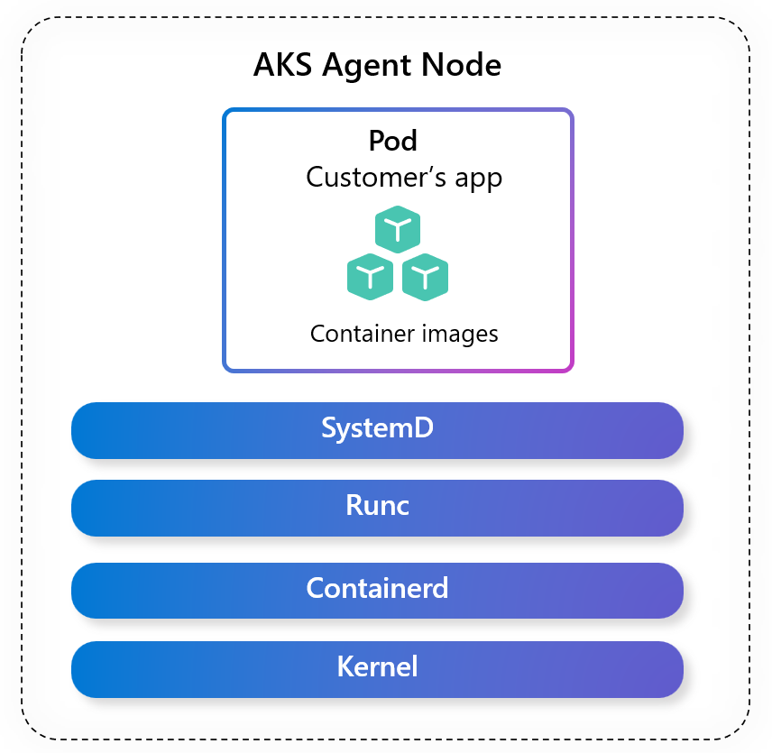
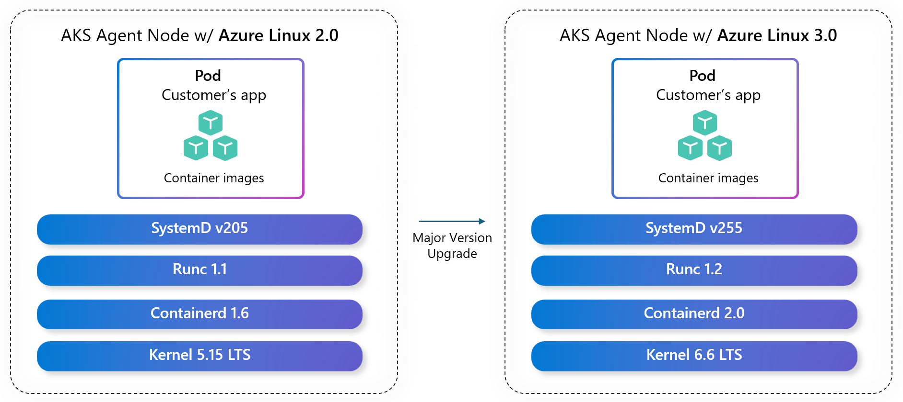

### Introduction

Upgrading the operating system version on your AKS nodes is a critical step that can impact workload security, stability, and performance. In this blog, we’ll share key recommendations to help you plan and execute major OS version upgrades smoothly and confidently on AKS.

<!-- truncate -->

### Why Upgrading OS versions matters

In Azure Kubernetes Service (AKS), the operating system (OS) serves as the foundational layer for every node in your cluster. It governs how containers are executed, how resources are managed, and how workloads interact with the underlying infrastructure.



_Figure 1: AKS Linux Node Image including Operating system, container runtime, and core Kubernetes node components._

Keeping your OS version up to date is essential for maintaining security, performance, and compatibility. There are two kinds of OS upgrades that can be made to keep you on the latest OS version: 

1.	**Minor Version Upgrade or Patch Upgrade**: Upgrading your node image version so that you have the latest release within an OS version. For example, upgrading your Ubuntu 22.04 node image from the *202509.11.0* release to the *202509.18.0* release. When you perform a minor version or patch upgrade you benefit from the latest OS-level security patches, resolved bugs, and ensure alignment with AKS lifecycle guarantees.
2.	**Major Version Upgrade**: Upgrading your OS version when a new major version becomes available. For example, upgrading your OS version from *Azure Linux 2.0* to *Azure Linux 3.0*. When you perform a major OS version upgrade you benefit from new package versions, performance improvements, security enhancements, improved developer tooling, and more.



_Figure 2: Major version upgrade from Azure Linux 2.0 to Azure Linux 3.0,_

This blog will focus on the second goal, upgrading from one major OS version to the next. For more information on minor version or patch upgrades, see [AKS documentation](https://learn.microsoft.com/en-us/azure/aks/auto-upgrade-node-os-image?tabs=azure-cli). 

Failing to update your clusters can in turn lead to risks and issues with your cluster; CVEs may remain unpatched, workloads may experience compatibility issues, and you may encounter gaps in support when your OS version reaches end-of-life—preventing scaling, patching, or access to critical updates.

### Addressing Common OS Upgrade Challenges 

Upgrading your OS version on AKS to the latest version introduces several potential risks to be aware of. To address these challenges and ease pain points across a variety of upgrade scenarios AKS recommends the following:

**Scenario 1**: Testing New OS Versions Safely
- **Challenge**: When a new OS version becomes available, it’s important to validate your workloads before rolling it out broadly. Upgrading without testing can lead to unexpected issues such as workload disruption or performance regressions.
- **Recommendation**: When a new OS version is released, AKS will add a new OS Sku enum in public preview. To begin testing this new version, you can update your existing node pools.
- **Example**: I’m using the default `Ubuntu` OS Sku for all of my node pools. The `Ubuntu2404` OS Sku enum was just released by AKS in public preview. I’ll update my existing node pools by running the following command: 

```cli
az aks nodepool update \
    --resource-group $RESOURCE_GROUP \
    --cluster-name $CLUSTER_NAME \
    --os-type Linux \
    --os-sku Ubuntu2404 \
    --name $NODE_POOL_NAME \
```
My node pool is now using the new OS version! I can continue to upgrade additional node pools until I feel confident that my workloads will run on the new OS version without issues.

**Scenario 2**: Minimizing Workload Disruption
- **Challenge**: Upgrading your OS version can also introduce changes that might impact existing workloads. Without a straightforward rollback mechanism, customers may find themselves in a regressed state if compatibility issues arise. For example, when AKS customers upgraded to Ubuntu 22.04 on Kubernetes 1.25, the switch from cgroup v1 to cgroup v2 caused [unexpected memory pressure and increased usage](https://learn.microsoft.com/en-us/troubleshoot/azure/azure-kubernetes/create-upgrade-delete/aks-memory-saturation-after-upgrade) in Java, Node.js, and .NET applications. If a rollback option had been available, customers could have quickly reverted to a stable OS version, minimizing disruption and restoring expected performance.
- **Recommendation**: If you’re using the default OS Skus (`Ubuntu` or `AzureLinux`), a Kubernetes version upgrade may introduce a new OS version. If this causes issues for your workload, you can now rollback your OS version by performing a node pool update command. As a part of the node pool update, your nodes will reimage to use the latest node image for the new OS version.
- **Example**: I’m using the default `Ubuntu` OS Sku for all of my node pools. When I upgraded to Kubernetes version 1.35, my OS version automatically upgraded to Ubuntu 24.04. This caused my workloads to break! However, I can update my existing node pools to roll back to Ubuntu 22.04 by running the following command:
  
```cli
az aks nodepool update \
    --resource-group $RESOURCE_GROUP \
    --cluster-name $CLUSTER_NAME \
    --os-type Linux \
    --os-sku Ubuntu2204 \
    --name $NODE_POOL_NAME \
```
My node pool is now back to using Ubuntu 22.04, and the issue I was having is resolved. While I can’t remain on Ubuntu 22.04 forever, this rollback functionality gives me the time that I need to update my workload so that I can upgrade to Ubuntu 24.04 safely. 

**Scenario 3**: OS Upgrades while using AKS Long Term Support (LTS) 
- **Challenge**: At times [AKS LTS](https://blog.aks.azure.com/2025/07/25/aks-lts-announcement) lifecycles and OS version lifecycles are misaligned. For example, Azure Linux 2.0 went End of Life November 30, 2025 alongside AKS version 1.31 standard support. However, AKS versions 1.28 through 1.31 LTS support now go EoL after [Azure Linux 2.0 support ends](https://techcommunity.microsoft.com/blog/linuxandopensourceblog/azure-linux-now-supports-aks-long-term-support-lts-starting-with-kubernetes-v1-2/4424826). To maintain promised support and security coverage, customers needed a path to transition to a supported OS version for the remainder of the Kubernetes LTS period.
- **Recommendation**: If you’re using [LTS](https://learn.microsoft.com/en-us/azure/aks/long-term-support), you’ll typically remain on a single Kubernetes version for an extended period of time. This means that if you are using the default OS Skus (`Ubuntu` or `AzureLinux`), you will not encounter a Kubernetes version upgrade that introduces a new OS version. You may want to upgrade your OS version manually because of support or security risks while using Long Term Support. As a part of the node pool update, your nodes will reimage to use the latest node image for the new OS version.
- **Example**: I’m using the default `AzureLinux` OS Sku for all of my LTS node pools running on Kubernetes version 1.28, which defaults to Azure Linux 2.0. In November 2025, Azure Linux 2.0 will no longer be supported. I’m concerned about the lack of security updates and therefore I want to upgrade my OS version to Azure Linux 3.0. I can make this OS upgrade without upgrading my Kubernetes version by performing the following node pool update command:
  
```cli
az aks nodepool update \
    --resource-group $RESOURCE_GROUP \
    --cluster-name $CLUSTER_NAME \
    --os-type Linux \
    --os-sku AzureLinux3 \
    --name $NODE_POOL_NAME \
```
While remaining on my LTS Kubernetes version, I successfully updated my OS version!

**Scenario 4**: OS Upgrades under Operational Constraints
- **Challenge**: Planning an OS upgrade often requires significant time and coordination. Teams must ensure critical pods remain available, configure adequate Pod Disruption Budgets (PDBs), schedule maintenance windows, notify developers, and set up alerts—all of which add operational overhead.
- **Recommendation**: To minimize operational overhead during upgrades, adopt a well-tuned upgrade strategy that combines key settings for performance and stability:
  - [Planned maintenance window](https://learn.microsoft.com/en-us/azure/aks/planned-maintenance?tabs=azure-cli): Schedule auto-upgrade during low-traffic periods —ideally at least four hours.
  - [Max surge](https://learn.microsoft.com/en-us/azure/aks/upgrade-aks-cluster?tabs=azure-cli#customize-node-surge-upgrade): Increase surge nodes to speed up upgrades, but balance against workload disruption. AKS recommends 33% for production.
  - [Max unavailable](https://learn.microsoft.com/en-us/azure/aks/upgrade-aks-cluster?tabs=azure-cli#customize-unavailable-nodes-during-upgrade): Use when capacity is limited.
  - [Pod disruption budget](https://kubernetes.io/docs/tasks/run-application/configure-pdb/): Define limits on simultaneous pod disruptions. Validate for your service.
  - [Node drain timeout](https://learn.microsoft.com/en-us/azure/aks/upgrade-aks-cluster?tabs=azure-cli#set-node-drain-timeout-value): Set the eviction wait time for pods (default: 30 minutes).
  - [Node soak time](https://learn.microsoft.com/en-us/azure/aks/upgrade-aks-cluster?tabs=azure-cli#set-node-soak-time-value): Stagger node upgrades to reduce downtime (default: 0 minutes).
 
These settings help balance speed and stability, ensuring workloads remain available while upgrades complete successfully. In addition, AKS performs pre-upgrade [validations](https://learn.microsoft.com/en-us/azure/aks/upgrade-cluster?tabs=azure-cli#validations-used-in-the-upgrade-process)—such as checking for API deprecations, PDB misconfigurations, and resource quotas—to proactively detect issues and reduce the risk of upgrade failures. 

### General Advice: Selecting the correct OS SKU
Each node image on AKS corresponds to an OS version, which you can specify using the OS Sku parameter. When deciding between which OS Sku to use for a given distribution, AKS recommends the following:
- **Default**: Use default if you want an easy, no touch experience. AKS will automatically update `Ubuntu` and `AzureLinux` OS Skus to the latest recommended OS version.
- **Version Enums**: Use versioned enums, for example `Ubuntu2404` and `AzureLinux3` if you want increased control.
Find the full list of supported OS versions on AKS [here](https://learn.microsoft.com/en-us/azure/aks/upgrade-os-version?tabs=testing-a-new-os-version%2Croll-back-your-os-version#supported-os-versions).

### Considerations 
When selecting an OS upgrade strategy for your organization, consider the following priorities:
1.	**Support**: Each OS version has a support lifecycle. During standard support, customers will receive updates, security patches, and maintenance. If your priority is to stay supported and avoid the additional costs of extended support, using the default OS options on AKS would ensure that you are always on a supported OS version.
2.	**Security**: After the standard support period, OS versions are no longer supported, leaving you vulnerable to security risks unless extended support is purchased. If your priority is to reduce security risk, using the default OS options on AKS would ensure that you are always on an OS version that receives security updates.
3.	**Stability**: When OS versions are released, there are changes and updates that can impact existing workloads. If your priority is to maintain stability and reduce workload breakage, using the versioned enums will allow you to test your workload with updates before upgrading your clusters.
4.	**LTS**: For each Kubernetes version, AKS offers an LTS option that extends the support window by an additional 12 months. If your priority is to maintain extended support, using versioned enums allows you to upgrade to a supported OS version while continuing to run the same Kubernetes version throughout the extended support period.

### Limitations
- Versioned enums are not supported indefinitely, they require manual upgrades to continue to upgrade your Kubernetes version.
- Versioned enums are not supported for some features, for example Ubuntu 24.04 does not yet support FIPS. See [docs](https://learn.microsoft.com/en-us/azure/aks/upgrade-os-version) for feature limitations.

### Future Plans
As new OS Skus and OS versions are released in the future, AKS will include versioned enums so that customers have the flexibility to choose whichever OS upgrade strategy is best suited for their organization. 

For example, when Azure Linux releases support for the next major version, Azure Linux 4.0, AKS will add a new version enum `AzureLinux4`. 

This will also extend to net new OS Skus on AKS, such as [Azure Linux with OS Guard](https://techcommunity.microsoft.com/blog/linuxandopensourceblog/azure-linux-with-os-guard-immutable-container-host-with-code-integrity-and-open-/4437473), that will have both a default OS Sku `AzureLinuxOSGuard`, as well as a versiond enum  `AzureLinux3OSGuard`.

### Questions?
Connect with the AKS and Azure Linux teams and communities through our [GitHub discussions](https://github.com/Azure/AKS/discussions) or share your [feedback and suggestions](https://github.com/Azure/AKS/issues).


