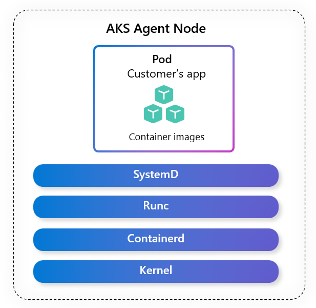

### Introduction

Upgrading the operating system version on your AKS nodes is a critical step that can impact workload security, stability, and performance. In this blog, we’ll share key recommendations to help you plan and execute major OS version upgrades smoothly and confidently on AKS.

<!-- truncate -->

### Why Upgrading OS versions matters

In Azure Kubernetes Service (AKS), the operating system (OS) serves as the foundational layer for every node in your cluster. It governs how containers are executed, how resources are managed, and how workloads interact with the underlying infrastructure.

_Figure 1: AKS Linux Node Image including Operating system, container runtime, and core Kubernetes node components._
