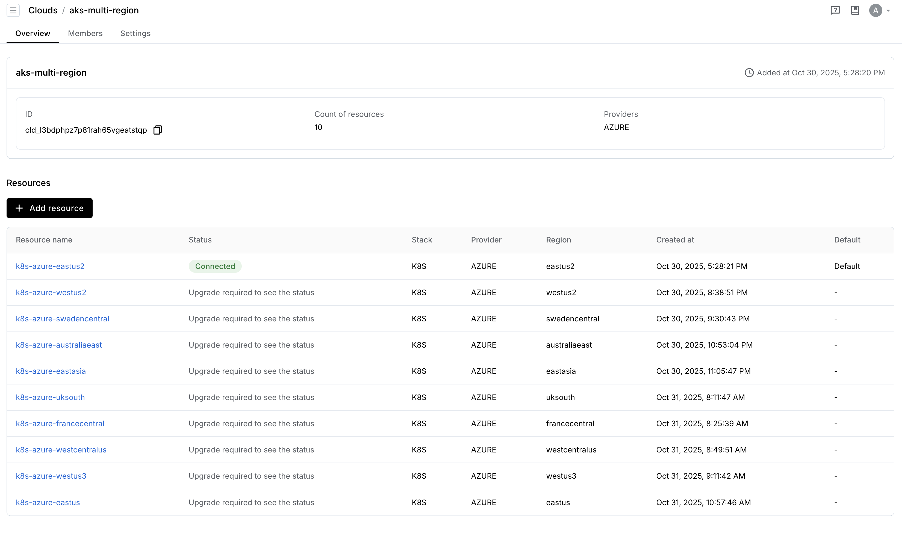

In modern machine learning and data processing workflows, workloads can range from short-lived experimental jobs to massive, long-running production training runs. On one end of the spectrum, teams frequently spin up small to medium Ray jobs for rapid experimentation—these jobs are lightweight, bursty, and often completed within minutes or hours. On the other end, large-scale production workloads may involve launching a single giant Ray cluster that runs for days or weeks, consuming hundreds or even thousands of GPU or CPU nodes on dedicated AKS clusters. Balancing the scalability, efficiency, and cost for both patterns requires careful design of how Ray interacts with Kubernetes and how AKS manages dynamic cluster resources.

To address the dual challenges of handling frequent small-scale experiments and large, resource-intensive production workloads, a multi-cluster and multi-region strategy can be highly effective. By dispatching many small Ray workloads across multiple AKS clusters—even spanning regions or cloud providers—teams can mitigate GPU scarcity, improve workload distribution, and take advantage of regional price and capacity differences for optimal cost-performance. Meanwhile, maintaining a single, well-prepared AKS cluster dedicated to large or “hot spot” jobs ensures stability and predictable performance for mission-critical training runs. This hybrid approach balances agility and scale—enabling fast iteration for experimentation while guaranteeing reliability and throughput for production workloads.

## Scaling with Multiple Clusters

(Stitch multiple AKS clusters across region with Anyscale)

(Stitch AKS, EKS, GKE clusters with Anyscale)

## Scaling in Single Cluster

(Monitor and tune control plane: kuberay/anyscale-operator, kube-controller-manager)

(Monitor and tune service discovery: coredns, kube-proxy)