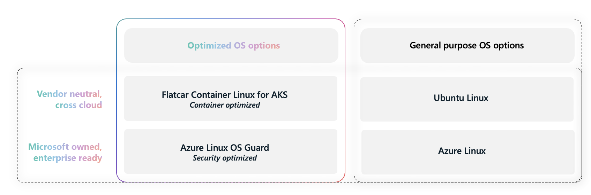

Selecting an operating system for your Kubernetes deployments may appear straightforward; however, this decision can significantly influence both security and operational complexity. In this blog, we’ll share key recommendations to help you select a container optimized OS for your AKS deployments.

<!-- truncate -->

## Selecting a Linux OS option

AKS has just released support for two new Linux OS options:

- [Azure Linux OS Guard (preview)](https://aka.ms/aks/azure-linux-os-guard) is Microsoft-created and optimized for Azure. OS Guard is built on top of Azure Linux with specialized configuration to support containerized workloads with security optimizations.
- [Flatcar Container Linux for AKS (preview)](https://aka.ms/aks/flatcar) is a CNCF-governed, vendor-neutral, container-optimized immutable OS, best suited for running on multi-cloud and on-prem environments.

As contributors to both projects, we understand the distinct customer needs each solution addresses. Customers running containerized workloads across multiple clouds and seeking consistency during critical OS updates typically choose Ubuntu or Flatcar Container Linux. Security-focused enterprises operating primarily on Azure and prioritizing a unified support experience opt for Azure Linux or OS Guard. Both approaches are valid, distinct, and fully supported by Microsoft.

## What's different about optimized Linux OS options?

The main optimization in OS options like [Azure Linux OS Guard](https://aka.ms/aks/azure-linux-os-guard) and [Flatcar Container Linux](https://aka.ms/aks/flatcar) is their immutability.

An immutable operating system refers to a type of operating system that cannot be modified at runtime. All OS binaries, libraries and static configuration are read-only, while the bit-for-bit integrity is often cryptographically protected. These special purpose operating systems usually come without any kind of package management or other traditional means of altering the OS, shipping as self-contained images. User workloads run in isolated environments like containers, sandboxed from the OS.

While these are certainly limiting factors compared to general purpose operating systems, immutable systems perform unparalleled in security and compliance:

- Binaries cannot be changed, eliminating whole classes of sandbox escapes and exploits.
- Special purpose operating systems include only what’s absolutely necessary, minimizing the attack surface.
- As individual parts of the OS cannot be swapped in or out, any given OS release always corresponds to the full version-set of all software and libraries included with that release. This significantly eases software inventory management and makes version drift impossible.

What’s more, immutable operating systems can bring similar benefits to node configuration. By applying node configuration at provisioning time only, there is no configuration drift. To phrase it differently, a node does not hold _state_, its state is defined by configuration passed during provisioning – making node provisioning reproducible.

While immutability is the core difference, there's typically more security features offered with Kubernetes optimized OS options:

| | [Azure Linux OS Guard](https://aka.ms/aks/azure-linux-os-guard) | [Flatcar Container Linux for AKS](https://aka.ms/aks/flatcar) | General purpose Linux OS |
|--|--|--|--|
| Filesystem | Immutable (read-only) | Immutable (read-only) | Writable (read-write) |
| Focus on | Trusted code execution backed by IPE (Integrity Policy Enforcement) | Multi-cloud, on-prem, Adaptability and sovereignty  | Extensibility, flexibility, and choice |
| Mandatory Access Control | SELinux | SELinux | AppArmor|
| Secure Boot | Supported by default with UKI (Unified Kernel Image) | Not yet supported with AKS | Supported with certain VM sizes |

## Recommendations for Linux OS on AKS

When deciding between which Linux OS options to use, we recommend the following:

- Use [**Flatcar Container Linux for AKS (preview)**](https://aka.ms/aks/flatcar) if you're looking for a vendor neutral, community stewarded immutable OS with cross-cloud support.
- Use [**Azure Linux OS Guard (preview)**](https://aka.ms/aks/azure-linux-os-guard) if you're looking for an immutable OS that is Microsoft-created and optimized for Azure.
- Use [Ubuntu](https://aka.ms/aks/supported-ubuntu-versions) if you're looking for a portable, general purpose OS with cross-cloud support.
- Use [Azure Linux](https://aka.ms/aks/use-azure-linux) if you're looking for a general purpose OS that is Microsoft-created and optimized for Azure.

_Figure 1: Comparison across OS options supported on AKS, including Flatcar Container Linux for AKS, Azure Linux OS Guard, Ubuntu, and Azure Linux._

## Migration to an optimized Linux OS option

If you'd like to migrate to [Azure Linux OS Guard (preview)](https://aka.ms/aks/azure-linux-os-guard) or [Flatcar Container Linux for AKS (preview)](https://aka.ms/aks/flatcar), you'll want to keep in mind the following limitations and recommendations.

Immutable operating systems, by implication, make large parts of a node’s file system read-only. While Kubernetes workloads in general should not break abstraction and interfere with a node’s OS, the reality is often different. Care must be taken when migrating from general purpose operating systems. We have observed workloads’ expectations not being uniformly upheld on immutable systems particularly with, but not limited to:

- Any containers that require access to the host filesystem (e.g. via a /host/... mount), in particular init containers and daemonsets.
- Containers required to run in host PID and / or Networking namespace

Some AKS features may not be supported when using [Azure Linux OS Guard (preview)](https://aka.ms/aks/azure-linux-os-guard) or [Flatcar Container Linux for AKS (preview)](https://aka.ms/aks/flatcar). If you are using a feature that is not supported by the new OS, you will not be able to migrate your existing clusters/node pools. Ensure you review the limitations called out in their respective pages thoroughly.

When planning to migrate to an optimized OS option, we recommend the following:

- Ensure your workloads configure and run successfully on the new OS in test/dev before migrating any production clusters.
- If you'd like to migrate existing Linux clusters or node pools to [Azure Linux OS Guard (preview)](https://aka.ms/aks/azure-linux-os-guard), you can use [in-place OS Sku migration](https://learn.microsoft.com/azure/azure-linux/tutorial-azure-linux-os-guard-migration). There are pre-requisites and limitations to this process, see documentation for details.
- If you'd like to migrate to [Flatcar Container Linux for AKS (preview)](https://aka.ms/aks/flatcar), you'll need to create new clusters and/or node pools and migrate existing workloads. [Flatcar](https://aka.ms/aks/flatcar) is available on all AKS supported Kubernetes versions.

## Community Stewardship

AKS is built on community stewarded open source projects. Our teams maintain [Azure Linux OS Guard](https://aka.ms/aks/azure-linux-os-guard), contribute significantly to [Flatcar Container Linux](https://aka.ms/aks/flatcar), and actively collaborate with the Immutable Linux community, the UAPI group, and other open source initiatives. Our continued engagement with projects like Flatcar improves the ecosystem for everybody and also empowers our users and customers to actively engage and participate in both development as well as project stewardship – driving the technology as well as determining the course and direction of these projects.

Join us in the Flatcar Container Linux open source project, which is community-driven and governed by the Cloud Native Computing Foundation. Get involved, contribute, and help shape the future of Flatcar Container Linux:

- [Flatcar's participation how-to](https://github.com/flatcar/Flatcar?tab=readme-ov-file#participate-and-contribute)
- [Chat with Flatcar contributors over at Matrix](https://app.element.io/?#/room/#flatcar:matrix.org)

## Roadmap

We’re excited to continue to extend AKS support for these optimized OS options. Our long-term goals include:

- In-place updates of OS and Kubernetes: faster, safer, less resource constraining
- Trusted and Confidential computing, locked-down execution through code signing
- Making signed execution available to everyone, by means of multiple trust levels and the option for users to use their own signing keys for their workloads

As we build these new features, we will be excited to share all these achievements with the broader Linux and Kubernetes ecosystem by contributing back and by making building blocks available.

To follow along with our backlog and progress, please see our public roadmaps:

- [Flatcar Container Linux roadmap](https://github.com/orgs/flatcar/projects/7/views/9)
- [AKS Public Roadmap](https://github.com/orgs/Azure/projects/685)
- [Azure Linux roadmap](https://github.com/orgs/microsoft/projects/970)

## Questions?

Connect with the AKS and Azure Linux teams and communities through our [GitHub discussions](https://github.com/Azure/AKS/discussions) or share your [feedback and suggestions](https://github.com/Azure/AKS/issues).
