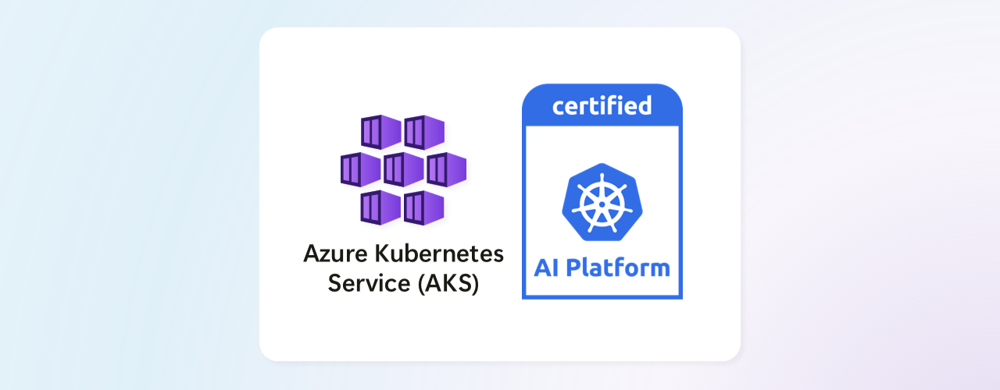

As organizations increasingly move AI workloads into production, they need consistent and interoperable infrastructure they can rely on. The Cloud Native Computing Foundation (CNCF) launched the **Kubernetes AI Conformance Program** to address this need by creating open, community-defined standards for running AI workloads on Kubernetes. See [CNCF Kubernetes AI Conformance Announcement](https://www.cncf.io/announcements/2025/11/11/cncf-launches-certified-kubernetes-ai-conformance-program-to-standardize-ai-workloads-on-kubernetes/) at KubeCon North America 2025.

Azure Kubernetes Service (AKS) is proud to be among the first platforms certified for Kubernetes AI Conformance, demonstrating our commitment to providing customers with a verified, standardized platform for running AI workloads.



<!-- truncate -->

## What is the Kubernetes AI Conformance Program?

The [Kubernetes AI Conformance Program](https://github.com/cncf/k8s-ai-conformance) defines a standard set of capabilities, APIs, and configurations that a Kubernetes cluster must offer to reliably and efficiently run AI and ML workloads. Building on CNCF's successful [Certified Kubernetes Conformance Program](https://www.cncf.io/certification/software-conformance/), which brought together more than 100 certified distributions and platforms, this new initiative applies the same proven model to AI infrastructure.

The program is developed in the open by the Kubernetes community.

## Why AI Conformance matters

Running AI workloads on Kubernetes introduces unique challenges. Teams often struggle with GPU driver compatibility, specialized scheduling requirements for distributed training, and the complexity of exposing inference endpoints at scale. Without a common baseline, organizations risk building on fragmented, vendor-specific implementations that limit flexibility and portability.

According to [Linux Foundation Research on Sovereign AI](https://www.linuxfoundation.org/hubfs/Research%20Reports/lfr_sovereign_ai_090525a.pdf), 82% of organizations are already building custom AI solutions, and 58% use Kubernetes to support those workloads. With 90% of enterprises identifying open-source software as critical to their AI strategies, the risk of fragmentation and inconsistent performance is rising. The Kubernetes AI Conformance Program responds directly to this need.

The AI Conformance Program addresses these challenges by establishing a verified set of capabilities that every conformant platform must support. When you deploy on AKS, a certified AI-conformant platform, you benefit from:

- **Predictable scaling**: Your AI workloads scale consistently using standardized APIs and autoscaling behaviors
- **Hardware optimization**: GPU and accelerator resources are managed through proven Kubernetes primitives, maximizing utilization
- **Workload mobility**: Applications built for one conformant platform work on any other, reducing vendor lock-in
- **Ecosystem compatibility**: Popular ML frameworks, operators, and tools function reliably because they target a known, tested baseline

## Key requirements for AI Conformance

The Kubernetes AI Conformance program maintains a versioned specification of requirements for each Kubernetes release starting with v1.33. Each requirement goes through a graduation process, starting as a SHOULD recommendation and may eventually become a MUST for certification.

Here are the [requirements for Kubernetes v1.34](https://github.com/cncf/k8s-ai-conformance/blob/main/docs/AIConformance-1.34.yaml) and how AKS meets each requirement:

### Accelerators

#### Dynamic Resource Allocation (DRA)

Traditional resource requests in Kubernetes use simple numeric counts (for example, `nvidia.com/gpu: 1`). DRA introduces a more flexible model where workloads can specify device characteristics, request specific GPU models, or express preferences about memory and compute capabilities. DRA APIs are enabled by default in Kubernetes 1.34 on AKS. For a deep dive into how DRA works and how to use it with GPU drivers, see our blog post on [DRA: Devices and Drivers on Kubernetes](/2025/11/17/dra-devices-and-drivers-on-kubernetes).

### Networking

#### Gateway API for AI inference

Inference services often need sophisticated traffic routing: sending a percentage of requests to a new model version, routing based on request headers (including OpenAI protocol headers), or implementing canary deployments. The Kubernetes Gateway API introduces improved routing capabilities for a more flexible architecture for traffic management. AKS supports Gateway API through both the [Istio-based service mesh add-on](https://learn.microsoft.com/azure/aks/istio-gateway-api) and [Application Gateway for Containers](https://aka.ms/agc/addon).

### Scheduling and orchestration

#### Gang scheduling

Distributed training jobs often require multiple pods to start simultaneously. If only some pods in a training job get scheduled, the others wait indefinitely, wasting resources. Gang scheduling solves this by treating a group of pods as a single unit: either all pods get scheduled together, or none do. You can run [Kueue on AKS](https://learn.microsoft.com/azure/aks/kueue-overview) to enable gang scheduling. To get started, refer to the guidance on [deploying batch jobs with Kueue](https://learn.microsoft.com/azure/aks/deploy-batch-jobs-with-kueue).

#### Cluster autoscaling

GPU nodes are expensive. The cluster autoscaler must intelligently provision GPU nodes when training or inference pods are pending, and scale them down during idle periods. On AKS, you can combine the [cluster autoscaler](https://learn.microsoft.com/azure/aks/cluster-autoscaler) with [KEDA and NVIDIA DCGM metrics](https://learn.microsoft.com/azure/aks/autoscale-gpu-workloads-with-keda) to automatically scale GPU node pools based on real-time utilization. You can configure GPU node pools to [scale down to zero](https://learn.microsoft.com/azure/aks/autoscale-gpu-workloads-with-keda#scale-down-the-gpu-node-pool) when no workloads are running, minimizing costs.

#### Pod autoscaling

Inference workloads need to scale pod replicas based on demand. The Horizontal Pod Autoscaler (HPA) must work correctly with GPU-enabled pods and support custom metrics relevant to AI workloads. On AKS, you can use [KEDA with NVIDIA DCGM metrics](https://learn.microsoft.com/azure/aks/autoscale-gpu-workloads-with-keda) to scale pods based on GPU metrics like `DCGM_FI_DEV_GPU_UTIL` (GPU utilization percentage). This enables scaling decisions based on actual GPU usage rather than just CPU or memory.

### Observability

#### Accelerator performance metrics

Observability is critical for AI workloads. Platforms must expose GPU utilization, memory consumption, temperature, power draw, and other accelerator metrics through standard endpoints. You can deploy the [NVIDIA DCGM exporter](https://learn.microsoft.com/azure/aks/monitor-gpu-metrics) on AKS to expose GPU metrics in Prometheus format, and use [GPU health monitoring](https://learn.microsoft.com/azure/aks/gpu-health-monitoring) for proactive issue detection with Node Problem Detector (NPD) in your AI pipelines.

#### AI service metrics

Platforms must provide a monitoring system capable of discovering and collecting metrics from workloads that expose them in standard formats like Prometheus. AKS integrates with [Azure Monitor for containers](https://learn.microsoft.com/azure/azure-monitor/containers/kubernetes-monitoring-enable) and provides [Container Insights GPU monitoring](https://learn.microsoft.com/azure/azure-monitor/containers/container-insights-gpu-monitoring) for observability needs in your environment. For AI inference workloads, you can [monitor and visualize vLLM inference metrics](https://learn.microsoft.com/azure/aks/ai-toolchain-operator-monitoring) with Azure Managed Prometheus and Azure Managed Grafana when using the AI toolchain operator (KAITO) add-on.

### Security

#### Secure accelerator access

Access to accelerators from within containers must be properly isolated and mediated by the Kubernetes resource management framework (device plugin or DRA) and container runtime, preventing unauthorized access or interference between workloads. See the [AKS secure accelerator access evidence](https://github.com/Azure/AKS/tree/master/ai-conformance/v1.34/secure_accelerator_access) for implementation details.

### Operators

#### AI operator support

Modern AI platforms rely on Kubernetes operators to manage complex resources like training jobs, model servers, and distributed training coordinators. AKS supports the [AI Toolchain Operator (KAITO)](https://learn.microsoft.com/azure/aks/ai-toolchain-operator) to run inferencing, fine-tuning, and retrieval augmented generation (RAG). You can also install and run operators with custom resource definitions, such as [Ray on AKS](https://learn.microsoft.com/azure/aks/ray-overview).

## Creating an AI-conformant AKS cluster

To create an AI-conformant AKS cluster, be sure to choose a certified Kubernetes version with the appropriate features enabled.

### Step 1. Create an AKS cluster

AKS achieved AI Conformance certification starting with Kubernetes 1.34. Create an AKS cluster running Kubernetes 1.34 or later:

```bash
az aks create \
  --resource-group <resource-group> \
  --name <cluster-name> \
  --enable-azure-monitor-metrics \
  --kubernetes-version 1.34.0
```

### Step 2. Add a GPU node pool

For GPU-accelerated workloads, add a [fully managed GPU node pool (preview)](https://learn.microsoft.com/azure/aks/aks-managed-gpu-nodes) with [GPU-enabled VMs](https://learn.microsoft.com/azure/virtual-machines/sizes/overview#gpu-accelerated). For a select set of NVIDIA GPU SKUs, AKS automatically installs the GPU driver, device plugin, and DCGM metrics exporter.

First, register the feature flag:

```bash
az feature register --namespace Microsoft.ContainerService --name ManagedGPUExperiencePreview
```

Then add the GPU node pool with the `EnableManagedGPUExperience` tag:

```bash
az aks nodepool add \
  --resource-group <resource-group> \
  --cluster-name <cluster-name> \
  --name gpunp \
  --node-count 1 \
  --node-vm-size Standard_NC40ads_H100_v5 \
  --node-taints sku=gpu:NoSchedule \
  --enable-cluster-autoscaler \
  --min-count 1 \
  --max-count 3 \
  --tags EnableManagedGPUExperience=true
```

### Step 3. Enable the Istio service mesh with Gateway API (optional)

If your AI workloads require advanced traffic management capabilities, you can use the [Istio service mesh add-on with the Gateway API (preview)](https://learn.microsoft.com/azure/aks/istio-gateway-api).

First, install the Azure CLI preview extension and register the feature flag:

```bash
# Install the aks-preview extension
az extension add --name aks-preview

# Register the Gateway API feature flag
az feature register --namespace "Microsoft.ContainerService" --name "ManagedGatewayAPIPreview"
```

Then enable the Istio service mesh and Gateway API on your cluster:

```bash
az aks mesh enable \
  --resource-group <resource-group> \
  --name <cluster-name>

az aks update \
  --resource-group <resource-group> \
  --name <cluster-name> \
  --enable-gateway-api
```

### Step 4. Enable Prometheus metrics (optional)

If you need to collect metrics about your applications and infrastructure, you can optionally install the metrics add-on that scrapes Prometheus metrics.

```bash
az aks update \
  --resource-group <resource-group> \
  --name <cluster-name> \
  --enable-azure-monitor-metrics
```

Your cluster now meets the requirements for Kubernetes AI Conformance. You can now optionally [install and run Kueue](https://learn.microsoft.com/azure/aks/kueue-overview) to enable gang scheduling and [deploy batch jobs](https://learn.microsoft.com/azure/aks/deploy-batch-jobs-with-kueue).

## Conclusion

The Kubernetes AI Conformance Program represents an important step forward for the AI ecosystem, aligning the community around shared standards that make deploying AI at scale more consistent and reliable. By using an AI-conformant platform like AKS, you can build AI applications that are production-ready, portable, and efficient without reinventing infrastructure for every deployment. For more information about the program and how to get involved, check out the [CNCF Kubernetes AI Conformance Repository](https://github.com/cncf/k8s-ai-conformance).

AKS's certification demonstrates Microsoft's commitment to open standards and ensures that your AI workloads can run reliably on a verified platform. Start building your AI-conformant AKS cluster today and take advantage of the growing ecosystem of compatible tools and frameworks.

## Resources

- [CNCF Kubernetes AI Conformance Repository](https://github.com/cncf/k8s-ai-conformance)
- [AKS AI/ML Documentation](https://learn.microsoft.com/azure/aks/ai-ml-overview)
- [CNCF Kubernetes AI Conformance Announcement](https://www.cncf.io/announcements/2025/11/11/cncf-launches-certified-kubernetes-ai-conformance-program-to-standardize-ai-workloads-on-kubernetes/)
