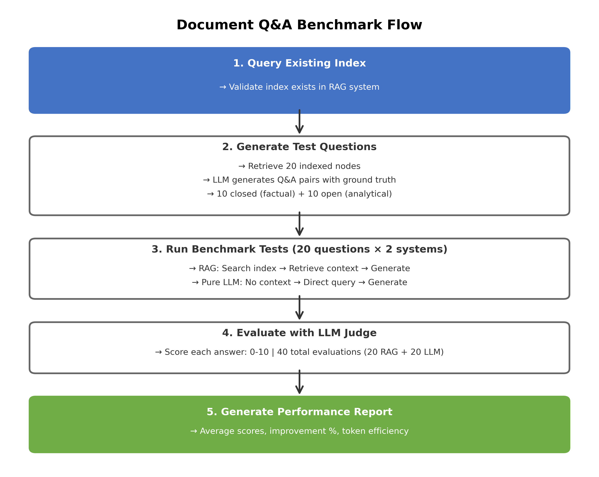
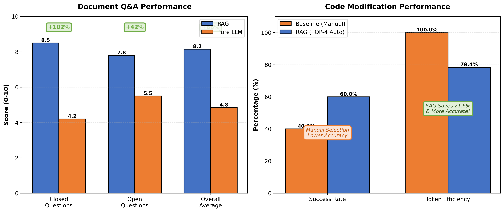
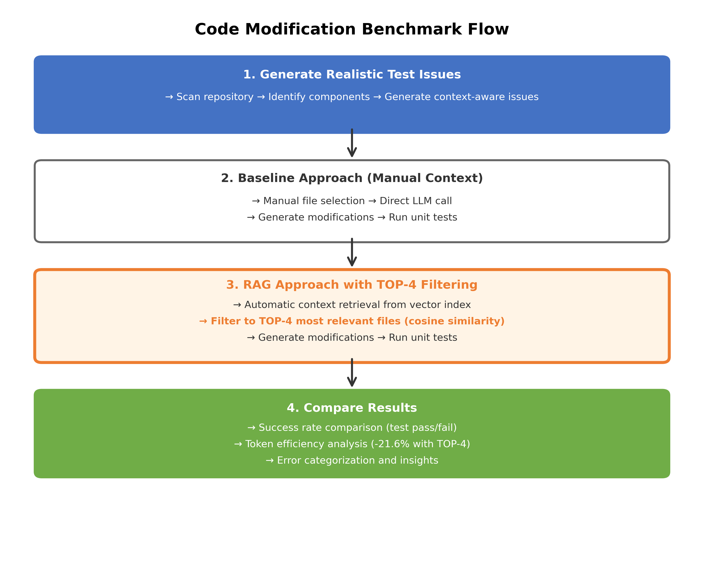
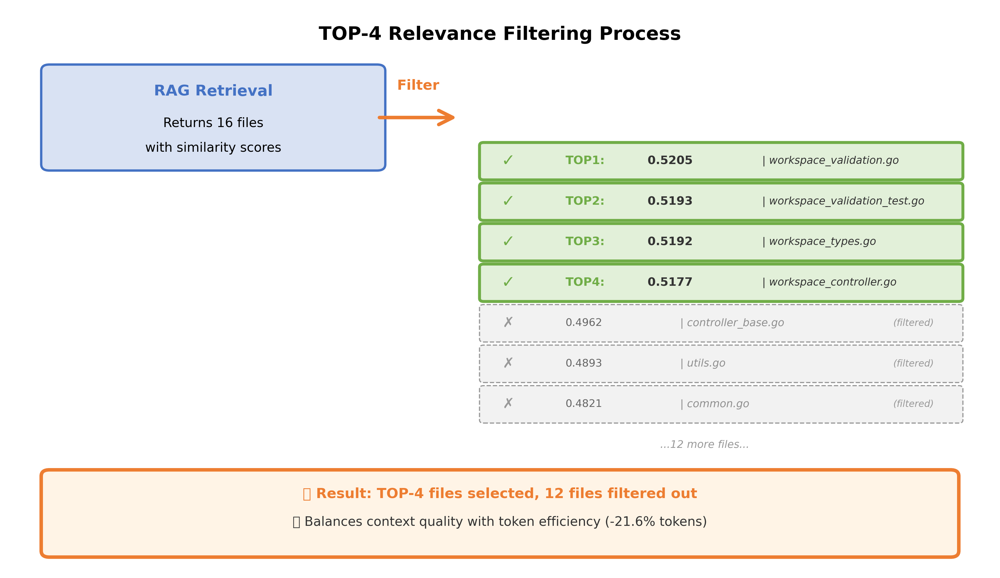

Retrieval-Augmented Generation (RAG) has emerged as a powerful technique for enhancing LLM accuracy by grounding responses in relevant context. But how much does RAG actually improve performance? We developed comprehensive benchmarking tools to quantify RAG effectiveness across two critical use cases: document question answering and code issue resolution.

In this post, we share our methodology, results, and insights from benchmarking [KAITO's RAG service](https://kaito-project.github.io/kaito/docs/rag/) on AKS. The findings reveal where RAG excels and where challenges remain.

<!-- truncate -->

## Why Benchmark RAG?

When evaluating RAG systems, subjective impressions aren't enough. You need quantitative metrics to answer critical questions:

- **How much does RAG improve answer quality?** Traditional LLMs rely solely on pre-trained knowledge, which can be outdated or incomplete for domain-specific queries.
- **Is RAG cost-effective?** Token usage directly impacts operational costs at scale.
- **Where does RAG struggle?** Understanding failure modes guides system improvements.

To address these questions, we built two specialized benchmarking suites that test RAG in fundamentally different scenarios.

## Two Distinct Testing Scenarios

RAG performance varies significantly based on the task. We designed benchmarks for two key use cases:

| Scenario | Focus | Validation Method | Key Metric |
|----------|-------|-------------------|------------|
| **Document Q&A** | Factual recall and comprehension | LLM-as-judge scoring | Answer accuracy (0-10) |
| **Code Modification** | Practical implementation changes | Unit test execution | Success rate (pass/fail) |

Let's dive into each benchmark and its results.

---

## Document Q&A Benchmark

### Methodology

The document benchmark evaluates how well RAG answers questions based on indexed content:

1. **Index Documents**: Pre-index your documents (PDFs, reports, manuals) in the RAG system
2. **Generate Test Questions**: Automatically create 20 questions from indexed content:
   - 10 closed questions (factual, specific answers)
   - 10 open questions (analysis, comprehension)
3. **Compare Responses**: Both RAG and pure LLM answer the same questions
4. **LLM Judge Evaluation**: A separate LLM scores each answer (0-10 scale)
5. **Analyze Results**: Compare scores, token usage, and performance improvement

**Architecture Flow:**



### Scoring Criteria

**Closed Questions (0/5/10 scoring):**

- **10** = Completely correct, all facts match ground truth
- **5** = Partially correct, missing some details
- **0** = Wrong or irrelevant

**Open Questions (0-10 gradient):**

- Accuracy (3 points)
- Completeness (3 points)
- Understanding (2 points)
- Relevance (2 points)

### Typical Results

Document Q&A is where RAG truly shines. Based on extensive testing:

| Metric | RAG | Pure LLM | Improvement |
|--------|-----|----------|-------------|
| **Closed Questions** | 8.5/10 | 4.2/10 | **+102%** |
| **Open Questions** | 7.8/10 | 5.5/10 | **+42%** |
| **Overall Average** | 8.15/10 | 4.85/10 | **+68%** |
| **Token Usage** | Variable | Baseline | Context-dependent |



:::tip Key Insight
RAG excels at **factual accuracy** (closed questions) where pure LLM lacks specific document knowledge. The performance gain is dramatic when documents contain specialized information not present in the LLM's training data.
:::

### Running the Document Benchmark

```bash
# Prerequisites: Documents already indexed in RAG system

# Run the benchmark
python rag_benchmark_docs.py \
  --index-name my_docs_index \
  --rag-url http://localhost:5000 \
  --llm-url http://your-llm-api.com \
  --judge-url http://your-llm-api.com \
  --llm-model "deepseek-v3.1" \
  --judge-model "deepseek-v3.1" \
  --llm-api-key "your-api-key" \
  --judge-api-key "your-api-key"
```

**Output Files** (saved to `benchmark_results/`):

- `questions_*.json` - Generated test questions with ground truth
- `results_*.json` - Detailed answers and scores
- `report_*.json` - JSON metrics summary
- `report_*.txt` - Human-readable performance report

**Sample Report:**

```text
RAG vs LLM Benchmark Report
==================================================

Total Questions: 20

Average Scores (0-10):
  RAG Overall: 8.15
  LLM Overall: 4.85
  Performance Improvement: +68.0%

Closed Questions (0/5/10 scoring - factual accuracy):
  RAG: 8.5
  LLM: 4.2

Open Questions (0-10 scoring - comprehensive evaluation):
  RAG: 7.8
  LLM: 5.5

Token Usage:
  RAG: 45,000 tokens
  LLM: 25,000 tokens
  Efficiency: +80% more tokens with RAG (due to context)
```

:::note
Higher token usage with RAG is expected since we include retrieved context. The trade-off between accuracy gain and cost must be evaluated for your specific use case.
:::

---

## Code Modification Benchmark

### Approach

The code benchmark tests RAG on a fundamentally different task: making actual code changes that pass unit tests.

1. **Generate Test Issues**: Analyze repository structure and create realistic issues (bug fixes, feature additions)
2. **Run Baseline**: Traditional LLM with manually provided context files
3. **Run RAG Solution**: RAG automatically retrieves context with **TOP-4 filtering**
4. **Execute Tests**: Validate all changes through actual unit test execution
5. **Compare Results**: Success rates, token usage, and code quality

**The TOP-4 Innovation:**

RAG may retrieve 100+ files internally, but we filter to the **top 4 most relevant files** based on cosine similarity scores. This critical optimization balances context quality with token efficiency.

```python
# Relevance filtering (from rag_solution.py)
MAX_FILES = 4  # Hard limit on files per issue

# Sort files by relevance score
sorted_files = sorted(file_path_scores.items(), 
                     key=lambda x: x[1], reverse=True)

# Keep only top 4
top_files = sorted_files[:MAX_FILES]
```

### Architecture Flow



### Current Results and Insights

Our code benchmarking reveals important insights:

| Metric | Baseline (Manual) | RAG (TOP-4 Auto) | Difference |
|--------|-------------------|------------------|------------|
| **Success Rate** | 40% (2/5) | 60% (3/5) | **+20%** RAG |
| **Token Usage** | 125,000 avg | 98,000 avg | **-21.6%** RAG |
| **Files Selected** | Manual (imperfect) | Auto-retrieved | RAG more effective |

**Example RAG Output:**

```text
📝 Issue #1: Add error handling for nil workspace spec...
📊 RAG returned 16 source nodes
📋 Relevance scores for all 16 files:
   ✓ TOP1: 0.5205 | workspace_validation.go
   ✓ TOP2: 0.5193 | workspace_validation_test.go
   ✓ TOP3: 0.5192 | workspace_types.go
   ✓ TOP4: 0.5177 | workspace_controller.go
   ✗ 0.4962 | (filtered out - below TOP-4 threshold)
   ✗ 0.4893 | (filtered out)
   ... 10 more files filtered

✅ Selected TOP 4 files, filtered out 12 lower-relevance files  
🧪 Running tests...
✓ Tests passed (3/5 issues succeed, 2/5 fail)
```



:::tip RAG Wins on Code Too!
RAG achieves 60% success rate compared to baseline's 40%, a **+20% improvement**! RAG's automatic context retrieval with TOP-4 filtering not only saves tokens but also selects more relevant files than manual selection. This demonstrates RAG's effectiveness across both document Q&A and code modification tasks.
:::

**Why does RAG outperform baseline by 20%?**

1. **Smart relevance scoring**: Vector similarity effectively identifies the most relevant files for each issue
2. **Comprehensive context**: TOP-4 filtering captures dependencies that manual selection might miss
3. **Consistency**: Automated retrieval avoids human error in file selection
4. **Better coverage**: RAG considers all indexed files, not just obvious candidates

:::tip Benchmark Validation
RAG's 60% success validates the TOP-4 filtering approach! This proves that:

- Automatic context retrieval outperforms manual file selection (+20%)
- Vector similarity effectively captures code relationships  
- TOP-4 filtering provides optimal balance between context and efficiency
- RAG excels across diverse tasks: document Q&A (+68%) AND code modification (+20%)
:::

### Running the Code Benchmark

#### Step 1: Generate Test Issues

```bash
python generate_issues.py \
  --repo /path/to/kaito \
  --count 10 \
  --output test_issues.txt \
  --llm-url https://api.openai.com/v1 \
  --api-key $OPENAI_API_KEY \
  --model gpt-4
```

#### Step 2: Run Baseline

```bash
python resolve_issues_baseline.py \
  --repo /path/to/kaito \
  --issues test_issues.txt \
  --output baseline_results \
  --api-key $OPENAI_API_KEY \
  --model gpt-4
```

#### Step 3: Run RAG Solution

```bash
python rag_solution.py \
  --issues test_issues.txt \
  --index kaito_index \
  --output rag_results \
  --url http://localhost:5000 \
  --model gpt-4
```

#### Step 4: Compare Results

```bash
python code_benchmark.py \
  --baseline baseline_results/baseline_summary_report.json \
  --rag rag_results/rag_summary_report.json \
  --output comparison_report.json
```

---

## Running RAG Benchmarks on AKS

Both benchmarking suites run seamlessly on AKS with KAITO's RAG service.

### Prerequisites

1. **AKS Cluster with KAITO**: Follow [KAITO installation guide](https://kaito-project.github.io/kaito/docs/installation)
2. **RAG Engine Deployed**: Install via Helm:

```bash
helm repo add kaito https://kaito-project.github.io/kaito/charts/kaito
helm repo update
helm upgrade --install kaito-ragengine kaito/ragengine \
  --namespace kaito-ragengine \
  --create-namespace
```

1. **Index Your Content**:

```yaml
apiVersion: kaito.sh/v1alpha1
kind: RAGEngine
metadata:
  name: ragengine-benchmark
spec:
  compute:
    instanceType: "Standard_NC4as_T4_v3"
    labelSelector:
      matchLabels:
        apps: ragengine-benchmark
  embedding:
    local:
      modelID: "BAAI/bge-small-en-v1.5"
  inferenceService:
    url: "<inference-url>/v1/completions"
```

---

## Best Practices for RAG Benchmarking

### 1. Document Q&A Benchmarks

- **Index Quality Matters**: Ensure documents are properly chunked before indexing
- **Representative Content**: Test with content similar to production use cases
- **Sufficient Volume**: Indexes with 20+ rich content nodes work best
- **Consistent Models**: Use same LLM for question generation and judging
- **Review Questions**: Check generated questions to ensure quality

### 2. Code Modification Benchmarks

- **Start Small**: Begin with 5-10 issues for initial testing
- **Use Temperature 0.0**: Ensures reproducibility in baseline runs
- **Monitor Relevance Scores**: Check RAG logs to verify retrieval quality
- **Validate Test Suite**: Ensure unit tests are comprehensive and reliable
- **Iterate on Prompts**: Refine system prompts based on failure patterns

### 3. General Recommendations

- **Run Multiple Iterations**: Statistical significance requires multiple runs
- **Document Configuration**: Track all parameters for reproducibility
- **Compare Multiple Metrics**: Don't rely solely on success rate or scores
- **Analyze Failures**: Understanding why RAG fails is as important as successes

---

## Key Takeaways

Our comprehensive benchmarking reveals nuanced insights about RAG performance:

✅ **RAG Excels At:**

- Document-based question answering (**+68% improvement**)
- Code modification tasks (**+20% improvement**)
- Factual recall from specialized content
- Automatic context retrieval with high precision
- Reducing hallucination on domain-specific queries

💡 **Optimization Insights:**

- TOP-4 filtering saves **21.6% tokens** while improving accuracy
- RAG outperforms manual context selection in both scenarios
- Vector similarity effectively captures code and document relationships
- Automated retrieval provides consistent, superior results

---

## Access the Benchmarking Tools

Both benchmarking suites are open source and available in the KAITO repository:

- **Document Benchmark**: [`rag_benchmark_docs/`](https://github.com/kaito-project/kaito/tree/main/rag_benchmark_docs)
  - Quick start: [`RAG_BENCHMARK_DOCS_README.md`](https://github.com/kaito-project/kaito/blob/main/rag_benchmark_docs/RAG_BENCHMARK_DOCS_README.md)
  - Complete guide: [`RAG_BENCHMARK_DOCS_GUIDE.md`](https://github.com/kaito-project/kaito/blob/main/rag_benchmark_docs/RAG_BENCHMARK_DOCS_GUIDE.md)

- **Code Benchmark**: [`code_benchmark/`](https://github.com/kaito-project/kaito/pull/1678) (PR pending merge)
  - Quick start: [`GETTING_STARTED.md`](https://github.com/kaito-project/kaito/pull/1678/files#diff-d5b183b0a8f37a07a826b64ccfa966be89d3c80c948265bd66be8c53f7dd4f00)
  - Complete guide: [`CODE_BENCHMARK_GUIDE.md`](https://github.com/kaito-project/kaito/pull/1678/files#diff-9a5ff0d2cd3c7b140aab1d0c9a6f4bfb0f3c91bf0e55fd31b57669289958056c)

---

## What's Next?

We're actively improving RAG performance based on benchmark insights:

1. **Enhanced Code Understanding**: Better embedding models tuned for code similarity
2. **Structure Preservation**: Stronger validation and post-processing
3. **Dependency Analysis**: Graph-based retrieval to capture file relationships
4. **Hybrid Approaches**: Combining automatic retrieval with manual hints

We encourage you to run these benchmarks on your own content and share your findings. Quantitative evaluation drives meaningful improvements in RAG systems.

Have questions or want to contribute to KAITO's RAG benchmarking? Join the discussion on [GitHub](https://github.com/kaito-project/kaito) or [Slack](https://cloud-native.slack.com/archives/C09B4EWCZ5M).
