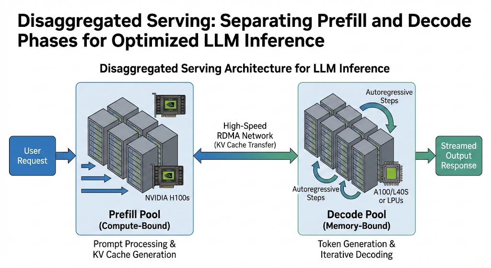

*This blog post is co-authored with
[Saurabh Aggarwal](https://www.linkedin.com/in/sa126/),
[Anish Maddipoti](https://www.linkedin.com/in/anish-maddipoti/),
[Amr Elmeleegy](https://www.linkedin.com/in/meleegy/), and
[Rohan Varma](https://www.linkedin.com/in/rohan-s-varma/) from NVIDIA.*

In our [previous post](https://blog.aks.azure.com/2025/10/24/dynamo-on-aks),
we demonstrated the power of the ND GB200 NVL72 platform, achieving a
staggering **1.2M tokens per second** across 10 nodes using NVIDIA Dynamo.
Today, we’re shifting focus from raw throughput to **developer velocity** and
**operational efficiency**.

We will explore how the [**Dynamo Planner**](https://github.com/ai-dynamo/dynamo/blob/main/docs/planner/sla_planner.md) and [**Dynamo Planner Profiler**](https://github.com/ai-dynamo/dynamo/tree/main/benchmarks/profiler)
remove the guesswork from performance tuning.

<!-- truncate -->

## The Challenge: Balancing the "Rate Matching" Equation

Disaggregated serving separates the prefill and decode phases of inference
across distinct GPU nodes. This allows each phase to be independently
optimized with custom GPU counts and model parallelism configurations.

One of the main challenges in disaggregated serving is **rate matching**:
determining the right GPU allocation between prefill and decode stages to
meet a specific Service Level Objective (SLO). If you miscalculate the GPU
ratio between these stages, you face two "silent killers" of performance:

* **Over-provisioned Prefill**: Your prompt processing is fast, but
requests bottleneck at the generation stage. This spikes *Inter-Token
Latency (ITL)* and leaves expensive compute nodes idle.
* **Under-provisioned Prefill**: Your decode GPUs sit starved for data.
This drives up *Time-To-First-Token (TTFT)* and inflates your
*Total Cost of Ownership (TCO)*.

Beyond rate matching, developers must also optimize model parallelism
parameters (data, tensor, and expert parallelism) to maintain high
["Goodput"](https://arxiv.org/abs/2401.09670) (the fraction of time
and resources where the model is learning or producing correct results,
instead of waiting or doing extra work).

Exploring these configurations manually is technically challenging,
time-consuming and often results in suboptimal resource utilization.

## Dynamic Traffic: The Move to SLO-Driven Scaling

Static configurations are brittle. In production, traffic is rarely uniform:

* **Volatile Request Volume**: Traditional Horizontal Pod Autoscalers (HPA)
are too slow for LLM jitters.
* **Shifting Sequence Patterns**: If your workload shifts from short chat
queries (low input sequence length, or ISL) to long-context document analysis (high ISL), a static
disaggregated split becomes suboptimal instantly (resulting in overworked
prefill GPUs and idle decode GPUs).

NVIDIA Dynamo addresses these gaps through two integrated components:
the **Planner Profiler** and the **SLO-based Planner**.

---

### Let’s see it through an example application scenario

Consider a major airline’s mobile app that uses AI to offer personalized
rerouting during flight delays. This use case is a 'stress test' for
inference: it is subject to massive, sudden bursts in traffic and highly
variable request patterns, such as a mix of short status queries and
long-context itinerary processing. To prevent latency spikes during
these peaks, the underlying system requires the precise orchestration
offered by a disaggregated architecture.

To build a truly efficient disaggregated AI inference system you
need to transition from manual "guess-and-check" configurations
to an automated, SLO-driven approach. The core of this automation
lies in two distinct but deeply integrated components: the Dynamo
Planner profiler and the Dynamo Planner.

The first step in building your system is determining the "Golden Ratio"
of GPUs: how many should handle prefill versus decode, and what tensor
parallelism (TP) levels each should use.

### The Architect: Dynamo Planner Profiler

The Dynamo Planner profiler is your pre-deployment simulation engine.
Instead of burning GPU hours testing every possible configuration, you
define your requirements in a **DynamoGraphDeploymentRequest (DGDR)**
manifest. The profiler then executes an automated "sweep" of the search space:

* **Parallelization Mapping**: It tests different TP sizes for both prefill
and decode stages to find the lowest TTFT and ITL (Inter-Token Latency).
* **Hardware Simulation**: Using the **AI Configurator (AIC)** mode, the
profiler can simulate performance in just 20–30 seconds
based on pre-measured performance data, allowing for rapid
iteration before you ever touch a physical GPU.
* **Resulting Recommendation**: The output is a highly tuned
configuration that maximizes "Goodput", the maximum throughput
achievable while staying strictly within your latency bounds.

Ultimately the app developers and AI engineers reduce their time
spent on testing different system setups, and can focus on their airline
passengers’ needs.

### The Pilot: Dynamo Planner

Once your system is deployed, static configurations can't handle the
"jitter" of real-world traffic. This is where the Dynamo Planner takes
over as a runtime orchestration engine.

Unlike a traditional load balancer, the Dynamo Planner is **LLM-aware**.
It continuously monitors the live state of your cluster, specifically
looking at:

* **KV Cache Load**: It monitors memory utilization in the decode pool.
* **Prefill Queue Depth**: It tracks how many prompts are waiting to be
processed.

Using the performance bounds identified earlier by the profiler, the Planner
proactively scales the number of prefill and decode workers up or down. For
example, if a *sudden burst of long-context itinerary queries* floods the
system, the Planner detects the spike in the prefill queue and shifts available
GPU resources to the prefill pool *before* your TTFT violates its SLO.

Now, you can try this yourself by running the NVIDIA Dynamo Planner Profiler
to capture burst and request behavior, then using the SLO-based Planner to
translate latency targets into placement and scaling decisions on your AKS
cluster. Setting it up in this order - profile under stress, define SLOs,
and let the planner orchestrate your disaggregated inference system to
handle sudden traffic spikes without latency spikes.

Get hands on with the
[Qwen3-32B-FP8](https://huggingface.co/Qwen/Qwen3-32B-FP8/tree/main).
model: [aka.ms/aks-dynamo-part-2](https://aka.ms/aks-dynamo-part-2)

## Conclusion: Inference Without the Infrastructure Burden

The shift toward disaggregated serving is a necessity for the next
generation of reasoning-heavy and long-context LLMs. However, as we
have seen, the complexity of manually tuning these distributed systems
on Kubernetes can quickly become a bottleneck for even the most
experienced AI teams.

By utilizing the NVIDIA Dynamo Planner Profiler, developers can move
from educated guessing to data-driven certainty, modeling performance
in seconds rather than days. When paired with the Dynamo Planner, this
static optimization becomes a dynamic, SLO-aware reality on AKS, capable of
weathering the unpredictable traffic spikes of production environments.

Ultimately, this suite transforms your inference stack from a series of
fragile configurations into a resilient, self-optimizing engine. For the AI
engineer, this means less time spent managing hardware limits and configuring
system scalability and more time spent delivering the high-quality,
interactive experiences that your users (and your passengers) expect.
