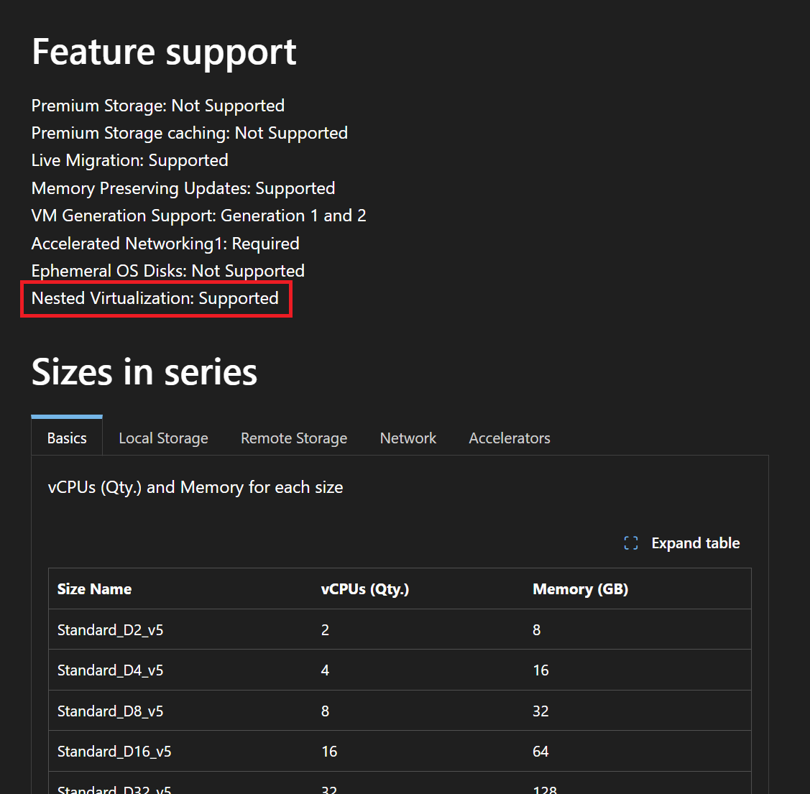

Kubernetes adoption continues to grow, but not every workload can be re-architected for containers right away. Many organizations still depend on virtual machine (VM) based deployments for technical, regulatory, or operational reasons.

[KubeVirt](https://github.com/kubevirt/kubevirt) is a [Cloud Native Computing Foundation (CNCF) incubating](https://www.cncf.io/projects/kubevirt/) open-source project that allows users to run, deploy, and manage VMs in their Kubernetes clusters.

In this post, you will learn how KubeVirt lets you run, deploy, and manage VMs on Kubernetes, alongside your containerized applications, using Kubernetes as the orchestrator.
<!-- truncate -->

## Why KubeVirt matters

KubeVirt can help organizations that are in various stages of their Kubernetes journey manage their infrastructure more effectively. It allows customers to manage legacy VM workloads alongside containerized applications using the same Kubernetes API. 

VMs deployed on KubeVirt act much the same way as VMs deployed in more traditional manners would but can run and be managed alongside other containerized applications through traditional Kubernetes tools. Capabilities like scheduling that users know and love on Kubernetes can also be applied to these VMs. 

Management of these otherwise disparate deployments can be simplified and unified. This unified management can help teams avoid the sprawl that would otherwise come with managing multiple platforms.

The capability to mix and match your workloads in a "hybrid" setting can also allow organizations that might have more complex, legacy VM-based applications to incrementally transition to containers or allow these mission-critical legacy applications to remain as they are.

## Deploying KubeVirt

Users today are able to self-deploy KubeVirt on AKS clusters using SKUs that support nested virtualization.

### Creating an AKS cluster

:::important
When you select a `--node-vm-size`, use a VM SKU that supports nested virtualization. You can confirm support on the VM size's Microsoft Learn page, such as [Standard_D4s_v5](https://learn.microsoft.com/azure/virtual-machines/sizes/general-purpose/dv5-series?tabs=sizebasic#feature-support).
Using the [Standard_D4s_v5](https://learn.microsoft.com/azure/virtual-machines/sizes/general-purpose/dv5-series?tabs=sizebasic#feature-support) SKU as an example, on the SKU page, you can see whether or not nested virtualization is supported in the "Feature support" section.


::: 
1. Start with creating your AKS cluster.

   ```bash
   az aks create --resource-group <resource-group> --name <cluster-name> --node-vm-size Standard_D4s_v5
   ```

2. After your cluster is up and running, get the access credentials for the cluster.

   ```bash
   az aks get-credentials --resource-group <resource-group> --name <cluster-name>
   ```

### Installing KubeVirt

1. Install the KubeVirt operator.

   ```bash
   kubectl apply -f \
   https://github.com/kubevirt/kubevirt/releases/download/v1.6.3/kubevirt-operator.yaml
   ```

1. Next, install the KubeVirt custom resource.

   ```bash
   curl -L https://github.com/kubevirt/kubevirt/releases/download/v1.6.3/kubevirt-cr.yaml \
   | yq '.spec.infra.nodePlacement={}' \
   | kubectl apply -f -
   ```

   Notice the empty `nodePlacement: {}` line. By default, KubeVirt sets the node-affinity of control plane components to control plane nodes. Because AKS control plane nodes are fully managed by Azure and inaccessible to KubeVirt, this update to nodePlacement avoids potential failures.

   `v1.6.3` is specified in this example, but another [supported version](https://github.com/kubevirt/sig-release/blob/main/releases/k8s-support-matrix.md) can be chosen instead.

### Confirm the KubeVirt pods are up and running on the cluster

Once all the components are installed, you can quickly check if all the KubeVirt components are up and running properly in your cluster:

```bash
kubectl get pods -n kubevirt -o wide
```

You should see something like this:

```bash
NAME                               READY   STATUS    RESTARTS   AGE     IP             NODE                                NOMINATED NODE   READINESS GATES
virt-api-7f7d56bbc5-s9nr4          1/1     Running   0          4m10s   10.244.0.174   aks-nodepool1-26901818-vmss000000   <none>           <none>
virt-controller-7c5744f574-56dd5   1/1     Running   0          3m39s   10.244.0.204   aks-nodepool1-26901818-vmss000000   <none>           <none>
virt-controller-7c5744f574-ftz6z   1/1     Running   0          3m39s   10.244.0.120   aks-nodepool1-26901818-vmss000000   <none>           <none>
virt-handler-dlkxf                 1/1     Running   0          3m39s   10.244.0.52    aks-nodepool1-26901818-vmss000000   <none>           <none>
virt-operator-7c8bdfb574-54cs6     1/1     Running   0          9m38s   10.244.0.87    aks-nodepool1-26901818-vmss000000   <none>           <none>
virt-operator-7c8bdfb574-wzdxt     1/1     Running   0          9m38s   10.244.0.153   aks-nodepool1-26901818-vmss000000   <none>           <none>
```

### Creating VirtualMachineInstance resources in KubeVirt

With KubeVirt successfully installed on your cluster, you can now create your VirtualMachineInstance (VMI) resources.

1. Create your VMI. Save the following YAML, which will create a VMI based on Fedora OS, as `vmi-fedora.yaml`.

   ```yaml
   apiVersion: kubevirt.io/v1
   kind: VirtualMachineInstance
   metadata:
     labels:
       special: vmi-fedora
     name: vmi-fedora
   spec:
     domain:
       devices:
         disks:
         - disk:
             bus: virtio
           name: containerdisk
         - disk:
             bus: virtio
           name: cloudinitdisk
         interfaces:
         - masquerade: {}
           name: default
         rng: {}
       memory:
         guest: 1024M
       resources: {}
     networks:
     - name: default
       pod: {}
     terminationGracePeriodSeconds: 0
     volumes:
     - containerDisk:
         image: quay.io/kubevirt/fedora-with-test-tooling-container-disk:devel
       name: containerdisk
     - cloudInitNoCloud:
         userData: |-
           #cloud-config
           password: fedora
           chpasswd: { expire: False }
       name: cloudinitdisk
   ```

1. Deploy the VMI in your cluster.

   ```bash
   kubectl apply -f vmi-fedora.yaml
   ```

   If successful, you should see an output similar to `virtualmachineinstance.kubevirt.io/vmi-fedora created`.

### Check out the created VMI

1. Test and make sure the VMI is created and running via `kubectl get vmi`. You should see a result similar to:

   ```bash
   NAME         AGE   PHASE     IP             NODENAME                            READY
   vmi-fedora   85s   Running   10.244.0.213   aks-nodepool1-26901818-vmss000000   True
   ```

1. You can also connect to the newly created VMI, and inspect it.

   Before you use the `virtctl` command-line tool, install it on your workstation. If you use `kubectl krew`, run:

   ```bash
   kubectl krew install virt
   virtctl console vmi-fedora
   ```

   When prompted with credentials, the default username/password should be `fedora`/`fedora`.

   ```bash
   vmi-fedora login: fedora
   Password: 
   ```

   Once logged in, running `cat /etc/os-release` should allow you to see the OS details.

   ```bash
   [fedora@vmi-fedora ~]$ cat /etc/os-release
   NAME=Fedora
   VERSION="32 (Cloud Edition)"
   ID=fedora
   VERSION_ID=32
   VERSION_CODENAME=""
   PLATFORM_ID="platform:f32"
   PRETTY_NAME="Fedora 32 (Cloud Edition)"
   ANSI_COLOR="0;34"
   LOGO=fedora-logo-icon
   CPE_NAME="cpe:/o:fedoraproject:fedora:32"
   HOME_URL="https://fedoraproject.org/"
   DOCUMENTATION_URL="https://docs.fedoraproject.org/en-US/fedora/f32/system-administrators-guide/"
   SUPPORT_URL="https://fedoraproject.org/wiki/Communicating_and_getting_help"
   BUG_REPORT_URL="https://bugzilla.redhat.com/"
   REDHAT_BUGZILLA_PRODUCT="Fedora"
   REDHAT_BUGZILLA_PRODUCT_VERSION=32
   REDHAT_SUPPORT_PRODUCT="Fedora"
   REDHAT_SUPPORT_PRODUCT_VERSION=32
   PRIVACY_POLICY_URL="https://fedoraproject.org/wiki/Legal:PrivacyPolicy"
   VARIANT="Cloud Edition"
   VARIANT_ID=cloud
   ```

## Share your feedback

If you're using KubeVirt on AKS or are interested in trying it, we'd love to hear from you! Your feedback will help the AKS team plan how to best support these types of workloads on our platform. Share your thoughts in our [GitHub Issue](https://github.com/Azure/AKS/issues/5445).

## Resources

- [What is KubeVirt?](https://www.redhat.com/topics/virtualization/what-is-kubevirt)
- [KubeVirt user guides](https://kubevirt.io/user-guide/)
