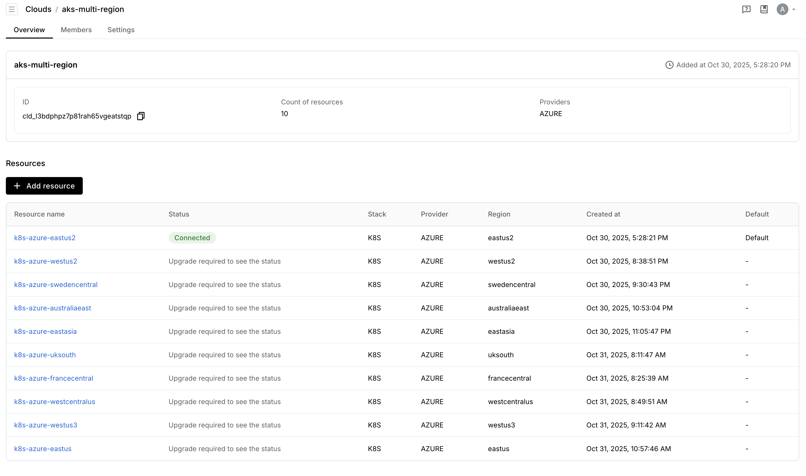

Following our [initial announcement of Ray on AKS](/blog/2025-01-13-ray-on-aks), we've been working closely with Anyscale to enhance the production-readiness of Ray workloads on Azure Kubernetes Service. As part of Microsoft and Anyscale's [strategic collaboration to deliver AI-native computing on Azure](https://www.anyscale.com/press/anyscale-collaborates-with-microsoft-to-deliver-ai-native-computing-on-azure), we've focused on three critical areas to improve user experience and prepare for private preview:

## Recent Enhancements

Over the past months, we've made significant improvements to the Ray on AKS experience:

### 1. **Security: Workload Identity Authentication**

We've eliminated the operational burden of 30-day token rotation by implementing Azure Workload Identity integration. Ray clusters now authenticate to Azure resources using service principals with federated credentials, providing:
- Zero-credential storage in Kubernetes clusters
- Automatic token refresh without manual intervention
- Fine-grained RBAC for Azure resource access
- Full audit trails through Azure Activity Logs

This enhancement removes a major friction point for production deployments where credential expiration previously caused service disruptions.

### 2. **Storage: BlobFuse2 Integration**

We've integrated Azure Blob Storage with BlobFuse2 to provide unified, scalable storage for ML artifacts throughout the entire training lifecycle:
- **Shared storage across clusters**: Training data, checkpoints, and models accessible from any Ray cluster
- **Optimized for ML workloads**: High-throughput parallel I/O with intelligent caching
- **Cost-efficient at scale**: Leverage Azure's tiered storage pricing (hot/cool/archive)
- **Seamless integration**: Mount blob storage as POSIX filesystems within Ray worker pods

This enables data scientists to seamlessly transition from pre-training to fine-tuning to inference without manual data migration.

### 3. **Multi-Cluster Multi-Region Support**

To address GPU scarcity and improve availability, we've built comprehensive multi-region orchestration:
- **Intelligent workload routing**: Automatically schedule jobs to regions with available GPU capacity
- **Unified cloud management**: Single Anyscale cloud spanning multiple Azure regions
- **Cross-region storage**: Shared blob storage accessible from all clusters
- **Cost optimization**: Leverage regional pricing differences and spot instances

This architecture enables teams to overcome capacity constraints and run workloads where GPUs are available, rather than waiting for capacity in a single region.

## Production-Ready Architecture

These enhancements combine to deliver a production-grade ML platform on AKS that scales from rapid experimentation to massive training runs. Whether you're running hundreds of short-lived experimental jobs or a single multi-day training run consuming thousands of GPU nodes, the architecture provides:

- **Operational simplicity** through automated credential management
- **Data persistence** with unified storage across the ML lifecycle
- **Elastic scalability** via multi-region capacity aggregation
- **Cost efficiency** through spot instances and intelligent workload placement

The following sections detail the implementation of each enhancement, with code examples and configuration templates from our [reference implementation](https://github.com/Azure-Samples/aks-anyscale).

## Security Improvements with Service Principal Authentication

One of the key operational challenges when running Ray on AKS is maintaining secure and reliable authentication between Ray clusters and Azure resources. Traditional approaches often rely on CLI tokens or API keys that expire every 30 days, requiring manual rotation and creating potential service disruptions when credentials expire unexpectedly.

By leveraging Azure Service Principals with managed identities, teams can eliminate this operational burden entirely. Service principals provide long-lived, automatically managed credentials that integrate seamlessly with Azure's identity and access management (IAM) system. When Ray clusters are configured to use service principals, they can:

- **Eliminate manual token rotation**: Service principals use certificate-based or federated identity authentication that doesn't require periodic renewal
- **Improve security posture**: Fine-grained RBAC policies can be applied to limit exactly what resources each Ray cluster can access
- **Enable audit trails**: All API calls made by the service principal are logged in Azure Activity Logs for compliance and security monitoring
- **Support cross-subscription access**: Service principals can be granted access across multiple Azure subscriptions, enabling complex multi-tenant scenarios

To implement this, configure your Ray clusters with workload identity federation or managed service identities, ensuring that your Anyscale or self-managed Ray deployments authenticate using service principals rather than short-lived user tokens.

### Authentication Flow

The following diagram illustrates how Azure Workload Identity enables the Anyscale Kubernetes Operator to authenticate without storing credentials:


In this flow:
1. The AKS workload (Anyscale Operator pod) authenticates using a user-assigned managed identity
2. The managed identity requests an access token with scope `api://086bc.../.default`
3. The token is issued by the Anyscale Kubernetes Operator Auth service principal
4. The service principal's `appId` becomes the `AZURE_CLIENT_ID` environment variable
5. The managed identity's `appId`/`id` appears as the `oid` claim in the resulting access token

This eliminates the need to store credentials in the cluster, as the AKS OIDC issuer automatically provides identity tokens to pods.

### Implementation Example

The [aks-anyscale setup](./aks-anyscale) demonstrates this pattern by creating a User Assigned Managed Identity and configuring workload identity federation:

```bash
# Create user assigned identity
az identity create -g "$RESOURCE_GROUP" -n "$USER_IDENTITY_NAME"

# Grant storage access roles
az role assignment create \
  --assignee-object-id "$IDENTITY_PRINCIPAL_ID" \
  --role "Storage Blob Data Contributor" \
  --scope "$STORAGE_ACCOUNT_ID"

az role assignment create \
  --assignee-object-id "$IDENTITY_PRINCIPAL_ID" \
  --role "Storage Account Key Operator Service Role" \
  --scope "$STORAGE_ACCOUNT_ID"
```

The identity is then federated with the AKS cluster's OIDC issuer, allowing the Anyscale Operator pods to authenticate without storing any credentials:

```bash
# Create federated credential linking OIDC issuer to ServiceAccount
OIDC_ISSUER=$(az aks show -g "$RESOURCE_GROUP" -n "$AKS_CLUSTER_NAME" \
  --query "oidcIssuerProfile.issuerUrl" -o tsv)

az identity federated-credential create \
  --name "${AKS_CLUSTER_NAME}-operator-fic" \
  --identity-name "$USER_IDENTITY_NAME" \
  --resource-group "$RESOURCE_GROUP" \
  --issuer "$OIDC_ISSUER" \
  --subject "system:serviceaccount:anyscale-operator:anyscale-operator" \
  --audiences "api://AzureADTokenExchange"
```

This federated credential establishes trust between the AKS cluster's OIDC issuer and the user-assigned identity, enabling pods running with the `anyscale-operator` ServiceAccount to automatically obtain Azure AD tokens. The Anyscale Operator Helm chart is then configured with the managed identity client ID:

```bash
helm upgrade anyscale-operator anyscale/anyscale-operator \
  --set-string global.cloudDeploymentId="$CLOUD_DEPLOYMENT_ID" \
  --set-string global.auth.iamIdentity="$IDENTITY_CLIENT_ID" \
  --set-string global.auth.anyscaleCliToken="$ANYSCALE_CLI_TOKEN" \
  --namespace anyscale-operator \
  --install
```

See [setup.sh:56-92](./aks-anyscale/setup.sh) and [setup.sh:230-244](./aks-anyscale/setup.sh) for the complete implementation.

## Cluster Storage Support with BlobFuse2

Managing training data, model checkpoints, and artifacts across the ML lifecycle—from pre-training to fine-tuning to inference—requires robust, scalable, and performant storage solutions. Azure Blob Storage, combined with BlobFuse2, provides an ideal storage backend for Ray workloads on AKS.

BlobFuse2 is a virtual filesystem driver that mounts Azure Blob Storage containers as local file systems within Kubernetes pods. This enables Ray workers to read and write data using standard POSIX file operations while benefiting from the scalability and durability of object storage.

### Key Benefits for Ray Workloads

- **Unified storage across training stages**: Store training datasets, intermediate checkpoints, and final models in a single Blob Storage account accessible across pre-training, fine-tuning, and inference pipelines
- **High throughput for large datasets**: BlobFuse2 supports parallel reads and writes, delivering the performance needed for data-intensive workloads like large language model training
- **Cost-effective at scale**: Azure Blob Storage offers tiered pricing (hot, cool, archive) allowing teams to optimize costs based on access patterns
- **Multi-cluster data sharing**: Multiple Ray clusters across regions or subscriptions can mount the same storage containers, enabling seamless data sharing and model versioning
- **Integration with Ray's distributed filesystem**: Ray's built-in support for cloud storage URIs (e.g., `az://container/path`) works seamlessly with BlobFuse2-mounted volumes

### Implementation Approach

To leverage BlobFuse2 with Ray on AKS:

1. Create Azure Blob Storage containers for datasets, checkpoints, and models
2. Deploy BlobFuse2 FlexVolume or CSI drivers in your AKS clusters
3. Configure Ray pod specifications to mount BlobFuse2 volumes
4. Use service principal authentication (see previous section) to grant Ray clusters access to storage containers
5. Configure Ray's checkpoint and storage settings to write directly to mounted blob paths

This approach ensures that your ML artifacts persist beyond individual cluster lifecycles and can be accessed efficiently across your entire Ray infrastructure.

### Configuration Example

The [aks-anyscale setup](./aks-anyscale) provides production-ready BlobFuse2 configuration. First, a Storage Account is created with secure defaults:

```bash
az storage account create \
  --name "$STORAGE_ACCOUNT" \
  --resource-group "$RESOURCE_GROUP" \
  --location "$PRIMARY_REGION" \
  --sku Standard_LRS \
  --kind StorageV2 \
  --allow-blob-public-access false
```

The storage container is created with private access, and CORS is configured to allow the Anyscale console to access storage metadata:

```bash
# Create private blob container
az storage container create \
  --name "$STORAGE_CONTAINER" \
  --account-name "$STORAGE_ACCOUNT" \
  --auth-mode login \
  --public-access off

# Configure CORS for Anyscale console
az storage cors add \
  --services b \
  --account-name "$STORAGE_ACCOUNT" \
  --origins "https://console.anyscale.com" \
  --methods GET \
  --allowed-headers "*" \
  --max-age 600
```

The StorageClass ([storageclass_fuse2.yaml](./aks-anyscale/storageclass_fuse2.yaml)) uses workload identity authentication and optimized caching parameters:

```yaml
apiVersion: storage.k8s.io/v1
kind: StorageClass
metadata:
  name: blob-fuse2
provisioner: blob.csi.azure.com
parameters:
  protocol: fuse2
  storageAccount: aksanyscalesa
  resourceGroup: aks-anyscale-rg
  clientID: <managed-identity-client-id>
  mountWithWorkloadIdentityToken: "true"
mountOptions:
  - -o allow_other
  - --file-cache-timeout-in-seconds=120
  - --use-attr-cache=true
  - --cache-size-mb=1000
allowVolumeExpansion: true
reclaimPolicy: Retain
```

A PersistentVolumeClaim ([pvc_fuse2.yaml](./aks-anyscale/pvc_fuse2.yaml)) is then created in the `anyscale-operator` namespace with `ReadWriteMany` access mode, allowing multiple Ray workers across different nodes to concurrently access the same storage:

```yaml
apiVersion: v1
kind: PersistentVolumeClaim
metadata:
  name: blob-fuse2
  namespace: anyscale-operator
spec:
  accessModes:
    - ReadWriteMany
  storageClassName: blob-fuse2
  resources:
    requests:
      storage: 100Gi
```

The setup script dynamically generates these configurations with actual resource identifiers and applies them to the cluster:

```bash
# Generate StorageClass with actual identity and storage account details
sed -e "s/\${STORAGE_PROTOCOL}/${STORAGE_PROTOCOL}/g" \
    -e "s/\${STORAGE_ACCOUNT}/${STORAGE_ACCOUNT}/g" \
    -e "s/\${IDENTITY_CLIENT_ID}/${IDENTITY_CLIENT_ID}/g" \
    storageclass.yaml > "storageclass_fuse2.yaml"
kubectl apply -f "storageclass_fuse2.yaml"

# Create PVC in anyscale-operator namespace
sed -e "s/\${STORAGE_PROTOCOL}/${STORAGE_PROTOCOL}/g" \
    pvc.yaml > "pvc_fuse2.yaml"
kubectl apply -f "pvc_fuse2.yaml"
```

This PVC is then referenced in the Anyscale cloud registration ([cloud.yaml:12](./aks-anyscale/cloud.yaml)) as `persistent_volume_claim: blob-fuse2`, making it available to all Ray workloads launched on the cluster.

## Multi-Cluster Multi-Region Support for GPU Scarcity

GPU availability remains one of the most significant challenges in large-scale ML operations. High-demand accelerators like NVIDIA H100s and A100s often face capacity constraints in specific Azure regions, leading to delays in provisioning clusters or launching training jobs. A multi-cluster, multi-region strategy is essential to overcome these limitations.

### Overcoming GPU Scarcity

By deploying Ray clusters across multiple AKS clusters in different Azure regions, teams can:

- **Increase GPU availability**: Distribute workload submissions across regions with available capacity, reducing wait times for cluster provisioning
- **Leverage regional pricing differences**: Take advantage of lower spot instance prices or reserved capacity in specific regions
- **Improve fault tolerance**: If one region experiences an outage or capacity shortage, workloads can be automatically rerouted to healthy clusters
- **Scale beyond single-cluster limits**: Azure imposes quota limits on GPU instances per region; multi-region deployments allow you to aggregate capacity across regions

### Implementation with Anyscale or KubeRay

Platforms like Anyscale provide built-in multi-cluster orchestration, allowing you to register multiple AKS clusters as compute backends and intelligently route workloads based on availability, cost, and workload requirements. For self-managed deployments using KubeRay, you can implement similar patterns using:

- **Cluster registries**: Maintain a registry of available AKS clusters with their GPU types, availability zones, and capacity
- **Workload schedulers**: Build or integrate with schedulers that query cluster availability and dispatch Ray jobs to the best-fit cluster
- **Cross-region networking**: Use Azure Virtual Network peering or private endpoints to enable secure communication between clusters and shared storage

This multi-region approach not only mitigates GPU scarcity but also enables more sophisticated workload management strategies, such as burst-to-cloud patterns and hybrid on-premises/cloud deployments.

### Infrastructure and Node Pool Configuration

Each regional cluster is deployed with a complete networking stack optimized for ML workloads:

```bash
# VNet with custom CIDR ranges
az network vnet create \
  --name "${AKS_CLUSTER_NAME}-vnet" \
  --resource-group "$RESOURCE_GROUP" \
  --location "$REGION" \
  --address-prefixes "10.192.0.0/15"

# NAT Gateway for predictable outbound IP
az network nat gateway create \
  --name "${AKS_CLUSTER_NAME}-nat-gw" \
  --resource-group "$RESOURCE_GROUP" \
  --location "$REGION" \
  --public-ip-addresses "${AKS_CLUSTER_NAME}-nat-pip" \
  --idle-timeout 10
```

The AKS cluster is created with Azure CNI Overlay networking and workload identity enabled:

```bash
az aks create \
  --resource-group "$RESOURCE_GROUP" \
  --name "$AKS_CLUSTER_NAME" \
  --kubernetes-version "1.34.1" \
  --enable-oidc-issuer \
  --enable-workload-identity \
  --enable-blob-driver \
  --network-plugin azure \
  --network-plugin-mode overlay \
  --pod-cidr "10.128.0.0/12" \
  --outbound-type userAssignedNATGateway \
  --nodepool-name sys \
  --node-count 3 \
  --node-vm-size "Standard_D8_v5"
```

Multiple node pools are added to support different workload types:

```bash
# CPU node pool (on-demand) for general workloads
az aks nodepool add \
  --cluster-name "$AKS_CLUSTER_NAME" \
  --name cpu \
  --enable-cluster-autoscaler \
  --min-count 3 --max-count 6 \
  --node-vm-size "Standard_D16_v5" \
  --labels node.anyscale.com/capacity-type=ON_DEMAND \
  --node-taints node.anyscale.com/capacity-type=ON_DEMAND:NoSchedule

# A100 GPU node pool (spot) for training workloads
az aks nodepool add \
  --cluster-name "$AKS_CLUSTER_NAME" \
  --name a100 \
  --enable-cluster-autoscaler \
  --node-count 0 --min-count 0 --max-count 3 \
  --node-vm-size "Standard_ND96amsr_A100_v4" \
  --labels node.anyscale.com/capacity-type=SPOT nvidia.com/gpu.product=NVIDIA-A100 nvidia.com/gpu.count=8 \
  --priority Spot \
  --node-taints node.anyscale.com/capacity-type=SPOT:NoSchedule,nvidia.com/gpu=present:NoSchedule,node.anyscale.com/accelerator-type=GPU:NoSchedule
```

This node pool strategy separates system workloads, general CPU workloads, and GPU workloads with appropriate taints and labels for targeted scheduling. GPU nodes use spot instances (up to 90% cost savings) with autoscaling from 0 to minimize costs when idle.

### Multi-Region Deployment

The [aks-anyscale setup](./aks-anyscale) automates multi-region deployment. The [variables.sh](./aks-anyscale/variables.sh) file defines the target regions:

```bash
REGIONS="${REGIONS:-uksouth swedencentral}"
PRIMARY_REGION="${PRIMARY_REGION:-uksouth}"
```

The setup script then iterates through each region, creating dedicated AKS clusters with identical configurations. Each cluster is registered with Anyscale using the cloud resource template ([cloud_resource.yaml](./aks-anyscale/cloud_resource.yaml)):

```yaml
name: k8s-azure-$REGION
provider: AZURE
compute_stack: K8S
region: $REGION
object_storage:
  bucket_name: abfss://${STORAGE_CONTAINER}@${STORAGE_ACCOUNT}.dfs.core.windows.net
file_storage:
  persistent_volume_claim: blob-fuse2
azure_config:
  tenant_id: ${AZURE_TENANT_ID}
kubernetes_config:
  anyscale_operator_iam_identity: ${IDENTITY_PRINCIPAL_ID}
```

Notice that all clusters share the same Azure Blob Storage account (`object_storage.bucket_name`) and use the same managed identity for authentication. This ensures that Ray workloads can seamlessly access the same training data, checkpoints, and models regardless of which region they run in.

The setup script handles primary and secondary regions differently when registering with Anyscale:

```bash
# Primary region: Register new cloud
if [[ "$REGION" == "$PRIMARY_REGION" ]]; then
  anyscale cloud register \
    --provider Azure \
    --name "$ANYSCALE_CLOUD_NAME" \
    -f "$CLOUD_RESOURCE_YAML"
else
  # Secondary regions: Add as cloud resources
  anyscale cloud resource create \
    --cloud "$ANYSCALE_CLOUD_NAME" \
    -f "$CLOUD_RESOURCE_YAML"
fi
```

After registration, the cloud deployment ID is retrieved and used to install the Anyscale Operator in each cluster:

```bash
CLOUD_DEPLOYMENT_ID=$(anyscale cloud get --name "$ANYSCALE_CLOUD_NAME" | \
  awk -v target="k8s-azure-$REGION" '
    $1=="-" && $2=="cloud_resource_id:" { id=$3 }
    $1=="name:" && $2==target { print id; exit }
  ')

helm upgrade anyscale-operator anyscale/anyscale-operator \
  --set-string global.cloudDeploymentId="$CLOUD_DEPLOYMENT_ID" \
  --namespace anyscale-operator \
  --install
```

This creates a unified multi-region cloud in Anyscale where workloads can be scheduled to any available cluster based on GPU availability, cost, and latency requirements.

To deploy across multiple regions, simply set the `REGIONS` environment variable and run the setup:

```bash
export REGIONS="eastus westus northeurope"
export PRIMARY_REGION="eastus"
./setup.sh
```

The script will provision all infrastructure, register each cluster with Anyscale, and configure cross-region storage access automatically.

### Kubernetes Add-ons

Each cluster is configured with essential add-ons for Ray workload support:

**NGINX Ingress Controller** provides external access to Ray services:

```bash
helm upgrade ingress-nginx nginx/ingress-nginx \
  --version 4.12.1 \
  --namespace ingress-nginx \
  --values values_nginx.yaml \
  --install
```

**NVIDIA Device Plugin** enables GPU scheduling for ML workloads:

```bash
helm upgrade nvdp nvdp/nvidia-device-plugin \
  --namespace nvidia-device-plugin \
  --version 0.17.1 \
  --values values_nvidia.yaml \
  --install
```

The NVIDIA Device Plugin configuration ([values_nvidia.yaml](./aks-anyscale/values_nvidia.yaml)) includes tolerations for all Anyscale taints, ensuring GPU pods can be scheduled on nodes with capacity-type and accelerator-type taints.

## Manage Workloads across Clusters

With the infrastructure deployed across multiple regions, you can now manage and monitor Ray workloads from the Anyscale console. The unified cloud view shows all registered clusters and their available resources:



Anyscale Workspaces provides a managed environment for running interactive Ray workloads, with automatic scheduling across available clusters based on resource requirements:


## Reference Implementation

All the patterns and configurations described in this article are available as automation scripts in the [Azure-Samples/aks-anyscale](https://github.com/Azure-Samples/aks-anyscale) repository. This open-source reference implementation provides infrastructure-as-code to deploy production-ready, multi-region AKS clusters configured for Ray workloads with:

- Service principal authentication with workload identity
- BlobFuse2 storage integration for ML artifacts
- Multi-region deployment automation
- GPU node pools with autoscaling
- Pre-configured Kubernetes add-ons (NGINX Ingress, NVIDIA Device Plugin, Anyscale Operator)

To get started:

```bash
git clone https://github.com/Azure-Samples/aks-anyscale
cd aks-anyscale
export REGIONS="eastus westus"
./setup.sh
```

The setup script provisions all required Azure resources and registers clusters with Anyscale automatically. See the [repository README](https://github.com/Azure-Samples/aks-anyscale#readme) for detailed configuration options.

## Conclusion

Running Ray at scale on Azure Kubernetes Service requires careful attention to security, storage, and multi-region deployment strategies. By implementing:

1. **Workload identity authentication** to eliminate credential management overhead
2. **BlobFuse2 storage integration** for unified ML artifact management across the training lifecycle
3. **Multi-region, multi-cluster deployments** to overcome GPU scarcity and improve availability

Teams can build production-ready ML infrastructure that scales elastically, operates securely, and delivers consistent performance across diverse workload patterns. The [Azure-Samples/aks-anyscale](https://github.com/Azure-Samples/aks-anyscale) reference implementation provides a complete, automated solution that codifies these best practices and can be deployed in minutes.

Whether running hundreds of small experimental jobs or massive multi-day training runs, this architecture provides the flexibility and reliability needed for modern ML operations at scale.
