This post focuses on running Anyscale's managed Ray service on AKS, using the Anyscale Runtime (formerly RayTurbo) for an optimized Ray experience. For open-source Ray on AKS, see our [Ray on AKS overview](https://blog.aks.azure.com/2025/01/13/ray-on-aks).

Ray is an open-source distributed compute framework for scaling Python and AI workloads from a laptop to clusters with thousands of nodes. Anyscale provides a managed ML/AI platform and an optimized Ray runtime with better scalability, observability, and operability than running open-source [KubeRay](https://github.com/ray-project/kuberay)—including intelligent autoscaling, enhanced monitoring, and fault-tolerant training.

As part of [Microsoft and Anyscale's strategic collaboration](https://www.anyscale.com/press/anyscale-collaborates-with-microsoft-to-deliver-ai-native-computing-on-azure) to deliver [distributed AI/ML Azure-native computing at scale](https://devblogs.microsoft.com/all-things-azure/powering-distributed-aiml-at-scale-with-azure-and-anyscale/), we've been working closely with Anyscale to enhance the production-readiness of Ray workloads on Azure Kubernetes Service (AKS) in three critical areas:

- **Elastic scalability** through multi-cluster multi-region capacity aggregation
- **Data persistence** with unified storage across ML/AI development and operation lifecycle
- **Operational simplicity** through automated credential management with service principal

Whether you're [fine-tuning models with DeepSpeed or LLaMA-Factory](https://github.com/Azure-Samples/aks-anyscale/tree/main/examples/finetuning) or [deploying inference endpoints for LLMs ranging from small to large-scale reasoning models](https://github.com/Azure-Samples/aks-anyscale/tree/main/examples/inferencing), Anyscale on AKS delivers a production-grade ML/AI platform that scales with your needs.

<!-- truncate -->

## Multi-cluster Multi-region

GPU scarcity remains one of the most significant challenges in large-scale ML operations. High-demand accelerators like NVIDIA GPUs often face capacity constraints in specific Azure regions, leading to delays in provisioning clusters or launching training jobs.

By deploying Ray clusters across multiple AKS clusters in different Azure regions, you can:

- **Increase GPU availability**: Distribute workloads across clusters and regions with available capacity, reducing wait times for cluster provisioning
- **Scale beyond single-cluster limits**: Azure imposes quota limits on GPU instances per region, but multi-region deployments let you aggregate capacity
- **Improve fault tolerance**: If one region experiences an outage or capacity shortage, workloads can be automatically rerouted to healthy clusters

With infrastructure deployed across multiple regions—and optionally on-premises or other cloud environments—you can manage and monitor Anyscale workloads on registered clusters from the Anyscale console. This multi-cloud and hybrid cloud approach lets you access GPU capacity wherever it exists, whether in Azure regions, on-premises data centers, or other cloud providers. Extend your compute pool beyond Azure by connecting on-premises GPU clusters through [AKS enabled by Azure Arc](https://learn.microsoft.com/en-us/azure/aks/aksarc/), aggregating existing infrastructure investments with cloud-based resources:


Anyscale Workspaces provides a managed environment for running interactive Ray workloads, with manual or automatic scheduling across available clusters based on resource requirements:


To add a cluster or another region to your existing Anyscale cloud, define a cloud resource as below [cloud_resource.yaml](https://github.com/Azure-Samples/aks-anyscale/blob/main/config/cloud_resource.yaml):

```yaml
name: k8s-azure-$REGION
provider: AZURE
compute_stack: K8S
region: $REGION
object_storage:
  bucket_name: abfss://${STORAGE_CONTAINER}@${STORAGE_ACCOUNT}.dfs.core.windows.net
file_storage:
  persistent_volume_claim: blob-fuse2
azure_config:
  tenant_id: ${AZURE_TENANT_ID}
kubernetes_config:
  anyscale_operator_iam_identity: ${IDENTITY_PRINCIPAL_ID}
```

Then create the cloud resource using the Anyscale CLI:

```bash
anyscale cloud resource create \
  --cloud "$ANYSCALE_CLOUD_NAME" \
  -f cloud_resource.yaml
```

## Unified Storage

Another major challenge is sharing training data, model checkpoints, and artifacts across the ML/AI workflow—from pre-training to fine-tuning to inference. [Azure BlobFuse2](https://github.com/Azure/azure-storage-fuse) mounts Azure Blob Storage into Ray worker pods as a shared POSIX filesystem, providing unified, cloud-scale storage beyond workload lifecycle.

From Ray's perspective, BlobFuse2 is just a mounted filesystem. Ray tasks and actors read datasets and write checkpoints via normal file I/O, while BlobFuse2 ensures data is persisted to Azure Blob Storage and shared across pods. This keeps Ray code portable while benefiting from Azure-native storage. By decoupling data from compute, you can scale Ray clusters up and down across node pools without data loss, while local caching prevents GPU stalls during large training job run.



To use BlobFuse2 with Ray on AKS:

1. Create Azure Blob Storage containers for datasets, checkpoints, and models.

2. Enable [blob-csi-driver](https://github.com/kubernetes-sigs/blob-csi-driver) when creating your AKS cluster:

   ```bash
   az aks create \
     ...
     --enable-blob-driver
     ...
   ```

3. Create a [StorageClass](https://github.com/Azure-Samples/aks-anyscale/blob/main/config/storageclass.yaml) that uses workload identity authentication and optimized caching parameters for large files:

   ```yaml
   apiVersion: storage.k8s.io/v1
   kind: StorageClass
   metadata:
     name: blob-fuse2

   provisioner: blob.csi.azure.com
   parameters:
     protocol: fuse2
     storageAccount: ${STORAGE_ACCOUNT}
     resourceGroup: ${RESOURCE_GROUP}
     clientID: ${IDENTITY_CLIENT_ID}
     mountWithWorkloadIdentityToken: "true"

   mountOptions:
     - -o allow_other
     - --file-cache-timeout-in-seconds=120
     - --use-attr-cache=true
     - --cancel-list-on-mount-seconds=10
     - -o attr_timeout=120
     - -o entry_timeout=120
     - -o negative_timeout=120
     - --log-level=LOG_WARNING
     - --cache-size-mb=1000

   allowVolumeExpansion: true
   reclaimPolicy: Retain
   volumeBindingMode: Immediate
   ```

4. Create a [PersistentVolumeClaim](https://github.com/Azure-Samples/aks-anyscale/blob/main/config/pvc.yaml) in the `anyscale-operator` namespace with `ReadWriteMany` access mode. This allows multiple Ray workers across different nodes to access the same data:

   ```yaml
   apiVersion: v1
   kind: PersistentVolumeClaim
   metadata:
     name: blob-fuse2
     namespace: anyscale-operator
   spec:
     accessModes:
       - ReadWriteMany
     storageClassName: blob-fuse2
     resources:
       requests:
         storage: 100Gi
   ```

5. Configure Ray workloads to read from and write to mounted path `/mnt/cluster_storage`.

With this setup, Ray workers read and write data using standard POSIX file operations while benefiting from the durability and scalability of Azure Blob Storage. ML/AI engineers can seamlessly transition from pre-training to fine-tuning to inference without manual data migration.

## Service Principal Authentication

Maintaining secure and reliable authentication between Ray clusters and Azure resources can be challenging. Previous integration relied on CLI tokens or API keys that expire every 30 days, requiring manual rotation or causing potential service disruptions.

By combining Microsoft Entra service principals with managed identities (workload identity), you eliminate this operational burden without storing long-lived secrets in the cluster. Pods use the managed identity to obtain short-lived access tokens for the service principal from Microsoft Entra ID, and Entra automatically refreshes these tokens as needed:

- No long-lived credentials (client secrets or certificates) are stored in Kubernetes clusters
- Automatic short-lived token issuance and refresh without manual intervention
- Fine-grained RBAC for Azure resource access
- Full audit trails through Azure Activity Logs

The following diagram illustrates how the service principal enables the Anyscale Kubernetes Operator to authenticate without storing credentials:



In this authentication flow:

1. The `Anyscale Operator` pod authenticates using a user-assigned managed identity.
2. The managed identity requests an access token with scope `api://086bc.../.default`.
3. The token is issued by the `Anyscale Kubernetes Operator Auth` service principal.
4. The service principal's `appId` becomes the `AZURE_CLIENT_ID` environment variable.
5. The managed identity's `appId` appears as the `oid` claim in the resulting access token.

This approach removes the need for manual credential rotation by letting Azure automatically manage token lifecycle, reducing operational overhead and minimizing the risk of authentication failures due to expired secrets. In a multi-cluster environment, this becomes even more critical—automated credential management across clusters simplifies operations and ensures consistent, secure authentication at scale.

## Conclusion

Running Ray at scale on Azure Kubernetes Service requires careful consideration of compute, storage, and security strategies. Whether you're running hundreds of small experiments or large, multi-day training jobs, Anyscale on AKS gives you the elastic scale, unified storage, and operational simplicity to take ML/AI workloads from development to production.

To explore private preview access for Anyscale on AKS, contact your Microsoft account team or open a request on the [AKS GitHub repository](https://github.com/Azure/AKS/issues/new/choose) with details about your Ray workloads and target regions.
