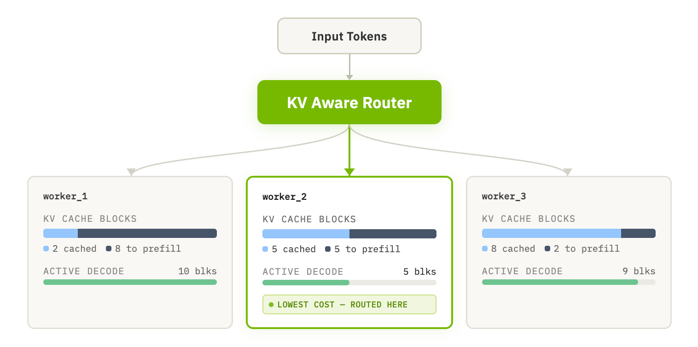

*This blog post is co-authored with [Nikhar Maheshwari](https://www.linkedin.com/in/nikharmaheshwari/),
[Anish Maddipoti](https://www.linkedin.com/in/anish-maddipoti/),
[Amr Elmeleegy](https://www.linkedin.com/in/meleegy/), and
[Rohan Varma](https://www.linkedin.com/in/rohan-s-varma/) from NVIDIA.*

We kicked things off in [Part 1](https://blog.aks.azure.com/2025/10/24/dynamo-on-aks) by introducing NVIDIA Dynamo on AKS and demonstrating 1.2 million tokens per second across 10 GPU nodes of GB200 NVL72. In [Part 2](https://blog.aks.azure.com/2026/01/22/dynamo-on-aks-part-2), we explored the Dynamo Planner and Profiler for SLO-driven scaling.

In this blog, we explore how **Dynamo’s KV Router** makes multi-worker LLM deployments significantly more efficient—demonstrating up to **~25% lower** P99 latency and **~18% faster** P99 Time To First Token (TTFT) on real-world conversation traces.

<!-- truncate -->

## The Challenge: The Hidden Cost of Redundant Compute

During inference, a router distributes incoming requests across a fleet of workers (GPUs). As each worker processes a request, it builds a **KV (key-value) cache**, which is a compute-intensive representation of the conversation context that the model uses to generate output tokens.

In production, many requests share common **prefixes**: a system prompt defining an agent’s persona, a standard compliance disclaimer, or a shared document in a retrieval-augmented generation (RAG) workflow. If a worker already holds the KV cache for a prefix, it can reuse it for the next matching request—reducing prefill and reaching the first output token faster.

Standard routing strategies such as round-robin, or policies optimized purely for load balancing, spread requests across workers without considering KV-cache locality. For globally-shared prefixes (e.g., a system prompt), this is usually fine: every worker quickly builds and retains the KV cache for that prefix. But many prefixes are shared only within a subset of traffic - forming “prefix families” - requests in the same prefix family may be tied to the same document, agent configuration, or conversation history. Load balancers scatter these related requests across the worker pool, forcing repeated prefill on workers that don’t have the relevant cached blocks, resulting in lost opportunity and ultimately, higher latencies.

Simply routing to the worker with the best cache hit is not ideal either. Doing so can overload cache-rich workers while others sit idle, creating queue buildup that hurts tail latency just as much as the redundant prefill.

This makes routing in inference a two-signal decision:

1. **Cache locality/prefill cost**: Which worker can serve this request with the least remaining prefill because it already has relevant cached KV blocks?

1. **Worker load**: Which worker can take the request without becoming a decode/queue bottleneck?

A routing strategy that optimizes only one of these signals leaves performance on the table.

## The Solution: Dynamo KV Router

[Dynamo's KV Router](https://docs.nvidia.com/dynamo/latest/design-docs/router-design#kv-router-architecture) solves this by making the routing layer "state-aware". This intelligence is designed to drop into your existing inference stack with minimal friction.

* **Engine-Agnostic Design**: The router works out-of-the-box with major engines like [vLLM](https://docs.vllm.ai/), [TensorRT-LLM](https://docs.nvidia.com/tensorrt-llm/index.html), and [SGLang](https://docs.sglang.io/). Workers automatically broadcast their cache state (KV events) to the router, requiring no complex API instrumentation or engine-specific configuration changes.

* **Intelligent, Tunable Routing**: The router doesn't just look for cache hits; it uses a cost function that balances **cache locality** against **worker load**. This is fully configurable, allowing you to tune the router's behavior to favor cache reuse (ideal for prefill-heavy workloads) or load distribution (ideal for decode-heavy workloads) depending on your inference traffic patterns.

To see this in practice, let’s take a look at how the router makes a decision in real-time:

The router scores each worker using the following cost function:

`Cost = overlap_weight × Prefill_Blocks + Decode_Blocks`,

and routes to the worker with the lowest cost. *Prefill blocks* are the blocks corresponding to input tokens not yet cached on the worker. The *overlap_weight* (default: 1.0) controls the tradeoff: higher overlap weight values penalize cache misses more heavily, favoring cache locality; lower values let decode load dominate, spreading requests more evenly.

In the above scenario, Worker 3 has the best cache hit rate (8 of 10 blocks cached), but its high decode load pushes its cost above Worker 2:

* Worker 1: 1.0 × 8 + 10 = **18**
* Worker 2: 1.0 × 5 + 5 = **10** * (selected — lowest cost)
* Worker 3: 1.0 × 2 + 9 = **11**

The router takes the partial cache hit on Worker 2 to speed up prefill, while avoiding the contention on Worker 3. This prevents cache-rich but overloaded nodes from becoming hotspots. In the next section, we put this to the test on a real-world workload.

## Validating the Approach: Benchmarks on AKS

To quantify the real-world value of inference with the KV-aware router, we ran an apples-to-apples comparison on an AKS cluster with [Dynamo](https://github.com/ai-dynamo/dynamo) and [Grove](https://github.com/ai-dynamo/grove), keeping the hardware, model, and traffic identical while changing only the routing strategy from Round-Robin to KV-Aware.

For the test environment, we deployed the [Llama-3.3-70B-Instruct-FP8](https://huggingface.co/nvidia/Llama-3.3-70B-Instruct-FP8) LLM on an AKS cluster with 8x NVIDIA H100 GPUs (4 nodes x Azure `Standard_NC80adis_H100_v5`). To simulate a production workload, we replayed 1,000 requests from the [Mooncake traces dataset](https://github.com/kvcache-ai/Mooncake) at a rate of 1 request per second. Mooncake traces are derived from real conversation logs and exhibits substantial prefix sharing (e.g., repeated system prompts and multi-turn dialogue history), making it ideal for evaluating cache-aware routing efficiency.

The following table summarizes key performance metrics across the two deployments:

| Metric | Round-Robin | KV Router | Improvement |
|--|--|--|--|
| TTFT avg | 1,756 ms | 1,405 ms | +20.0% |
| TTFT median | 369 ms | 307 ms | +16.8% |
| TTFT P99 | 11,131 ms | 9,167 ms | +17.6% |
| E2E Latency avg | 7,859 ms | 6,820 ms | +13.2% |
| E2E Latency median | 1,683 ms | 1,341 ms | +20.3% |
| E2E Latency P99 | 38,834 ms | 28,965 ms | +25.4% |

As shown in the results above, we see that smarter routing directs requests to the worker that is “experienced” with the relevant data:

* **Users received faster responses**: TTFT improved by ~18% at the tail (P99).

* Congestion dropped sharply: P99 end-to-end latency **decreased by ~25%**. With less time spent re-computing prefixes, workers completed requests sooner, avoiding the queue pileups that typically hurt performance during traffic spikes.

From these results, we see that the Dynamo KV Router eliminates the hidden cost of redundant compute, ensuring efficient use of cluster resources.

* Follow the [AKS Dynamo deployment guide](https://aka.ms/aks-dynamo) to enable it in your environment.

* Check out the [Dynamo Router Guide](https://docs.nvidia.com/dynamo/v-0-9-0/user-guides/kv-cache-aware-routing) to learn about advanced configuration options and fine-tune performance.

* Refer to the [Benchmarking Guide](https://github.com/ai-dynamo/dynamo/blob/release/0.6.1/docs/benchmarks/kv-router-ab-testing.md) to reproduce these results and compare in your setup.

## Looking Ahead: Orchestration & Data Mover (NIXL)

In this blog series, we’ve used NVIDIA Dynamo to establish the foundations for high-performance LLM serving—introducing disaggregated architectures in [Part 1](https://blog.aks.azure.com/2025/10/24/dynamo-on-aks), SLO-driven planning in [Part 2](https://blog.aks.azure.com/2026/01/22/dynamo-on-aks-part-2), and now intelligent routing. Turning these systems into production deployments requires two additional pieces: efficient data movement between components and purpose-built orchestration.

In disaggregated inference deployments, the KV cache must be transferred between prefill and decode workers, passing the computed context from the GPUs that process the prompt to the GPUs that generate the response. [NVIDIA Inference Xfer Library](https://github.com/ai-dynamo/nixl) (NIXL) is a high-bandwidth, low-latency library purpose-built for this task, and now, with the [NIXL plugin for Azure Blob Storage](https://github.com/ai-dynamo/nixl/blob/release/0.10.0/src/plugins/azure_blob/README.md), Dynamo’s disaggregated data plane can also leverage Azure Blob Storage–native integration for data movement.

To fully capitalize on NIXL’s speed and minimize transfer time, placement needs to reflect the underlying physical topology (e.g., host/GPU affinity and network proximity). As the Kubernetes-native orchestrator for Dynamo, **NVIDIA Grove** coordinates role-aware startup and component readiness. By leveraging Azure topology signals exposed to AKS (reflecting the physical network layout), Grove can schedule tightly communicating pods in closer physical proximity. This helps prevent operational “pileups,” providing a robust foundation for scaling advanced inference setups.

With Grove and NIXL, Dynamo’s disaggregated serving becomes much easier to run at scale on AKS, and we will discuss them in further detail later in this series!
