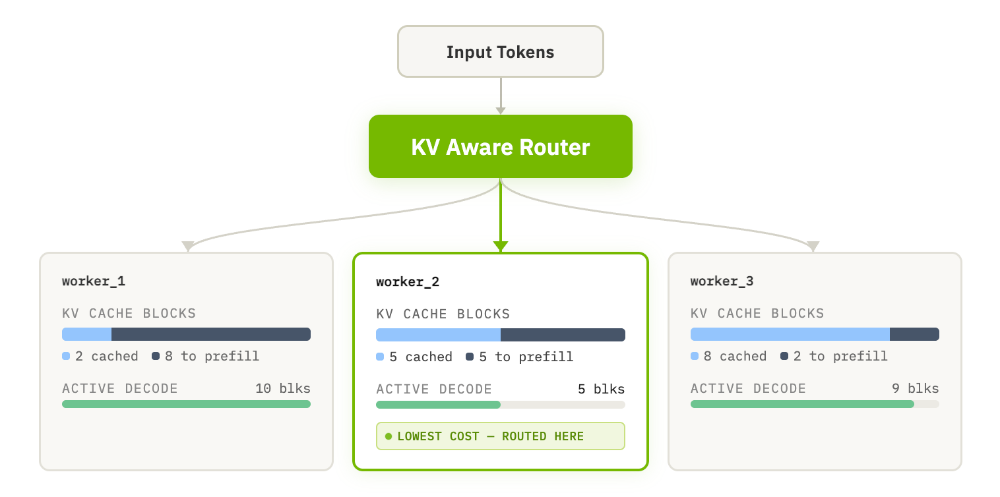

*This blog post is co-authored with [Nikhar Maheshwari](https://www.linkedin.com/in/nikharmaheshwari/),
[Anish Maddipoti](https://www.linkedin.com/in/anish-maddipoti/),
[Rohan Varma](https://www.linkedin.com/in/rohan-s-varma/),
[Clement Pakkam Isaac](https://www.linkedin.com/in/clement-ai/), and
[Stephen Mccoulough](https://www.linkedin.com/in/stephen-mcc/?lipi=urn%3Ali%3Apage%3Ad_flagship3_profile_view_base%3BEwyhTwyCTTOp9G8dfPVssw%3D%3D)
from NVIDIA.*

We kicked things off in [Part 1](https://blog.aks.azure.com/2025/10/24/dynamo-on-aks) by introducing NVIDIA Dynamo on AKS and demonstrating 1.2 million tokens per second across 10 GPU nodes of GB200 NVL72. In [Part 2](https://blog.aks.azure.com/2026/01/22/dynamo-on-aks-part-2), we explored the Dynamo Planner and Profiler for SLO-driven scaling.

In this blog, we explore how **Dynamo’s KV Router** makes multi-worker LLM deployments significantly more efficient, demonstrating over **20x faster** Time To First Token (TTFT) and over **4x faster** end-to-end latency on real-world production traces. These latency reductions not only improve the end-user experience but also maximize GPU utilization and lower the Total Cost of Ownership (TCO).

<!-- truncate -->

## The Challenge: The Hidden Cost of Redundant Compute

As enterprise Generative AI evolves into complex multi-agent workflows, system prompts and shared context windows have significantly increased in size. The compute-intensive process of reading this context and building the **Key-Value (KV) cache**, known as the **prefill** phase, introduces a bottleneck.

In production, many requests share an initial segment of tokens (that is, the **prefix**), such as a system prompt defining an agent’s persona, a standard compliance disclaimer, a shared document in a retrieval-augmented generation (RAG) workflow, or conversation history. If a worker already holds the KV cache for that prefix, it can reuse the cache for the next matching request—reducing prefill and reaching the first output token faster.

Standard routing strategies such as round-robin, or policies optimized purely for load balancing, spread requests across workers without considering KV-cache locality. As a result, requests with the same prefix may land on different workers over time, forcing KV cache rebuilds on workers that don’t currently have the relevant cached blocks.

For globally shared prefixes (e.g., a system prompt), this is acceptable: each worker quickly builds and retains the KV cache for that prefix, so routing decisions don’t materially change prefill cost. But many prefixes are shared only within subsets of traffic, forming **“prefix families.”** Requests in the same prefix family may be tied to the same document, agent configuration, or conversation history. When load balancers scatter these related requests across the worker pool, cache reuse drops and the same prefixes get rebuilt repeatedly, increasing latency.

Simply routing to the worker with the best cache hit is not ideal either. Doing so can overload cache-rich workers while others sit idle, creating queue buildup that hurts tail latency just as much as redundant prefill.

This makes routing inference requests a two-signal decision:

1. **Cache locality/prefill cost**: Which worker can serve this request with the least remaining prefill because it already has relevant cached KV blocks?

2. **Worker load**: Which worker can take the request without becoming a decode/queue bottleneck?

A routing strategy that optimizes only one of these signals leaves performance on the table.

## The Solution: Dynamo KV Router

[Dynamo's KV Router](https://docs.nvidia.com/dynamo/components/router) solves this by making the routing layer "state-aware". This intelligence is designed to drop into your existing inference stack with minimal friction.

* **Engine-Agnostic Design**: The router works out-of-the-box with major engines like [vLLM](https://docs.vllm.ai/), [TensorRT-LLM](https://docs.nvidia.com/tensorrt-llm/index.html), and [SGLang](https://docs.sglang.io/). Workers automatically broadcast their cache state (KV events) to the router, requiring no complex API instrumentation or engine-specific configuration changes.

* **Intelligent, Tunable Routing**: The router doesn't just look for cache hits; it uses a cost function that balances **cache locality** against **worker load**. This is fully configurable, allowing you to tune the router's behavior to favor cache reuse (ideal for prefill-heavy workloads) or load distribution (ideal for decode-heavy workloads) depending on your inference traffic patterns.

To see this in practice, let’s take a look at how the router makes a decision in real-time.

The router scores each worker using the following cost function:

`Cost = overlap_weight × Prefill_Blocks + Decode_Blocks`,

and routes to the worker with the lowest cost. *Prefill blocks* are the blocks corresponding to input tokens not yet cached on the worker. The *overlap_weight* (default: 1.0) controls the tradeoff: higher overlap weight values penalize cache misses more heavily, favoring cache locality; lower values let decode load dominate, spreading requests more evenly.

In the above scenario, Worker 3 has the best cache hit rate (8 of 10 blocks cached), but its high decode load pushes its cost above Worker 2:

* Worker 1: 1.0 × 8 + 10 = **18**
* Worker 2: 1.0 × 5 + 5 = **10** *(selected — lowest cost)*
* Worker 3: 1.0 × 2 + 9 = **11**

The router takes the partial cache hit on Worker 2 to speed up prefill, while avoiding the contention on Worker 3. This prevents cache-rich but overloaded nodes from becoming hotspots. In the next section, we put this to the test on a real-world workload.

## Validating the Approach: Benchmarks on AKS

To quantify the value of inference with the KV-aware router, we ran an apples-to-apples comparison on an AKS cluster using [Dynamo](https://github.com/ai-dynamo/dynamo) and [Grove](https://github.com/ai-dynamo/grove), keeping the hardware, model, and traffic identical while changing *only* the routing strategy from Round-Robin to KV-Aware.

In the test environment, we deployed the [Qwen3-32B](https://huggingface.co/Qwen/Qwen3-32B) LLM on an AKS cluster with 8x NVIDIA H100 GPUs (4 nodes of Azure `Standard_NC80adis_H100_v5`). To simulate a production workload, we replayed ~23,000 requests from the [Mooncake Tool Agent Traces](https://github.com/kvcache-ai/Mooncake/blob/main/FAST25-release/traces/toolagent_trace.jsonl) dataset with a fixed schedule, preserving the original request arrival pattern.

:::note
These traces are sampled from [Moonshot AI](https://www.moonshot.ai/)'s Kimi production cluster and capture workloads related to tool-calling and agent functionality. Such workloads are characterized by the use of long, pre-designed system prompts that are fully repetitive. For example, an AI agent with access to multiple tools must include a detailed definition of each tool (name, parameters, and calling conventions) at the start of each request. This setup results in a high degree of prefix sharing across requests, making it an apt scenario to evaluate how well cache-aware routing performs.
:::

The following table summarizes key performance metrics across the two deployments:

| Metric | Round-Robin | Dynamo KV Router | Speedup |
|--|--|--|--|
| TTFT avg. | 53,877 ms | 2,658 ms | **~20.4x** |
| TTFT P99 | 280,221 ms | 17,585 ms | **~15.9x** |
| E2E Latency avg. | 84,517 ms | 19,761 ms | **~4.3x** |
| E2E Latency P99 | 340,006 ms | 90,299 ms | **~3.8x** |

As shown in the results above, we see the advantage of routing requests to workers that already hold the matching prefix KV cache. By eliminating the hidden cost of redundant compute, the Dynamo KV Router demonstrated two key benefits in our tests:

* **Users received faster responses**: 20x faster TTFT means that users experienced significantly less wait time.

* **Congestion dropped sharply**: 4x faster end-to-end latency resulted in less time spent re-computing prefixes, so workers completed requests sooner and prevented the queue pileups that typically degrade performance during traffic spikes.

To explore further:

* Follow the [AKS Dynamo deployment guide](https://aka.ms/aks-dynamo) to enable it in your environment.

* Check out the [Dynamo Router Guide](https://docs.nvidia.com/dynamo/v-0-9-0/user-guides/kv-cache-aware-routing) to learn about advanced configuration options and fine-tune performance.

* Refer to the [Benchmarking Guide](https://aka.ms/dynamo-on-aks-benchmarking) to reproduce these results and compare in your setup.

## Looking Ahead: Orchestration & Data Mover (NIXL)

In this blog series, we’ve used NVIDIA Dynamo to establish the foundations for high-performance LLM serving—introducing disaggregated architectures in [Part 1](https://blog.aks.azure.com/2025/10/24/dynamo-on-aks), SLO-driven planning in [Part 2](https://blog.aks.azure.com/2026/01/22/dynamo-on-aks-part-2), and now intelligent routing. Turning these systems into production deployments requires two additional pieces: efficient data movement across the memory hierarchy between components and purpose-built orchestration.

In disaggregated inference deployments, the KV cache must be transferred between prefill and decode workers, passing the computed context from the GPUs that process the prompt to the GPUs that generate the response. [NVIDIA Inference Xfer Library](https://github.com/ai-dynamo/nixl) (NIXL) is a high-bandwidth, low-latency library purpose-built for this task, and now, with the [NIXL plugin for Azure Blob Storage](https://github.com/ai-dynamo/nixl/blob/release/0.10.0/src/plugins/azure_blob/README.md), Dynamo’s disaggregated data plane can also leverage Azure Blob Storage–native integration for data movement.

To leverage NIXL’s speed and minimize transfer time, placement needs to reflect the underlying physical topology (e.g., host/GPU affinity and network proximity). As the Kubernetes-native orchestrator for Dynamo, **NVIDIA Grove** coordinates role-aware startup and component readiness. By leveraging Azure topology signals exposed to AKS (reflecting the physical network layout), Grove can schedule tightly communicating pods in closer physical proximity. This helps prevent operational “pileups,” providing a robust foundation for scaling advanced inference setups.

With Grove and NIXL, Dynamo’s disaggregated serving becomes much easier to run at scale on AKS, and we will discuss them in further detail later in this series!
