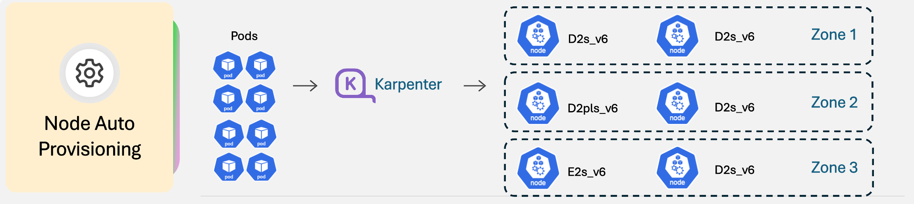

## Background

AKS users want to ensure their workloads schedule, scale, and are disrupted only when (or where) desired. The problem here is Kubernetes can feel complex, and its easy to be unclear what settings to use to accomplish this. Node Auto-Provisioning optimizes bin-packing your compute, but to best utilize it - users need to make sure certain best practices are followed for predictable behavior.

When adopting Kubernetes at scale, the hardest operational questions often aren’t “How do I scale nodes (or VMs)?” — they’re:

- Where will my workload replicas land (zones / nodes)?
- How do I express node preferences without accidentally blocking scheduling?
- If I’m using Node Auto-Provisioning (NAP), how does it interpret the rules I set?

This post will connect NAP with three most important workload-level tools for shaping predictable node provisioning outcomes on AKS:

1. **Taints and Tolerations** – control which pods can go to which nodes
2. **Affinity/Anti-Affinity** – control where workloads can (or should not) run
3. **Topology Spread Constraints** – control replica distribution across failure domains

Then we’ll connect the dots to explain what AKS Node Auto-Provisioning (NAP) does with those signals to manage your workloads.

If you’re new to these Kubernetes features, this post will give you “good defaults” as a starting point. If you’re already deep into scheduling, treat it as a checklist for the behaviors AKS users most commonly ask about.

---

<!-- truncate -->



:::info

Learn more in the official documentation: [Node Auto Provisioning](https://learn.microsoft.com/azure/aks/node-auto-provisioning) and [AKS Operator Best Practices](https://learn.microsoft.com/azure/aks/operator-best-practices-advanced-scheduler)
:::

---

## How NAP handles node selection

Node auto-provisioning provisions, scales, and manages nodes. NAP senses pending pod pressure, chooses/provisions nodes that satisfy workload specs and NodePool allowed options — and then schedules pods onto those nodes.

NAP uses the following levers to control workload scheduling:

- [NodePool CRD](https://learn.microsoft.com/azure/aks/node-auto-provisioning-node-pools) (policies / constraints) - Node settings like (SKU selection, capacity type, zones, labels, node-level resource limits)
- [AKSNodeClass CRD](https://learn.microsoft.com/azure/aks/node-auto-provisioning-aksnodeclass) (policies / constraints) - Azure-specific node settings like subnet behavior, image/OS disk/kubelet configuration, etc
- NodeClaims - details the state of provisioned and provisioning nodes
- Workload spec / deployment file - The Kubernetes manifest that defines your workload's resource requirements and scheduling constraints (Node Affinity, Tolerations, and Topology Spread Constraints)

Simply put, Workload spec expresses “where and how this pod should run”, NodePool / AKSNodeClass expresses “what nodes are allowed to exist for this class of workloads”, NodeClaims track what nodes are being scheduled or currently running.

You can think of the NodePool/AKSNodeClass as your “node policy envelope,” which your workload intent has to fit inside it.

_**Note:**_ NAP is a node-level (or infrastructure) autoscaler that schedules pods to nodes (VMs). For application level autoscaling, you can use [KEDA](https://learn.microsoft.com/azure/aks/keda-about) with NAP. We also suggest using [Vertical Pod Autoscaler (VPA)](https://learn.microsoft.com/azure/aks/vertical-pod-autoscaler) in recommendation-only mode (for example, with `updateMode: Off` in the VPA custom resource) for resource sizing recommendations.

## Part 1 — The mental model: scheduling constraints are “workload intent”

Kubernetes scheduling is a negotiation between:

- Workload intent (what your pod spec asks for)
- Available capacity (what nodes exist, and what the platform can create)

On AKS, you can express workload intent in your workload deployment file using Kubernetes concepts including:

- nodeSelector / nodeAffinity / podAffinity / podAntiAffinity
- taints & tolerations
- topologySpreadConstraints

AKS also publishes [operator best-practices guidance](https://learn.microsoft.com/azure/aks/operator-best-practices-advanced-scheduler) for these scheduler features.

## Part 2 — Topology Spread Constraints: tool for zone-aware replicas

**Topology Spread Constraints** let you tell the scheduler: “Keep these replicas balanced across domains like zones or nodes.” The Kubernetes documentation describe it as a way to spread pods across failure domains such as regions, zones, nodes, and custom topology keys.

### How NAP handles Topology Spread

NAP honors workload [topologySpreadConstraints](https://kubernetes.io/docs/concepts/scheduling-eviction/topology-spread-constraints/#topologyspreadconstraints-field). While you can list the allowed zones in the NodePool CRD, `topologySpreadConstraints` are the means to ensure topology spread.

- NAP (**without** pod-level `topologySpreadConstraints` defined) will provision wherever there is availability for the preferred VM SKU. This can look like NAP provisioning all preferred nodes in zone 1 and none in zone 2 and zone 3.
- NAP (**with** pod-level `topologySpreadConstraints` defined) ensures topology spread. NAP honors pod-level constraints (number of replicas, topology spread behavior) in the workload deployment file. See the Kubernetes docs on topology spread for other examples also.

### A good default: spread across Availability Zones

Here’s a typical “3-zone spread” pattern for a Deployment:

```yaml
spec:
  replicas: 6
  template:
    metadata:
      labels:
        app: web
    spec:
      topologySpreadConstraints:
        - maxSkew: 1
          minDomains: 3
          topologyKey: topology.kubernetes.io/zone
          whenUnsatisfiable: DoNotSchedule
          labelSelector:
            matchLabels:
              app: web
```

What these fields mean (in plain language):

- topologyKey: topology.kubernetes.io/zone → spread across zones (not just nodes).
- maxSkew: 1 → keep zone counts close (difference between most/least loaded domains can’t exceed 1 when DoNotSchedule).
- minDomains: 3 (only valid with DoNotSchedule) → treat it as a requirement that at least 3 eligible domains participate; if fewer than minDomains are eligible, Kubernetes treats the “global minimum” as 0, affecting skew calculation.
- whenUnsatisfiable: DoNotSchedule → enforce the rule strictly; if it can’t be met, pods stay Pending.

### “Hard” vs “soft” topology spreading

Kubernetes gives you two behaviors:

- _DoNotSchedule_: strict; better for HA-critical workloads, but can stall rollouts (pods stay pending) if capacity is constrained.
- _ScheduleAnyway_: best-effort; scheduler still places pods wherever there is capacity but prioritizes choices that reduce skew.

**Practical guidance:**

Start with `DoNotSchedule` for Tier-0 services where zonal placement is critical and more important than scheduling speed.
Use `ScheduleAnyway` if you’d rather progress than block workload readiness during partial zone pressure.

For more info, visit the [upstream Kubernetes docs on topology spread constraints](https://kubernetes.io/docs/concepts/scheduling-eviction/topology-spread-constraints/#topologyspreadconstraints-field).

## Part 3 — Node Affinity / Anti-Affinity: shaping which nodes are eligible

Node affinity is the evolution of [nodeSelector](https://kubernetes.io/docs/concepts/scheduling-eviction/assign-pod-node/#nodeselector): it’s more expressive and lets you define hard requirements vs soft preferences.

Common use cases:

Simple Example “Only run on GPU nodes” - You typically implement this with node labels + nodeSelector / nodeAffinity (and often taints/tolerations if you want strong isolation).

Basic Example (with NodeSelector):

```yaml
spec:
  template:
    spec:
      nodeSelector:
        accelerator: gpu
```

Standard Example (with nodeAffinity) - sets a hard rule using ` requiredDuringSchedulingIgnoredDuringExecution` requiring gpu support:

```yaml
affinity:
  nodeAffinity:
    requiredDuringSchedulingIgnoredDuringExecution:
      nodeSelectorTerms:
        - matchExpressions:
            - key: accelerator
              operator: In
              values:
                - gpu
```

Standard Example (with nodeAffinity) - “Prefer this node type, but don’t block if it’s unavailable” - Uses a soft rule of `preferredDuringSchedulingIgnoredDuringExecution` that prefer a specific SKU, but will apply best effort and schedule elsewhere if this SKU is unavailable:

```yaml
affinity:
  nodeAffinity:
    preferredDuringSchedulingIgnoredDuringExecution:
        preference:
          matchExpressions:
            - key: node.kubernetes.io/instance-type
              operator: In
              values: ["Standard_D16ds_v5"]
```

 Standard Example - “Never co-locate replicas on the same node”

That’s usually `podAntiAffinity` or topology spread across hostname.
This scenario uses a hard rule `DoNotSchedule` to spread pods using kubernetes.io/hostname:

```yaml
topologySpreadConstraints:
- maxSkew: 1
  topologyKey: kubernetes.io/hostname
  whenUnsatisfiable: DoNotSchedule
  labelSelector:
    matchLabels:
      app: web
```

### How do Topology Spread Constraints interact with Node Affinity rules?

Both Topology Spread Constraints and Node Affinity have hard and soft controls. If you set both, depending on how they are set Kubernetes and AKS with factor them into scheduling logic in multiple paths. 

Node Affinity rules can either be:

- Hard Rule - `requiredDuringSchedulingIgnoredDuringExecution`
- Soft Rule (best effort) - `preferredDuringSchedulingIgnoredDuringExecution`

Topology Spread Constraint can either be:

- Hard Rule - `whenUnsatisfiable: DoNotSchedule`
- Soft Rule (best effort) - `whenUnsatisfiable: ScheduleAnyway`

The following table lists what to expect when you set these two constraints together in common scenarios, and our recommended setting:

| Topology Spread Configuration | Affinity Configuration | Observed Scheduling Behavior | Recommendation |
|------------------------------|------------------------|------------------------------|----------------|
| **Hard** (`whenUnsatisfiable: DoNotSchedule`) | **Hard Node Affinity** (`requiredDuringSchedulingIgnoredDuringExecution`) | Pod remains **Pending** if no node satisfies *both* constraints. The scheduler filters out all nodes that violate either rule. | Use only when you are certain the constraints are always compatible (for example, multi‑zone node affinity plus multi‑zone spread). Avoid mixing single‑zone affinity with multi‑zone spread. |
| **Soft** (`whenUnsatisfiable: ScheduleAnyway`) | **Hard Node Affinity** (`requiredDuringSchedulingIgnoredDuringExecution`) | Pod schedules only on nodes matching affinity. Topology spread is applied as **best‑effort**, and distribution may be uneven. | ✅ **Recommended default** for most workloads. Enforce strict placement requirements while keeping high availability best‑effort. |
| **Hard** (`whenUnsatisfiable: DoNotSchedule`) | **Soft Node Affinity** (`preferredDuringSchedulingIgnoredDuringExecution`) | Pod schedules only if topology spread constraints are met. Affinity acts only as a preference among valid nodes. | Use when even distribution across zones or nodes is more important than node‑level preferences. |
| **Soft** (`whenUnsatisfiable: ScheduleAnyway`) | **Soft Node Affinity** | Pod always schedules. Both constraints only influence scoring; placement is flexible and may be imbalanced. | Suitable for dev/test, batch, or low‑criticality workloads. |
| **Hard multi‑zone spread** (`whenUnsatisfiable: DoNotSchedule` and `minDomains` >= 2) | **Single‑zone hard affinity** | Pod enters a permanent **Pending** state due to a logical contradiction between constraints. | Align affinity and spread to the same topology domains, or relax one of the constraints. |

#### Practical Guidance

1. Decide which requirement is truly “must-have.”

- Make that one hard (required… or DoNotSchedule).
- Make the other a preference (preferred… or ScheduleAnyway).

2. If you combine strict affinity with strict multi-zone spread, double-check feasibility:

- If affinity restricts you to 1 zone, you cannot also require even spread across 3 zones with `DoNotSchedule`.

3. Use nodeAffinityPolicy: Honor when your intent is “spread within the nodes I’ve made eligible via affinity.”

## Part 4 — Taints and Tolerations  

Taints and tolerations are mechanisms used in Kubernetes to control which pods can be scheduled onto which nodes. They allow you to ensure that certain pods do not run on particular nodes, enabling more fine-grained control over your clusters.

### A Practical AKS/NAP Mental Model  for taints and tolerations

Think of taints as a ‘Do Not Enter’ sign on a node. If a node has a specific taint, pods must tolerate it to be scheduled on that node. This helps families of workloads maintain their operational boundaries while ensuring they run on appropriate resources.  

Taints are defined in your [NodePool CRD](https://learn.microsoft.com/azure/aks/node-auto-provisioning-node-pools), and Tolerations are defined in your workload deployment file. 

### Taint your NAP-managed nodes

In NAP, you can provide taints in your [NodePool CRD](https://learn.microsoft.com/azure/aks/node-auto-provisioning-node-pools), and every node created based on this NodePool CRD will have this taint. If you only want specific nodes to have this taint, make sure you have a specific NodePool CRD file created for this purpose (as you can have multiple NodePool CRDs). 

In the following example shows a taint called `test.com/custom-taint` that is added in the `spec.template.spec.taints` field in a [NodePool CRD](https://learn.microsoft.com/azure/aks/node-auto-provisioning-node-pools):

```yaml
apiVersion: karpenter.sh/v1
kind: NodePool
metadata:
  name: default
spec:
  template:
      taints:
        - key: test.com/custom-taint
          effect: NoSchedule
```

> ![NOTE] Taints can prevent pods from being scheduled to these nodes if they are not tolerated by the pods. A proper toleration must be added to your specific pods to allow them to be scheduled to nodes that are based on this NodePool CRD.

### Tolerations for your workloads

Tolerations are a field you place in your workload deployment file to flag what types of tainted nodes these pods can be scheduled to. There are two general behaviors for tolerations:

- `NoSchedule` - strict toleration. Only pods with the proper toleration can be scheduled to the node with a specific taint.
- `PreferNoSchedule` - less strict toleration. AKS will _try_ to avoid placing pods that don't tolerate this node's taint, but it's not gauranteed.

1. **NoSchedule Toleration** example:

```yaml  
   tolerations:  
   - key: "key1"  
     operator: "Equal"  
     value: "value1"  
     effect: "NoSchedule"  
```

2. **PreferNoSchedule Toleration** example:

```yaml
tolerations:  
- key: "key2"  
  operator: "Equal"  
  value: "value2"  
  effect: "PreferNoSchedule"  
```

### Common Taint + Toleration Pitfalls

- Over-tainting Nodes: Be cautious not to overuse taints as they can create scheduling issues.
- Complexity in Management: Managing multiple taints and tolerations can become complex, making debugging and management harder.

For more on Taints and Tolerations, visit our [operator best practices docs](https://learn.microsoft.com/azure/aks/operator-best-practices-advanced-scheduler#provide-dedicated-nodes-using-taints-and-tolerations) or the [Kubernetes documentation](https://kubernetes.io/docs/concepts/scheduling-eviction/taint-and-toleration/).

## FAQ

- How can I overprovision? I always want to be overprovisioned by 10% so I can respond to spikes of traffic

When using NAP, you can set your resource needs slightly higher than you expect to actually use. NAP responds to pending pod pressure, so by default it provisions nodes to match the amount you request in your deployment file. When not using an autoscaler, you have the option to use [overprovisioning](https://learn.microsoft.com/azure/aks/best-practices-performance-scale#overprovisioning) to have excess compute to respond quickly to spikes of traffic. 

- How can I reduce latency when trying to schedule nodes?

You can consider enabling features such as [Artifact Stream](https://learn.microsoft.com/en-us/azure/aks/artifact-streaming) which can decrease pod readiness time. 

For more visit our documentation on [performance and scaling best practices](https://learn.microsoft.com/en-us/azure/aks/best-practices-performance-scale).

## Next steps

Ready to get started?

1. **Try NAP today:** Follow the [Enable Node Auto Provisioning steps](https://learn.microsoft.com/azure/aks/use-node-auto-provisioning).
1. **Learn more:** Visit our AKS [operator best-practices guidance](https://learn.microsoft.com/azure/aks/operator-best-practices-advanced-scheduler).
1. **Share feedback:** Open issues or ideas in [AKS GitHub Issues](https://github.com/Azure/AKS/issues).
1. **Join the community:** Subscribe to the [AKS Community YouTube](https://www.youtube.com/@theakscommunity) and follow [@theakscommunity](https://x.com/theakscommunity) on X.
