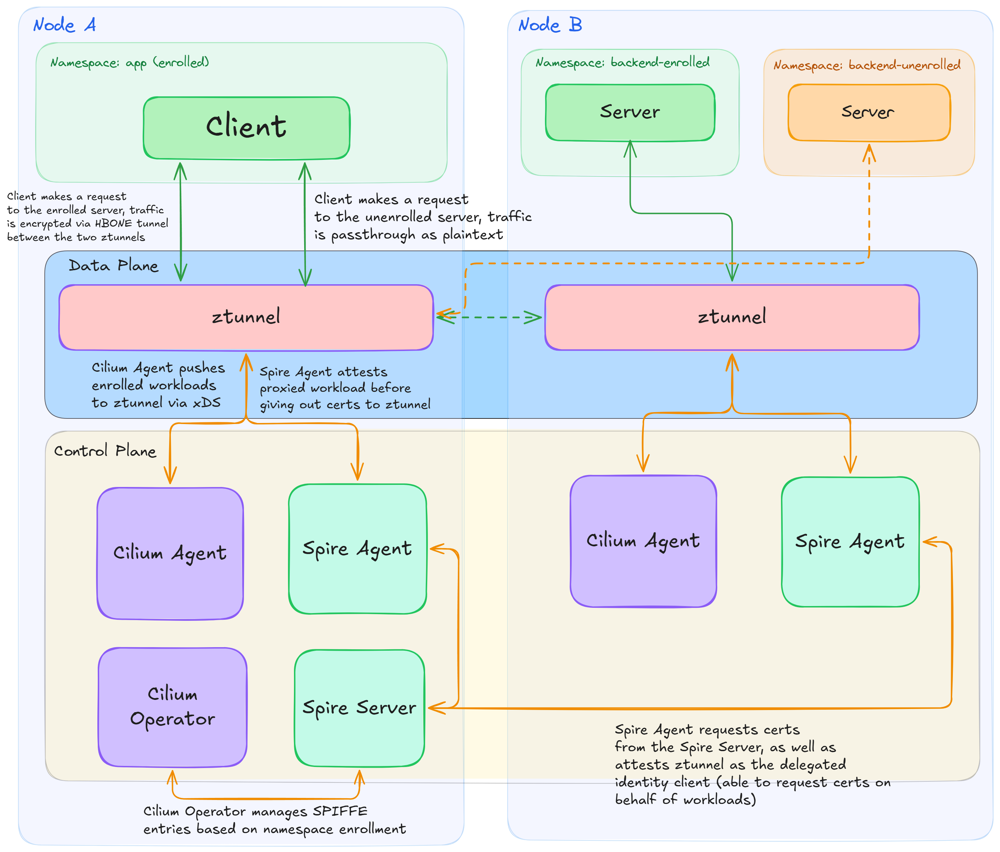

<!-- markdownlint-disable MD033 -->

import BrowserOnly from '@docusaurus/BrowserOnly';
import { useColorMode } from '@docusaurus/theme-common';

export function TransparentMtlsAnimation() {
  const { colorMode } = useColorMode();
  const theme = colorMode === 'light' ? 'light' : 'dark';
  return (
    <iframe
      src={`https://nddq.github.io/transparent-mtls-animation/?theme=${theme}`}
      width="100%"
      height="700"
      style={{border: "none"}}
      title="Interactive mTLS flow walkthrough"
      sandbox="allow-scripts"
      referrerPolicy="no-referrer"
      loading="lazy"
    />
  );
}

## The Encryption Gap in Kubernetes

Kubernetes does not encrypt pod-to-pod traffic by default. Anyone with access to the underlying network — through a compromised workload, a misconfigured node, or otherwise — can observe or tamper with that traffic.

The traditional fix has been a sidecar-based service mesh: an Envoy proxy per pod, terminating and re-originating TLS at each hop. This works, but the costs are real — increased memory and CPU per pod, added latency, complex upgrade workflows, and a sidecar lifecycle tightly coupled to application deployments.

We [recently announced](https://techcommunity.microsoft.com/blog/AzureNetworkingBlog/announcing-public-preview-cilium-mtls-encryption-for-azure-kubernetes-service/4504423) **transparent mutual TLS (mTLS)** as a transit encryption option for [Advanced Container Networking Services (ACNS)](https://learn.microsoft.com/azure/aks/advanced-container-networking-services-overview), powered by [Cilium](https://github.com/cilium/cilium) and [ztunnel](https://github.com/istio/ztunnel). It brings workload-level encryption to AKS without sidecars, without application changes, and without a separate service mesh stack. This post dives into how it works at the implementation level.

<!-- truncate -->

## Architecture Overview

The system has two halves: ztunnel as the **data plane**, and Cilium as the **control plane**.

**[ztunnel](https://github.com/istio/ztunnel)** is a lightweight L4 proxy written in Rust, originally built by Istio for [ambient mesh](https://istio.io/latest/docs/ambient/overview/). It runs as a DaemonSet — one instance per node — and transparently intercepts traffic from enrolled pods. Rather than building a new proxy, the Cilium community adopted ztunnel: it already solves the problem well, and reusing it means both ecosystems benefit from improvements. The public preview ships with a [Cilium fork of ztunnel](https://github.com/cilium/ztunnel) that adds SPIRE support and xDS-over-Unix-socket transport — both are in the process of being upstreamed to the Istio project.

Instead of using Istio's istiod control plane to program the ztunnel data plane, **Cilium's control plane**, consisting of two components, is used:

- The **Cilium agent** (per-node DaemonSet) handles the node-local relationship with ztunnel — enrolling pods, streaming workload discovery, setting up traffic interception, and optionally signing certificates. All communication with ztunnel happens over local Unix sockets.
- The **Cilium operator** (cluster-wide) handles SPIRE identity registration — when a namespace is enrolled, it creates SPIRE entries for all service accounts in that namespace so ztunnel can obtain certificates on their behalf.

Each workload's identity is derived from its Kubernetes namespace and service account, encoded as a [SPIFFE](https://spiffe.io/) ID:

```text
spiffe://<trust-domain>/ns/<namespace>/sa/<service-account>
```

This identity is embedded in the workload's X.509 certificate and verified during every mTLS handshake. The tunneling protocol is [HBONE](https://istio.io/latest/docs/ambient/architecture/hbone/) (HTTP-Based Overlay Network Encapsulation): TCP streams are encapsulated in HTTP/2 CONNECT tunnels, with mTLS 1.3 securing the outer connection to provide forward secrecy and modern cipher suites by default.



### Interactive Walkthrough

Step through the full mTLS flow with code references in this interactive animation:

<BrowserOnly>
  {() => <TransparentMtlsAnimation />}
</BrowserOnly>

Can't see the animation? [Open it directly](https://nddq.github.io/transparent-mtls-animation/).

## Namespace Enrollment

Enrollment is namespace-scoped. When you label a namespace:

```yaml
metadata:
  labels:
    io.cilium/mtls-enabled: "true"
```

The Cilium agent detects the change via a Kubernetes watch. Internally, enrolled namespaces are tracked in Cilium's in-memory state store (StateDB). A reconciliation controller — following the same watch-and-react pattern familiar from Kubernetes controllers — monitors this state and pushes all existing pod endpoints in newly enrolled namespaces as workload discovery events to ztunnel.

## The Three Control Plane Channels

Cilium and ztunnel communicate over three distinct channels, each with its own socket and protocol. All three are local to the node — there is no cross-node control plane traffic.

### ZDS — Workload Lifecycle

The Ztunnel Discovery Service (ZDS) manages the lifecycle of enrolled workloads over a Unix socket at `/var/run/cilium/ztunnel.sock`. When ztunnel connects, Cilium sends an initial snapshot of all enrolled pods — one message per pod, carrying its namespace, name, service account, and UID. Crucially, each message includes the pod's **network namespace file descriptor** passed as ancillary data via `unix.UnixRights()`. This is how ztunnel gains access to the pod's network namespace without being a sidecar. After the snapshot, incremental add/delete messages flow as pods are created or deleted.

### xDS — Workload Address Discovery

The xDS server provides workload and service discovery over a Unix socket at `/var/run/cilium/xds.sock`. It implements xDS in delta mode — the same protocol ztunnel already speaks with istiod, so no ztunnel-side changes were needed. For each enrolled endpoint, Cilium sends a workload record containing the pod's identity and IP addresses, marked with `TunnelProtocol=HBONE`. This is how ztunnel decides whether to encrypt traffic to a given destination or pass it through as plaintext.

### CA — Certificate Signing

Workload certificates — the X.509 credentials that enable mTLS — can come from two sources:

**Built-in CA**: The Cilium agent runs a gRPC server implementing `IstioCertificateService` on TCP port 15012 with TLS. Ztunnel sends Certificate Signing Requests (CSRs); the CA signs them using a pre-provisioned CA key. This is the only mode currently supported in upstream Cilium and is primarily useful for development and testing.

**SPIRE**: For production environments, the built-in CA is disabled and ztunnel obtains certificates directly from a SPIRE agent, which provides attestation-based identity verification. SPIRE is the intended CA for production deployments and is what ships with the ACNS public preview. The SPIRE integration is in the process of being upstreamed to Cilium open source. See the [SPIRE Integration](#spire-integration--production-identity) section below for details.

## Traffic Interception

When a pod is enrolled via ZDS, the Cilium agent enters the pod's network namespace (using the file descriptor received during the ZDS handshake) and installs iptables rules. These rules transparently redirect the application's TCP traffic to ztunnel's listening ports.

The rules use two custom chains — `CILIUM_PREROUTING` and `CILIUM_OUTPUT` — in both the `mangle` and `nat` tables:

**Inbound traffic** (PREROUTING):

- Non-localhost TCP traffic without the inpod mark (`0x539`) is redirected to ztunnel's **inbound plaintext port** (15006). This is how ztunnel intercepts incoming traffic destined for the pod.
- Port 15008 — ztunnel's **HBONE inbound port** — is excluded from redirection since it already receives encrypted traffic directly from remote ztunnel instances.

**Outbound traffic** (OUTPUT):

- The tproxy connmark (`0x111`) is restored from the connection tracker — traffic already processed by ztunnel is allowed through without re-redirection.
- Self-addressed loopback traffic bypasses ztunnel (app-to-app on the same pod).
- DNS traffic is not redirected — the iptables rules only capture TCP, so UDP-based DNS bypasses ztunnel entirely.
- All other non-localhost TCP traffic without the inpod mark is redirected to ztunnel's **outbound port** (15001).

The combination of packet marks (`0x539` for "ztunnel processed" and `0x111` for "already redirected") prevents redirection loops — ztunnel marks its own outbound packets so they pass through the iptables rules untouched.

## SPIRE Integration — Production Identity

[SPIRE](https://spiffe.io/docs/latest/spire-about/) is the reference implementation of the SPIFFE standard — it issues short-lived X.509 certificates to workloads after verifying their identity through a process called attestation. The SPIRE integration is the most significant extension to the ztunnel feature, spanning both the Cilium operator and the ztunnel fork. Where the built-in CA simply signs any CSR it receives, SPIRE provides cryptographic attestation: it verifies the workload's identity by inspecting its running process before issuing a certificate.

### Operator Side — Registering Identities

When a namespace is enrolled, the Cilium operator iterates all ServiceAccounts in that namespace and registers them with the SPIRE server. For each service account, it creates a SPIRE entry:

```text
SpiffeId:  spiffe://<trust-domain>/ns/<namespace>/sa/<service-account>
ParentId:  spiffe://<trust-domain>/ztunnel
Selectors: [k8s:ns:<namespace>, k8s:sa:<service-account>]
```

The `ParentId` of `/ztunnel` establishes the delegation chain — it scopes which workload entries ztunnel can fetch certificates for through the Delegated Identity API. When a namespace is unenrolled, the operator batch-deletes all associated SPIRE entries.

### Ztunnel Side — Certificate Acquisition via SPIRE

On the ztunnel side, a new `SpireClient` uses SPIRE's [Delegated Identity API](https://github.com/spiffe/spire/blob/main/proto/spire/api/agent/delegatedidentity/v1/delegatedidentity.proto) to fetch X.509 certificates for workloads. When ztunnel needs a certificate, it resolves the workload's pod UID to a container PID via the Container Runtime Interface (CRI) API, then passes that PID to SPIRE for attestation. SPIRE verifies the PID belongs to the claimed identity and returns an X.509 SVID (certificate + private key). As a security measure, ztunnel re-verifies the PID after attestation to guard against PID reuse races.

Certificates are cached per-pod for SPIRE (since each pod has a distinct PID) versus per-identity for the built-in CA. Certificates are fetched on-demand when ztunnel first needs them for a connection.

## Permissive Mode

ztunnel operates in **permissive mode** by default, enabling incremental rollout without disrupting existing traffic:

- **Enrolled → Enrolled**: Traffic is encrypted via HBONE mTLS. Both sides verify each other's SPIFFE identity.
- **Enrolled → Non-enrolled**: ztunnel proxies the traffic but sends it as **plaintext**. No encryption, no disruption.
- **Non-enrolled → Enrolled**: Traffic arrives as plaintext. ztunnel on the destination node accepts it without requiring mTLS.

This means you can enroll namespaces one at a time. Enrolled pods can still reach external APIs, databases in non-enrolled namespaces, and any other service — traffic flows normally, just without encryption for those paths.

## Current Limitations and What's Next

The initial release focuses on **encryption and identity** — transparent mTLS for all traffic between enrolled pods. This is the foundation that everything else builds on.

What's **not yet supported**:

- **L4/L7 network policy enforcement**: L3 policies (IP-based) work with enrolled traffic, but L4 port-based rules are not yet enforced — ztunnel rewrites destination ports during redirection, so Cilium's eBPF datapath sees the rewritten port rather than the original. L7 policies are similarly not yet supported for ztunnel-proxied connections.
- **Identity-based authorization**: Fine-grained access control based on SPIFFE identity (e.g., allowing only specific service accounts to reach a backend) is not yet supported in Cilium.

The goal is a layered architecture: ztunnel handles encryption and identity-based authorization at L4, Cilium enforces network policy at the eBPF datapath, and [waypoint proxies](https://istio.io/latest/docs/ambient/overview/#layer-7-features) are an area we can explore for L7 traffic management in the future.

:::info Ready to try it?

Follow the [step-by-step guide](https://learn.microsoft.com/azure/aks/container-network-security-cilium-mutual-tls-how-to) to enable Cilium mTLS on your AKS cluster, track upstream development on [GitHub](https://github.com/cilium/cilium), and share feedback on the [AKS GitHub Issues](https://github.com/Azure/AKS/issues) page.

:::
