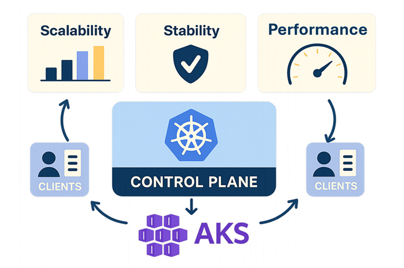
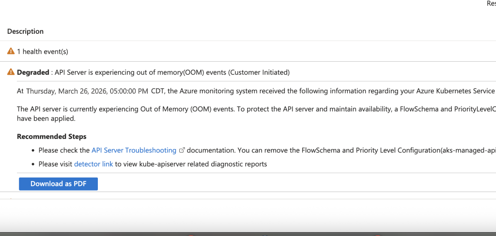

Azure Kubernetes Service (AKS) now includes several control plane enhancements to enable large clusters scale more efficiently and operate reliably. These enhancements include streaming LIST responses, higher control plane resource limits, API server guard and etcd defragmentation optimizations.

<!-- truncate -->

## Introduction

A key factor in Kubernetes scalability is how clients interact with the control plane and how those interactions shape the cluster’s overall scale envelope. Unoptimized API server call patterns by clients and growing etcd footprints can place increasing pressure on the control plane, ultimately limiting cluster scalability. To address this, AKS includes a set of built‑in control plane enhancements for large clusters that automatically improve scalability, performance, and stability without requiring any manual configuration from customers.

## Streaming encoder for LIST responses

The API server's response encoders traditionally serialize the entire response into a contiguous block of memory and perform one [ResponseWriter.Write](https://pkg.go.dev/net/http#ResponseWriter.Write) call to transmit data to the client. If multiple large LIST requests arrive simultaneously, the cumulative memory consumption can grow quickly, leading to Out-of-Memory (OOM) events that compromise cluster stability.

Kubernetes v1.33 introduced [streaming encoding for LIST responses](https://kubernetes.io/blog/2025/05/09/kubernetes-v1-33-streaming-list-responses/). This approach processes and transmits each item individually, so memory is freed progressively as each chunk is sent. In benchmarks, this reduced memory usage by up to 20x in heavy LIST scenarios.

This capability is backported to AKS versions 1.31.9+ and 1.32.6+, so your clusters benefit before upgrading to 1.33.

### Benefits

- **Reduced memory consumption**: Your API server uses significantly less memory when handling large list requests. This reduces the likelihood of OOM events, thereby improving API server response time.
- **Increased scalability and stability**: Your API server can handle more concurrent requests and larger datasets, increasing your cluster's current scale ceiling.

## Higher control plane resource limits

AKS autoscales your control plane based on cluster size, measured by total compute cores in the cluster, and the control plane's CPU and memory utilization. With this enhancement, your AKS control plane can now receive up to 4x higher CPU and memory limits during scaling. This gives large clusters more room to handle the most demanding workloads.

### Benefits

- **Greater scalability**: Your cluster can support more nodes and workloads. This is especially beneficial for advanced scenarios such as AI inference and training.
- **Lower latency**: Higher CPU and memory help reduce your API server's response time.
- **Higher stability**: Your control plane encounters fewer bottlenecks and remains more stable under heavy load.

## AKS managed API server guard

When the API server remains unstable after scaling to the maximum control plane resource limits, and out-of-memory (OOM) incidents continue, AKS applies a [managed flow schema and priority level configuration](https://learn.microsoft.com/troubleshoot/azure/azure-kubernetes/create-upgrade-delete/troubleshoot-apiserver-etcd?tabs=resource-specific#cause-4-aks-managed-api-server-guard-was-applied) that throttles non-system API server requests. 

In most cases, resource-intensive LIST operations from unoptimized clients trigger this instability. This last-resort safeguard keeps the API server stable and operational, even under extreme load.

### Benefits

- **Protects API server integrity**: Prevents your API server from becoming unresponsive due to excessive load, helping preserve overall cluster stability.
- **Simplified troubleshooting**: AKS proactively notifies you through a [resource health notification](https://learn.microsoft.com/azure/service-health/resource-health-overview) when API server guard is applied. The [API server resource intensive listing detector](https://learn.microsoft.com/troubleshoot/azure/azure-kubernetes/create-upgrade-delete/troubleshoot-apiserver-etcd?tabs=resource-specific#step-2---identify-and-analyse-latency-for-user-agent) in Diagnose & Solve helps you identify unoptimized clients. Once client call patterns are optimized, you also have the ability to override or modify the managed API server guard.

## etcd defragmentation optimizations

Defragmentation is essential for reclaiming unused space in etcd by rewriting fragmented data into contiguous storage. Because defragmentation blocks reads and writes, it runs on one etcd replica at a time, and larger databases take longer to complete.

AKS now includes etcd defragmentation optimizations for large clusters, reducing defragmentation time by up to 50%. For example, in a sample cluster with an etcd size of about 2 GB, per-replica defragmentation time decreased from about 18 seconds to about 9 seconds.

### Benefits

- Reduces your API server's response time spikes and transient client timeouts during etcd operations that serve client reads and writes.

## Conclusion

These improvements make your control plane more resilient, scalable, and performant, and reduce the manual configuration needed to scale your existing clusters to handle the most demanding workloads. Always remember, the Kubernetes scale envelope remains multidimensional. The number and size of cluster objects, such as pods, nodes, CRDs, Secrets, ConfigMaps, and other resources along with client behavior, continue to play a critical role in how efficiently your cluster scales.

To learn more about the Kubernetes scale envelope, its interaction with the control plane, client optimization, creating resource health alerts and best practices for running large clusters, refer to:

- **[AKS Best Practices for Large Clusters](https://learn.microsoft.com/azure/aks/best-practices-performance-scale-large)**
- **[API Server and etcd - Troubleshooting Guide](https://learn.microsoft.com/troubleshoot/azure/azure-kubernetes/create-upgrade-delete/troubleshoot-apiserver-etcd)**
- **[Create Resource Health Alerts](https://learn.microsoft.com/azure/service-health/resource-health-alert-arm-template-guide)**