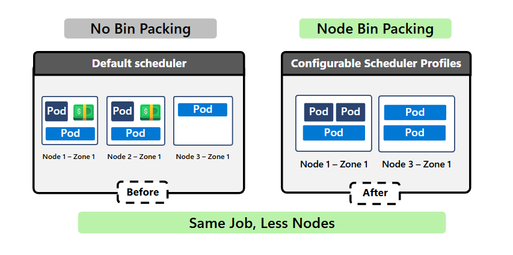
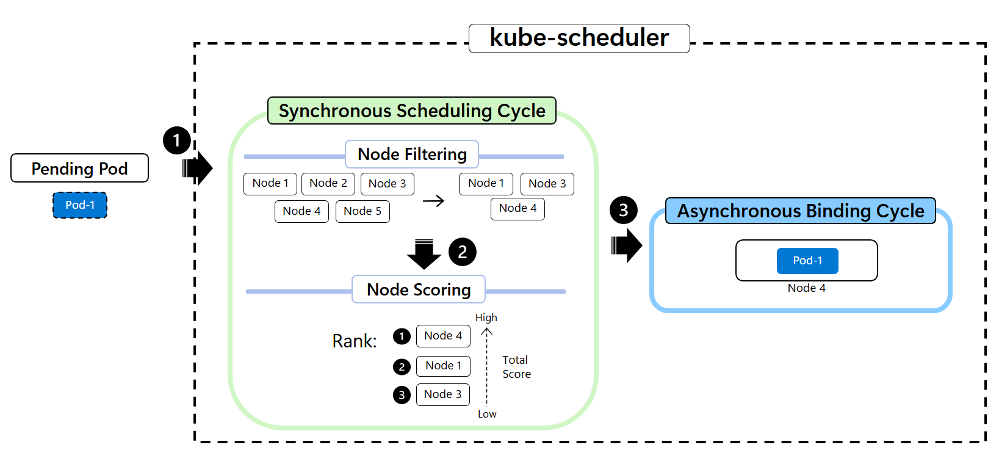
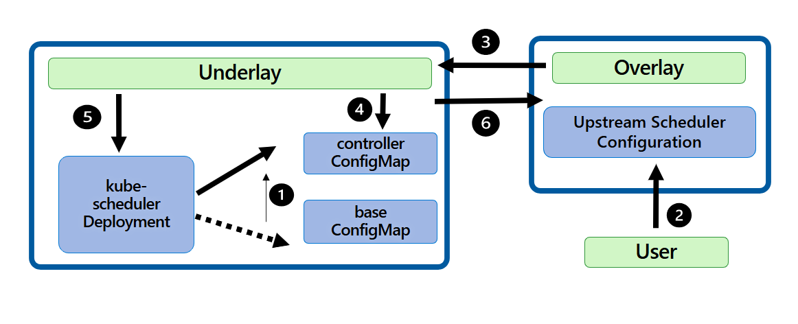
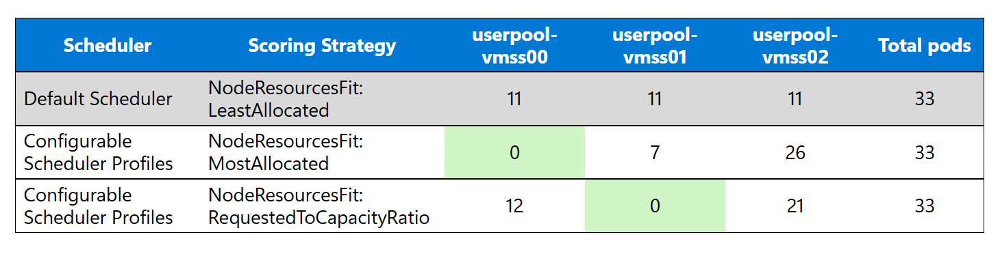

In 2025, Datadog found most Kubernetes containers use less than [25% of their requested CPU][datadog-state-of-containers], and in 2023 Weights and Biases found that nearly a third of GPU users [average less than 15% utilization][wb-gpu-utilization]. This data signals that underutilized resources materially contribute to increased infrastructure cost. While there are many factors that impact node utilization, as a core component of the Kubernetes control plane, the kube-scheduler has a big influence on node utilization.

[Configurable Scheduler Profiles][concepts-scheduler-configuration] on AKS lets customers configure their own scheduling logic: enable specific plugins, adjust plugin priorities, and tune parameter weights. The result: higher node density, better GPU utilization, and lower infrastructure costs.

This blog explains how the default Kubernetes scheduler places pods, where the defaults fall short, and how to increase node utilization using Configurable Scheduler Profiles on AKS.

1. [How does kube-scheduler work?](#how-does-the-default-kubernetes-scheduler-place-pods)
2. [Use Configurable Scheduler Profiles to increase node utilization and operator control](#configurable-scheduler-profiles-on-aks)
3. [Increase AKS cluster CPU utilization up to 85% with Configurable Scheduler](#increase-aks-cpu-utilization)
4. [Increase AKS cluster GPU or CPU utilization while balancing memory with Configurable Scheduler](#increase-aks-gpu-utilization)
5. [FAQ: How do Configurable Scheduler Profiles interact with autoscalers?](#faq)

<!-- truncate -->



## How does the default Kubernetes scheduler place pods?

The Kubernetes scheduler operates in two cycles: a synchronous scheduling cycle and an asynchronous binding cycle. The scheduling cycle has two sub-phases, filtering and scoring, and only manages one pod at a time.

1. **Filtering** phase removes unsuitable nodes based on hard and soft constraints.
2. **Scoring** phase calculates a score for the remaining nodes; ultimately, the most suitable node has the highest score.

Once a node is selected, the binding cycle can process multiple pods in parallel. During this phase, the scheduler attempts to bind the pod to the chosen node. If binding a pod to a node fails, the scheduler tries the node with the next highest score. When filtering and scoring nodes, the default scheduler considers several hard and soft constraints with predefined weights, including (but not limited to):

1. Resource requirements (CPU, memory)
2. Node affinity/anti-affinity
3. Pod affinity/anti-affinity
4. Taints and tolerations
5. TopologySpreadConstraints



For a deep dive on the Kubernetes Scheduler visit technical blog from SIG Scheduling contributor and AKS Upstream Engineer, Heba Elayoty, [Deep Dive into the Kubernetes Scheduler Framework][deep-dive-scheduler-framework].

### Limitations of the default Kubernetes scheduler

The default scheduler is primarily designed for general-purpose workloads that prioritize nodes with the most available resources using the _LeastAllocated_ scoring strategy. This spreads pods across nodes, even when they could safely be packed more densely. While this works well for many services, the default scheduling criteria, and their fixed priority order, are not suitable for workloads that demand optimizing GPU and CPU utilization. In these scenarios, spreading pods across nodes can lead to fragmented resources, underutilized GPUs, and increased infrastructure cost.

Today, the default scheduler on AKS lacks the flexibility for users to change which criteria should be prioritized, or ignored, in the scheduling cycle on a per cluster basis. This rigidity often forces users to either accept suboptimal placement or manage a separate custom scheduler, both of which increase operational complexity. Starting with Kubernetes v1.33, AKS introduces Configurable Scheduler Profiles - an AKS-managed CRD - that exposes the upstream scheduling framework without maintaining a separate scheduler. Now, users can adjust the `NodeResourcesFit` plugin from the default configuration to favor nodes with higher utilization to achieve more efficient bin‑packing and reduce infrastructure cost.

## Configurable Scheduler Profiles on AKS

[Configurable Scheduler Profiles on AKS][concepts-scheduler-configuration] allow customers to benefit from the extensibility of the [scheduling framework][scheduling-framework-interfaces] while reducing the operational overhead of adopting a second scheduler or defining a custom scheduler. Configurable Scheduler Profiles use a Custom Resource Definition (CRD) that lets users define custom scheduler profiles with their own scheduling logic. A dedicated controller continuously reconciles these user-defined configurations with the underlying kube-scheduler deployment, validating changes and applying them transparently. If a new configuration causes the scheduler to become unhealthy, the controller automatically reverts to the last known good state to ensure cluster stability.



A profile is a set of one or more in-tree scheduling plugins and configurations that dictate how to schedule a pod. AKS supports 18 in-tree Kubernetes [scheduling plugins][supported-in-tree-scheduling-plugins].

## Increase node utilization and operator control

In this simple scale-out scenario, when you manually increase replicas from 8 to 30 with identical pod specs, the default scheduler distributes pods evenly across nodes. Configurable Scheduler Profiles that use the `NodeResourcesFit` plugin show a visible consolidation pattern that differs from the default scheduler's logic. Instead of spreading pods evenly, the scheduler begins to intentionally concentrate workloads onto fewer nodes. This shift occurs without changing the workload, node size, or autoscaling behavior - only the scheduler’s scoring logic.

While this experiment uses intentionally simple, CPU-bound containers to isolate scheduling behavior, the placement patterns observed here generalize to more complex workloads where consolidation and utilization efficiency matter. This change in distribution shape enables downstream efficiencies: improved control for platform engineers, efficient resource usage, and cost optimization that are difficult to achieve when pods are evenly spread.



The key takeaway is that each profile expresses a distinct scheduling intent. The next two sections detail how MostAllocated and RequestedToCapacityRatio achieve these outcomes.
| Scheduler / Profile | Scheduling intent | Operator Benefits |
|---|---|---|
| Default scheduler<br/>NodeResourcesFit: LeastAllocated | Balance and hotspot reduction | No tuning |
| Configurable Scheduler Profile<br/>NodeResourcesFit: MostAllocated | Maximize consolidation / bin‑packing | Maximum node utilization, highest cost reduction potential |
| Configurable Scheduler Profile<br/>NodeResourcesFit: RequestedToCapacityRatio | Targeted utilization with headroom | Increased utilization with stronger control over consolidation and burst headroom than `MostAllocated` |

### Increase AKS CPU utilization

`RequestedToCapacityRatio` scores nodes based on the ratio of requested resources to total node capacity after the pod is _hypothetically_ placed. This strategy enables more fine-grained bin‑packing by allowing operators to define an ideal utilization curve for their nodes rather than simply preferring the most or least utilized nodes. Lastly, it is critical to note that `PodTopologySpread` is disabled in this profile because bin-packing and zone-spreading are opposing goals and the scheduling logic may prioritize pod spreading. If you need both high utilization _and_ zone resilience, define a new profile to achieve both goals.

By shaping the scoring curve to target a range of 50-85% CPU utilization, operators can increase pod density on provisioned nodes while preserving headroom for bursts, background processes, and system components in CPU-based workloads. [Configure node bin-packing][configure-requested-to-capacity] using the `RequestedToCapacityRatio` strategy to improve utilization and reduce infrastructure costs.

**This bin packing profile is configured to favor nodes within a utilization band of 50-85%, avoiding empty nodes, and severely deprioritizing nearly full nodes at 90% utilization or more, to limit oversaturated nodes. Given this level of configuration detail, `RequestedToCapacityRatio` is the recommended scoring strategy for node bin‑packing on AKS for production clusters.**

:::note
Scoring strategy can also be used for GPU by changing the target resource. Adjust resources, resource weights, utilization thresholds, and plugin parameters to match your VM SKUs, workload patterns, and cluster topology.
:::

```yaml
apiVersion: aks.azure.com/v1alpha1
kind: SchedulerConfiguration
metadata:
  name: upstream
spec:
  rawConfig: |
    apiVersion: kubescheduler.config.k8s.io/v1
    kind: KubeSchedulerConfiguration
    profiles:
      - schedulerName: cpu-binpacking-scheduler
        plugins:
          multiPoint:
            enabled:
              - name: NodeResourcesFit
            disabled:
              - name: PodTopologySpread
        pluginConfig:
          - name: NodeResourcesFit
            args:
              apiVersion: kubescheduler.config.k8s.io/v1
              kind: NodeResourcesFitArgs
              scoringStrategy:
                type: RequestedToCapacityRatio
                resources:
                  - name: cpu
                    weight: 8
                  - name: memory
                    weight: 1
                requestedToCapacityRatio:
                  shape:
                    - utilization: 0
                      score: 0
                    - utilization: 30
                      score: 8
                    - utilization: 50
                      score: 10
                    - utilization: 85
                      score: 10
                    - utilization: 90
                      score: 3
                    - utilization: 100
                      score: 0
```

### Increase AKS GPU utilization

`MostAllocated` scores nodes based on their current resource utilization, favoring nodes that are already more heavily utilized. Unlike `RequestedToCapacityRatio`, it does not consider node capacity in node scoring, making it more suitable for an aggressive cost-optimization scheduling strategy. When paired with MostAllocated, `NodeResourcesBalancedAllocation` complements the behavior because it encourages pod placement on nodes with user-defined proportional utilization, helping reduce bottlenecks caused by asymmetric resource pressure. Lastly, it is critical to note that `PodTopologySpread` is disabled in this profile because bin-packing and zone-spreading are opposing goals and the scheduling logic may prioritize pod spreading.

When combined, these plugins favor GPU‑bound nodes with balanced CPU and memory usage over nodes with large amounts of unused memory or fragmented resources. This results in more efficient GPU placement and fewer partially utilized nodes. [Configure node bin-packing][configure-most-allocated] using the MostAllocated strategy to improve utilization and reduce infrastructure costs.

**This scheduler configuration maximizes GPU utilization by consolidating smaller jobs onto fewer nodes, reducing idle accelerator capacity while maintaining reasonable CPU and memory balance.**

:::note
Adjust resources, resource weights, utilization thresholds, and plugin parameters to match your VM SKUs, workload patterns, and cluster topology.
:::

```yaml
apiVersion: aks.azure.com/v1alpha1
kind: SchedulerConfiguration
metadata:
  name: upstream
spec:
  rawConfig: |
    apiVersion: kubescheduler.config.k8s.io/v1
    kind: KubeSchedulerConfiguration
    profiles:
      - schedulerName: gpu-node-binpacking-scheduler
        plugins:
          multiPoint:
            enabled:
              - name: NodeResourcesFit
              - name: NodeResourcesBalancedAllocation
            disabled:
              - name: PodTopologySpread
        pluginConfig:
          - name: NodeResourcesFit
            args:
              apiVersion: kubescheduler.config.k8s.io/v1
              kind: NodeResourcesFitArgs
              scoringStrategy:
                type: MostAllocated
                resources:
                  - name: nvidia.com/gpu
                    weight: 8
                  - name: cpu
                    weight: 1
          - name: NodeResourcesBalancedAllocation
            args:
              apiVersion: kubescheduler.config.k8s.io/v1
              kind: NodeResourcesBalancedAllocationArgs
              resources:
                - name: cpu
                  weight: 1
                - name: memory
                  weight: 1
```

### FAQ

1. Which Bin packing strategy does AKS recommend to increase node utilization? AKS recommends using the scoring strategy `RequestedToCapacityRatio` because it provides a more granular scoring approach allowing users to define an ideal utilization curve for their respective nodes. For example, this bin packing strategy allows users to configure a target utilization of 85%.
2. How does Configurable Scheduler Profiles interact with autoscalers such as Node Auto Provisioning (NAP), Cluster Autoscaler (CA), and Vertical Pod Autoscaler (VPA)? These components are complementary to each other. Configurable Scheduler Profiles influence how pods are placed on nodes, while autoscalers make scaling decisions based on resource utilization and pending pods.
    - **Node Auto Provisioning (NAP)** is triggered when pods are unschedulable. If a suitable node already exists, that pod will be scheduled with the defined Configurable Scheduler Profile. If no suitable node exists, NAP provisions new capacity and schedules the pod.
    - **Cluster Autoscaler (CA)** manages node scale-up and scale-down. On scale-up, CA is triggered when there aren't any suitable nodes available for the pending pod. Using Configurable Scheduler Profiles ensures nodes are only scaled when provisioned resources are no longer suitable. On scale-down, CA is triggered when nodes fall below utilization thresholds, the default is 50%. As active nodes are packed more efficiently, underutilized nodes become easier candidates for removal.
    - **VPA** optimizes resource utilization patterns in pods. As pods are recreated with updated CPU and memory requests, they are scheduled using the configured scheduler profile, allowing placement decisions to reflect the new resource requirements.
3. What if a resource, like `memory`, is omitted in the `scoringStrategy`? If a resource is omitted in the `scoringStrategy`, then that resource will not be considered in the filter or scoring cycles of the defined Configurable Scheduler Profile. If that resource should be considered, but with a reduced influence on the final score, it can be included with reduced weight.
4. Can multiple Configurable Scheduler Profiles be used for different workloads on the same cluster? Yes, multiple scheduling profiles can coexist in a single cluster. This allows different placement strategies (for example, cost‑optimized vs. latency‑sensitive workloads) to run side‑by‑side. Visit the documentation for a [multiple scheduler profiles example][configure-multi-config]
    - Multiple profiles can be defined centrally in a single scheduler configuration.
    - Individual workloads select a profile via `schedulerName` in the pod spec.
5. How do I monitor whether my scheduler profile is improving utilization? Monitor these signals to confirm that the scheduler is behaving correctly. Over time, you should see higher average node utilization, reduced variance between nodes, and fewer lightly utilized nodes.
   - Track node‑level utilization metrics, including CPU and memory utilization per node and distribution of pods across nodes, using Azure Monitor Container Insights and `kubectl top nodes` for quick validation.
   - Review autoscaler outcomes, looking for fewer scale‑ups during normal load and more decisive scale‑downs after demand drops.
   - Measure cost metrics, such as reduced idle costs when you use the [Cost Analysis add-on][aks-cost-analysis-add-on].

## Next steps: Optimize Azure resources and test Configurable Scheduler Profiles on AKS

With Configurable Scheduler Profiles, teams gain fine-grained control over pod placement strategies like bin-packing, topology distribution, and resource-based scoring that directly addresses challenges related to application resilience and resource utilization for their AKS clusters. By leveraging these scheduling plugins, AKS users can ensure their workloads make full use of available GPU capacity, reduce idle costs, and avoid costly overprovisioning. This not only improves ROI but also accelerates development by allowing more jobs to run concurrently and reliably.

- For additional guidance and best practices, see [kube-scheduler best practices][best-practices-advanced-scheduler]
- Increase node utilization using [Configurable Scheduler Profiles][node-bin-packing-configurations]
- If additional capabilities or ML frameworks are needed to schedule and queue batch workloads, you can [install and configure Kueue on AKS][kueue-overview] to ensure efficient, policy-driven scheduling in AKS clusters.

[concepts-scheduler-configuration]: https://learn.microsoft.com/azure/aks/concepts-scheduler-configuration
[kueue-overview]: https://learn.microsoft.com/azure/aks/kueue-overview
[best-practices-advanced-scheduler]: https://learn.microsoft.com/azure/aks/operator-best-practices-advanced-scheduler
[scheduling-framework-interfaces]: https://kubernetes.io/docs/concepts/scheduling-eviction/scheduling-framework/#interfaces
[supported-in-tree-scheduling-plugins]: https://learn.microsoft.com/azure/aks/concepts-scheduler-configuration#supported-in-tree-scheduling-plugins
[node-bin-packing-configurations]: https://learn.microsoft.com/azure/aks/configure-node-binpack-scheduler?tabs=new-cluster
[datadog-state-of-containers]: https://www.datadoghq.com/state-of-containers-and-serverless/
[configure-requested-to-capacity]: https://learn.microsoft.com/azure/aks/configure-node-binpack-scheduler?tabs=new-cluster#configure-node-bin-packing-with-requestedtocapacity-plugin
[configure-most-allocated]: https://learn.microsoft.com/azure/aks/configure-node-binpack-scheduler?tabs=new-cluster#configure-node-bin-packing-with-mostallocated-plugin
[configure-multi-config]: https://learn.microsoft.com/azure/aks/configure-aks-scheduler?tabs=new-cluster#configure-multiple-scheduler-profiles
[aks-cost-analysis-add-on]: https://learn.microsoft.com/azure/aks/cost-analysis
[wb-gpu-utilization]: https://wandb.ai/wandb_fc/articles/reports/Monitor-Improve-GPU-Usage-for-Model-Training--Vmlldzo1NDQzNjM3
[deep-dive-scheduler-framework]: https://helayoty.org/blog/inside-kube-scheduler-the-plugin
