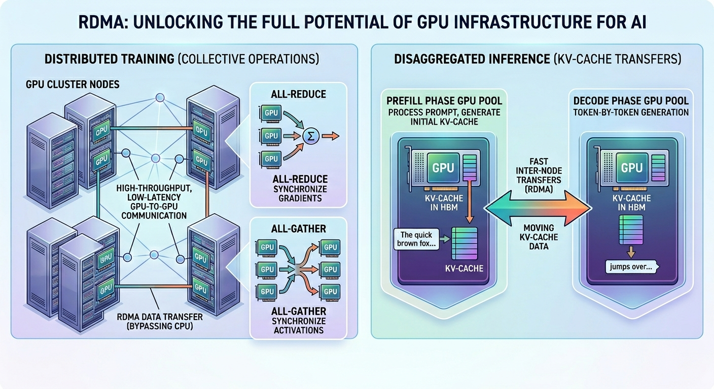
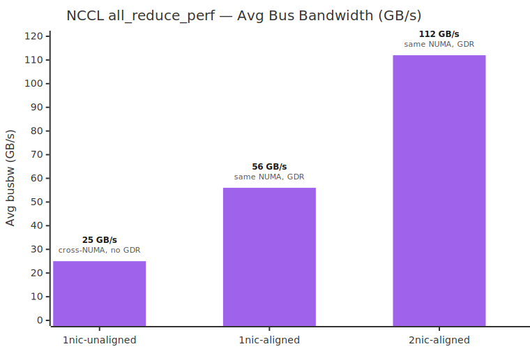

RDMA (Remote Direct Memory Access) is critical for unlocking the full potential of GPU infrastructure, enabling the high-throughput, low-latency GPU-to-GPU communication that large-scale AI workloads demand. In distributed training, collective operations like all-reduce and all-gather synchronize gradients and activations across GPUs — any communication bottleneck stalls the entire training pipeline. In disaggregated inference, RDMA provides the fast inter-node transfers needed to move KV-cache data between prefill and decode phases running on separate GPU pools.



[DRANET](https://github.com/kubernetes-sigs/dranet) is an open-source [Dynamic Resource Allocation](https://kubernetes.io/docs/concepts/scheduling-eviction/dynamic-resource-allocation/) (DRA) network driver that discovers RDMA-capable devices, advertises them as ResourceSlices, and injects the allocated devices into each pod and container. Combined with the [NVIDIA GPU DRA driver](https://github.com/kubernetes-sigs/nvidia-dra-driver-gpu), it enables topology-aware co-scheduling of GPUs and NICs for high-performance AI networking on Kubernetes.

<!-- truncate -->

:::note
For a deeper walkthrough of DRA concepts and a hands-on tutorial with the NVIDIA GPU DRA driver, see our previous post on [DRA devices and drivers on Kubernetes](/2025/11/17/dra-devices-and-drivers-on-kubernetes).
:::

In this post, you’ll learn how DRANET works on [AKS 1.34](https://kubernetes.io/blog/2025/09/01/kubernetes-v1-34-dra-updates/) with [Azure ND GB300-v6](https://learn.microsoft.com/azure/virtual-machines/sizes/gpu-accelerated/nd-gb300-v6-series?tabs=sizebasic) nodes, demonstrate three NUMA (Non-Uniform Memory Access) alignment scenarios, show and compare the RDMA benchmark results.

## Naive scheduling hurts performance

On an Azure ND GB300-v6 node, there are four [NVIDIA GB300](https://www.nvidia.com/en-us/data-center/gb300-nvl72/) GPUs and four [NVIDIA ConnectX-8](https://www.nvidia.com/en-us/networking/infiniband-adapters/) NICs with [InfiniBand](https://www.nvidia.com/en-us/networking/products/infiniband/) spread across two NUMA domains. The hardware topology looks like this:

| Resource | Count | Detail |
|---|---|---|
| GPU | 4x NVIDIA GB300 | 288 GB HBM3E each |
| NIC | 4x NVIDIA ConnectX-8 | 100 GB/s InfiniBand each |
| NUMA nodes | 2 | 2 GPUs + 2 NICs per NUMA node |

The NUMA topology from `nvidia-smi topo -m` reveals the affinity relationships:

|      | GPU0 | GPU1 | GPU2 | GPU3 | NIC0 | NIC1 | NIC2 | NIC3 |
|------|------|------|------|------|------|------|------|------|
| GPU0 | X    | NV18 | NV18 | NV18 | NODE | NODE | SYS  | SYS  |
| GPU1 | NV18 | X    | NV18 | NV18 | NODE | NODE | SYS  | SYS  |
| GPU2 | NV18 | NV18 | X    | NV18 | SYS  | SYS  | NODE | NODE |
| GPU3 | NV18 | NV18 | NV18 | X    | SYS  | SYS  | NODE | NODE |

GPUs 0-1 and NICs 0-1 share NUMA node 0. GPUs 2-3 and NICs 2-3 share NUMA node 1. A **NODE** relationship means the GPU and NIC share a direct PCIe root complex, enabling GPU-Direct RDMA (GDR). A **SYS** relationship means data must cross the QPI/UPI interconnect between NUMA domains, disabling GDR and adding latency.

Without topology-aware scheduling, Kubernetes has no way to co-locate a GPU and its NUMA-local NICs in the same ResourceClaim. Scheduling a workload onto a GPU with the wrong NIC on a different NUMA node can silently result in slower data paths and degrade RDMA performance.

## How DRANET works

The following system diagrams show how the DRA and DRANET control plane and data plane components work together to achieve topology-aware GPU and NIC alignment.

**Control plane**: DRA drivers discover hardware topology and publish ResourceSlices. The scheduler evaluates [Common Expression Language](https://kubernetes.io/docs/reference/using-api/cel/) (CEL) selectors from ResourceClaimTemplates to allocate NUMA-aligned GPU and NIC pairs.



**Data plane**: Once the scheduler binds a pod with ResourceClaim, the kubelet instructs containerd to create the container. The [Node Resource Interface](https://github.com/containerd/nri) (NRI) plugin intercepts the OCI hook and injects the allocated RDMA devices, enabling GPU-Direct RDMA over NUMA-local PCIe paths.



That high-level flow depends on node-local DRANET agents to turn scheduling decisions into usable RDMA resources. DRANET runs as a DaemonSet on each node and handles three key tasks:

### 1. Discovering RDMA devices

The NVIDIA ConnectX-8 NICs on Azure ND GB300-v6 nodes operate in InfiniBand mode -- they have no Ethernet netdev interface. DRANET discovers them by:

- Skipping IPoIB interfaces during netdev discovery
- Recording the RDMA link name (`rdmaDevice`) on each PCI device
- Identifying IB-only devices as those with a non-empty `rdmaDevice` and no `ifName`

### 2. Publishing DRANET ResourceSlices

DRANET publishes a ResourceSlice for each node, exposing every discovered NIC as a named device with topology attributes that the scheduler can match against:

```yaml
spec:
  devices:
  - name: pci-0101-00-00-0
    attributes:
      dra.net/numaNode:
        int: 0
      dra.net/pciAddress:
        string: "0101:00:00.0"
      dra.net/rdma:
        bool: true
      dra.net/rdmaDevice:
        string: mlx5_0
      ...
  driver: dra.net
```

The NVIDIA GPU DRA driver (`gpu.nvidia.com`) similarly publishes GPU attributes including `pciBusID` and `numaNode`. Together, these attributes give the Kubernetes scheduler enough information to make NUMA-aligned allocation decisions.

Here are the full device inventories on Azure ND GB300 node:

**GPUs** (driver: `gpu.nvidia.com`):

| Device | pciBusID | NUMA | pcieRoot |
|---|---|---|---|
| gpu-0 | 0008:06:00.0 | 0 | pci0008:00 |
| gpu-1 | 0009:06:00.0 | 0 | pci0009:00 |
| gpu-2 | 0018:06:00.0 | 1 | pci0018:00 |
| gpu-3 | 0019:06:00.0 | 1 | pci0019:00 |

**NICs** (driver: `dra.net`):

| Device | pciAddress | rdmaDevice | NUMA |
|---|---|---|---|
| pci-0101-00-00-0 | 0101:00:00.0 | mlx5_0 | 0 |
| pci-0102-00-00-0 | 0102:00:00.0 | mlx5_1 | 0 |
| pci-0103-00-00-0 | 0103:00:00.0 | mlx5_2 | 1 |
| pci-0104-00-00-0 | 0104:00:00.0 | mlx5_3 | 1 |

### 3. Injecting RDMA Devices

At pod start, the NRI plugin injects only the allocated `/dev/infiniband/uverbsN` character devices into containers, to give each pod visibility into exactly the devices it was allocated. This also reduces the security risk of setting `privileged: true`, which grants containers far more permissions than workloads actually need to leverage RDMA.

## How to use DRANET

With ResourceSlices published, workload authors can write ResourceClaimTemplates that use CEL selectors to express precise GPU-NIC alignment constraints. Each template creates a per-pod ResourceClaim that requests devices from both the `gpu.nvidia.com` and `dranet.net` DeviceClasses, filtered by attributes like device name  or PCI address. We define three ResourceClaimTemplates to demonstrate different alignment strategies.

### 1nic-unaligned: 1 GPU + 1 NIC, cross-NUMA

```yaml
apiVersion: resource.k8s.io/v1
kind: ResourceClaimTemplate
metadata:
  name: 1nic-unaligned
spec:
  spec:
    devices:
      requests:
      - name: gpu
        exactly:
          deviceClassName: gpu.nvidia.com
          count: 1
          selectors:
          - cel:
              expression:
                device.attributes["resource.kubernetes.io"].pciBusID == "0008:06:00.0"
      - name: nic
        exactly:
          deviceClassName: dranet.net
          count: 1
          selectors:
          - cel:
              expression:
                device.attributes["dra.net"]["rdmaDevice"] == "mlx5_2"
```

GPU 0 (NUMA 0) is paired with mlx5_2 (NUMA 1) with **SYS** affinity, meaning cross-NUMA with no GDR path. This serves as the baseline.

### 1nic-aligned: 1 GPU + 1 NIC, same NUMA

```yaml
apiVersion: resource.k8s.io/v1
kind: ResourceClaimTemplate
metadata:
  name: 1nic-aligned
spec:
  spec:
    devices:
      requests:
      - name: gpu
        ...
          selectors:
          - cel:
              expression:
                device.attributes["resource.kubernetes.io"].pciBusID == "0008:06:00.0"
      - name: nic
        ...
          selectors:
          - cel:
              expression:
                device.attributes["dra.net"]["rdmaDevice"] == "mlx5_0"
```

GPU 0 (NUMA 0) is paired with mlx5_0 (NUMA 0) with **NODE** affinity and a direct PCIe path for GDR.

### 2nic-aligned: 1 GPU + 2 NICs, same NUMA

```yaml
apiVersion: resource.k8s.io/v1
kind: ResourceClaimTemplate
metadata:
  name: 2nic-aligned
spec:
  spec:
    devices:
      requests:
      - name: gpu
        ...
          selectors:
          - cel:
              expression:
                device.attributes["resource.kubernetes.io"].pciBusID == "0008:06:00.0"
      - name: nic
        ...
          selectors:
          - cel:
              expression:
                device.attributes["dra.net"]["rdma"] == true &&
                device.attributes["dra.net"]["numaNode"] == 0
```

GPU 0 (NUMA 0) is paired with both RDMA NICs mlx5_0 + mlx5_1 (NUMA 0). The `count: 2` with a NUMA selector is the idiomatic DRA pattern for multi-device allocation from a homogeneous group.

## Benchmark and Comparison

The RDMA benchmark uses an MPIJob from the Kubeflow MPI Operator to run NCCL `all_reduce_perf` across two worker pods on different nodes, each with one GPU and one or more NICs allocated through DRA. Here is one example MPIJob yaml file:

```yaml
apiVersion: kubeflow.org/v2beta1
kind: MPIJob
metadata:
  name: nccl-test-dra
spec:
  mpiReplicaSpecs:
    Launcher:
      replicas: 1
      template:
        spec:
          containers:
          - name: launcher
            command: ["/bin/bash", "-c"]
            args:
            - |
              mpirun -np 2 \
                -x NCCL_IB_DISABLE=0 \
                -x NCCL_SHM_DISABLE=1 \
                -x NCCL_MNNVL_ENABLE=0 \
                -x NCCL_NVLS_ENABLE=0 \
                ...
                /opt/nccl_tests/build/all_reduce_perf \
                  -b 512M -e 8G -f 2 -g 1 -c 0
    Worker:
      replicas: 2
      template:
        spec:
          affinity:
            podAntiAffinity:
              requiredDuringSchedulingIgnoredDuringExecution:
              - labelSelector:
                  matchLabels:
                    training.kubeflow.org/job-name: nccl-test-dra
                    training.kubeflow.org/job-role: worker
                topologyKey: kubernetes.io/hostname
          resourceClaims:
          - name: gpu-nic
            resourceClaimTemplateName: 1nic-aligned
          containers:
          - name: worker
            resources:
              claims:
              - name: gpu-nic
            ...
```

There are a few pieces worth calling out:

**NCCL environment variables force pure InfiniBand transport.** The launcher pod sets `NCCL_IB_DISABLE=0` to explicitly enable the InfiniBand transport, `NCCL_SHM_DISABLE=1` to prevent NCCL from using shared memory for intra-node transfers, `NCCL_MNNVL_ENABLE=0` to disable multi-node NVLink (MNNVL), and `NCCL_NVLS_ENABLE=0` to disable NVLink SHARP (NVLS) so that collectives don't offload to NVSwitch hardware. Together, these flags force all collective traffic through the InfiniBand transport, so the results reflect pure RDMA throughput.

**Pod anti-affinity forces inter-node RDMA.** The `podAntiAffinity` rule uses `requiredDuringSchedulingIgnoredDuringExecution` with `topologyKey: kubernetes.io/hostname` to guarantee that the two worker replicas land on different nodes. Without this, the scheduler could place both workers on the same node, where GPUs communicate intra-node instead of over InfiniBand fabric.

**`resourceClaimTemplateName` selects the GPU-NIC topology.** Each worker pod references a single ResourceClaimTemplate through the `resourceClaimTemplateName` field under `resourceClaims`. To switch between alignment scenarios, change this field from `1nic-aligned` to `2nic-aligned` or `1nic-unaligned` -- the scheduler will then allocate a different set of GPU and NIC devices based on the CEL selectors defined in each template. This is the only line that needs to change between benchmark runs.

The following chart shows the benchmark results across the three ResourceClaimTemplates:



The cross-NUMA `1nic-unaligned` case (GPU on NUMA 0, NIC on NUMA 1) delivers only **~25 GB/s** -- a **2.2x degradation** compared to the NUMA-aligned `1nic-aligned` case at **~56 GB/s**, and a **4.5x degradation** compared to the `2nic-aligned` case at **~112 GB/s**. Three compounding penalties explain this:

1. **GDR disabled** -- with a SYS relationship between GPU and NIC, NCCL falls back from `GPUDirect` to staging through host memory because there is no direct PCIe path
2. **Cross-NUMA** -- every data transfer crosses the QPI/UPI interconnect between NUMA domains
3. **Fewer channels** -- NCCL's topology engine allocates only 2 channels for SYS-distant NICs versus 8 channels with NUMA-aligned NIC (`1nic-aligned`), and 16 channels with two NUMA-aligned NICs (`2nic-aligned`)

Topology-aware scheduling with GPU-NIC alignment isn't optional for high-performance RDMA. DRANET and the DRA framework give you declarative, fine-grained control over that placement without privileged containers or manual device management.

Topology-aware scheduling with GPU-NIC alignment isn't optional for high-performance RDMA. DRANET and the DRA framework give you declarative, fine granular control over that placement without privileged containers or manual device management.

Connect with the AKS team through our [GitHub discussions](https://github.com/Azure/AKS/discussions) or [share your feedback and suggestions](https://github.com/Azure/AKS/issues).
