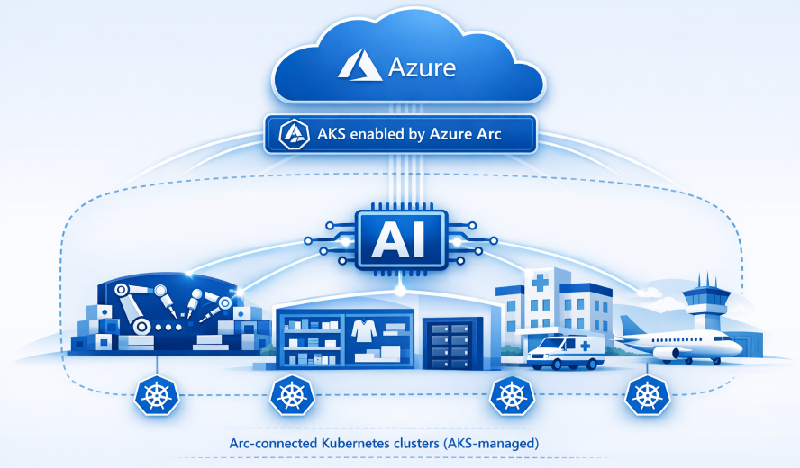

For many edge and on-premises environments, sending data to the cloud for AI inferencing isn't an option, as latency, data residency, and compliance make it a non-starter. With Azure Kubernetes Service (AKS) enabled by Azure Arc managing your Kubernetes clusters, you can run AI inferencing locally on the hardware you already have. This blog series shows you how, with hands-on tutorials for **experimenting** with generative and predictive AI workloads using CPUs, GPUs, and NPUs.

<!-- truncate -->

## Introduction

Whether you are processing sensor data on a factory floor, analyzing medical images in a hospital, or running in store retail analytics, your AI models need to run where the data lives. With AKS enabled by Azure Arc, you can extend Azure’s Kubernetes management to on‑prem and edge infrastructure and run AI inference without changing how you operate your clusters. You use the same Kubernetes APIs, deployment patterns, and lifecycle workflows across cloud and non‑cloud environments, while keeping inference close to where data is generated. This allows you to operate AI workloads consistently across highly distributed environments.

## Why AI inferencing on AKS enabled by Azure Arc matters

- **Low latency and data residency:** Inference runs locally, meeting real-time and compliance requirements for factory automation, medical imaging, and retail analytics.
- **Existing hardware utilization:** Use your current infrastructure with flexibility to add GPUs or accelerators later.
- **Hybrid and disconnected operations:** Manage workloads centrally from Azure while local execution continues during network outages.
- **Industry alignment:** Support the shift toward edge AI driven by data gravity, regulatory compliance, and real-time requirements.

Together, these capabilities make AKS enabled by Azure Arc a strong foundation for AI inference across edge and on‑prem environments, enabling you to choose and operate inference engines and models directly on your Kubernetes clusters, including bring‑your‑own models, while integrating with Microsoft’s broader AI stack such as [Microsoft Foundry](https://learn.microsoft.com/azure/foundry/what-is-foundry), [Microsoft Foundry Local](https://learn.microsoft.com/azure/foundry-local/what-is-foundry-local), and [KAITO](https://learn.microsoft.com/azure/aks/ai-toolchain-operator) where appropriate.

## Get started

This series walks you through experimenting with generative and predictive AI workloads step by step, using open-source tools and real models on your AKS enabled by Azure Arc clusters. For the full list of topics, prerequisites, and hands-on tutorials, head to the [Series Introduction and Scope](/2026/04/07/ai-inference-on-aks-arc-part-2).
