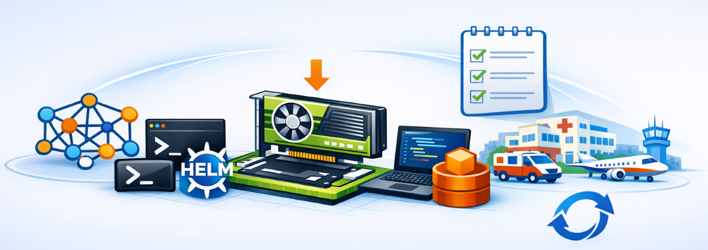

This series gives you **practical, step-by-step guidance** for running generative and predictive AI inference workloads on Azure Kubernetes Service (AKS) enabled by Azure Arc clusters, using CPUs, GPUs, and neural processing units (NPUs). The scenarios target on‑premises and edge environments, specifically Azure Local, with a focus on **repeatable, production-ready validation** rather than abstract examples.

<!-- truncate -->



## Introduction

This series explores emerging patterns for running generative and predictive AI inference workloads on AKS enabled by Azure Arc clusters in on-premises and edge environments. If you're looking to deploy AI closer to where your data is generated on factory floors, in retail stores, across manufacturing lines, and within infrastructure monitoring systems—they face unique challenges: limited connectivity, diverse hardware, and constrained resources.
High-end GPUs may not always be available or practical in these environments due to cost, power, or space limitations. That's why you may be exploring how to leverage your existing infrastructure—such as CPU-based clusters—or exploring new accelerators like NPUs to enable scalable, low-latency inference at the edge.
The series focuses on scenario-driven experimentation with AI inference on AKS enabled by Azure Arc, validating real-world deployments that go beyond traditional cloud-centric patterns. From deploying open-source LLM servers like **Ollama** and **vLLM** to integrating **NVIDIA Triton** with custom backends, each entry provides a structured approach to evaluating feasibility, performance, and operational readiness. Our goal is to equip you with practical insights and repeatable strategies for enabling AI inference in hybrid and edge-native environments.

## Audience and assumptions

This series assumes:

- You are already familiar with Kubernetes concepts such as pods, deployments, services, and node scheduling.
- You are operating, or plan to operate, AKS enabled by Azure Arc on Azure Local or a comparable on‑premises / edge environment.
- You are comfortable using command‑line tools such as kubectl, Azure CLI, and Helm.
- You are evaluating AI inference workloads (LLMs or predictive models) from an infrastructure and platform perspective, not from a data science or model‑training perspective.

### Explicit Non‑Goals

To keep this series focused and actionable, the following topics are intentionally **not** covered:

- **Kubernetes fundamentals or onboarding:**
  Readers new to Kubernetes should complete foundational material first:
  - [Introduction to Kubernetes (Microsoft Learn)](https://learn.microsoft.com/training/modules/intro-to-kubernetes/)
  - [Kubernetes Basics Tutorial (Upstream)](https://kubernetes.io/docs/tutorials/kubernetes-basics/)

- **AKS enabled by Azure Arc conceptual overview or onboarding:**
  This series assumes you already understand what Azure Arc provides and how AKS enabled by Azure Arc works:
  - [AKS enabled by Azure Arc Kubernetes overview](https://learn.microsoft.com/azure/azure-arc/kubernetes/overview)
  - [AKS enabled by Azure Arc documentation](https://learn.microsoft.com/azure/aks/aksarc/)

- **Model training, fine‑tuning, or data preparation:**
  All scenarios assume models are already trained and packaged in formats supported by the selected inference engine.

- **Deep internals of inference engines:**
  Engine-specific internals are referenced only where required for deployment or configuration. For deeper learning:
  - [NVIDIA Triton Inference Server documentation](https://docs.nvidia.com/deeplearning/triton-inference-server/)
  - [NVIDIA GPU Operator documentation](https://docs.nvidia.com/datacenter/cloud-native/gpu-operator/latest/getting-started.html)

If you’re looking for conceptual comparisons, performance benchmarks, or model‑level optimizations, those topics are intentionally out of scope for this series.

## Series ground rules (What this series guarantees)

Here are the set of baseline guarantees and assumptions that apply to all subsequent parts of the series:

- All scenarios use the same AKS enabled by Azure Arc environment unless explicitly noted otherwise.
- AKS enabled by Azure Arc is used as the management and control plane only; inference execution always occurs locally on the cluster.
- No managed Azure AI services are used to execute inference.
- Each scenario follows a consistent, repeatable structure so results can be compared across inference engines and hardware types.

### Standard workflow

Each scenario follows the same high-level workflow:

- **Connect and verify:**
  Log in to Azure and get cluster credentials. Inspect available compute resources (CPU, GPU, NPU) and node labels/capabilities

- **Prepare the accelerator (If Required):**
  Install or validate the required accelerator enablement based on the scenario.
  - GPU: NVIDIA GPU Operator
  - NPU: Vendor‑specific enablement (future)
  - CPU: No accelerator setup required
- **Deploy the inference Workload:**
  - Deploy the model server or inference pipeline (LLM server, Triton, or other engine)
  - Configure runtime parameters appropriate to the selected hardware
- **Validate inference:**
  - Send a test request (prompt, image, or payload)
  - Confirm functional and expected inference output
- **Cleanup resources:**
  - Remove deployed workloads
  - Release cluster resources (compute, storage, accelerator allocations)

## Series outline

In this series, we walk you through a range of AI inference patterns on AKS enabled by Azure Arc clusters, spanning both generative and predictive AI workloads. The series is designed to evolve over time, and we'll continue adding topics as we validate new scenarios, runtimes, and architectures.

### Topics covered in this series

| Topic | Type | Status |
| ----- | ---- | ------ |
| [**Ollama** — open-source LLM server](/2026/04/07/ai-inference-on-aks-arc-part-3) | Generative | ✅ Available |
| [**vLLM** — high-throughput LLM engine](/2026/04/07/ai-inference-on-aks-arc-part-3) | Generative | ✅ Available |
| [**Triton + ONNX** — ResNet‑50 image classification](/2026/04/07/ai-inference-on-aks-arc-part-4) | Predictive | ✅ Available |
| **Triton + TensorRT‑LLM** — optimized large-model inference | Generative | 🔜 Coming soon |
| **Triton + vLLM backend** — vision-language model serving | Generative | 🔜 Coming soon |

This series will continue to grow as we introduce new inference engines, hardware configurations, and real‑world deployment patterns across edge, on‑premises, and hybrid environments.

## Prerequisites

All scenarios in this series run on a common AKS enabled by Azure Arc clusters environment. Before you begin, make sure you have the following in place:

- **AKS enabled by Azure Arc clusters with a GPU node:** A Azure Local clusters with at least one GPU node and appropriate NVIDIA drivers installed. The GPU node needs the NVIDIA device plugin (via the NVIDIA GPU Operator) running so pods can access nvidia.com/gpu resources.

- **Azure CLI with Azure Arc extensions:** The [Azure CLI](https://learn.microsoft.com/cli/azure/install-azure-cli) installed on your admin machine and `connectedk8s` extensions (for Azure Arc-enabled Kubernetes). Use `az extension list -o table` to confirm these are installed.

- **kubectl:** The Kubernetes CLI installed on your workstation for applying manifests and managing cluster resources.

- **Helm:** The [Helm](https://helm.sh/docs/intro/install/) package manager installed (v3), for deploying the GPU Operator and helm charts as needed.

- **PowerShell 7+ (optional):** If using PowerShell for CLI steps and REST calls, upgrade to PowerShell 7.4 or later (older Windows PowerShell 5.1 may cause JSON quoting issues in our examples).

- **Cluster access:** Ensure you can connect to your AKS enabled by Azure Arc clusters (e.g. same network or VPN to the Azure Local environment). After logging in to Azure and retrieving cluster credentials, verify access by listing nodes:

```powershell
az login

# Use this command when you have AKS RBAC to export cluster credentials.
az aks get-credentials --resource-group <YourResourceGroup> --name <YourClusterName>

# Otherwise, use this command to access the cluster via the proxy without exporting credentials.
az connectedk8s proxy --resource-group <YourResourceGroup> --name <YourClusterName>

# This should show your cluster’s nodes, including any GPU node(s).
kubectl get nodes
```

Note: On Windows 11, you can use `winget` to quickly install prerequisites. For example:

```powershell
# Install PowerShell
winget install -e --id Microsoft.PowerShell
pwsh -v

# Install or Update - Azure CLI, Kubectl, Helm, Git
winget install -e --id Microsoft.AzureCLI
winget install -e --id Kubernetes.kubectl
winget install -e --id Helm.Helm
winget install -e --id Git.Git
winget update -e --id Microsoft.AzureCLI
winget update -e --id Kubernetes.kubectl
winget update -e --id Helm.Helm
winget update -e --id Git.Git

# Install or Update – Azure CLI Extensions
az extension add --name aksarc
az extension add --name connectedk8s
az extension update --name aksarc
az extension update --name connectedk8s
```

### Install the NVIDIA GPU operator

Next, install the NVIDIA GPU Operator on the cluster. This operator installs the necessary drivers and Kubernetes device plugin to expose GPU resources to your workloads. vLLM requires the NVIDIA Kubernetes plugin to access the GPU hardware.

- **Add the NVIDIA Helm repository:** If you haven’t already, add NVIDIA’s Helm chart repository and update it:

```powershell
helm repo add nvidia https://helm.ngc.nvidia.com/nvidia
helm repo update
```

This adds the official NVIDIA chart source (which contains the GPU operator chart) to your Helm client.

- **Install the GPU operator:** Use Helm to install the NVIDIA GPU Operator onto your cluster:

```powershell
helm install --wait --generate-name nvidia/gpu-operator
```

This will install the GPU operator into your cluster (in its default namespace) and wait for all components to be ready. The --generate-name flag automatically assigns a name to the Helm release. The operator will set up the NVIDIA device plugin and drivers on your cluster nodes.

:::note
Ensure your cluster nodes have internet connectivity to pull the necessary container images for the operator. This may take a few minutes the first time as images are downloaded.
:::

### Next up: [Generative AI with Open‑Source LLM Server](/2026/04/07/ai-inference-on-aks-arc-part-3)
