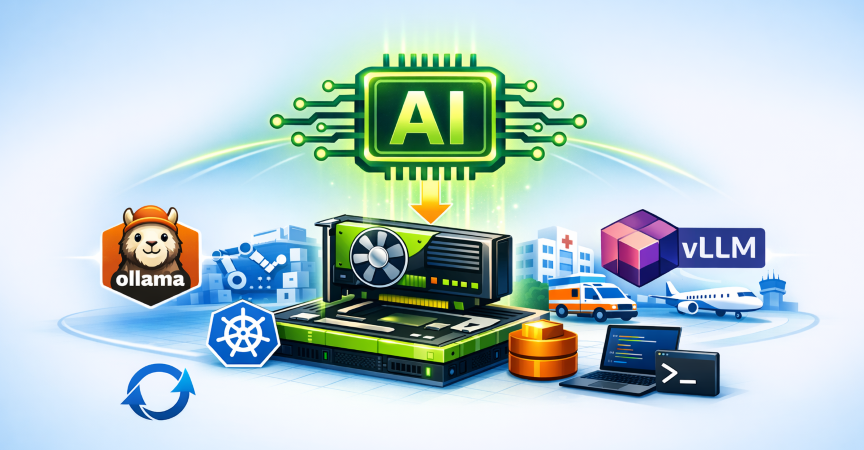

In this post, you'll explore how to deploy and run generative AI inference workloads using open-source large language model servers on Azure Kubernetes Service (AKS) enabled by Azure Arc. You'll focus on running these workloads locally, on-premises or at the edge, using GPU acceleration with centralized management. This approach is especially useful when cloud-based AI services are not viable due to data sovereignty, latency, cost, or limited connectivity.

<!-- truncate -->



## Introduction

Rather than using managed AI services, you'll deploy Ollama and vLLM as standalone Kubernetes workloads directly on your cluster. This keeps things transparent — you'll see exactly how model serving, GPU scheduling, and inference requests work inside your Arc-managed environment. Performance tuning and benchmarks are out of scope here; the focus is a clear, repeatable, and diagnosable foundation for GPU-accelerated inference. These fundamentals set you up for the more advanced architectures covered in later posts.

:::note
Before you begin, ensure the prerequisites described in [AI Inference on AKS enabled by Azure Arc: Series Introduction and Scope](/2026/04/07/ai-inference-on-aks-arc-part-2) are fully met.
You should have an AKS enabled by Azure Arc cluster (on Azure Local or similar) with a **GPU node** available and configured for **nvidia.com/gpu**.
The cluster nodes must have **internet access** to download the model. If restricted, you must manually provide the model files via a Persistent Volume. **Expect a delay** during the initial deployment while the **pod downloads** and caches the large model files.
:::

## AI inference with Ollama

Now that your environment is ready, you'll deploy the Ollama model server. You'll use Ollama's official container image to serve a large language model — specifically **Phi-3 Mini** with 4-bit quantization (~2.2 GB), which fits comfortably on a single **16 GB GPU**. Once deployed, you'll have a single endpoint that supports both Ollama's native REST API and an OpenAI-compatible interface.

### Deploying the Ollama model server

First, ensure you have connected to your Arc-enabled cluster (see Prerequisites) and that it has a GPU node with the NVIDIA device plugin ready (the GPU Operator should be installed). If your cluster has multiple GPU nodes, apply the accelerator=nvidia-gpu label to a node to ensure the Ollama pod schedules on your target hardware.

```powershell
# 1. FIND THE GPU NODE NAME
# This script performs a deep search of your cluster's hardware resources.
kubectl get nodes -o json | ConvertFrom-Json | ForEach-Object { $_.items } | Where-Object { $_.status.allocatable.'nvidia.com/gpu' -gt 0 } | Select-Object -ExpandProperty metadata | Select-Object -ExpandProperty name

# 2. APPLY THE APPLICATION LABEL
# This identifies the node as the designated "home" for the Ollama application.
# Useful for organizational filtering: 'kubectl get nodes -l app=ollama'
kubectl label node <node name>  app=ollama

# 3. APPLY THE HARDWARE LABEL FOR SCHEDULING AFFINITY
# This matches the 'nodeSelector' in the Deployment YAML below.
# This creates a "Hardware Requirement" tag on the Node's metadata.
kubectl label node <node name> accelerator=nvidia-gpu
```

Next, create a Kubernetes manifest (e.g. ollama-deployment.yaml) for the Ollama Deployment and Service:

```yaml
# 1. NAMESPACE: Creates a dedicated logical "room" for your Ollama resources.
# This prevents your models and services from cluttering the 'default' namespace.
apiVersion: v1
kind: Namespace
metadata:
  name: ollama-inference
---
# 2. DEPLOYMENT: This manages the lifecycle of your Ollama container.
# It ensures that if the pod crashes, a new one is automatically started.
apiVersion: apps/v1
kind: Deployment
metadata:
  name: ollama
  namespace: ollama-inference
spec:
  replicas: 1
  # SELECTOR: The Deployment controller uses this to find the Pods it owns.
  selector:
    matchLabels:
      app: ollama
  template:
    metadata:
      # POD LABELS: These are the "tags" applied to the actual running container.
      # These MUST match the selector above and the Service selector below.
      labels:
        app: ollama
    spec:
      # NODE SELECTOR: This is the hardware "constraint."
      # It forces the pod to land ONLY on a node you have labeled 'accelerator: nvidia-gpu'.
      nodeSelector:
        accelerator: nvidia-gpu
      containers:
      - name: ollama
        image: ollama/ollama:0.18.3
        ports:
        # PORT NAME
        # Note: Kubernetes still uses TCP under the hood (the default protocol).
        - name: http
          containerPort: 11434
        # READINESS PROBE: Tells Kubernetes when this pod is ready to accept traffic.
        # Ollama responds with "Ollama is running" on GET / when the server is up.
        # The Service will not route requests here until this probe succeeds.
        readinessProbe:
          httpGet:
            path: /
            port: 11434
          initialDelaySeconds: 10   # Wait 10s after container start before first check.
          periodSeconds: 5          # Check every 5 seconds after that.
          failureThreshold: 3       # Mark unready after 3 consecutive failures.
        resources:
          # RESOURCE LIMITS: This is the actual "handshake" with the NVIDIA driver.
          # It tells the cluster to carve out 1 physical GPU for this pod.
          limits:
            nvidia.com/gpu: 1
---
# 3. SERVICE: This acts as the "Front Door" or Load Balancer for the Pod.
# It provides a stable IP address so you can talk to the Ollama API.
apiVersion: v1
kind: Service
metadata:
  name: ollama-service
  namespace: ollama-inference
spec:
  # TYPE: LoadBalancer requests a public/external IP from your cloud provider.
  # Use 'ClusterIP' instead if you only want to access this from inside the cluster.
  type: LoadBalancer
  # SERVICE SELECTOR: This tells the Service, "Find any pod with the label 'app: ollama'
  # in this namespace and send traffic to it."
  selector:
    app: ollama
  ports:
  - name: http
    port: 11434        # The port you hit on the LoadBalancer IP.
    targetPort: 11434  # The port the Ollama application is listening on inside the pod.
```

This defines a **Deployment** running one instance of the ollama/ollama:0.18.3 container image, exposing the server on port **11434**, and requesting 1 GPU (nvidia.com/gpu: 1) so it runs on your GPU node. A LoadBalancer Service on port 11434 forwards requests to the pod; on Azure Local, if no external load balancer is available, you can use port-forwarding to access the service. Apply the manifest to start the Ollama server:

```powershell
kubectl apply -f ollama-deployment.yaml                  # apply deployment yaml
kubectl get pods -l app=ollama -n ollama-inference -w    # watch pod status
```

Wait until the ollama pod is Running!

### Loading a model and testing inference

Once the server is running, load a test model and send an inference API request. The example below uses a small (~2.2 GB) model called “phi3”. Run the following to pull the model weights inside the running Ollama pod:

```powershell
$podName = kubectl get pods -n ollama-inference -l app=ollama -o jsonpath='{.items[0].metadata.name}'
kubectl exec -it $podName -n ollama-inference -- ollama pull phi3
```

After the ollama pull command prints “success,” the model is ready. Now issue a test generate request to the server’s HTTP API (port 11434). For example, using PowerShell:

```powershell
# Setup Port Forwarding if your client machine and AKS enabled by Azure Arc clusters are not on the same network
kubectl port-forward svc/ollama-service -n ollama-inference 11434

# Use localhost with port-forward (if using external IP, replace URI accordingly):
# To use the OpenAI-compatible interface, switch the URI to "http://localhost:11434/v1/chat/completions"
Invoke-RestMethod -Method Post -Uri "http://localhost:11434/api/generate" `
    -ContentType "application/json" `
    -Body '{"model": "phi3", "prompt": "What is Azure Kubernetes Service (AKS) enabled by Azure Arc?", "stream": false}'

# Example output:
model                : phi3
created_at           : 2026-03-26T16:41:37.52900295Z
response             : Azure Kubernetes Service (AKS) leverages the capabilities of Azure Arc to extend its infrastructure 
                       management across multiple environments, including on-premises and other cloud services. .......
done                 : True
done_reason          : stop
context              : {32010, 29871, 13, 5618...}
total_duration       : 6388662955
load_duration        : 181600130
prompt_eval_count    : 21
prompt_eval_duration : 34590990
eval_count           : 328
eval_duration        : 5894037253
```

### Cleanup Ollama

When finished, remove the Ollama resources to free up the GPU.

```powershell
# REMOVE ALL RESOURCES:
# Deletes the 'ollama-inference' namespace and everything inside it.
# This includes the Deployment (Ollama pod), the Service (LoadBalancer/IP),
# and any local configurations. This is the "factory reset" for this app.
kubectl delete namespace ollama-inference

# remove node labels if added
$nodeName = (kubectl get nodes -l app=ollama -o jsonpath='{.items[0].metadata.name}')
kubectl label node $nodeName app-
$nodeName = (kubectl get nodes -l accelerator=nvidia-gpu -o jsonpath='{.items[0].metadata.name}')
kubectl label node $nodeName accelerator-
```

## AI inference with vLLM

Before starting this step, make sure you have completed the cleanup and any required prerequisites. You will then serve a local large language model using the vLLM inference engine on an AKS enabled by Azure Arc cluster. With its optimized memory management approach, vLLM enables efficient text generation for large models. In this step, you will deploy a sample Mistral 7B model (quantized to about 4 GB) using vLLM’s OpenAI‑compatible API, then submit a prompt to validate the response.

### Deploying the vLLM model server

After connecting to your Arc-enabled cluster (see Prerequisites), confirm the cluster’s GPU node is ready and run the NVIDIA GPU Operator if not already installed (to provide the device plugin).

```powershell
# 1. FIND THE GPU NODE NAME
# This script performs a deep search of your cluster's hardware resources.
kubectl get nodes -o json | ConvertFrom-Json | ForEach-Object { $_.items } | Where-Object { $_.status.allocatable.'nvidia.com/gpu' -gt 0 } | Select-Object -ExpandProperty metadata | Select-Object -ExpandProperty name

# 2. APPLY THE APPLICATION LABEL
kubectl label node <node name>  app=vllm-mistral

# 3. APPLY THE HARDWARE LABEL FOR SCHEDULING AFFINITY
kubectl label node <node name> accelerator=nvidia-gpu
```

Next prepare a Kubernetes manifest (e.g. vllm-deployment.yaml) to run the vLLM server and expose it:

```yaml
# 1. NAMESPACE: Creates a dedicated "room" for vLLM resources.
apiVersion: v1
kind: Namespace
metadata:
  name: vllm-inference
---
# 2. DEPLOYMENT: Manages the vLLM inference engine pod.
apiVersion: apps/v1
kind: Deployment
metadata:
  name: vllm-mistral
  namespace: vllm-inference  # Scopes this deployment to the vllm-inference namespace
spec:
  replicas: 1
  # SELECTOR: Connects the Deployment controller to the specific Pods it manages.
  selector:
    matchLabels:
      app: vllm-mistral
  template:
    metadata:
      # POD LABELS: Provides identity for the Pod.
      # The Service uses 'app: vllm-mistral' to route incoming API requests here.
      labels:
        app: vllm-mistral
    spec:
      # NODE SELECTOR: Hardware targeting.
      # Forces the Pod to land on a node you have labeled 'accelerator: nvidia-gpu'.
      nodeSelector:
        accelerator: nvidia-gpu
      containers:
      - name: vllm-container
        image: vllm/vllm-openai:v0.18.0
        command: ["python3", "-m", "vllm.entrypoints.openai.api_server"]
        # Note: Public models (e.g., TheBloke/Mistral-7B-v0.1-AWQ) work without auth; gated models 
        # (e.g., Llama 3) require HUGGING_FACE_HUB_TOKEN to be set in the container environment.
        args: ["--model", "TheBloke/Mistral-7B-v0.1-AWQ",
               "--quantization", "awq", "--dtype", "float16",
               "--host", "0.0.0.0", "--port", "8000",
               "--max-model-len", "4096", "--gpu-memory-utilization", "0.80",
               "--enforce-eager"]
        ports:
        - name: http
          containerPort: 8000
        # READINESS PROBE: Tells Kubernetes when this pod is ready to serve inference.
        # vLLM exposes a /health endpoint that returns HTTP 200 once the model is loaded.
        # Until this probe passes, the Service will not send any traffic to the pod.
        readinessProbe:
          httpGet:
            path: /health
            port: 8000
          initialDelaySeconds: 120  # vLLM needs time to download and load the model.
          periodSeconds: 10         # Check every 10 seconds after the initial delay.
          failureThreshold: 6       # Allow up to 60s of failures before marking unready.
        resources:
          # RESOURCE LIMITS: Ensures 1 physical GPU is reserved for this pod.
          limits:
            nvidia.com/gpu: 1
        volumeMounts:
        - name: shm
          mountPath: /dev/shm
      volumes:
      - name: shm
        # SHM (Shared Memory): Required by vLLM/PyTorch for fast data exchange
        # between GPU and CPU. 'Memory' medium uses RAM instead of disk.
        emptyDir:
          medium: Memory
          sizeLimit: "2Gi"
---
# 3. SERVICE: Provides a stable entry point for the vLLM API.
apiVersion: v1
kind: Service
metadata:
  name: vllm-service
  namespace: vllm-inference
spec:
  # TYPE: LoadBalancer requests an external IP from your provider.
  type: LoadBalancer
  # SERVICE SELECTOR: Routes traffic to any pod carrying the 'app: vllm-mistral' label.
  selector:
    app: vllm-mistral
  ports:
  - name: http
    protocol: TCP
    port: 80           # The port you access externally (e.g., http://EXTERNAL_IP:80)
    targetPort: 8000   # The port the vLLM container is actually listening on
```

This Deployment launches one vllm/vllm-openai:v0.18.0 container that runs vLLM’s OpenAI-compatible API server for the Mistral-7B model (TheBloke/Mistral-7B-v0.1-AWQ from Hugging Face). The container is configured with a 4096 token context, uses 80% of GPU memory (--gpu-memory-utilization 0.80), and employs AWQ 4-bit quantized weights (to fit in a ~16 GB GPU). It requests 1 GPU, and mounts a 2 GiB emptyDir at /dev/shm for fast memory access. A Service vllm-service is used to forward port 80 to the container’s port 8000 (the API) as a LoadBalancer.

Apply the manifest to start the vLLM server:

```powershell
kubectl apply -f vllm-deployment.yaml                       # apply deployment yaml
kubectl get pods -l app=vllm-mistral -n vllm-inference -w   # wait for vllm-mistral pod to run
```

Kubernetes will pull the container image and start the server. Wait for the vllm-mistral pod to reach Running. Once running, if no external IP address is assigned to vllm-service, open a terminal and port-forward it (e.g. `kubectl port-forward svc/vllm-service -n vllm-inference 8080:80`) to access the API at `http://localhost:8080`.

### Testing the LLM endpoint

With the vLLM server ready, send a test completion request to verify the deployed model. Using PowerShell’s Invoke-RestMethod, call the /v1/completions endpoint with a JSON body specifying the model and a prompt:

```powershell
# Using localhost with port-forward; replace $SERVICE_IP if using external LB
  Invoke-RestMethod -Method Post -Uri "http://localhost:8080/v1/completions" `
      -ContentType "application/json" `
      -Body '{"model": "TheBloke/Mistral-7B-v0.1-AWQ", "prompt": "What is Azure Kubernetes Service (AKS) enabled by Azure Arc", "max_tokens": 100}' |
    Select-Object -ExpandProperty choices | Select-Object -ExpandProperty text

# Example output:
Azure Kubernetes Service (AKS) Arc is a managed service provided by Microsoft that allows you to manage your Kubernetes deployment and monitor metrics across multiple clusters using Azure Portal.
```

### Cleanup vLLM

```powershell
# When finished, remove the vllm resources to free up the GPU.
kubectl delete namespace vllm-inference

# Remove node labels if added
$nodeName = (kubectl get nodes -l app=vllm-mistral -o jsonpath='{.items[0].metadata.name}')
kubectl label node $nodeName app-
$nodeName = (kubectl get nodes -l accelerator=nvidia-gpu -o jsonpath='{.items[0].metadata.name}')
kubectl label node $nodeName accelerator-
```

This removes the vllm-mistral Deployment (stopping the pod) and the Service. If no more GPU inference is needed, you may also remove the GPU Operator (`helm uninstall <release-name>`) to reclaim cluster resources.

### Next up: [Predictive AI using Triton and ResNet-50](/2026/04/07/ai-inference-on-aks-arc-part-4)
