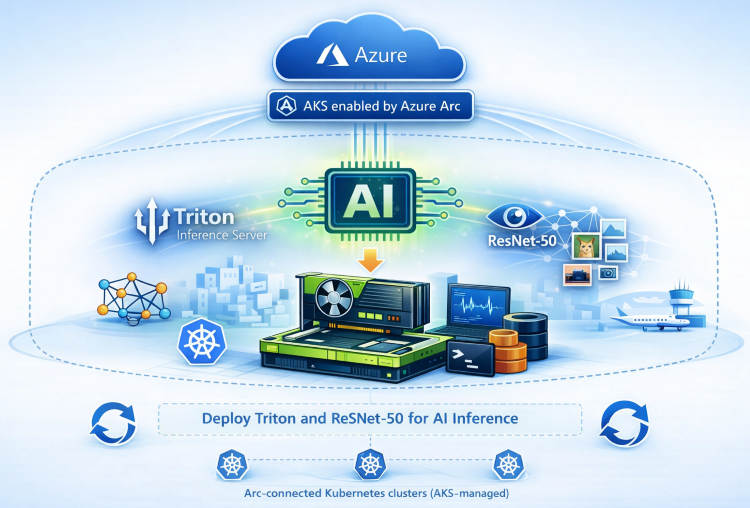

In this post, you'll deploy NVIDIA Triton Inference Server on your Azure Kubernetes Service (AKS) enabled by Azure Arc cluster to serve a ResNet-50 image classification model in ONNX format. By the end, you'll have a working predictive AI inference pipeline running on your on-premises GPU hardware.

<!-- truncate -->



## Introduction

The previous post covered deploying LLM servers for text generation. This post shifts to predictive AI, specifically computer vision. You'll use NVIDIA Triton Inference Server with the ONNX runtime backend to serve ResNet-50, a classic "hello world" for image classification. Triton is an enterprise-grade, multi-framework model server, and deploying it here gives you a starting pattern for serving any ONNX model on your AKS enabled by Azure Arc managed cluster.

:::note[PREREQUISITES AND SCOPE]
Before you begin, ensure the [Part 2 prerequisites](/2026/04/07/ai-inference-on-aks-arc-part-2) are met, including a GPU node configured for **nvidia.com/gpu**. Cluster nodes need **internet access** to download models. **Expect a delay** during initial deployment while the pod downloads and caches model files.

This tutorial is designed for experimentation and learning. The configurations shown are not production-ready and should not be deployed to production environments without additional security, reliability, performance hardening, and following standard practices.
:::

## AI Inference with Triton (ONNX)

### Preparing storage for the model repository

In addition to the prerequisites, you'll need persistent **storage** for model files. First, create a **triton-inference** namespace and a **PersistentVolumeClaim** (PVC) for the model repository.

Save the following YAML as `triton-pvc.yaml`:

```yaml
# 1. THE NAMESPACE
# Creates an isolated logical boundary for your Triton resources.
# All subsequent resources must reference this namespace to communicate.
apiVersion: v1
kind: Namespace
metadata:
  name: triton-inference
---
# 2. THE STORAGE (PVC)
# Requests a persistent disk from the cluster to store your model weights.
# This ensures that if the Pod restarts, your downloaded models remain intact.
apiVersion: v1
kind: PersistentVolumeClaim
metadata:
  name: triton-model-repository-pvc
  namespace: triton-inference # Ensures the storage is available within your namespace
spec:
  # ReadWriteOnce (RWO) allows the volume to be mounted as read-write by a single node.
  accessModes:
    - ReadWriteOnce
  # Omit storageClassName to use the cluster's default StorageClass. 
  resources:
    requests:
      # Allocates 10GB of space. Ensure your underlying disk provider supports this size.
      storage: 10Gi
```

Apply the manifest and verify the PVC status is **Bound** (storage provisioned):

```powershell
kubectl apply -f triton-pvc.yaml
kubectl get pvc -n triton-inference
```

### Deploy a helper pod to download the model

:::tip
This tutorial uses a helper pod for interactive model downloading, which makes it easy to troubleshoot and retry. For automated workflows, consider using a Kubernetes [Job](https://kubernetes.io/docs/concepts/workloads/controllers/job/) instead, which handles retries and completion tracking natively.
:::

Next, you'll spin up a temporary pod to download the model into storage. Save the following YAML as `model-download-pod.yaml`:

```yaml
apiVersion: v1
kind: Pod
metadata:
  # Name of the helper pod used to stage or download models
  name: model-downloader

  # Namespace where Triton and related components are deployed
  namespace: triton-inference

  labels:
    # Label to identify this pod for management or cleanup
    app: model-downloader

spec:
  volumes:
    - name: model-storage
      # Persistent volume claim backing the Triton model repository
      # Models downloaded by this pod will be visible to Triton
      persistentVolumeClaim:
        claimName: triton-model-repository-pvc

  containers:
    - name: helper
      # Lightweight Python image used as a utility container
      image: python:3.11-slim

      # Keep the container running so you can exec into it
      # and download or manage model files interactively
      command: ["/bin/sh", "-c", "tail -f /dev/null"]

      volumeMounts:
        - name: model-storage
          # Mount path where models will be placed
          # This should match Triton's model repository path
          mountPath: /models
```

Apply the manifest and wait for the model-downloader pod to reach Running (you can stop watching with Ctrl+C once it’s running).

```powershell
kubectl apply -f model-download-pod.yaml
kubectl get pods -n triton-inference -w
```

### Download the ONNX model into the repository

Now **download the ResNet-50 ONNX model** from Hugging Face:

```powershell
kubectl exec -n triton-inference model-downloader -- python3 -c "
import urllib.request;
import os;
os.makedirs('/models/repository/resnet50/1', exist_ok=True);
urllib.request.urlretrieve(
  'https://huggingface.co/onnxmodelzoo/resnet50-v2-7/resolve/main/resnet50-v2-7.onnx',
  '/models/repository/resnet50/1/model.onnx'
);
print('Download Complete')
"
```

#### Confirm the model file (~98 MB) exists

```powershell
kubectl exec -n triton-inference model-downloader -- ls -lh /models/repository/resnet50/1/model.onnx
```

### Deploying Triton inference server (ONNX)

With the model in place, you'll deploy Triton. Save this as `triton-deployment.yaml`:

```yaml
apiVersion: apps/v1
kind: Deployment
metadata:
  # Name of the Triton Inference Server deployment
  name: triton-server

  # Namespace where Triton and related resources are deployed
  namespace: triton-inference

spec:
  # Number of Triton pods to run
  replicas: 1

  selector:
    matchLabels:
      # Label selector used by the Deployment to manage pods
      app: triton-server

  template:
    metadata:
      labels:
        # Labels applied to the Triton pod
        app: triton-server

    spec:
      containers:
      - name: triton
        # Official NVIDIA Triton Inference Server image
        image: nvcr.io/nvidia/tritonserver:24.08-py3

        # Start Triton with the model repository mounted at /models/repository
        # --strict-model-config=false allows Triton to infer model configs
        args: ["tritonserver", "--model-repository=/models/repository", "--strict-model-config=false"]

        ports:
        # HTTP endpoint for inference and health checks
        - containerPort: 8000
          name: http

        # gRPC endpoint for inference
        - containerPort: 8001
          name: grpc

        # READINESS PROBE:
        # Checks whether Triton is ready to accept inference requests.
        # Triton exposes /v2/health/ready and returns HTTP 200 only after
        # the server is initialized and all models are loaded.
        readinessProbe:
          httpGet:
            path: /v2/health/ready
            port: 8000
          initialDelaySeconds: 60 # Wait 60 seconds before the first probe
          periodSeconds: 10       # Probe every 10 seconds
          failureThreshold: 6     # Mark pod unready after 6 failures

        resources:
          limits:
            # Request exclusive access to one NVIDIA GPU
            nvidia.com/gpu: 1

        volumeMounts:
        - name: model-vol
          # Mount the persistent volume containing the Triton model repository
          mountPath: /models

      volumes:
      - name: model-vol
        # Persistent volume claim backing the Triton model repository
        persistentVolumeClaim:
          claimName: triton-model-repository-pvc
```

Apply the Triton deployment manifest and verify Triton server is running

```powershell
kubectl apply -f triton-deployment.yaml
kubectl get pods -n triton-inference -w   # watch Triton pod startup
```

### Validating the ResNet model inference

Now you'll test it end-to-end. You'll send an image to Triton and confirm you get a valid prediction back from ResNet-50.

1. Expose the Triton service for testing: Since there's no LoadBalancer service, you'll use port-forwarding. In a separate terminal window (or a new background process), run:

    ```powershell
    kubectl port-forward -n triton-inference deploy/triton-server 8000:8000
    ```

2. Prepare a test image: Obtain a sample image file (e.g., a JPEG picture of an animal, since ResNet-50 is a general image classifier). Save the image to a known path on your local machine (for example, `C:\temp\test-image.jpg`).

3. Install the Python dependencies the script needs (if you haven't already):

    ```powershell
    pip install numpy pillow requests
    ```

4. Run an inference request using a script. Save the following script as `ImageClassificationSample.ps1`, then execute it to submit a request to Triton:

    :::note
    ResNet‑50 predicts one of 1,000 ImageNet classes. This sample applies a demo‑only mapping that groups some animal‑related labels for simplicity. You can extend the sample to handle additional classes or custom mappings. This is provided for demonstration purposes only.
    :::

    ```powershell
    # ImageClassificationSample.ps1 - sends an image to Triton Inference Server and prints the result.
    # 1. Prompt for the local image path to classify:
    $imagePath = Read-Host "Enter the full path to your local image (e.g., C:\pics\animal.jpg)"
    $tritonUrl = "http://localhost:8000/v2/models/resnet50/infer"
    
    # 2. Define a Python script that will send the image to Triton:
    $scriptPath = "$env:TEMP\triton_silent_exec.py"
    $scriptContent = @'
    import numpy as np
    from PIL import Image
    import requests
    import json
    import sys
    
    # Determine broad animal type from predicted label (for demonstration)
    def get_animal_type(label):
        l = label.lower()
        mapping = {
            "DOG": ['dog', 'terrier', 'retriever', 'hound', 'collie', 'beagle', 'malamute', 'husky', 'dalmatian', 'pug'],
            "CAT": ['cat', 'tabby', 'siamese', 'persian', 'lynx', 'leopard', 'tiger', 'lion', 'cougar', 'cheetah'],
            "HORSE": ['horse', 'stallion', 'foal', 'zebra', 'sorrel'],
            "DONKEY": ['donkey', 'mule'],
            "BUFFALO": ['buffalo', 'bison', 'water buffalo'],
            "DEER": ['deer', 'impala', 'gazelle', 'elk', 'moose', 'antelope']
        }
        for category, keywords in mapping.items():
            if any(x in l for x in keywords):
                return category
        return "OTHER"
    
    def main():
        try:
            img_path, url = sys.argv[1], sys.argv[2]
            # Fetch labels for ImageNet classes
            labels_resp = requests.get("https://raw.githubusercontent.com/pytorch/hub/master/imagenet_classes.txt", timeout=10)
            labels = [line.strip() for line in labels_resp.text.strip().splitlines() if line.strip()]
            # Load and preprocess the image
            img = Image.open(img_path).convert('RGB').resize((224, 224))
            img_data = (np.array(img).astype(np.float32) / 255.0).transpose(2, 0, 1)
            img_data = np.expand_dims(img_data, axis=0)
            # Prepare binary data and header for Triton HTTP inference request
            binary_data = img_data.tobytes()
            header = {
                "inputs": [{
                    "name": "data",
                    "shape": [1, 3, 224, 224],
                    "datatype": "FP32",
                    "parameters": {"binary_data_size": len(binary_data)}
                }]
            }
            header_str = json.dumps(header)
            body = header_str.encode('utf-8') + binary_data
            headers = {
                "Inference-Header-Content-Length": str(len(header_str)),
                "Content-Type": "application/octet-stream"
            }
            # Send the request to Triton's HTTP inference endpoint
            response = requests.post(url, data=body, headers=headers, timeout=15)
            res = response.json()
            if "error" in res:
                print(f"Error: {res['error']}")
            else:
                scores = res["outputs"][0]["data"]
                idx = scores.index(max(scores))
                breed = labels[idx]
                # Print results
                print("\n--- AI INFERENCE RESULT ---")
                print(f"ANIMAL TYPE    : {get_animal_type(breed)}")
                print(f"SPECIFIC BREED : {breed}")
                print(f"SCORE     : {max(scores):.4f}")
        except Exception as e:
            print(f"Execution Failed: {e}")
    
    if __name__ == '__main__':
        main()
    '@
    
    # 3. Execute the Python inference script with the provided image:
    Write-Host "Processing inference..." -ForegroundColor Cyan
    $scriptContent | Out-File -FilePath $scriptPath -Encoding utf8 -Force
    python $scriptPath "$imagePath" "$tritonUrl"
    
    # 4. Clean up the temporary script file:
    if (Test-Path $scriptPath) {
        Remove-Item $scriptPath
    }
    ```

Example output:

```output
PS D:\Dynamo-Triton> powershell.exe -ExecutionPolicy Bypass -File .\ImageClassificationSample.ps1
Enter the full path to your local image (e.g., C:\pics\animal.jpg): "D:\Dynamo-Triton\susanneedele-quarter-horse.jpg"
Processing Inference...

--- AI INFERENCE RESULT ---
ANIMAL TYPE    : HORSE
SPECIFIC BREED : sorrel
SCORE          : 12.5520
```

The script maps ImageNet labels to broad animal categories for readability; your actual output will include the full class name.

### Cleanup

To free resources, delete the triton-inference namespace and all its contents:

```powershell
kubectl delete namespace triton-inference
```

If you installed the GPU Operator specifically for this test, you can also uninstall it via Helm to release cluster resources.

### Troubleshooting

Here are common issues and how to fix them:

- Triton pod stuck in Pending state: This typically means no suitable node was found with the required GPU resource. Ensure that your cluster has a GPU node available and that the NVIDIA device plugin is running on it. If you haven’t installed the GPU operator or device plugin, revisit the Prepare GPU nodes step above or see the [GPU workloads on AKS Arc](https://learn.microsoft.com/azure/aks/aksarc/use-gpu-workloads) documentation.
- Model fails to download: If the model-downloader pod cannot retrieve the model from the internet (for example, kubectl exec times out or the model file is not present), check that the cluster’s network can access external endpoints such as Hugging Face. If necessary, manually download the model file to your local machine and then transfer it to the cluster (for instance, by attaching a file to the PVC or using a different container image with the model baked in).
- Triton server not loading the model: If the Triton pod is running but the model isn’t being served (e.g., inference requests return errors), verify the Triton container logs for any errors. Use kubectl logs -n triton-inference deploy/triton-server to see Triton’s output. Check for messages about loading the model; if there are errors, ensure the model repository path is correct (it should be /models/repository inside the container) and that the model file is correctly placed under the folder structure resnet50/1/model.onnx. You can also exec into the Triton pod to confirm the model file exists in the expected location.
- Inference request errors: If the PowerShell test script returns a JSON parsing error or other failure, ensure you are using PowerShell 7+ (as older Windows PowerShell versions may not handle the JSON body formatting correctly). Additionally, check that the port-forward is active and that you are using the correct URL (`http://localhost:8000/v2/models/resnet50/infer`). If using a different model or if you modified the deployment, adjust the model name and endpoint accordingly.

You now have Triton running on your Arc-enabled AKS cluster, serving predictions from a ResNet-50 model. From here, you can swap in your own ONNX models or try different Triton backends for other AI workloads.
