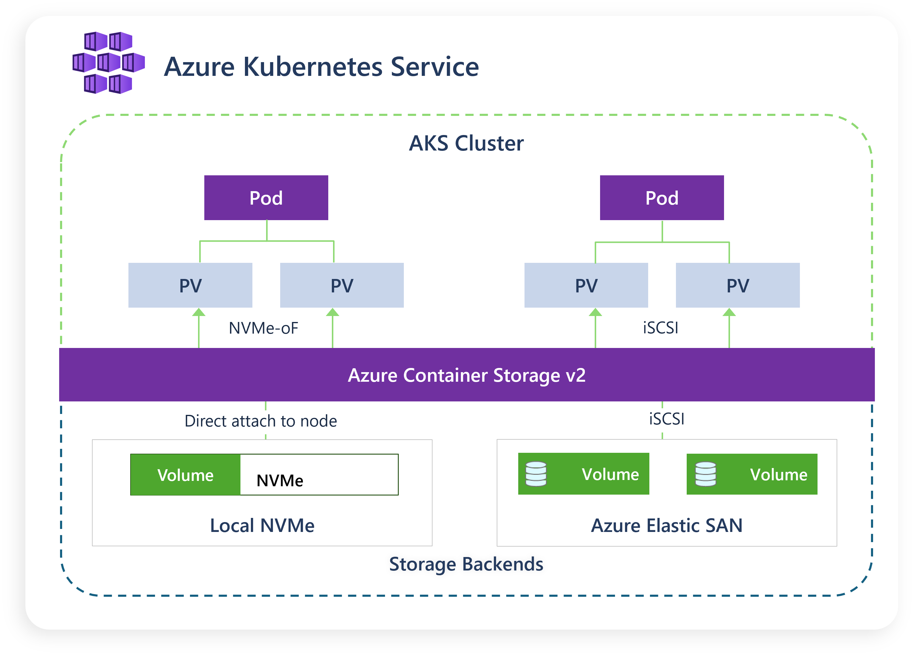

## Introduction

Stateful workloads on Kubernetes continue to demand not only faster performance but also larger scale and more streamlined operational simplicity. [Azure Container Storage v2.1.0](https://learn.microsoft.com/azure/storage/container-storage/container-storage-introduction) is now generally available with three headline improvements: a native Elastic SAN (ESAN) integration, a modular on-demand installation model, and node selector support to control where Azure Container Storage components run.

## What’s new in v2.1.0

- Elastic SAN integration: Elastic SAN is available as a supported storage type in Azure Container Storage v2.1.0.
- Modular installation: You can selectively deploy only the components required for your chosen storage type, reducing install time and cluster footprint.
- Node selector support: You can control the placement of Azure Container Storage components on dedicated storage node pools or mixed topologies.

## How Elastic SAN integration helps

Elastic SAN is a managed, shared block storage service that provides a central pool of capacity and performance including IOPS and throughput. From this pool, you create multiple volumes and attach them to many compute resources.

Below are example ESAN “base capacity” sizes and the ESAN-level provisioned performance you get from that base size (because ESAN scales SAN IOPS + throughput linearly with base TiB). Specifically, each 1 TiB of base capacity adds 5,000 IOPS and 200 MB/s throughput; additional/capacity-only TiB does not increase IOPS or throughput.

| Base capacity (TiB) | ESAN provisioned IOPS | ESAN provisioned throughput |
| --- | --- | --- |
| 1 | 5,000 | 200 MB/s |
| 2 | 10,000 | 400 MB/s |
| 5 | 25,000 | 1,000 MB/s |
| 50 | 250,000 | 10,000 MB/s |
| 200 | 1,000,000 | 40,000 MB/s |

For Kubernetes users, the key benefit is a shared, centrally managed model that helps consolidate large numbers of persistent volumes under a single SAN resource, which can reduce management overhead for stateful workloads.

Elastic SAN uses iSCSI over TCP/IP for volume connectivity. This helps bypass traditional VM disk attachment constraints (for example, limits such as 64 disks per VM) when attaching many PVs per node, improving scalability for high-volume PV scenarios.
Here are the key advantages we see customers looking for:

**Seamless scalability for container workloads**: Elastic SAN increases the potential PV density per node by using iSCSI sessions instead of traditional disk attachments. On AKS Linux nodes, iSCSI sessions aren’t constrained by the same “disk attachment” limits, so you can attach significantly more PVs per node. This is especially useful for clusters that need to scale out PV-backed pods without hitting VM-level disk attachment ceilings.  

**Cost efficiency through storage consolidation**: Elastic SAN provisions storage at the TiB level, which enables consolidating hundreds (or thousands) of smaller GiB-scale PVs under a single SAN. This reduces overprovisioning at the volume level and can lower management overhead by consolidating many volumes under fewer top-level storage resources.  

**Fast attach/detach operations for burst scale scenarios**: Elastic SAN uses iSCSI. In practice, customers care about attach/detach during burst scale when dozens to hundreds of pods come and go quickly. The key point: iSCSI session establishment can be fast and avoids disk-centric attachment throttling patterns.

**Simplified management with an on-ramp to open-source flexibility**: Azure Container Storage v2 is designed so you install only the components needed for the selected storage type, and it’s aligned with a broader direction where both Azure Container Storage v2 and the SAN CSI Driver are planned to be open sourced to give customers flexibility in how they orchestrate storage.  

## Which workloads benefit most

Elastic SAN with Azure Container Storage is a strong fit for stateful workloads that combine many volumes with elastic provisioning needs. Here are a few workload patterns we’ve seen align well:
DBaaS / multi-tenant database platforms: A representative scenario is a DBaaS provider running containerized databases on AKS. The key requirements tend to be:

- scale out workload instances while keeping infrastructure overhead manageable
- provision and attach many PVs quickly
- avoid “monolithic” installs when only one storage type is needed

**Large-scale developer environments and per-user volumes**: Another pattern is per-user or per-project environments where each user instance maps to a PV. One example described in planning is a large environment with many pods across multiple clusters, where daily burst creation can stress volume provisioning and attachment if implemented as thousands of independent disks. Elastic SAN enables consolidating volumes under a SAN and accelerating provisioning/attachment flows compared to disk-per-PV approaches.  

**Stateful databases on AKS (PostgreSQL and beyond)**: AKS guidance and benchmarks frequently show how storage choices impact database performance and operability. Azure Container Storage is used to orchestrate Kubernetes volume deployment, and it supports local NVMe and Elastic SAN. So, you can choose backing storage based on durability, scale, or cost needs. If you’re deciding between local NVMe and network-backed options such as Elastic SAN, the “right” answer usually depends on your latency and durability requirements. The goal with Azure Container Storage is to keep the Kubernetes-native experience consistent while letting you select the backend that matches the workload.

## On-demand installation model

Azure Container Storage v2.1.0 supports a lightweight, modular installation model. With v2.1.0, you have flexibility in how you enable Azure Container Storage. You can enable Azure Container Storage first, then choose a backing storage type when you need it, so you deploy only the components required for that storage type. It supports two kinds of modes for installation:

**Flow A**: Enable Azure Container Storage and choose storage type upfront
If you know which storage type (local NVMe/Elastic SAN) you want to use up-front, enable Azure Container Storage with your preferred storage type so the relevant driver and a default StorageClass can be configured.

**Flow B**: Enable Azure Container Storage first, then add storage type later
If you want to keep the initial install lightweight, you can enable Azure Container Storage first and then create a StorageClass of your preferred storage type which triggers installation of the respective CSI driver when you need it.  
configured.

## Node selector support for component placement

In many real clusters, you don’t want “every component everywhere” You might have:

- a dedicated node pool optimized for storage-heavy workloads
- GPU pools where you want to minimize background DaemonSet footprint
- mixed compute/storage topologies where placement matters

Azure Container Storage v2.1.0 adds node selector support so you can control where Azure Container Storage components run, helping optimize performance and resource usage

## Getting started with Azure Container Storage v2.1.0

Ready to run your stateful workloads using Azure Container Storage v2.1.0? Here are your next steps:

- New to Azure Container Storage? Start with our [comprehensive documentation](https://learn.microsoft.com/azure/storage/container-storage/container-storage-introduction)

- Want to use Azure Elastic SAN as storage type? Follow [the step-by-step guide](https://learn.microsoft.com/en-us/azure/storage/container-storage/use-container-storage-with-local-disk)

- Want to use local NVMe as storage type? Follow [the step-by-step guide](https://learn.microsoft.com/azure/storage/container-storage/use-container-storage-with-elastic-san?tabs=cli)

- Deploying specific workloads? Check out our updated deployment guide for [PostgreSQL](https://learn.microsoft.com/azure/aks/postgresql-ha-overview)

- Want the open-source local CSI driver? Visit our [GitHub repository](https://github.com/Azure/local-csi-driver) for installation instructions

- Have questions or feedback? Reach out to our team at [AskContainerStorage@microsoft.com](mailto:AskContainerStorage@microsoft.com)

## Practical guidance

- Validate scale targets in your environment: very high PV density scenarios should be tested with your workload’s IO patterns and cluster topology.

- Use node selectors to align component placement with your node pool strategy (for example, dedicated storage pools or mixed pools).

- Consolidate where it makes sense: Elastic SAN is most compelling when you have many PVs and want centralized capacity/performance management.
