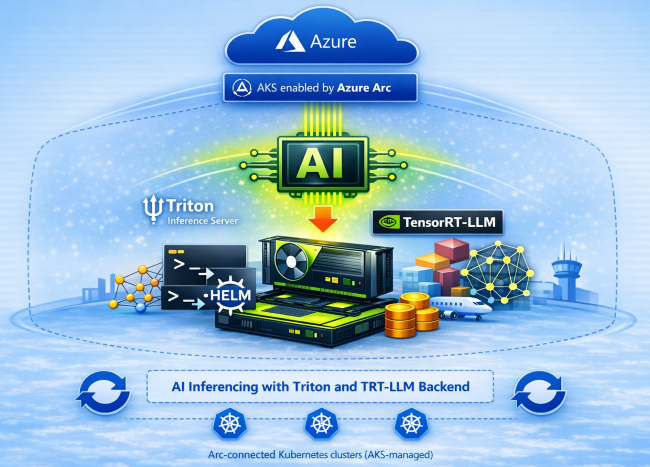

<!-- markdownlint-disable MD046 -->

In this post, you’ll deploy NVIDIA Triton Inference Server on your Azure Kubernetes Service (AKS) enabled by Azure Arc cluster to serve a Qwen‑based generative model using the TensorRT‑LLM backend. By the end, you’ll have a working generative AI inference pipeline running locally on your on‑premises GPU hardware.

<!-- truncate -->



## Introduction

Earlier parts of this series used runtimes such as Ollama and vLLM to quickly enable local LLM inference and iterate on model behavior. In this post, you move to a more infrastructure‑centric deployment model using **NVIDIA Triton Inference Server with the TensorRT‑LLM backend** and an instruction‑tuned model. This approach prioritizes **predictable performance, efficient GPU utilization, and long‑running inference services**, making it well suited for edge and on‑prem environments where capacity is fixed and inference must operate reliably as part of the platform.

:::note[PREREQUISITES AND SCOPE]
Before you begin, ensure the [Part 2 prerequisites](/2026/04/07/ai-inference-on-aks-arc-part-2) are met, including a GPU node configured for **nvidia.com/gpu**. Cluster nodes need **internet access** to download models. **Expect a delay** during initial deployment while the pod downloads and caches model files.

This tutorial is designed for experimentation and learning. The configurations shown are not production-ready and should not be deployed to production environments without additional security, reliability, performance hardening, and following standard practices.
:::

## TensorRT‑LLM deployment pipeline on Triton

Unlike Ollama, vLLM, or ONNX-based models, where inference engines initialize at runtime, TensorRT-LLM follows an explicit build-then-serve pipeline. The model is compiled into a GPU-specific engine ahead of time, and Triton uses this engine for runtime inference. Once a TensorRT‑LLM engine is built, it can be deployed to any node as long as the hardware and software environment match the conditions it was built for. At a high level, the pipeline consists of three phases:

| Phase | Purpose | Key activities |
| ------ | -------- | ---------------- |
| **Preparation (Provisioner)** | Transform a standard model into a high‑performance, GPU‑specific executable | Model weights are converted from Hugging Face format into a TensorRT‑LLM checkpoint, optional quantization is applied to reduce memory footprint, and a GPU‑specific TensorRT engine is compiled with CUDA kernel fusion for maximum throughput. |
| **Configuration (Template)** | Align the model’s physical characteristics with Triton’s execution requirements | Template‑based Triton configurations are populated with concrete values such as engine paths, batching limits, and instance counts, ensuring preprocessing, engine, and postprocessing stages agree on shapes and runtime behavior. |
| **Inference (Runtime)** | Orchestrate live request execution and model serving | Triton Inference Server loads the prebuilt TensorRT‑LLM engine, orchestrates the ensemble pipeline end‑to‑end, manages concurrency and in‑flight batching, and exposes HTTP and gRPC endpoints for inference. |

### For reference

- [TensorRT‑LLM overview](https://docs.nvidia.com/tensorrt-llm)
- [TensorRT‑LLM engine build workflow](https://github.com/NVIDIA/TensorRT-LLM)
- [Triton model repository and ensemble models](https://docs.nvidia.com/deeplearning/triton-inference-server)
- [TensorRT‑LLM Triton backend](https://github.com/triton-inference-server/tensorrtllm_backend)
- [Triton Inference Server architecture](https://docs.nvidia.com/deeplearning/triton-inference-server/user-guide/docs)
- [Performance and batching concepts](https://docs.nvidia.com/deeplearning/triton-inference-server/user-guide/docs/user_guide/model_configuration.html)

### Why this pipeline matters

This compile-then-serve model differentiates TensorRT-LLM from earlier approaches in this series. By shifting optimization and hardware specialization to build time, TensorRT-LLM delivers deterministic performance and efficient GPU utilization, which are key requirements for edge and on-prem AI deployments.

### TensorRT-LLM build and deployment directory structure

The following directory structure represents how artifacts flow through the build and deployment phases when using TensorRT-LLM with Triton. This structure helps visualize how model assets, hardware-specific artifacts, and runtime configuration are separated.

```text
/models
├── qwen-raw
│   ├── model.safetensors
│   ├── tokenizer.json
│   ├── tokenizer_config.json
│   └── config.json
│
├── model_repository
│   ├── tllm_checkpoint_qwen_7b_int41
│   │   ├── config.json
│   │   ├── *.ckpt
│   │   └── rank0.safetensors
│   └── tllm_engine_qwen_7b_int41
│       ├── config.json
│       └── rank0.engine
│
├── engines
│   └── qwen_7b_int4
│       ├── config.json
│       └── rank0.engine
│
├── tokenizer
│   └── qwen_7b_int4
│       ├── tokenizer.json
│       └── tokenizer_config.json
│
└── triton_model_repo
    ├── ensemble
    │   ├── 1
    │   └── config.pbtxt
    ├── preprocessing
    │   ├── 1
    │   └── config.pbtxt
    ├── tensorrt_llm
    │   ├── 1
    │   └── config.pbtxt
    ├── postprocessing
    │   ├── 1
    │   └── config.pbtxt
    └── tensorrt_llm_bls
        ├── 1
        └── config.pbtxt
```

## Phase 1: Preparation

### Preparing storage for the model repository

In addition to the prerequisites, you'll need persistent **storage** for model files. First, create a **triton-inference** namespace and a **PersistentVolumeClaim** (PVC) for the model repository.

Save the following YAML as `triton-pvc.yaml`:

```yaml
# THE NAMESPACE
# Creates an isolated logical boundary for your Triton resources.
# All subsequent resources must reference this namespace to communicate.
apiVersion: v1
kind: Namespace
metadata:
  name: triton-inference
---
# THE STORAGE (PVC)
# Requests a persistent disk from the cluster to store your model weights.
# This ensures that if the Pod restarts, your downloaded models remain intact.
apiVersion: v1
kind: PersistentVolumeClaim
metadata:
  name: triton-model-repository-pvc
  namespace: triton-inference # Ensures the storage is available within your namespace
spec:
  # ReadWriteOnce (RWO) allows the volume to be mounted as read-write by a single node.
  accessModes:
    - ReadWriteOnce

  # Omit storageClassName to use the cluster's default StorageClass.
  resources:
    requests:
      # Allocates 100GB of space. Ensure your underlying disk provider
      # supports this size.
      storage: 100Gi
```

Apply the manifest and verify the PVC status is **Bound** (storage provisioned):

```powershell
kubectl apply -f triton-pvc.yaml
kubectl get pvc -n triton-inference
```

### Deploy a helper pod to download the model

:::tip
This tutorial uses a helper pod for downloading models, installing tools, and converting models to engines, making it easier to troubleshoot and iterate. For automated workflows, consider using a Kubernetes [Job](https://kubernetes.io/docs/concepts/workloads/controllers/job/) instead, which handles retries and completion tracking natively.
:::

Next, you'll deploy a temporary helper pod that acts as a provisioner. You'll use this pod to download the model into persistent storage, convert the raw weights into TensorRT-LLM checkpoints, and build a GPU-specific TensorRT engine. This pod **requires a GPU** during the preparation stage. Save the following YAML as `triton-provisioner.yaml`.

```yaml
# THE PROVISIONER POD
# This pod serves as your "workspace" to prepare the environment.
# Its purpose is to download raw models, convert them into checkpoints,
# and compile the optimized TensorRT engines for deployment.
apiVersion: v1
kind: Pod
metadata:
  name: triton-provisioner
  namespace: triton-inference
spec:
  containers:
    - name: provisioner
      # TRT-LLM Image: Contains the necessary NVIDIA libraries (CUDA, TensorRT-LLM)
      # and the Triton server binary required for engine building and testing.
      image: nvcr.io/nvidia/tritonserver:25.01-trtllm-python-py3

      # Keep the pod alive indefinitely so you can 'kubectl exec' into it
      # and run your download/build commands manually or via scripts.
      command: ["/bin/sh", "-c", "sleep infinity"]

      resources:
        limits:
          # A GPU is required for the 'trtllm-build' step to compile
          # the engine for the specific GPU architecture in your cluster.
          nvidia.com/gpu: 1

      volumeMounts:
        # Mount the PVC to /models inside the container.
        # All downloads and engine files saved here will persist across pod restarts.
        - name: model-storage
          mountPath: /models
  volumes:
    - name: model-storage
      # Connects the internal /models path to the 100Gi PVC defined earlier.
      persistentVolumeClaim:
        claimName: triton-model-repository-pvc
```

Apply the manifest and wait for the triton-provisioner pod to reach Running (you can stop watching with Ctrl+C once it’s running).

:::note[EXPECT A WAIT]
The provisioning pod may take ten minutes or longer to reach the Running state because it pulls a large Triton image that includes CUDA and TensorRT-LLM libraries.
:::

```powershell
kubectl apply -f triton-provisioner.yaml
kubectl get pods -n triton-inference -w
```

### TensorRT-LLM Model Preparation and Triton Repository Assembly

Save the following script as a `prepare-trtllm.sh` file. This script prepares a Hugging Face LLM for inference with Triton by downloading the model, converting and quantizing it into a GPU‑specific TensorRT‑LLM engine, assembling the Triton model repository, and generating all required configuration files for end‑to‑end inference.

```bash
#!/usr/bin/env bash
set -euo pipefail

# Print a helpful message if any command fails
trap 'echo "FAILED at line $LINENO: $BASH_COMMAND" >&2' ERR

echo "Starting TensorRT-LLM preparation pipeline..."

# Paths
MODELS_ROOT="/models"
RAW_MODEL_DIR="${MODELS_ROOT}/qwen-raw"
CHECKPOINT_DIR="${MODELS_ROOT}/model_repository/tllm_checkpoint_qwen_7b_int41"
ENGINE_BUILD_DIR="${MODELS_ROOT}/model_repository/tllm_engine_qwen_7b_int41"
ENGINES_DIR="${MODELS_ROOT}/engines/qwen_7b_int4"
TOKENIZER_DIR="${MODELS_ROOT}/tokenizer/qwen_7b_int4"
TRITON_REPO_DIR="${MODELS_ROOT}/triton_model_repo"
FILL_TEMPLATE_SCRIPT="/app/tools/fill_template.py"
MODEL_ID="Qwen/Qwen2.5-7B-Instruct"

# Small helper to print what is running
run() {
  echo ""
  echo "RUN: $*"
  "$@"
}

# Validate environment
if [[ ! -d "${MODELS_ROOT}" ]]; then
  echo "FAILED: ${MODELS_ROOT} does not exist. Ensure the PVC is mounted at /models and run inside the provisioner pod." >&2
  exit 1
fi

if ! command -v python3 >/dev/null 2>&1; then
  echo "FAILED: python3 not found. Run inside the TRT LLM provisioner image." >&2
  exit 1
fi

if ! command -v trtllm-build >/dev/null 2>&1; then
  echo "FAILED: trtllm-build not found. Run inside the TRT LLM provisioner image." >&2
  exit 1
fi

# Enter persistent directory
run cd "${MODELS_ROOT}"

# Create required directories (idempotent)
run mkdir -p "${RAW_MODEL_DIR}"
run mkdir -p "${CHECKPOINT_DIR}"
run mkdir -p "${ENGINE_BUILD_DIR}"

echo ""
echo "Downloading model ${MODEL_ID} into ${RAW_MODEL_DIR} ..."

# Download raw model
# Prefer huggingface-cli when available, otherwise fall back to python module invocation
if command -v huggingface-cli >/dev/null 2>&1; then
  run huggingface-cli download "${MODEL_ID}" --local-dir "${RAW_MODEL_DIR}" --exclude "*.bin" "*.pth"
else
  run python3 -m huggingface_hub.cli download "${MODEL_ID}" --local-dir "${RAW_MODEL_DIR}" --exclude "*.bin" "*.pth"
fi

# Convert to quantized checkpoint
run python3 /app/examples/qwen/convert_checkpoint.py \
  --model_dir "${RAW_MODEL_DIR}" \
  --output_dir "${CHECKPOINT_DIR}" \
  --dtype float16 \
  --use_weight_only \
  --weight_only_precision int4

# Build the compressed engine
run trtllm-build \
  --checkpoint_dir "${CHECKPOINT_DIR}" \
  --output_dir "${ENGINE_BUILD_DIR}" \
  --gemm_plugin float16 \
  --max_batch_size 4 \
  --max_input_len 2048 \
  --max_seq_len 3072

echo ""
echo "Finalizing Triton model repository..."

# Create folder layout + copy engine files
run mkdir -p "${ENGINES_DIR}"
run cp -f "${ENGINE_BUILD_DIR}/"* "${ENGINES_DIR}/"

# Copy Triton model repository templates (overwrite allowed)
run mkdir -p "${TRITON_REPO_DIR}"
run cp -rf /app/all_models/inflight_batcher_llm/* "${TRITON_REPO_DIR}/"

# Verify files copied
run ls -la "${TRITON_REPO_DIR}"

# Copy tokenizer files
run mkdir -p "${TOKENIZER_DIR}"
run cp -f "${RAW_MODEL_DIR}/"tokenizer* "${TOKENIZER_DIR}/"

# Fill in model configs with fill_template.py
if [[ ! -f "${FILL_TEMPLATE_SCRIPT}" ]]; then
  echo "FAILED: fill_template.py not found at ${FILL_TEMPLATE_SCRIPT}" >&2
  exit 1
fi

export ENGINE_DIR="${ENGINES_DIR}"
export TOKENIZER_DIR="${TOKENIZER_DIR}"
export MODEL_FOLDER="${TRITON_REPO_DIR}"
export TRITON_MAX_BATCH_SIZE="1"
export INSTANCE_COUNT="1"
export MAX_QUEUE_DELAY_MS="0"
export MAX_QUEUE_SIZE="0"
export FILL_TEMPLATE_SCRIPT="${FILL_TEMPLATE_SCRIPT}"
export DECOUPLED_MODE="false"
export LOGITS_DATATYPE="TYPE_FP32"

# Basic validation that expected config files exist before patching
for f in \
  "${MODEL_FOLDER}/ensemble/config.pbtxt" \
  "${MODEL_FOLDER}/preprocessing/config.pbtxt" \
  "${MODEL_FOLDER}/tensorrt_llm/config.pbtxt" \
  "${MODEL_FOLDER}/postprocessing/config.pbtxt" \
  "${MODEL_FOLDER}/tensorrt_llm_bls/config.pbtxt"
do
  if [[ ! -f "$f" ]]; then
    echo "FAILED: expected config file missing: $f" >&2
    exit 1
  fi
done

# Update ensemble config
run python3 "${FILL_TEMPLATE_SCRIPT}" -i "${MODEL_FOLDER}/ensemble/config.pbtxt" \
  "triton_max_batch_size:${TRITON_MAX_BATCH_SIZE},logits_datatype:${LOGITS_DATATYPE}"

# Update preprocessing config
run python3 "${FILL_TEMPLATE_SCRIPT}" -i "${MODEL_FOLDER}/preprocessing/config.pbtxt" \
  "tokenizer_dir:${TOKENIZER_DIR},triton_max_batch_size:${TRITON_MAX_BATCH_SIZE},preprocessing_instance_count:${INSTANCE_COUNT}"

# Update tensorrt_llm config
run python3 "${FILL_TEMPLATE_SCRIPT}" -i "${MODEL_FOLDER}/tensorrt_llm/config.pbtxt" \
  "triton_backend:tensorrtllm,triton_max_batch_size:${TRITON_MAX_BATCH_SIZE},decoupled_mode:${DECOUPLED_MODE},engine_dir:${ENGINE_DIR},max_queue_delay_microseconds:${MAX_QUEUE_DELAY_MS},batching_strategy:inflight_fused_batching,max_queue_size:${MAX_QUEUE_SIZE},encoder_input_features_data_type:TYPE_FP16,logits_datatype:${LOGITS_DATATYPE}"

# Update postprocessing config
run python3 "${FILL_TEMPLATE_SCRIPT}" -i "${MODEL_FOLDER}/postprocessing/config.pbtxt" \
  "tokenizer_dir:${TOKENIZER_DIR},triton_max_batch_size:${TRITON_MAX_BATCH_SIZE},postprocessing_instance_count:${INSTANCE_COUNT}"

# Update BLS config
run python3 "${FILL_TEMPLATE_SCRIPT}" -i "${MODEL_FOLDER}/tensorrt_llm_bls/config.pbtxt" \
  "triton_max_batch_size:${TRITON_MAX_BATCH_SIZE},decoupled_mode:${DECOUPLED_MODE},bls_instance_count:${INSTANCE_COUNT},logits_datatype:${LOGITS_DATATYPE}"

echo ""
echo "Triton model repository templates have been successfully updated."
echo "TensorRT-LLM preparation completed successfully."
echo "Stop the provisioner pod after this to release the GPU for the Triton server."
```

Run the `prepare-trtllm.sh` script inside provisioner POD using the following sequence of commands:

:::note[LONG BUILD TIME]
The engine build step may take 30 minutes or more depending on your GPU. Do not interrupt the process.
:::

```powershell
# Copy the prepare-trtllm.sh script to the provisioner pod
kubectl cp ./prepare-trtllm.sh triton-inference/triton-provisioner:/models/prepare-trtllm.sh

# Start a bash session inside the pod
kubectl exec -it triton-provisioner -n triton-inference -- /bin/bash
```

Run the following commands inside bash session:

```bash
# Fix potential Windows line-ending issues (safe no-op on Linux files)
sed -i 's/\r$//' /models/prepare-trtllm.sh

# Make the script executable
chmod +x /models/prepare-trtllm.sh

# Run the script
/models/prepare-trtllm.sh
```

### Deploying Triton inference server

With the engine in place, you'll deploy Triton. Save this as `triton-deployment.yaml`:

```yaml
# THE SERVICE (The "Phone Number" for your Model)
# This exposes the Triton Inference Server to users outside or inside the cluster.
---
apiVersion: v1
kind: Namespace
metadata:
  name: triton-inference
---
apiVersion: v1
kind: Service
metadata:
  name: triton-server
  namespace: triton-inference
spec:
  # LoadBalancer provides a public IP (on cloud providers like AKS/EKS/GKE).
  # Change to 'ClusterIP' if you only want internal access.
  type: LoadBalancer
  ports:
    # HTTP Endpoint: Standard REST queries (standard for most web apps)
    - name: http
      port: 8000
      targetPort: 8000
    # gRPC Endpoint: High-performance, low-latency streaming (best for LLMs)
    - name: grpc
      port: 8001
      targetPort: 8001
    # Metrics Endpoint: For Prometheus/Grafana monitoring (GPU usage, throughput)
    - name: metrics
      port: 8002
      targetPort: 8002
  selector:
    # Connects this Service to any Pod labeled 'app: triton-server'
    app: triton-server
---
# 5. THE DEPLOYMENT (The Inference Server)
# This is the actual "Running Process" that serves the model to users.
apiVersion: apps/v1
kind: Deployment
metadata:
  name: triton-server
  namespace: triton-inference
spec:
  # This can be flipped 1 or 0 to start and stop the Triton server during troubleshooting.
  replicas: 1
  selector:
    matchLabels:
      app: triton-server
  template:
    metadata:
      labels:
        app: triton-server
    spec:
      containers:
        - name: triton-server
          # Must match the version used in your Provisioner to ensure Engine compatibility.
          image: nvcr.io/nvidia/tritonserver:25.01-trtllm-python-py3
          args:
            - "tritonserver"
            # Point to the specific folder where your 'ensemble', 'tensorrt_llm', etc., are stored.
            - "--model-repository=/models/triton_model_repo"
            # Prevents Triton from guessing configurations; ensures it uses your exact .pbtxt files.
            - "--disable-auto-complete-config"
            # Increases timeout for the Python backend (needed for heavy LLM tokenizers/preprocessing).
            - "--backend-config=python,stub-timeout-seconds=120"
            # Verbose logging (Level 3) is great for debugging but very "noisy."
            # In production, change --log-verbose to 0 or 1.
            - "--log-info=true"
            - "--log-warning=true"
            - "--log-error=true"
            - "--log-verbose=3"
          ports:
            - containerPort: 8000
            - containerPort: 8001
            - containerPort: 8002

          resources:
            limits:
              # Triton requires at least one GPU to load the TensorRT-LLM backend.
              nvidia.com/gpu: 1
          volumeMounts:
            # Mount the SAME PVC that the Provisioner used to access the built engine files.
            - name: model-storage
              mountPath: /models
      volumes:
        - name: model-storage
          persistentVolumeClaim:
            claimName: triton-model-repository-pvc
```

Apply the Triton deployment manifest and verify Triton server is running:

:::warning[GPU RESOURCE CONFLICT]
The provisioner pod holds the GPU. You must delete it before deploying the Triton server, otherwise the Triton pod will stay in Pending state due to insufficient GPU resources.
:::

```powershell
# Stop Provisioner POD
kubectl delete pod triton-provisioner -n triton-inference
# wait until provisioner pod is stopped.
kubectl get pods -n triton-inference

# Deploy Triton Server
kubectl apply -f triton-deployment.yaml
# verify triton server is running.
kubectl get pods -n triton-inference -w

# Optionally check the Triton Server logs to ensure it starts correctly
kubectl logs -f deployment/triton-server -n triton-inference
# Replace "triton-server-5cb57f9bf-fjk6x" with the pod name from "kubectl get pods -n triton-inference"
kubectl logs triton-server-5cb57f9bf-fjk6x -n triton-inference --previous

```

### Validating the TensorRT-LLM inference

To validate the setup end-to-end, send a request to Triton and verify that TensorRT-LLM returns a valid response.

1. Expose the Triton service for testing: you'll use port-forwarding. In a separate terminal window (or a new background process), run:

    ```powershell
    kubectl port-forward -n triton-inference deploy/triton-server 8000:8000
    ```

2. Run an inference request

    ```powershell
    # Send a query to Triton from your client PowerShell
    $ModelName = "ensemble"
    $Uri = "http://localhost:8000/v2/models/$ModelName/generate"
    $Payload = @{
      text_input = "What is Azure?"
      max_tokens = 64
      bad_words  = ""
      stop_words = ""
    }
    $response = Invoke-RestMethod -Uri $Uri -Method Post -Body ($Payload | ConvertTo-Json -Compress) -ContentType "application/json"
    $response
    ```

Example output:

```output
model_name     : ensemble
model_version  : 1
sequence_end   : False
sequence_id    : 0
sequence_start : False
text_output    : What is Azure?

                 Azure is Microsoft's cloud computing platform that enables businesses to build, deploy, and manage
                 applications and services through a global network of data centers. It offers a wide range of cloud
                 services including Infrastructure as a Service (IaaS), Platform as a Service (PaaS), and Software as a
                 Service (SaaS). Azure
```

### Cleanup

To free resources, delete the triton-inference namespace and all its contents:

```powershell
kubectl delete namespace triton-inference
```

If you installed the GPU Operator specifically for this test, you can also uninstall it via Helm to release cluster resources.
