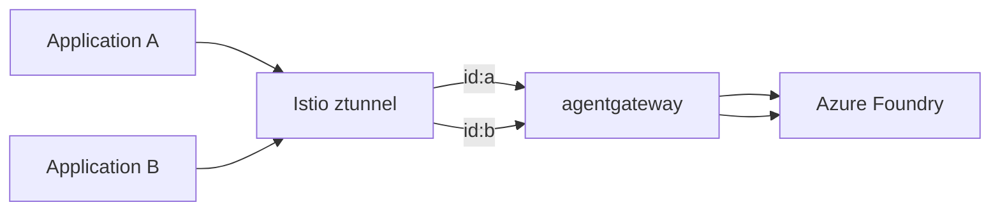

## Control AI spend with per-application token rate limiting using Application Network and agentgateway

As organizations scale AI adoption, platform teams must balance two competing goals:

- Enable broad, low-friction access to AI services  
- Prevent a single application from exhausting shared quotas

This article describes a **platform-oriented approach** to controlling AI spend using **Azure Kubernetes Application Network** and **agentgateway**. By leveraging **workload identity already present in the network**, you can enforce **per-application, token-based rate limiting** without issuing API keys to every application.

<!-- truncate -->  

**Azure Kubernetes Application Network** (AppNet, currently in Public Preview) is Azure's fully-managed L7 network for AKS, providing Security, Observability, and Control for your L7 network out-of-the-box. You can learn more about AppNet here, but in this article, we're focusing on AppNet's secure, automatic mTLS Authentication.

---

## The challenge with shared AI quotas

A typical AI inference workflow looks like this:

1. Create an AI or model provider account.
2. Distribute a shared API key.
3. Allow applications to call the service.

This approach works initially, but as usage grows, teams often encounter a shared failure mode:

> **403: Insufficient Quota**

When the quota is exhausted:

- All applications are affected simultaneously.
- It is difficult to identify which workload consumed the quota.
- One misbehaving application can impact the entire platform. 

---

## Why per-application API keys don’t scale

A common mitigation is to issue one API key per application, each with an independent quota. While this improves attribution, it introduces new operational challenges:

- Manual key provisioning by platform engineers
- Secret distribution and rotation
- Slower onboarding for new applications
- Increased operational overhead

Instead of removing blockers, the platform becomes one. 

---

## A platform-oriented solution

A more scalable approach is to shift rate limiting out of application code and into the **platform layer**.

The key idea is:

> **Identify applications by identity, not by secrets.**

In AppNet, workload identity is automatically established through mutual TLS (mTLS) using Istio's ztunnel proxy. By enforcing policy based on this identity, the platform can apply per-application limits transparently. 

---

## Solution overview

In this solution, we'll combine agentgateway's ability to define Token Rate Limiting buckets with CEL expressions with AppNet's automatic mTLS identity on all traffic to accomplish per-application Token budgets. By configuring agentgateway to terminate mTLS directly, we're able to have it participate in the network just like an Istio waypoint would, which gives it direct access to the TLS identity on the wire.



In contrast with our initial scenario, the Azure Foundry API Key is only accessible to the agentgateway, so application teams don't touch any secrets, while AppNet provides per-application identity information on the wire.

## Deep Dive

While the complete configuration for this demo can be found here, let's have a look at the key components that make up our rate limit. First, let's configure agentgateway to interoperate with AppNet, which exposes an Istio-compliant control plane:

```yaml
apiVersion: agentgateway.dev/v1alpha1
kind: AgentgatewayParameters
metadata:
  name: agentgateway
spec:
  deployment:
    spec:
      template:
        metadata:
          labels:
            istio.io/dataplane-mode: none
            networking.istio.io/tunnel: http
  istio: {}
  rawConfig:
    binds:
    - listeners:
      port: 15008
      tunnelProtocol: hboneGateway
  service:
    spec:
      ports:
      - name: hbone
        port: 15008
```

Next, let's create a policy to perform token-based rate limiting on this gateway's traffic, using the AppNet mTLS identity as the bucket key.

```yaml
apiVersion: agentgateway.dev/v1alpha1
kind: AgentgatewayPolicy
metadata:
  name: minute-token-budget
spec:
  targetRefs:
  - group: gateway.networking.k8s.io
    kind: Gateway
    name: gateway
  traffic:
    rateLimit:
      global:
        backendRef:
          group: ""
          kind: Service
          name: ratelimit
          namespace: ratelimit
          port: 8081
        descriptors:
        - entries:
          - expression: source.identity.namespace
            name: client_ns
          unit: Tokens
        domain: token-budgets
```

Finally, let's configure our Rate Limiting Server to deny traffic after 100 tokens per application per minute (in reality, we'd need a much bigger budget, but this low budget lets us easily demo exceeding the rate limiter).

```yaml
apiVersion: v1
data:
  config.yaml: |
    domain: token-budgets
    descriptors:
      # Rate limit by client namespace
      - key: client_ns
        rate_limit:
          unit: minute
          requests_per_unit: 100
kind: ConfigMap
metadata:
  name: ratelimit-config
```

Now that we've configured our rate limiter, let's send some completion requests to Azure Foundry to see it in action (full test instructions available (here)[https://gist.github.com/therealmitchconnors/b2776cea7a72e25f805b0228eef986cc#file-details-md]):

```bash
/ $ curl gateway.default/v1/chat/completions -i -H content-type:application/json  -d '{
>    "model": "",
>    "messages": [
>      {
>        "role": "system",
>        "content": "You are a helpful assistant."
>      },
>      {
>        "role": "user",
>        "content": "Write a short haiku about cloud computing."
>      }
>    ]
>  }'
HTTP/1.1 200 OK
...(succeeds several times)
/ $ curl gateway.default/v1/chat/completions -i -H content-type:application/json  -d '{
>    "model": "",
>    "messages": [
>      {
>        "role": "system",
>        "content": "You are a helpful assistant."
>      },
>      {
>        "role": "user",
>        "content": "Write a short haiku about cloud computing."
>      }
>    ]
>  }'
HTTP/1.1 429 Too Many Requests
content-length: 0
date: Fri, 03 Apr 2026 22:59:18 GMT
```

Once we've exhausted our token budget, all requests from httpbin to Azure Foundry will be blocked by agentgateway until our budget resets in 1 minute.  Requests from other applications can proceed without being blocked, because each application has its own rate limit bucket, keyed on AppNet identity.

## Conclusion

By adopting this platform-oriented approach, we gain centralized control over AI spending, eliminate secrets distribution, and improve operational efficiency. Applications gain transparent rate limiting without code changes, while platform teams reduce overhead and enforce fair resource allocation across the organization. This is just one of the many ways you can benefit from Application Network, built on Istio's Ambient Mode, with readily available open source tools like agentgateway. To learn more, see [Application Network documentation](https://learn.microsoft.com/azure/application-network/overview) and [agentgateway documentation](https://agentgateway.dev).