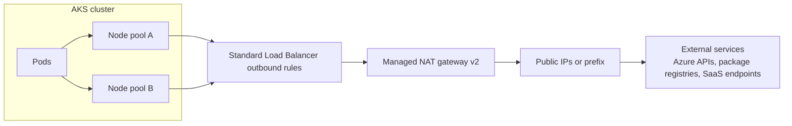
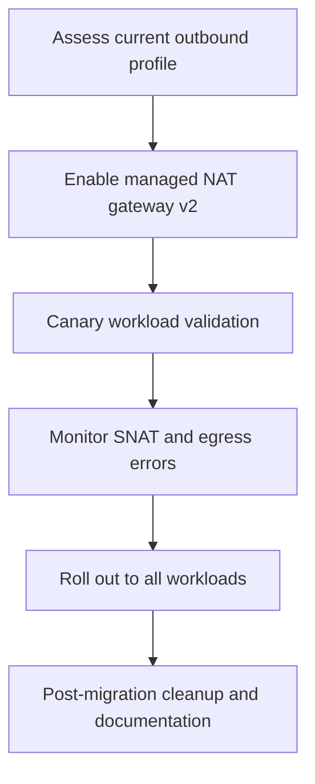

AKS now supports **managed NAT gateway v2** for cluster egress. You get a larger egress scaling envelope, improved zone resiliency controls, and better operational visibility for outbound connections.

If you run workloads with high outbound concurrency, strict outbound IP requirements, or periodic traffic spikes, managed NAT gateway v2 helps you keep egress stable without managing extra network infrastructure by hand.

<!-- truncate -->

## Why this matters

Most production clusters depend on predictable outbound traffic for image pulls, package downloads, API calls, telemetry, and third-party integrations. When egress is constrained, you can see intermittent timeouts, source port pressure, and hard-to-debug failures.

Managed NAT gateway v2 improves this in three areas:

- Better scale characteristics for outbound SNAT usage
- Stronger resiliency options for zonal design
- More actionable observability for operations teams

## Architecture at a glance

The following diagram shows how managed NAT gateway v2 handles AKS outbound traffic:



## What is new in managed NAT gateway v2

Managed NAT gateway v2 keeps the AKS-managed experience while adding key improvements:

- Expanded outbound connection handling for bursty workloads
- Improved compatibility with zone-aware cluster designs
- New egress observability signals to speed up troubleshooting
- Simpler migration path from existing managed NAT gateway configurations

## Prerequisites

1. Azure CLI version 2.79.0 or later.
2. `aks-preview` extension updated to the latest version.
3. Feature registration for managed NAT gateway v2 in your subscription.

```bash
az extension add --name aks-preview
az extension update --name aks-preview

az feature register \
	--namespace Microsoft.ContainerService \
	--name ManagedNatGatewayV2Preview

az provider register --namespace Microsoft.ContainerService
```

## Create a new AKS cluster with managed NAT gateway v2

Use the following command to create a new cluster with managed NAT gateway v2 enabled.

```bash
RESOURCE_GROUP=my-rg
CLUSTER_NAME=my-aks
LOCATION=eastus2

az group create \
	--name "$RESOURCE_GROUP" \
	--location "$LOCATION"

az aks create \
	--resource-group "$RESOURCE_GROUP" \
	--name "$CLUSTER_NAME" \
	--location "$LOCATION" \
	--network-plugin azure \
	--outbound-type managedNATGatewayV2 \
	--nat-gateway-managed-outbound-ip-count 2 \
	--nat-gateway-idle-timeout 30 \
	--generate-ssh-keys
```

### Verify cluster outbound profile

```bash
az aks show \
	--resource-group "$RESOURCE_GROUP" \
	--name "$CLUSTER_NAME" \
	--query "networkProfile.outboundType"
```

Expected output:

```output
"managedNATGatewayV2"
```

## Upgrade an existing cluster

If your cluster already uses a managed outbound profile, update it in place:

```bash
az aks update \
	--resource-group "$RESOURCE_GROUP" \
	--name "$CLUSTER_NAME" \
	--outbound-type managedNATGatewayV2 \
	--nat-gateway-managed-outbound-ip-count 4 \
	--nat-gateway-idle-timeout 30
```

## Migration flow

Use a phased rollout to reduce risk in production:



## Validate egress after enablement

Get cluster credentials and deploy a small test pod.

```bash
az aks get-credentials \
	--resource-group "$RESOURCE_GROUP" \
	--name "$CLUSTER_NAME"

kubectl run egress-check \
	--image=mcr.microsoft.com/cbl-mariner/base/core:2.0 \
	--restart=Never \
	--command -- sh -c "curl -s https://ifconfig.me && echo"

kubectl logs pod/egress-check
```

The command should return one of the managed outbound public IP addresses from your NAT gateway v2 profile.

## Operational guidance

Follow these practices when you move production clusters:

- Start with non-critical namespaces as a canary
- Keep explicit outbound allowlists up to date in dependent services
- Track outbound failures, timeout rate, and connection reset patterns
- Scale managed outbound IP count based on measured concurrency
- Document fallback and rollback procedures before rollout

## Known considerations

- Feature availability can vary by region during rollout.
- Quotas for public IP resources still apply.
- If you use user-defined routing, validate route table and firewall policy interactions before migration.
- For highly regulated environments, review outbound IP inventory and audit requirements before cutover.

## Next steps

- Read the [AKS egress outbound type documentation](https://learn.microsoft.com/azure/aks/egress-outboundtype).
- Review [AKS networking concepts](https://learn.microsoft.com/azure/aks/concepts-network).
- Share feedback through [AKS GitHub Issues](https://github.com/Azure/AKS/issues).

Managed NAT gateway v2 gives you a stronger default for production egress in AKS. Start with a canary, validate with telemetry, and roll out in phases for a low-risk transition.
