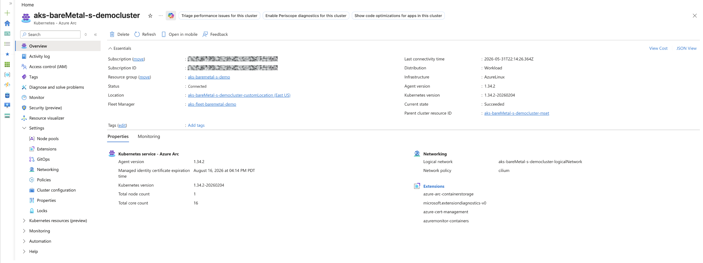
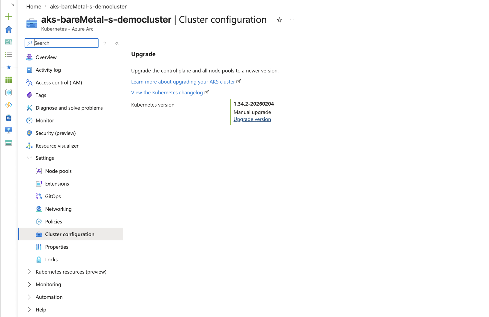

AKS runs everywhere — now on bare metal at the edge.

Our vision for Azure Kubernetes Service has always been simple: AKS runs everywhere. The same Azure Kubernetes Service you run across Azure regions is the same platform you run in sovereign and private clouds, and on OEM hardware. One platform, every substrate — so that the skills, the tooling, and the operational model you already know come with you wherever your applications need to run.

Today, we're adding the newest member to that family — and it answers one of the strongest signals we've heard from customers at the edge. **AKS now runs directly on bare-metal, small-form-factor devices at the edge, available today in public preview.**

## Why bare metal

For years, customers have told us the same thing: the edge forces hard trade-offs on Kubernetes. They want the consistency of a managed Kubernetes platform in the places where their business actually happens — the retail back room, the factory floor, the quick-service restaurant, the branch office, the remote site. But the edge is not the datacenter. Space, power, and budget are constrained. Hardware is small and sometimes ruggedized. Connectivity is intermittent, and sites often need to keep running through disconnection. Given the Kubernetes control plane runs locally on the device, deployed workloads continue to operate normally during connectivity loss. Only portal visibility and Azure management actions are interrupted until the connection is restored.

What customers have asked us for is precise: run real Kubernetes directly on the hardware, with no hypervisor underneath and no virtualization layer to license or maintain; do it on lightweight edge hardware rather than datacenter-class servers; and let it keep operating through intermittent connectivity.

That is exactly what AKS on bare metal delivers. This is Azure Kubernetes Service running directly on the device with no hypervisor, on small-form-factor hardware, and resilient to intermittent connectivity. It is not a different product for the edge. It is the same AKS, supporting a new class of hardware at the edge.

## From power-on to a running AKS cluster

The experience is deliberately simple. On-site, someone plugs in a USB drive with an OS image from the Azure portal, powers on the device, waits a couple of minutes, and removes the drive. That's the only step that happens at the location. During this [zero-touch provisioning](https://techcommunity.microsoft.com/blog/azurearcblog/announcing-public-preview-simplified-machine-provisioning-for-azure-local/4496811) process, a device voucher is written back to the USB drive and all configuration shifts to Azure — no deep infrastructure expertise required on site.

From there, everything happens in Azure. The machine is onboarded through the [Azure Local small form factor](https://learn.microsoft.com/azure/azure-local/whats-new) creation experience — create a site, upload the voucher, and the machine comes up as Provisioned. The cluster creation looks exactly like AKS anywhere else: configure Azure RBAC, set the control-plane networking, enable Azure Monitor, and deploy. When it completes, you have an AKS cluster running on Azure Linux, on bare metal, fully manageable from Azure: workloads, services, ingress, and Kubernetes upgrades, all without leaving the portal.

## One consistent AKS experience, from cloud to edge

Provisioning is only half the story. What matters at the edge is how you operate the cluster over time — and here the principle is simple: AKS on bare metal is just an AKS cluster. There's no edge-specific console, no separate operational model, no exceptions to learn.

Because it's a first-class AKS cluster, it shows up in Azure Kubernetes Fleet Manager right alongside your cloud clusters, managed and monitored with the same controls and the same tooling you already use everywhere else. The same AKS, the same experience, consistent across cloud and edge — now including bare metal.

## Available today

This is what "AKS everywhere" was always meant to become: not a fragmented collection of edge-specific products and tools, but one Kubernetes platform that follows your applications to every place they need to run — now including the smallest, most constrained, and most remote hardware at the edge.

**AKS on bare metal is now in public preview.** We can't wait to see what you build on it.

Join the preview today at [aka.ms/aks-edge-baremetal](https://aka.ms/aks-edge-baremetal).
