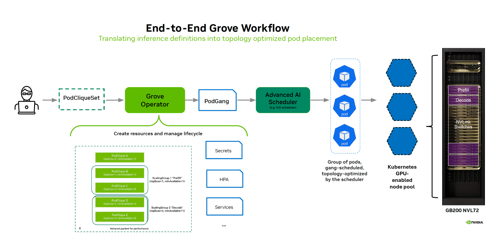

*This blog post is co-authored with [Nikhar Maheshwari](https://www.linkedin.com/in/nikharmaheshwari/),
[Anish Maddipoti](https://www.linkedin.com/in/anish-maddipoti/),
[Rohan Varma](https://www.linkedin.com/in/rohan-s-varma/),
[Clement Pakkam Isaac](https://www.linkedin.com/in/clement-ai/), and
[Stephen Mccoulough](https://www.linkedin.com/in/stephen-mcc/?lipi=urn%3Ali%3Apage%3Ad_flagship3_profile_view_base%3BEwyhTwyCTTOp9G8dfPVssw%3D%3D)
from NVIDIA.*

In the [first three blog posts](https://blog.aks.azure.com/tags/dynamo-series) of this series, we introduced [NVIDIA Dynamo](https://www.nvidia.com/en-us/ai/dynamo/) on AKS, covered SLO-driven scaling with the Dynamo Planner and Profiler, and explored KV-cache-aware routing. In this post, we move up one layer of the inference stack: how to describe and operate the distributed inference workload on a Kubernetes cluster.

As inference deployments evolve from simple model-serving replicas to systems with disaggregated prefill and decode phases, multi-node model instances, and explicit startup dependencies, an inference deployment benefits from a single API that describes the full serving pipeline: which roles exist, how they relate, and what constitutes a **deployable unit** of inference-serving capacity.

[NVIDIA Grove](https://developer.nvidia.com/grove) addresses this layer of the stack with a Kubernetes-native API for describing an AI inference service — so the platform can schedule, start, and scale the deployment in units that match the inference architecture.

<!-- truncate -->

## The Kubernetes orchestration gap for distributed inference

Modern AI inference workloads are fundamentally different from the traditional distributed workloads built with independent, stateless microservices. A production LLM deployment may include distinct roles – frontend services, KV-aware routers, prefill and decode workers – that are tightly coupled in how they must be scheduled, started, and scaled. They require scheduling in groups, starting up in a specific order, and scaling in ratios that preserve an end-to-end serving path. For larger models, a single prefill or decode instance may span several pods; where a complete deployment of each instance is necessary for a functional serving capacity.

Kubernetes primitives can independently schedule and run these components, but they do not natively understand the inter-component relationships required for the deployment to operate as an inference service:

* Which pods form one usable model instance?
* Which roles must start before others?
* Which components scale independently, and which must scale as a group?

Using existing Kubernetes primitives alone, operations teams are forced to spread these considerations across bespoke manifests, labels, scripts, or custom controllers. This can create orchestration challenges and worsen the deployment observability.

[LeaderWorkerSet (LWS)](https://lws.sigs.k8s.io/docs/overview/) is an Upstream API that addresses a part of this problem by managing a leader pod and its worker pods as a replicated unit, which generally maps well to multi-node model instances. A full Dynamo-style deployment, however, can contain multiple leader-worker units across prefill and decode, plus routing and other service components. LWS may model those leader-worker groups, but it is not intended to describe the full inference service across them. Additionally, LWS couples multi-node scaling units with a leader-worker pattern, and not all multi-node use cases map to this cleanly. Overall, scheduling, startup, and scaling for such modern deployments require a more flexible Kubernetes-native workload abstraction.

## NVIDIA Grove for Kubernetes-native AI scheduling

NVIDIA Grove is an open-source Kubernetes API, available as a modular component of NVIDIA Dynamo, for defining both simple single-node and complex multi-node AI workloads. Where standard Kubernetes resources describe individual pods and services, Grove enables you to describe an entire inference serving system’s components and orchestration requirements as one object: routing, prefill, decode, leader-worker groups/multi-node units, startup dependencies, and scaling boundaries — all expressed in a single workload specification.

From that specification, Grove takes responsibility for coordinating the Kubernetes resources required to run the service. Scheduling, startup, and scaling have a shared view of the workload: which pods form a usable instance and which roles belong together. Scaling actions can target a single role, a complete multi-node model instance, or a full service replica. Startup dependencies between roles are part of the workload definition rather than external scripts.

The result is a workload API that matches how distributed inference systems are actually built: individual roles with different resource profiles, grouped model instances that must scale together, and complete service replicas that represent usable end-to-end serving capacity.

In an inference deployment, Dynamo provides the serving stack: inference workers, routing, the Planner, KV cache management, and backend integrations such as vLLM, TensorRT-LLM, and SGLang. Grove defines the Kubernetes orchestration layer around this stack, a.k.a. the contract between the inference system and the cluster. Grove can also be deployed standalone or integrated with other high-performance inference frameworks.

## How Grove models the workload

Grove's user-facing model is built around three hierarchical primitives that together describe the full shape of an inference deployment, from individual roles up to the complete service:

| Grove primitive | What it represents | Example in model inference |
|--|--|--|
| PodClique | A group of pods with the same role and pod template. It has its own replica count, resource needs, and optional autoscaling policy | Router pods, prefill workers, decode workers, frontend pods |
| PodCliqueScalingGroup | A group of PodClique objects that must scale together while preserving role ratios | A multi-node prefill instance with one leader and four workers |
| PodCliqueSet | The top-level workload object that describes the full inference system | Router + prefill group + decode group, with startup order and scaling policy |

Using this hierarchy, Grove generates the lower-level Kubernetes resources the cluster needs to schedule, start, and scale the workload. Users work at the inference deployment level, while Grove translates the intent into Grove managed pods and other resources, including the scheduler-facing PodGang resources that encode the scheduling constraints.

## Coordinating scheduling, startup, and scalability

Once Grove has the workload specification, it uses the same hierarchy to guide how the workload is scheduled, started, and scaled.

### Scheduling

For multi-node inference, serving capacity arrives as a collection of complete instances. A prefill or decode instance that spans several pods can serve traffic only when the full set can run together. Gang scheduling gives Kubernetes an all-or-nothing contract: either all pods in the instance are scheduled together, or none are. Grove creates the scheduler-facing PodGang resources automatically from the workload specification, so this guarantee is part of the workload model rather than a rule that teams have to enforce separately.

Gang scheduling ensures that each individual component of a deployment is allocated as a complete unit, for example, a full prefill instance or a full decode instance. However, this alone does not guarantee that the deployment can actually serve end-to-end requests: the scheduler might schedule several complete prefill instances without any matching decode capacity, or vice versa.

Grove addresses this limitation with hierarchical gang scheduling. Instead of enforcing completeness only at the instance level, Grove also enforces it at the service level. The workload specifies higher-level viability constraints, for example, that at least one complete prefill instance and one complete decode instance must be scheduled together before the deployment is considered ready. The scheduler therefore treats these interdependent components as a “higher-level gang”: it schedules the required combination only when enough resources are available. This prevents the system from allocating individually complete but functionally unusable configurations that cannot process requests end to end.

On an AKS cluster, Grove-managed inference pods can be scheduled by a gang-aware scheduler like the [KAI Scheduler](https://github.com/kai-scheduler/KAI-Scheduler), an open-source Kubernetes-native scheduler built for AI workloads with native PodGang awareness. Grove defines the inference workload - the roles, groups, dependencies, and scaling boundaries - while KAI gives Kubernetes the scheduling behavior needed to place those pods as complete units. Together, they enable these capabilities to be expressed and enforced cleanly within the Kubernetes-native infrastructure.

:::note
When deploying Dynamo workloads with Grove and KAI scheduler, it is recommended that the cluster is set up with dedicated resources for the KAI scheduler to avoid scheduling conflicts. General-purpose workloads can continue to use the default kube-scheduler on separate node pools, so the two schedulers do not compete for the same node capacity.
:::

### Startup

Scheduling is only the first step. Distributed serving systems often have startup dependencies; for example, workers need to be discoverable before leaders start, and routers or frontends may need to be ready before model workers register. Grove integrates **startup order** with the workload definition through `cliqueStartupType` and `startsAfter`, instead of leaving it to scripts or external conventions.

### Scaling

Grove has multiple scaling boundaries in a hierarchy model: a PodClique for one role, a PodCliqueScalingGroup for a complete leader-worker unit, and a PodCliqueSet for the full service. This preserves independent scaling even when scheduling is coordinated: prefill and decode can be scheduled as viable units while still scaling separately in response to various bottlenecks.

Different scaling boundaries also integrate well with the Dynamo Planner (covered in [Part 2 of this blog series](https://blog.aks.azure.com/2026/01/22/dynamo-on-aks-part-2)). While the Planner reasons about traffic shape, sequence lengths, and TTFT or ITL targets to decide when capacity should change, Grove ensures this decision targets the appropriate Grove workload boundary: a PodClique for a single role, a PodCliqueScalingGroup for a complete leader-worker instance, or the PodCliqueSet for the end-to-end inference service. Ultimately, Planner-driven scale-out doesn't just add pods; it adds a complete, gang-scheduled inference instance that is ready to serve.

## Modeling inference deployments with Grove

Grove's [PodCliqueSet API](https://github.com/ai-dynamo/grove/blob/main/docs/api-reference/operator-api.md#podcliqueset) is flexible enough to cover a range of inference deployment shapes:

**Aggregated serving**: where a single PodClique is sufficient; each worker handles the full request lifecycle, and scaling means adding more copies of that worker pod.

**Disaggregated serving**: router, prefill, and decode become separate PodCliques, each scaling independently in response to different traffic pressures.

**Multi-node**: when a single model instance spans multiple pods, a PodCliqueScalingGroup binds the leader and worker PodCliques into one scaling unit.

The Grove GitHub repository includes [reference manifests](https://github.com/ai-dynamo/grove/tree/main/operator/samples/user-guide/01_core-concepts) for these deployment patterns, giving teams concrete starting points for mapping their own serving architecture into PodCliques, PodCliqueScalingGroups, and PodCliqueSets.

See Grove in action below as it orchestrates a multi-node Llama 3.1 70B deployment on AKS. The demo serves [Llama-3.1-70B-Instruct-FP8](https://huggingface.co/nvidia/Llama-3.1-70B-Instruct-FP8) on 16x NVIDIA H100 (2 nodes of [Azure Standard_ND96isr_H100_v5](https://learn.microsoft.com/en-us/azure/virtual-machines/sizes/gpu-accelerated/ndh100v5-series?tabs=sizebasic)) with tp=16. The walkthrough shows a DynamoGraphDeployment being translated into Grove resources, worker pods landing across H100 nodes, and scale-out adding a second gang-scheduled two-pod worker as a grouped unit.

## Looking ahead

By introducing this workload layer, Grove provides Kubernetes with a structured contract for orchestrating the gang scheduling and scaling requirements of AI workloads. This also provides the foundation for handling complex challenges that modern inference workloads are facing today.

One such challenge is **topology-aware scheduling**. As deployments span multiple nodes and accelerator domains, scheduling decisions become critical to performance. Without topology awareness, gang-scheduled instances may be placed on nodes that are physically or network-topologically distant from one another, introducing *communication bottlenecks* that undermine the efficiency that the inference stack is designed to deliver.

Rolling updates introduce another layer of complexity. In disaggregated inference, prefill and decode components usually have compatibility constraints across framework versions, requiring cross-version traffic to be blocked during upgrades. This can strand capacity across versions: for example, a rollout might leave eight old-version prefill instances but only two old-version decode instances, reducing the amount of end-to-end capacity that can actually serve requests. Updating these systems safely requires rollout behavior that *preserves viable serving capacity* across the pipeline, rather than updating each role as an independent pool of pods.

In Part 5, we’ll build on the Grove workload model introduced here and explore how this structured view of the serving pipeline enables more advanced orchestration, including topology-aware scheduling for distributed inference and safer rolling updates for disaggregated serving pipelines. We’ll also share how we’re collaborating with the NVIDIA Grove and Dynamo communities toward a shared goal: building a Kubernetes-native orchestration layer for the demands of modern inference.
