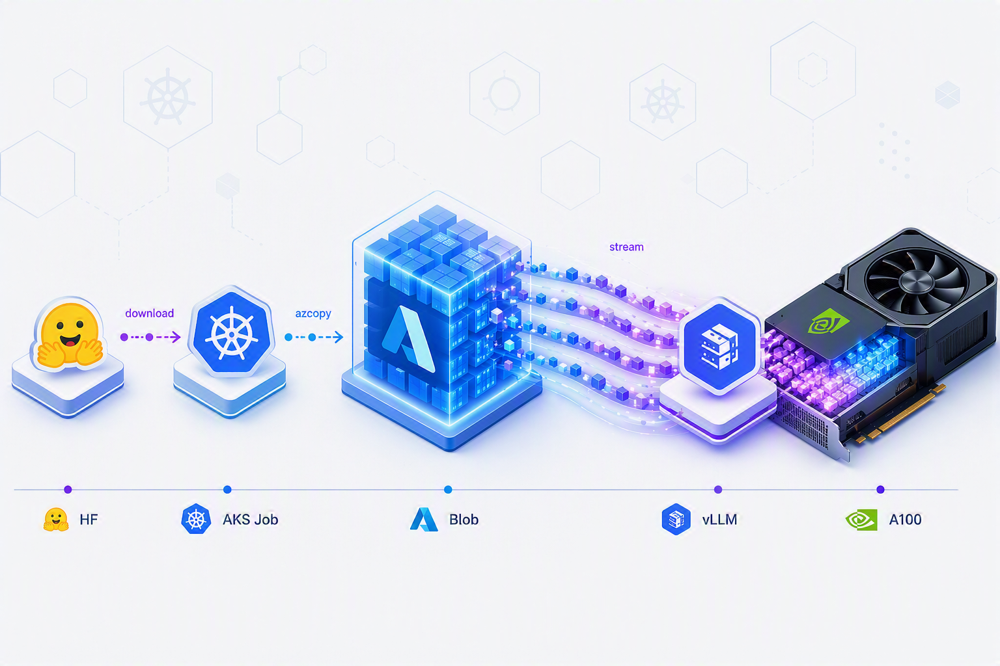

If you serve large language models on AKS, you eventually run into the same wall: every time an inference replica scales up, after a node failure, during a rollout, or when your autoscaler races to meet a traffic spike, the new pod has to load tens of gigabytes of model weights before it can serve a single request. That load time is your cold-start tax, and it lands at the worst possible moment: exactly when you need capacity *now*. This post shows how to cut it by streaming weights straight from Azure Blob Storage into GPU memory with the RunAI Model Streamer, and walks the full setup end to end on AKS.

When you autoscale LLM inference on Kubernetes, cold-start time is dominated by one thing: getting those tens of gigabytes of model weights off storage and into GPU memory. The naive path involves downloading all the model weights to local disk, then loading them into the GPU. However, this serializes two slow copies back-to-back and leaves the network idle while the GPU waits.

The [RunAI Model Streamer](https://github.com/run-ai/runai-model-streamer) collapses that into a single streaming step: it reads tensors concurrently from object storage and feeds them into GPU memory as they arrive, saturating the available bandwidth instead of staging everything on disk first. vLLM wires it in behind `--load-format runai_streamer`. For production inference on AKS, that translates to pods that reach a ready, serving state faster, which means quicker recovery from node failures, snappier rollouts, and autoscaling that can add replicas in time to absorb a traffic spike instead of lagging behind it.



<!-- truncate -->

Support for Azure Blob Storage was recently added to the RunAI Model Streamer. **As of vLLM v0.18.0 ([vllm-project/vllm#34614](https://github.com/vllm-project/vllm/pull/34614)) and runai-model-streamer v0.15.6 ([run-ai/runai-model-streamer#116](https://github.com/run-ai/runai-model-streamer/pull/116)), the `az://` scheme is now supported out of the box.** A stock `vllm/vllm-openai` image can stream from Blob with nothing more than an environment variable and a workload-identity binding.

This post walks the whole thing end to end on AKS:

1. An AKS cluster with OIDC + workload identity, and a **fully managed** A100 GPU node pool (AKS installs and maintains the NVIDIA driver, device plugin, and DCGM exporter, no need to install the NVIDIA GPU operator).
2. A premium block-blob storage account to hold the weights.
3. Workload identity that lets pods read and write Blob with a Microsoft Entra ID token instead of a storage key.
4. An **in-cluster upload Job** that pulls `microsoft/phi-4` from HuggingFace and pushes it to Blob, running inside Azure, so it uses Azure's backbone bandwidth rather than your home uplink. Such jobs need to be run once per model.
5. A vLLM Deployment that streams those weights straight from `az://` at startup.

:::note Why upload from a Job instead of your laptop?
Multi-gigabyte model weights uploaded from a workstation are gated by your upstream bandwidth and can take hours. A Job in the same region as the storage account moves the same bytes over Azure's network in minutes, and it authenticates with workload identity so there are no keys to copy around.
:::

---

## Why stream instead of download-then-load?

The default way vLLM loads a model is a two-step relay: download all the model weights from the source ([HuggingFace Hub](https://huggingface.co/models) or object storage) onto the node's local disk, then read them back off disk to load them into GPU memory. The RunAI streamer replaces both halves with a single concurrent stream from object storage straight into GPU memory.


To put real numbers on it, we timed both paths for `microsoft/phi-4` (about 27.4 GiB, ~29 GB of weights) on the same single, A100 node (`Standard_NC24ads_A100_v4`) with vLLM v0.23.0, the exact setup this post walks you through:

| Path                                          | Download to disk | Load into GPU | Time to weights loaded |
| --------------------------------------------- | ---------------: | ------------: | ---------------------: |
| Default: HuggingFace → local disk → GPU       |           ~113 s |         ~74 s |             **~187 s** |
| Streamer: Azure Blob → GPU (`runai_streamer`) |   — (no staging) |     **~10 s** |              **~10 s** |

The single most comparable number is the load step itself, reading the same ~29 GB (about 27.4 GiB) into GPU memory: **~74 s** off local disk versus **~10 s** streamed from Blob, roughly **7× faster**, because the streamer overlaps the read with the GPU copy and reads with high concurrency instead of shard-by-shard. Add the download the default path can't avoid and the end-to-end gap widens to **~187 s vs ~10 s**. (The download half in particular is network-dependent and will vary run to run; the load-step comparison is the stable, apples-to-apples one.)

Three things make the default path slow, and the streamer fixes each one:

- **Two serial passes instead of one.** With download-then-load, *nothing* reaches the GPU until the last byte has landed on disk. The GPU sits idle through the entire download, and the network sits idle through the entire disk-to-GPU load, the two slow copies never overlap. The streamer pipelines them: a tensor is loading onto the GPU while the next ones are still in flight from storage.
- **A wasted round-trip through disk.** Staging to disk writes tens of gigabytes and immediately reads them back, a second full pass over the data that exists only to bridge the two steps. Even on fast local NVMe that's pure overhead; on network-attached or smaller disks it's worse, and large model weights can fill the disk outright. Streaming never touches disk.
- **No concurrency.** A plain download and a plain disk read each tend to move data in a single stream, leaving bandwidth unused. The streamer issues many parallel reads against object storage and feeds the GPU concurrently, keeping the link saturated, which is exactly why the premium block-blob account in step 2 is worth it.

The net effect, as the numbers above show: cold-start time drops from *download time + disk-load time* (added together, ~187 s here) to roughly *the streaming time alone* (~10 s, overlapped), with the disk write-and-read-back eliminated entirely. That gap only widens as your models grow and your autoscaler gets busier: the larger the model weights, the more disk staging you skip, and the more often you scale out at peak traffic, the more those saved seconds compound into lower tail latency and fewer cold-start stalls for your AKS inference apps. Let's build the infrastructure to prove it.

---

## Prerequisites

- The [Azure CLI](https://learn.microsoft.com/cli/azure/install-azure-cli) (`az`), version 2.85.0 or later.
- [`kubectl`](https://kubernetes.io/docs/tasks/tools/) and [`jq`](https://jqlang.github.io/jq/).
- `envsubst` (ships with GNU gettext) used to fill the `${...}` placeholders in the Kubernetes manifests before applying them. On macOS, `brew install gettext`; on Debian/Ubuntu, `apt-get install gettext-base`.
- An Azure subscription with quota for an NVIDIA GPU VM (For example: `Standard_NC24ads_A100_v4`) in your target region.
- Logged in: `az login` and `az account set --subscription <id>`.

---

## Configuration

Everything below is driven by these variables. Modify them to match your environment and export them once in your shell and the rest of the commands are copy-paste.

```bash
# --- Azure / cluster ---
export AZURE_RESOURCE_GROUP="runai-demo"
export AZURE_REGION="<location with GPU VM SKU support>"
export CLUSTER_NAME="llm"
export ADMIN_USERNAME="azuser"

# --- GPU node pool ---
export NODE_POOL_NAME="gpunodes"
export NODE_POOL_VM_SIZE="<Standard_NC24ads_A100_v4 or other GPU VM size>"
export NODE_POOL_NODE_COUNT=1

# --- Storage ---
# Must be globally unique, 3-24 chars, lowercase letters and digits only.
export STORAGE_ACCOUNT_NAME="<provide unique name>"
export STORAGE_CONTAINER_NAME="models"

# --- Workload identity ---
export IDENTITY_NAME="vllm-model-reader"
export SERVICE_ACCOUNT_NAME="runai-streamer"
export NAMESPACE="default"

# --- Model / vLLM ---
export MODEL_NAME="microsoft/phi-4"
export VLLM_IMAGE="vllm/vllm-openai:v0.23.0"
```

---

## 1. Deploy the AKS cluster

### 1a. Enable the managed GPU preview

The fully managed GPU node-pool experience is a preview feature. Register it once per subscription. This is what lets us skip the NVIDIA GPU operator entirely, AKS takes over installing and maintaining the driver, the NVIDIA GPU device plugin, and the NVIDIA DCGM metrics exporter on every GPU node.

```bash
# The managed-GPU flag lives in the aks-preview extension (>= 19.0.0b29).
az extension add --name aks-preview --upgrade

# Register the feature flag.
az feature register \
    --namespace Microsoft.ContainerService \
    --name ManagedGPUExperiencePreview
```

Registration is asynchronous and can take a few minutes. Re-run the command below until it reports `Registered` before moving on, starting the node pool in step 1c while the feature is still `Registering` makes that command fail.

```bash
az feature show \
    --namespace Microsoft.ContainerService \
    --name ManagedGPUExperiencePreview \
    --query properties.state -o tsv
```

Once it prints `Registered`, propagate the feature to the resource provider:

```bash
az provider register --namespace Microsoft.ContainerService
```

### 1b. Create the resource group and cluster

First, create the resource group:

```bash
az group create \
    --name "${AZURE_RESOURCE_GROUP}" \
    --location "${AZURE_REGION}"
```

Then create the cluster. It needs three things switched on for workload identity to work later: `--enable-oidc-issuer` (so Kubernetes service-account tokens can be validated by Microsoft Entra ID), `--enable-workload-identity` (installs the mutating webhook that injects federated-token env vars into labeled pods), and `--enable-managed-identity`. This takes a few minutes:

```bash
az aks create \
    --resource-group "${AZURE_RESOURCE_GROUP}" \
    --name "${CLUSTER_NAME}" \
    --location "${AZURE_REGION}" \
    --node-count 1 \
    --enable-oidc-issuer \
    --enable-workload-identity \
    --enable-managed-identity \
    --generate-ssh-keys \
    --admin-username "${ADMIN_USERNAME}" \
    --os-sku Ubuntu
```

Finally, fetch the cluster credentials so `kubectl` targets it:

```bash
az aks get-credentials \
    --resource-group "${AZURE_RESOURCE_GROUP}" \
    --name "${CLUSTER_NAME}" \
    --overwrite-existing
```

The default node pool created here is a small CPU pool that runs system
components. GPU capacity comes from a dedicated pool in the next step.

### 1c. Add the managed GPU node pool

This single flag, `--enable-managed-gpu=true`, is the whole reason we don't need a GPU operator. AKS provisions the node with the NVIDIA driver already installed, deploys the NVIDIA GPU device plugin so `nvidia.com/gpu` is advertised, and wires up the NVIDIA DCGM exporter for metrics.

```bash
az aks nodepool add \
    --resource-group "${AZURE_RESOURCE_GROUP}" \
    --cluster-name "${CLUSTER_NAME}" \
    --name "${NODE_POOL_NAME}" \
    --node-count "${NODE_POOL_NODE_COUNT}" \
    --node-vm-size "${NODE_POOL_VM_SIZE}" \
    --enable-managed-gpu=true
```

Confirm the GPU is schedulable before moving on. It can take a couple of minutes after the pool is ready for the device plugin to advertise the resource:

```bash
kubectl get nodes -o json \
    | jq -r '.items[] | {name: .metadata.name, gpu: .status.allocatable["nvidia.com/gpu"]}'
```

You're looking for a node reporting `"gpu": "1"`.

---

## 2. Create a premium block-blob storage account

Premium block blob (`Premium_LRS` + `BlockBlobStorage`) gives the streamer the high, consistent throughput that makes this whole approach worthwhile. A standard account works too, but you'll leave bandwidth on the table.

Create the storage account:

```bash
az storage account create \
    --name "${STORAGE_ACCOUNT_NAME}" \
    --resource-group "${AZURE_RESOURCE_GROUP}" \
    --location "${AZURE_REGION}" \
    --sku Premium_LRS \
    --kind BlockBlobStorage
```

Then create the container that will hold the model weights:

```bash
az storage container create \
    --name "${STORAGE_CONTAINER_NAME}" \
    --account-name "${STORAGE_ACCOUNT_NAME}"
```

---

## 3. Set up workload identity for Blob access

This is the part that lets pods talk to Blob with **zero secrets**. The chain looks like this:


We use **Storage Blob Data Contributor** (not just Reader) on purpose: the same identity is reused by both the upload Job (which needs to *write*) and the vLLM pod (which only *reads*).

Read the cluster's OIDC issuer URL, the trust anchor for the federated credential, and create the user-assigned managed identity that pods will run as:

```bash
# The cluster's OIDC issuer URL, the trust anchor for federated credentials.
export AKS_OIDC_ISSUER=$(az aks show \
    --resource-group "${AZURE_RESOURCE_GROUP}" \
    --name "${CLUSTER_NAME}" \
    --query "oidcIssuerProfile.issuerUrl" -o tsv)

# Create a user-assigned managed identity.
az identity create \
    --name "${IDENTITY_NAME}" \
    --resource-group "${AZURE_RESOURCE_GROUP}" \
    --location "${AZURE_REGION}"
```

Capture the identity's client ID and object ID, plus the storage account's resource ID, the next two commands reference them:

```bash
export IDENTITY_CLIENT_ID=$(az identity show \
    --name "${IDENTITY_NAME}" \
    --resource-group "${AZURE_RESOURCE_GROUP}" \
    --query clientId -o tsv)

export IDENTITY_OBJECT_ID=$(az identity show \
    --name "${IDENTITY_NAME}" \
    --resource-group "${AZURE_RESOURCE_GROUP}" \
    --query principalId -o tsv)

export STORAGE_ACCOUNT_ID=$(az storage account show \
    --name "${STORAGE_ACCOUNT_NAME}" \
    --resource-group "${AZURE_RESOURCE_GROUP}" \
    --query id -o tsv)
```

Grant the identity read/write access on the storage account:

:::caution You need permission to create role assignments
The `az role assignment create` step here writes to `Microsoft.Authorization/roleAssignments`, which requires an elevated role on the scope: **Owner**, **User Access Administrator**, or **Role Based Access Control Administrator**. Plain Contributor isn't enough. Without it you'll see:

```text
(AuthorizationFailed) The client 'you@example.com' with object id '...' does not
have authorization to perform action 'Microsoft.Authorization/roleAssignments/write'
over scope '/subscriptions/.../storageAccounts/<account>/providers/Microsoft.Authorization/roleAssignments/...'
```

If you hit this, ask a subscription/resource-group administrator to either grant you one of those roles or run the role-assignment command for you. The rest of the setup is unaffected.
:::

```bash
az role assignment create \
    --role "Storage Blob Data Contributor" \
    --assignee-object-id "${IDENTITY_OBJECT_ID}" \
    --assignee-principal-type ServicePrincipal \
    --scope "${STORAGE_ACCOUNT_ID}"
```

Finally, federate the Kubernetes service account to the managed identity, so a projected service-account token can be exchanged for a Microsoft Entra ID token:

```bash
az identity federated-credential create \
    --name "vllm-federated-cred" \
    --identity-name "${IDENTITY_NAME}" \
    --resource-group "${AZURE_RESOURCE_GROUP}" \
    --issuer "${AKS_OIDC_ISSUER}" \
    --subject "system:serviceaccount:${NAMESPACE}:${SERVICE_ACCOUNT_NAME}" \
    --audience api://AzureADTokenExchange
```

Create a **dedicated** service account for these workloads, rather than reusing the namespace's shared `default`, so the workload-identity wiring stays off every other pod in the namespace. [`manifests/service-account.yaml`](https://github.com/Azure-Samples/aks-samples/blob/master/runai-model-streamer/manifests/service-account.yaml) declares it with two pieces of workload-identity metadata: an **annotation** (`azure.workload.identity/client-id`) that tells the webhook *which* managed identity to mint tokens for, and a **label** (`azure.workload.identity/use: "true"`).

```bash
curl -sL https://raw.githubusercontent.com/Azure-Samples/aks-samples/refs/heads/master/runai-model-streamer/manifests/service-account.yaml \
    | envsubst \
    | kubectl apply -f -
```

A subtlety worth understanding: the **label** is what actually triggers token injection, but the webhook keys off the label on the **pod**, not the service account. The label on the service account here is optional; the authoritative switch is the `azure.workload.identity/use: "true"` label in each pod template (you'll see it on both the Job and the Deployment in later sections). A pod that runs as this service account but is missing that label gets **no** token injected, and fails to authenticate to Blob with no obvious error. So from here on, every workload that needs Blob access carries `azure.workload.identity/use: "true"` on its **pod template**, which earns it `AZURE_CLIENT_ID`, `AZURE_TENANT_ID`, and a projected federated token automatically.

:::note Give the role assignment a couple of minutes to propagate
Azure RBAC role assignments are eventually consistent. If the upload Job in the next step starts too soon, it fails with `AuthorizationPermissionMismatch`. If you hit that, wait a couple of minutes (`sleep 120`) and let the Job's `backoffLimit` retry. To re-run the Job from scratch, delete it first, a `Job` is immutable, so a second `kubectl apply` fails with `AlreadyExists`:

```bash
kubectl delete job upload-model --ignore-not-found
```

:::

---

## 4. Upload the model weights from a Kubernetes Job

The Job does three things: pull `microsoft/phi-4` from HuggingFace, install `azcopy`, and copy the files into Blob using workload identity (`AZCOPY_AUTO_LOGIN_TYPE=WORKLOAD`). Because it runs in-cluster, the HuggingFace → Blob transfer rides Azure's network, not yours.

A few details worth calling out:

- The pod template carries the `azure.workload.identity/use: "true"` label, so `azcopy` finds the federated token automatically.
- `--overwrite=ifSourceNewer` makes retries cheap: a re-run skips blobs that already uploaded successfully instead of re-sending all the model weights.
- `--exclude-path '.cache'` skips HuggingFace's local cache directory.

The full manifest lives in [`Azure-Samples/aks-samples`](https://github.com/Azure-Samples/aks-samples/blob/master/runai-model-streamer/manifests/upload-model-job.yaml). Pull it, fill in the placeholders with `envsubst`, and apply, all in one copy-pastable command:

```bash
curl -sL https://raw.githubusercontent.com/Azure-Samples/aks-samples/refs/heads/master/runai-model-streamer/manifests/upload-model-job.yaml \
    | envsubst '${NAMESPACE} ${SERVICE_ACCOUNT_NAME} ${STORAGE_ACCOUNT_NAME} ${STORAGE_CONTAINER_NAME} ${MODEL_NAME}' \
    | kubectl apply -f -
```

The `envsubst` allow-list substitutes only those five variables, so the runtime shell variables inside the container script (`$AZURE_STORAGE_ACCOUNT_NAME`, the retry counters) are left untouched.

Wait for it to finish and check the logs:

```bash
kubectl wait --for=condition=complete job/upload-model --timeout=1800s
```

:::note A note on scaling to larger models
The 1800s (30 minute) timeout is plenty for a model like `microsoft/phi-4` (a 14.7B-parameter model, ~29 GB on disk in bf16). If you reuse this manifest for a 70B+ parameter model, two limits need raising together: bump this `--timeout` so the command doesn't give up while the Job is still uploading, **and** raise the `ephemeral-storage` request/limit on the Job, larger model weights that overflow the reserved scratch space get evicted with `DiskPressure` long before any timeout fires.
:::

In a separate terminal you can follow the logs:

```bash
kubectl logs -f job/upload-model
```

Verify the blobs landed:

```bash
az storage blob list \
    --account-name "${STORAGE_ACCOUNT_NAME}" \
    --container-name "${STORAGE_CONTAINER_NAME}" \
    --prefix "${MODEL_NAME}" \
    --output table
```

---

## 5. Deploy vLLM streaming from Azure Blob

Now the payoff. Two things turn on Blob streaming:

- `--load-format runai_streamer` selects the RunAI Model Streamer loader.
- `--model az://${STORAGE_CONTAINER_NAME}/${MODEL_NAME}` points at the blobs using the native `az://` scheme. The `AZURE_STORAGE_ACCOUNT_NAME` env var tells the streamer which account to read from, and the pod's workload-identity label handles auth, no keys, no connection strings.

:::tip Tuning the streamer
The RunAI Model Streamer exposes [tunable parameters](https://docs.vllm.ai/en/latest/models/extensions/runai_model_streamer/#tunable-parameters) that you pass to vLLM as a JSON object via `--model-loader-extra-config`. A few worth knowing:

- `'{"distributed":true}'` enables distributed streaming across tensor-parallel ranks, useful once you scale `--tensor-parallel-size` past 1.
- `'{"concurrency":16}'` sets how many OS threads read tensors from storage into the CPU buffer; raise it to push more bandwidth against a premium account.
- `'{"memory_limit":5368709120}'` caps the CPU staging buffer (in bytes).

To set one, add the flag to the container's `args` list in the [Deployment manifest](https://github.com/Azure-Samples/aks-samples/blob/master/runai-model-streamer/manifests/vllm-deployment.yaml), for example:

```yaml
        - --model-loader-extra-config
        - '{"concurrency":16}'
```

:::

The pod mounts an in-memory `emptyDir` at `/dev/shm` because vLLM uses shared memory for inter-process communication. A `startupProbe` and `readinessProbe` on vLLM's `/health` endpoint keep the pod out of the Service until the model has finished streaming and the server is actually answering.

The full manifest, a `Deployment` plus a `Service`, is in [`Azure-Samples/aks-samples`](https://github.com/Azure-Samples/aks-samples/blob/master/runai-model-streamer/manifests/vllm-deployment.yaml). It has no runtime-only variables, so `envsubst` can substitute everything:

```bash
curl -sL https://raw.githubusercontent.com/Azure-Samples/aks-samples/refs/heads/master/runai-model-streamer/manifests/vllm-deployment.yaml \
    | envsubst \
    | kubectl apply -f -
```

Wait for the rollout to complete:

```bash
kubectl rollout status deployment/phi-4 --timeout=600s
```

In a separate terminal you can follow the logs:

```bash
kubectl logs -f deployment/phi-4
```

How do you know the weights actually came from Blob through the RunAI streamer and not vLLM's default loader? Look for the streamer's own progress line, `Loading safetensors using Runai Model Streamer`. Its presence is the confirmation, the `runai_streamer` loader engaged and pulled the tensors from `az://` directly into GPU memory:

```bash
...
(EngineCore pid=157) INFO 06-29 20:07:33 [gpu_model_runner.py:5092] Starting to load model /root/.cache/vllm/assets/model_streamer/4d80bd96...
Loading safetensors using Runai Model Streamer:   0% Completed | 0/243 [00:00<?, ?it/s]
Loading safetensors using Runai Model Streamer:  47% Completed | 114/243 [00:06<00:07, 17.13it/s]
Loading safetensors using Runai Model Streamer: 100% Completed | 243/243 [00:08<00:00, 27.80it/s]
(EngineCore pid=157) INFO 06-29 20:07:43 [gpu_model_runner.py:5187] Model loading took 27.39 GiB memory and 9.956121 seconds
...
```

The closing `Model loading took ... seconds` line reports how long the stream-and-load took end to end, a handy number to compare against the default download-then-load path.

---

## 6. Verify and test

Once it's serving, port-forward and send a chat completion. The port-forward needs a moment to establish, so wait for `/health` to answer before firing the request:

```bash
kubectl port-forward svc/phi-4 8000:8000 &

curl -s http://localhost:8000/v1/chat/completions \
    -H "Content-Type: application/json" \
    -d '{
        "model": "microsoft/phi-4",
        "messages": [{"role": "user", "content": "Hello!"}],
        "max_tokens": 50
    }' | jq .
```

A JSON response with a `choices[0].message.content` field means the model loaded from Blob and is serving.

---

## How it fits together


The pieces that make this clean:

- **Native `az://` support** in vLLM + runai-model-streamer means a stock `vllm/vllm-openai` image just works. No custom builds, no monkey-patching.
- **Workload identity end to end.** Neither the uploader nor the server ever sees a storage key, both authenticate with short-lived federated tokens, and the same managed identity does double duty (write for the Job, read for the server).
- **Managed GPU node pool.** `--enable-managed-gpu=true` hands the driver, device plugin, and DCGM exporter lifecycle to AKS, so there's no GPU operator to install, reconcile, or debug.
- **Upload from inside Azure.** Moving the HuggingFace → Blob copy into a Job trades your home uplink for Azure's backbone, turning an hours-long upload into a minutes-long one.

---

## Trade-offs and downsides

Streaming from Blob isn't the right fit for every model. Weigh these before adopting it:

- **Every cold start re-streams the full weights.** The streamer's advantage is overlapping the network and GPU copies, which pays off most for large models on the autoscaling critical path. For a small model that already loads quickly from local disk, that win is marginal, the simpler default download path (optionally with the weights baked into your image) may be the better trade. Measure cold-start time both ways for *your* model before committing.
- **One upload per model, up front.** Every new model, and every new *version* of a model, has to be pushed to Blob with the upload Job before it can be served. There's no way around this with this pattern: the streamer reads from Blob, so the weights have to land in Blob first.
- **Safetensors only.** The RunAI Model Streamer loads weights in [Safetensors](https://github.com/huggingface/safetensors) format. A model distributed only as PyTorch pickle (`.bin` / `.pt`) or GGUF has to be converted first, or it won't load through `runai_streamer`. `microsoft/phi-4` ships as Safetensors, so the walkthrough above works as-is.
- **You now own a second copy of the weights.** The model lives in your premium Blob account in addition to its upstream source on HuggingFace. That's an ongoing storage cost, premium block blob isn't cheap at tens of gigabytes per model, and it's on you to re-run the upload when the upstream model changes, or your served copy quietly goes stale.

---

## Conclusion

Cold-start time is the tax you pay every time an inference replica scales up, and the default download-then-load path pays it twice, once to disk, once to the GPU. Streaming weights from Azure Blob with the RunAI Model Streamer collapses that into a single overlapped copy, and now that vLLM and runai-model-streamer speak `az://` natively, it takes nothing more than `--load-format runai_streamer`, one environment variable, and a workload-identity binding on a stock `vllm/vllm-openai` image.

The pieces reinforce each other: a managed GPU node pool removes the operator toil, workload identity removes the secrets, and an in-cluster upload Job moves the weights over Azure's backbone instead of your uplink. The result is faster, cheaper cold starts when you're autoscaling, exactly when it matters most.

If you're serving large models on AKS and every cold start sits on the critical path, this is worth adopting. If your model is small and already loads quickly from disk, measure both paths first, the simpler default may still win. Either way, the building blocks here are reusable: swap in your own model, point the Job at it once, and let the streamer do the rest.

---

## Cleanup

The GPU VM is the expensive part, delete the resource group when you're done to stop the meter on everything in one shot:

```bash
az group delete --name "${AZURE_RESOURCE_GROUP}" --yes --no-wait
```

---

## References

- [Azure-Samples/aks-samples: runai-model-streamer scripts and manifests](https://github.com/Azure-Samples/aks-samples/tree/master/runai-model-streamer)
- [vLLM #34614: Azure Blob support in the RunAI streamer loader](https://github.com/vllm-project/vllm/pull/34614)
- [runai-model-streamer #116: `az://` scheme support](https://github.com/run-ai/runai-model-streamer/pull/116)
- [AKS-managed GPU node pools (preview)](https://learn.microsoft.com/azure/aks/aks-managed-gpu-nodes)
- [Azure Workload Identity on AKS](https://learn.microsoft.com/azure/aks/workload-identity-overview)
- [vLLM RunAI Model Streamer docs](https://docs.vllm.ai/en/latest/models/extensions/runai_model_streamer.html)
