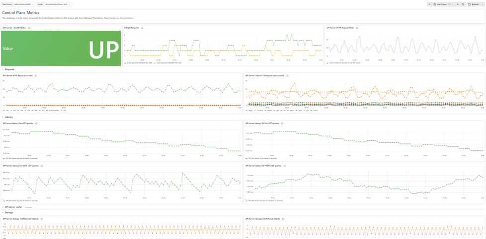

We're excited to announce that **control plane metrics collection for Azure Kubernetes Service (AKS)**, powered by **Azure Monitor managed service for Prometheus**, is now **generally available**. AKS clusters that were previously enabled for control plane metrics during preview are automatically enabled and continue to collect control plane metrics after general availability, so no action is required from existing preview customers.

<!-- truncate -->



This capability gives AKS customers native observability into key managed control plane components, including the **API server**, **etcd**, **kube-scheduler**, **kube-controller-manager**, **Cluster Autoscaler**, and **node auto-provisioning**. With these metrics, platform teams can better understand how workloads, controllers, automation, and scaling activity interact with the AKS control plane over time.

AKS manages the control plane on behalf of customers, including patching, high availability, and infrastructure-level health. However, customers still need visibility into how their own usage patterns affect control plane behavior: request volume, expensive API calls, scheduling throughput, object growth, and scale events all influence cluster responsiveness.

With control plane metrics now generally available, customers can collect this data through Azure Monitor managed service for Prometheus and visualize it in Grafana without deploying or managing additional control plane monitoring infrastructure.

This post explains how to enable control plane metrics collection and highlights **five high-signal metrics** every AKS customer should monitor first.

## Why start with the API server and etcd?

The **API server** and **etcd** are the two most important components for understanding cluster responsiveness.

The API server handles every Kubernetes API request: `kubectl` commands, controllers, CI/CD systems, operators, admission webhooks, autoscalers, and workload automation. etcd stores the cluster's state and serves as the durable backing store for the API server.

When either component is unhealthy or overloaded, the impact is cluster-wide. Deployments may stall, pod scheduling can slow down, controllers may fall behind, and client tooling can become unresponsive.

For this reason, API server and etcd metrics are the best starting point for AKS control plane observability.

## Enable control plane metrics collection

Control plane metrics can be enabled using the Azure CLI or the Azure portal. For complete setup instructions, see [Monitor AKS control plane metrics](https://learn.microsoft.com/azure/aks/control-plane-metrics-monitor).

When enabled, AKS control plane metrics can be collected by Azure Monitor managed service for Prometheus and queried from Grafana using PromQL.

Collection can be customized through the Azure Monitor metrics configuration. Two settings are especially important when getting started:

| Setting | Purpose |
|---|---|
| `controlplane-metrics.default-targets-scrape-enabled` | Controls which control plane targets are scraped |
| `controlplane-metrics.minimal-ingestion-profile` | Restricts collection to a curated metric set to help manage ingestion volume and cost |

Supported control plane scrape targets include:

- `apiserver`
- `etcd`
- `kube-scheduler`
- `kube-controller-manager`
- `cluster-autoscaler`
- `node-auto-provisioning`

We recommend starting with the default API server and etcd metrics, then enabling additional targets based on the scenarios you need to diagnose, such as scheduling latency or autoscaler behavior.

## Limitations

A few things to keep in mind before enabling control plane metrics collection:

- **Private Link clusters:** Control plane metric scraping is not yet supported on AKS clusters that use Azure Private Link for API server access. Support is planned for a future release.
- **Ingestion cost:** Enabling all scrape targets without the minimal ingestion profile can significantly increase Prometheus metric volume and cost. Start with the minimal ingestion profile and expand only as needed.
- **Regional availability:** Control plane metrics collection follows the same regional rollout as Azure Monitor managed service for Prometheus. Confirm availability in your cluster's region before enabling.

## The 5 metrics to monitor first

The following five metrics provide a practical starting point for AKS control plane monitoring. They help identify API server throttling, expensive requests, server-side failures, etcd storage pressure, and etcd disk latency.

### 1. API server request throttling: 429 responses

A 429 response means the API server rejected or delayed a request due to throttling or fairness controls. This is often the earliest signal that a client, controller, script, or CI/CD pipeline is generating excessive API load.

**PromQL**

```promql
sum by (client, verb, resource) (
  rate(apiserver_request_total{code="429"}[5m])
)
```

**Recommended alert:** Alert when the 429 rate for a client is sustained above zero for 5 minutes.

**Why it matters:** Frequent 429s usually indicate that a client needs rate limiting, pagination, reduced polling, or retry-with-backoff behavior.

**Find the top offending clients**

```promql
topk(5,
  sum by (client) (
    rate(apiserver_request_total{code="429"}[15m])
  )
)
```

### 2. LIST request latency

A LIST request retrieves all objects of a given resource type. LIST calls are more expensive than targeted GET calls, especially for high-cardinality resources such as Pods, Events, Secrets, ConfigMaps, or custom resources.

**PromQL**

```promql
histogram_quantile(
  0.99,
  sum by (le, resource) (
    rate(apiserver_request_duration_seconds_bucket{verb="LIST"}[5m])
  )
)
```

**Recommended alert:** Alert when p99 LIST latency for any resource exceeds 1 second for 5 minutes.

**Why it matters:** High LIST latency often points to controllers or jobs issuing expensive unpaginated queries. This can create broad API server pressure and affect unrelated workloads.

**Find clients issuing LIST calls**

```promql
topk(5,
  sum by (client, resource) (
    rate(apiserver_request_total{verb="LIST"}[15m])
  )
)
```

### 3. API server 5xx error rate

A 429 response indicates throttling or backpressure. A 5xx response indicates that the API server attempted to process a request and failed.

**PromQL**

```promql
sum(rate(apiserver_request_total{code=~"5.."}[5m]))
/
sum(rate(apiserver_request_total[5m]))
```

**Recommended alert:** Alert when the 5xx error rate exceeds 5% for 5 minutes.

**Why it matters:** A sustained 5xx rate can indicate an underlying control plane issue, etcd health problem, timeout, or dependency failure. When this alert fires, etcd health should be reviewed next.

**Break down by verb and resource**

```promql
sum by (verb, resource) (
  rate(apiserver_request_total{code=~"5.."}[5m])
)
```

### 4. etcd database size relative to quota

etcd enforces a backend storage quota. If the database approaches the quota, write availability can be affected until space is reclaimed.

**PromQL**

```promql
max(etcd_mvcc_db_total_size_in_bytes)
/
max(etcd_server_quota_backend_bytes)
```

**Recommended alert:** Alert when the ratio exceeds 80% for 10 minutes.

**Why it matters:** etcd growth is often caused by accumulated completed Jobs, retained ReplicaSets, excessive Events, or high object churn. Customers should review object retention patterns and cleanup policies before the database approaches quota.

**Track growth rate**

```promql
rate(etcd_mvcc_db_total_size_in_bytes[1h])
```

### 5. etcd disk WAL fsync latency

Every etcd write must be durably flushed to the write-ahead log before it is acknowledged. Disk latency here directly affects write performance for cluster state changes.

**PromQL**

```promql
histogram_quantile(
  0.99,
  sum by (le) (
    rate(etcd_disk_wal_fsync_duration_seconds_bucket[5m])
  )
)
```

**Recommended alert:** Alert when p99 WAL fsync latency exceeds 100 ms for 5 minutes.

**Why it matters:** Healthy clusters typically maintain low fsync latency. Elevated latency can cause slower writes, delayed controller progress, and broader API responsiveness issues.

**Check leader stability**

```promql
(etcd_server_has_leader == 0)
or
(increase(etcd_server_leader_changes_seen_total[15m]) > 3)
```

## Recommended next steps

1. Enable Azure Monitor managed service for Prometheus for your AKS cluster.
2. Turn on AKS control plane metrics collection.
3. Start with API server and etcd metrics.
4. Keep the minimal ingestion profile enabled unless you need additional diagnostic coverage.
5. Build a Grafana dashboard using the five queries above, or start from the out-of-the-box Grafana dashboards available for monitoring AKS etcd and API server metrics, as shown in the example dashboard above.

6. Configure alerts for throttling, LIST latency, 5xx rate, etcd quota usage, and etcd WAL fsync latency.
7. Review trends after 30 days to understand your normal control plane behavior and identify recurring pressure patterns.

If you consistently observe throttling, high LIST latency, or elevated request volume during normal operations, review the clients and controllers generating API traffic. Common improvements include adding client-side rate limiting, reducing polling frequency, using watches instead of repeated LIST calls, enabling pagination, and cleaning up high-cardinality objects such as completed Jobs and Events.

## Learn more

- [Monitor AKS control plane metrics](https://learn.microsoft.com/azure/aks/control-plane-metrics-monitor)
- [Minimal ingestion profile for control plane metrics](https://learn.microsoft.com/azure/azure-monitor/containers/prometheus-metrics-scrape-configuration-minimal)

If you have configured these alerts and continue to experience unresolved control plane issues, open an Azure support case and attach the relevant Grafana dashboards or PromQL query results. This helps accelerate investigation by providing the API server and etcd signals needed to identify the likely bottleneck.
