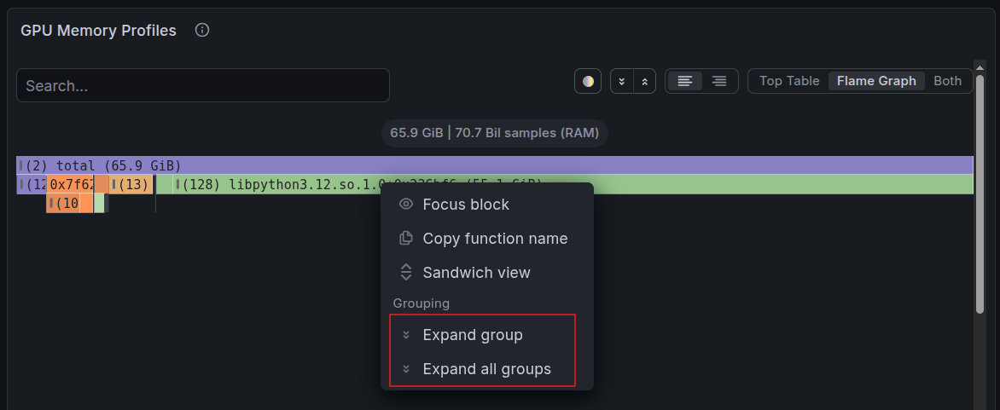
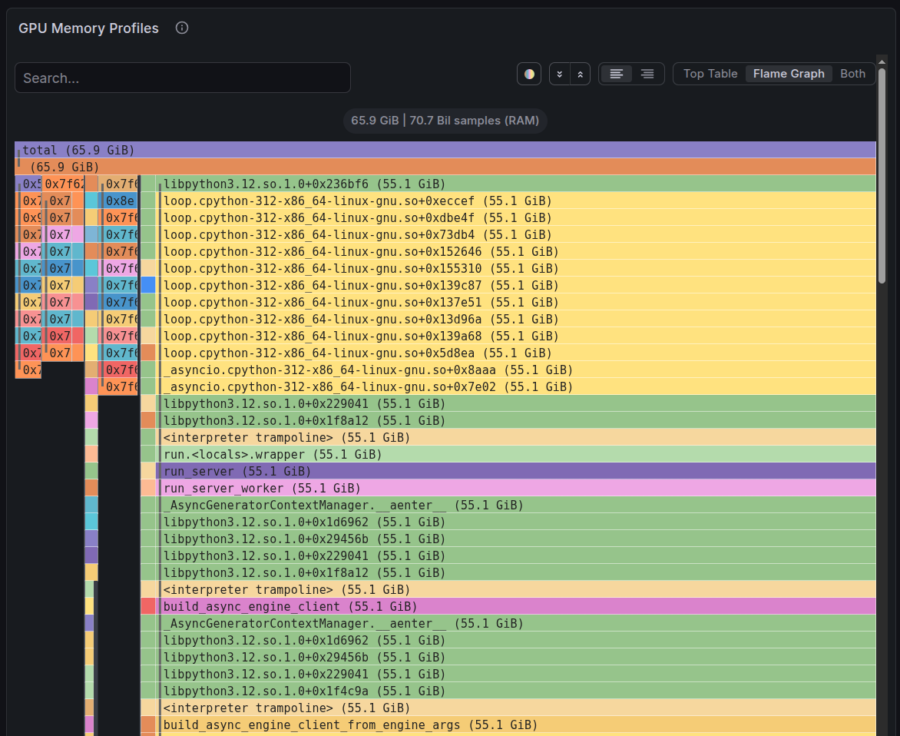

GPU memory allocation can be tricky to get right. Allocate too little and your AI workload can slow down or fail with an out-of-memory error, often during peak traffic when reliability matters most. Allocate too much and expensive GPU capacity sits unused. Getting an informed view of your workload's actual memory needs from the start helps you avoid both problems.

Kubernetes dashboards can show that GPU memory is under pressure, but they cannot tell you which functions in your workload are responsible. Without that detail, teams are left shrinking the workload, moving it to a larger GPU, or restarting it and hoping the problem does not return. That guesswork gets expensive fast.

[GPU memory profiling on Azure Kubernetes Service (AKS)](https://learn.microsoft.com/azure/aks/gpu-profiling) provides the evidence to show which functions allocate GPU memory while the workload runs, without requiring changes to your application code. You can use that visibility to size memory with an informed perspective from the beginning, troubleshoot unexpected pressure, and validate that later adjustments work as intended.

<!-- truncate -->

:::note Preview
This preview covers GPU **memory** allocations, not GPU **compute** utilization. Your existing GPU metrics tell you that something is going on; the profile gives you specific details on where it is happening.
:::

## From guessing to seeing

A GPU memory profile is a record of where allocations occur across your application's function call paths while the workload runs. Instead of showing only how much memory is in use, it connects that memory to the functions that requested it. This gives you a path from the symptom to the code responsible.

The profile is visualized as a flame graph, a chart that stacks functions to show the call paths behind GPU memory allocations. Wider bars represent more allocated memory, helping you identify where to investigate and make targeted changes.

You don't add profiling code to your app, and you don't need a sidecar just to turn it on. Point the profiler at a running cluster, and it starts showing you details right away. Profiling won't decide for you that an allocation is wasteful, and it won't tune your workload automatically. It gives you the evidence to decide what your workload needs.

## How it works

GPU memory profiling on AKS runs on [Inspektor Gadget](https://inspektor-gadget.io/), an open-source, eBPF-based observability framework for Kubernetes and a CNCF project that Microsoft helps maintain. For GPU profiling, it traces CUDA memory-allocation calls directly from the node, which is why there's no profiling code or sidecar container needed. Just turn on profiling before you deploy, or restart the workload once profiling is enabled.

Results flow into [Pyroscope](https://grafana.com/oss/pyroscope/) and show up as flame graphs in Grafana. Pair that with Azure Monitor managed service for Prometheus, and you get memory pressure in one panel and the code path behind it in another.

It's also secure: the Inspektor Gadget project recently completed its [first independent security audit](https://inspektor-gadget.io/blog/2026/04/inspektor-gadget-security-audit); three issues were found and fixed in version 0.51.1.

For more details and to get started, check out the [AKS GPU profiling documentation](https://learn.microsoft.com/azure/aks/gpu-profiling), which covers the prerequisites, extension installation, and wiring up Pyroscope, Grafana, and the dashboard.

## A real before and after

A flame graph looks intimidating the first time you open one, but the rule that matters is simple: wider bars mean more of whatever you're measuring. In this case, that's GPU memory allocated.

The AKS documentation includes a real example from a vLLM inference workload. The trail leads to `GPUModelRunner._allocate_kv_cache_tensors`, which shows **55.1 GB of self allocation**. It's the function creating the tensors for the KV cache, the store vLLM uses so it doesn't have to recompute attention for tokens it's already seen.

*The expanded flame graph from the AKS documentation. Follow the widest path to a leaf with high self memory; that's your target.*

Each bar is a function, stacked to show the call path, so you read from the bottom up to whichever function actually made the allocation. Two terms matter most:

- **Total**: memory attributed to a function, plus everything it calls.
- **Self**: memory that function allocated directly.

A wide bar with zero self memory is usually just handing work off to something else. Keep following the stack until you find a wide bar with high self memory. That's almost always where to look first.

A large KV cache isn't automatically a problem; it's doing real work. The real question is whether it's sized for the traffic you actually serve. For a vLLM service, that usually means comparing your configured context length and concurrency against real-world usage, then right-sizing the settings that control them.

Here's a loop to find and fix issues in the flame graph data:

1. See the memory pressure.
2. Find the allocation path in the flame graph.
3. Change one setting, based on what your workload actually needs.
4. Run the same load again, and profile it again.
5. Compare memory, performance, and reliability before you call it done.

## What this means for reliability, capacity, and cost

Reliability is the most direct win. When you can trace an out-of-memory failure back to a specific allocation, you fix the actual cause instead of guessing, and you can prove it by profiling again.

Memory efficiency comes next. You might find memory you can safely give back, or confirm the workload genuinely needs what it has. Both answers are useful: one frees up headroom, the other stops you from "optimizing" something that didn't need it.

Capacity and cost are downstream of both. A validated drop in memory use might let you fit more work on the GPUs you already have, or reconsider the GPU size you're requesting; call it responsible resourcing. The profiler isn't a cost calculator and won't resize nodes for you, so you still have to test the change and do the math yourself.

Either way, the decision is now backed by a real allocation path and a repeatable test, not a hunch.

## One more example: fine-tuning Stable Diffusion XL on KubeRay

Everything so far has focused on inference, but the same workflow applies to training. The [KubeRay GPU profiling demo for AKS with Anyscale](https://github.com/pauldotyu/awesome-aks/tree/main/2026-07-17-kubecon-gpuprofiling) spins up an AKS Automatic cluster with GPU Node Autoprovisioning, Inspektor Gadget, Pyroscope, Azure Monitor managed Prometheus, and Azure Managed Grafana.

The demo runs Anyscale's [Fine-tuning Stable Diffusion XL with Ray Train](https://console.anyscale.com/template-preview/finetune-stable-diffusion) template: DreamBooth LoRA fine-tuning across four GPU workers, moving through model loading, training, checkpointing, and image generation.

It's a useful reminder that profiling isn't just for inference. Watch the metrics, find the allocation path, make one change, profile again; the loop works whether you're serving a model or training one.

## Try it yourself

Start with the [GPU profiling documentation on Microsoft Learn](https://learn.microsoft.com/azure/aks/gpu-profiling) for setup. Once you're running, it's worth exploring the open-source contributions:

- [Inspektor Gadget](https://inspektor-gadget.io/)
- [Advanced GPU Observability dashboards](https://github.com/inspektor-gadget/grafana-dashboards)
- [Pyroscope](https://grafana.com/oss/pyroscope/)

:::note Preview
GPU memory profiling on AKS is in preview, so there could be breaking changes as the product evolves in response to feedback. Point it at a workload, see what the flame graph can tell you, fix your GPU allocation issues, and share feedback with us on what you find useful and what could be improved.
:::