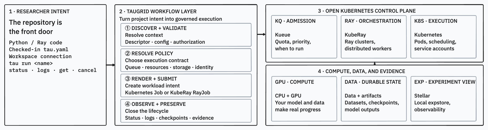
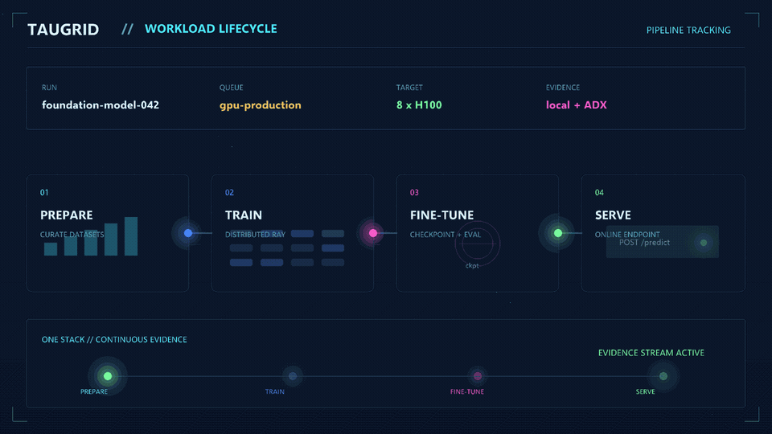
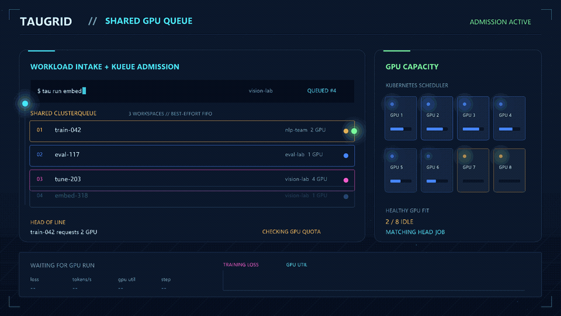

We are delighted to announce the open-source release of [TauGrid](https://github.com/Azure/taugrid). TauGrid brings the `tau` CLI, [Kueue](https://kueue.sigs.k8s.io/) queueing, [KubeRay](https://ray-project.github.io/kuberay/) orchestration, GPU-node health monitoring, and observability into one Kubernetes-native stack, spanning data preparation, distributed training, fine-tuning, and inference.

Running GPU workloads on Kubernetes today means assembling and maintaining each of these components separately, and building the glue between them: submission scripts, queue wrappers, health checks, and result retrieval. TauGrid replaces that glue. Platform teams get a single Helm install with clear ownership boundaries; researchers get one CLI to submit, observe, recover, and retrieve results without touching Kubernetes directly.

The project is MIT-licensed and published at [github.com/Azure/taugrid](https://github.com/Azure/taugrid), with container images and Helm charts on [Microsoft Container Registry](https://mcr.microsoft.com). Full documentation is available at [azure.github.io/taugrid](https://azure.github.io/taugrid).

<!-- truncate -->

## What is TauGrid?

TauGrid is an open-source, self-hosted platform for running AI workloads on Kubernetes. It gives teams the key benefits of a managed AI platform—easy job submission, scalable distributed computing, shared GPU resources, experiment tracking, and operational controls—while running on infrastructure they manage in their own cloud or data center.

Researchers work from a repository and the Tau CLI. Platform teams provide governed workspaces, queues, compute profiles, storage, identity, and observability. TauGrid connects those two experiences across training, fine-tuning, batch inference, and serving.



## How it works

TauGrid uses a `tau.yaml` configuration file to describe the workload. Here is a GPU training example that runs a PyTorch workload on a single A100:

```yaml
schema_version: 1
name: aks-gpu-quickstart
run:
  entrypoint: train.py
  workload_kind: rayjob
compute:
  gpus: 1
  workers: 1
  cpus: 16
  memory: 64Gi
runtime:
  image: mcr.microsoft.com/aks/ai-runtime/ray:py3.12-ray2.56.0-cuda13.0
  pip:
    - torch>=2.4.0
```

Once submitted with `tau run`, TauGrid resolves platform policy, renders a KubeRay RayJob, and submits it through Kueue. Status, logs, checkpoints, and experiment evidence are tracked throughout the run.

The same stack covers the full GPU workload lifecycle. This animation shows a workload moving from data preparation through distributed training, fine-tuning, and into a ready inference endpoint, all with one continuous evidence record:



When multiple teams share the same cluster, their workloads enter a shared Kueue ClusterQueue. Kueue admits each job based on quota and priority, and Kubernetes places it on healthy GPUs.



## Getting started

You need a Kubernetes 1.30+ cluster, `kubectl`, Helm 3+, and Git. Install the Tau CLI:

```bash
curl -fsSL https://github.com/Azure/taugrid/releases/latest/download/install.sh | sh

export PATH="$HOME/.local/bin:$PATH"
tau version --short
```

Install TauGrid onto your cluster:

```bash
tau cluster install
tau cluster validate installation
```

Create a workspace and wait for it to be ready:

```bash
tau workspace create "taugrid-default" --apply

kubectl wait \
  --for=jsonpath='{.status.phase}'=Ready \
  workspaces.tau.azure.com/taugrid-default \
  --namespace tau-system \
  --timeout=5m
```

Submit your first workload:

```bash
git clone https://github.com/Azure/taugrid.git
cd taugrid

tau run --config examples/cpu-multi-interest-ray/tau.yaml
tau run status cpu-multi-interest-ray --watch
tau run logs cpu-multi-interest-ray -f
```

This example runs a CPU workload and does not require GPU nodes. For the full step-by-step guide including cluster preparation, workspace configuration, GPU workloads, and handoff to researchers, see the [Getting Started on Kubernetes](https://azure.github.io/taugrid/docs/platform-admin-guide/installation-guides/kubernetes/) documentation.

The repository also includes these runnable examples:

| Example | What it demonstrates |
| --- | --- |
| [CPU queueing](https://azure.github.io/taugrid/docs/examples/cpu-queueing/) | Kueue admission, pending states, and borrowing between teams (no GPU required) |
| [GPU Ray Tune](https://azure.github.io/taugrid/docs/examples/gpu-ray-tune/) | Hyperparameter search on a single GPU with deterministic validation |
| [Experiment evidence](https://azure.github.io/taugrid/docs/examples/experiment-evidence/) | Persistent metrics, Stellar visualization, and evidence verification |
| [Full cluster](https://azure.github.io/taugrid/docs/examples/full-cluster/) | Terraform-provisioned AKS cluster with GPU nodes and end-to-end validation |

For more examples and detailed walkthroughs, see the [examples documentation](https://azure.github.io/taugrid/docs/examples/).

## Looking ahead

TauGrid is actively developed. The full [roadmap](https://github.com/Azure/taugrid/blob/main/ROADMAP.md) is maintained in the repository.

Near term: multi-workspace isolation with scoped identity and quotas, an interactive Portal for workload submission, a complete dataset lifecycle, validated distributed training examples (PyTorch DDP, FSDP, DeepSpeed, Hugging Face LoRA/QLoRA), and provider-agnostic observability and cost attribution.

Further out: inference examples for vLLM, SGLang, and TensorRT-LLM, cross-cloud execution with portable checkpoints, reinforcement learning with Verl and OpenRLHF, and agent-driven research loops.

TauGrid stays a workflow and lifecycle layer. It does not own cluster provisioning, pod scheduling, quota decisions that belong to Kubernetes and Kueue, framework internals, or model code.

## What's next?

Install the CLI, point it at any Kubernetes 1.30+ cluster, and submit your first workload. We are building TauGrid in the open and want your input: file an issue when something breaks, open a pull request to fix a bug or add a feature, share feedback on the lifecycle contract, or tell us how TauGrid fits (or does not fit) into your existing platform.

Get started with the [documentation](https://azure.github.io/taugrid), explore the code on [GitHub](https://github.com/Azure/taugrid), and check out the [contributing guide](https://github.com/Azure/taugrid/blob/main/CONTRIBUTING.md) to learn how to get involved.
